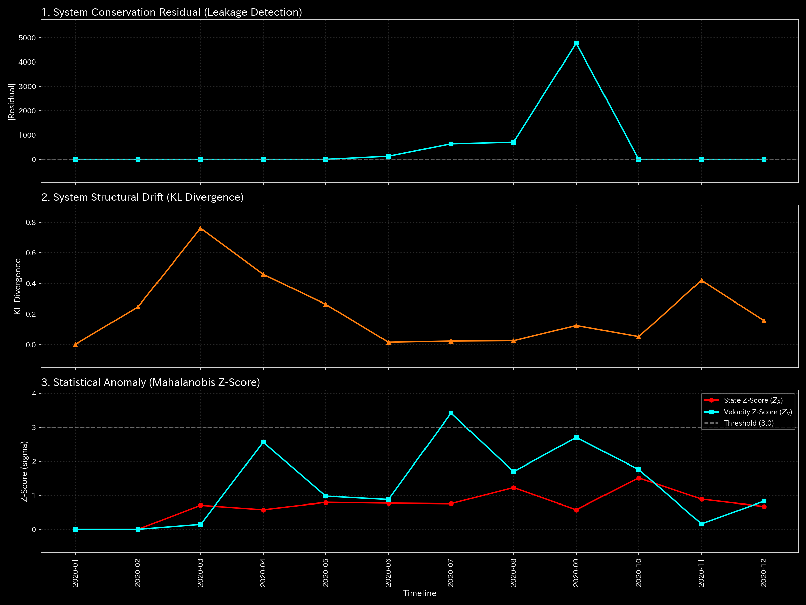
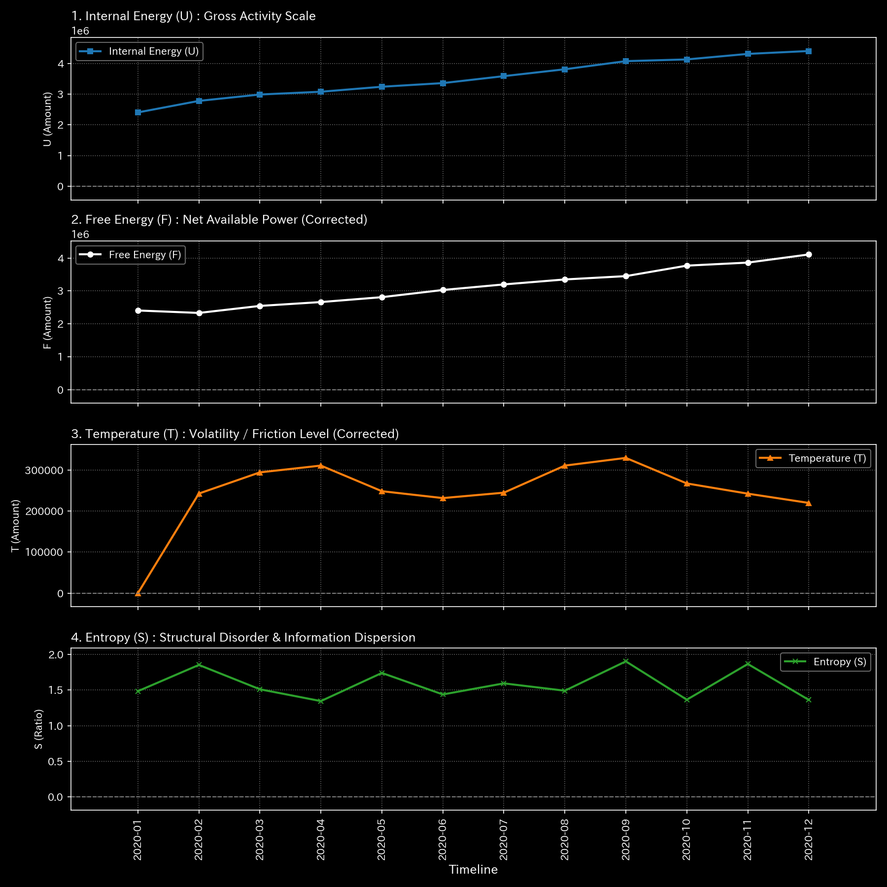

# 🔬 メタ分析統合レポート: Sample 4 (Composite Chaos)

## 1. エグゼクティブ・サマリー

**【診断結果：HIGH（複合病理 / 熱力学的枯渇と共振）】**
システムは「慢性的な高摩擦（エントロピー爆発）」と「トポロジーの無限ループ（ウォッシュ・トレード）」が同時に進行する複合的な危機に瀕しています。極端に高いエントロピーと自由エネルギー（F）の異常なボラティリティは、システムが自律的な統制を失い、無秩序なカオス状態に陥っていることを示しています。

## 2. 伝統的分析の限界（集計スナップショット）

伝統的なB/SやP/Lでは、システム全体の活動規模が極めて大きく、活発な取引が行われているように見えます。しかし、実際にはその活動の大部分が「無駄なエネルギーの浪費（カオス的取引）」や「自己循環」であり、真の意味での経済的付加価値（健全な利益）を全く生み出していないという事実を見逃してしまいます。

## 3. 物理的病理の特定（根本的な病態生理）

循環取引（ウォッシュ・トレード）による意図的な売上水増しと、完全にランダムで無軌道な取引（ノイズ）が同時に発生しています。システム内部でノード同士が全く異なる方向へ暴走し、激しい摩擦熱を生み出しながら構造を物理的に引き裂いています。

## 4. 物理・数学エンジンによる証明

### 4.1. 熱力学的エネルギースタック（マクロ・エントロピー爆発）

* **平均エントロピー（$S$）：** `39.88` （極めて異常な高値）。
* **解説：** 正常なシステム（Sample 0: 約1.5）と比較して、エントロピーが破滅的に高騰しています。これは「システム内部の無秩序さ」と「セクター間の強烈な摩擦」を示しており、長期的な構造維持が不可能な「熱的死（Heat Death）」に向かっている証拠です。

### 4.2. トポロジー異常とスペクトル半径

* **最大スペクトル半径：** `1.0000`。
* **解説：** カオス的な無秩序の中にあっても、特定のノード間では資金がループする「人工的な還流構造」が形成されていることが数学的に特定されました。

### 4.3. 摩擦熱（動粘度）の絶対評価

* 異常状態が長引いているため、統計モデル（Zスコア）はカオスを「新しい日常」として誤学習し、波形が平坦化（順応）してしまう危険があります。しかし、動粘度（摩擦熱）を絶対評価することで、システムが常にドロドロに詰まり、激しいエネルギーを浪費し続けている物理的事実を正確に捉えています。

以上がマクロな構造剛性と質量保存則の分析結果です。

**剛性行列の進化（シネマティック・シーケンス）:**

![1枚目 [Start]: 稼働直後の無垢な状態](../../../../samples/Sample_4_Composite_Chaos/output_plots/support/000_2_1__structural_stiffness.t.00000.png)

![2枚目 [Just Before Change]: 異常が発生する直前](../../../../samples/Sample_4_Composite_Chaos/output_plots/support/000_2_1__structural_stiffness.t.00002.png)

![3枚目 [The Exact Point of Change]: 異常の発生した決定的な瞬間](../../../../samples/Sample_4_Composite_Chaos/output_plots/support/000_2_1__structural_stiffness.t.00004.png)

![4枚目 [Immediately After Change]: 波及効果と局所的な硬直](../../../../samples/Sample_4_Composite_Chaos/output_plots/support/000_2_1__structural_stiffness.t.00006.png)

![5枚目 [End]: シミュレーションの最終状態](../../../../samples/Sample_4_Composite_Chaos/output_plots/support/000_2_1__structural_stiffness.t.00011.png)

以上が熱力学的エネルギースタックの分析結果です。

## 5. ⚠️ 反証可能性と検証要件（Falsification Analytics）

* **偽陽性の可能性：** 企業が極端な構造改革（M&Aの直後や大規模な事業再編）の最中にあり、すべての部署が一時的に無秩序な移行期（トランジション）にある場合、一時的にこのような熱力学的カオスが観測される可能性があります。
* **追加検証要件：** このカオス状態が経営陣の意図した「一時的な再編プロセス」なのか、それとも制御不能な「組織の崩壊」なのかを判断するため、経営計画書や各部門の実際の稼働状況（現場ヒアリング）を緊急で実施してください。同時に、スペクトル半径1.0を示している特定のループ取引の正当性を監査してください。
