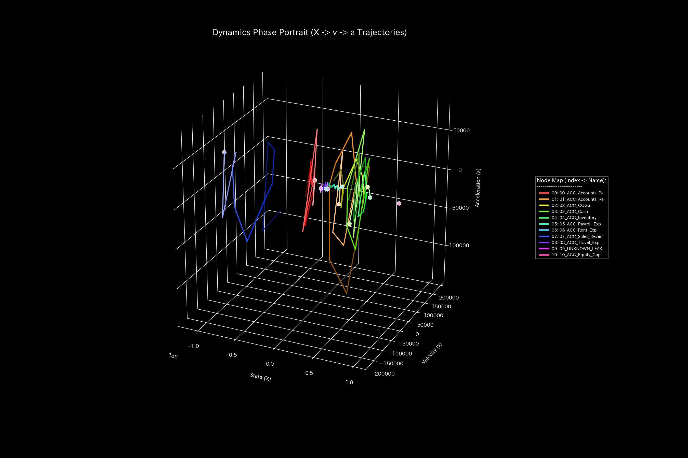

# 複合病態 臨床要約書（ケース4）

> [!NOTE]
> より詳細な技術的データを含む臨床診断書は [clinical_report.md](clinical_report.md) にあります。

---

## 0. エグゼクティヴ・サマリー (Executive Summary)

* **総合判定:** 【致命的異常・即時介入が必要（気血枯渇・過還流虚脱）】 資金が特定の空転還流ループに拘束されつつ、同時に大口の資金が外部の非正規口座へ流出（横領）しており、決済システムは完全に崩壊過程にあります。
* **総合体質評価（健康状態）:**
  組織の資産（**「体格」**）は `$181,818.18` まで衰退し、累計で **`$4,773.57`** の流出（**「質量欠損」**）が発生。資金の空転摩擦（**「自律神経の異常興奮・温度高騰」**）が極限に達し、血管は完全に硬化してデッドロック（**「動脈硬化」**）を起こしています。循環の開始（t=1）および流出の開始（t=5）、最大漏洩時（t=8）のすべてのフェーズにおいて、不連続な決済破綻（**「脈の乱れ」**）が発生しています。
* **要改善点と共生治療:**
  - **肩こり（回収サイトの遅延）:** **`03_ACC_Cash`**（現金）および **`07_ACC_Sales_Revenue`**（売上）に壊滅的な滞留（肩こり）が発生し、決済能力が完全にマヒしています。
  - **ツボ（改善ポイント）:** **`03_ACC_Cash`**（現金）および **`01_ACC_Accounts_Receivable`**（売掛金）が、還流を解消し流出をブロックするためのツボです。
  - **禁忌（避けるべき介入）:** 横領先の非正規口座や売上高への強引な直接の削減アプローチは、関係グループの即時離脱や顧客の倒産などの致命的な反発（副作用）を招くため禁忌です。

---

## 1. 総合病態診断（複合病態）

### 複合破綻（空転還流と漏洩の同期）

* **数理ブリッジ説明:**
  システムの内部還流の暴走度を示す指標（スペクトル半径）です。しきい値を超える `0.7861` に高騰したまま固定されており、資金が内部の空転サイクルに拘束されて外部に逃げず、同時に漏洩が発生していることを証明しています。

---

## 2. 総合体質評価

組織の資金循環能力を、東洋医学的メタファーに基づく体質パラメータとして評価します。

### ① 体格 (総資産の規模)

* **数理ブリッジ説明:**
  総資産の合計トレンドです。5月（t=5）以降、資産残高が急激に衰退しており、還流で膨らまされた見かけの資産の裏側で、累計 `$4,773.57` にのぼる貸借不一致（経絡出血）が発生していることを示しています。

### ② 免疫力 (ショック吸収バッファー)

* **数理ブリッジ説明:**
  利益の蓄積トレンドです。流出が始まって以降、利益が急激に失われており、突発的な売上減少に耐えうる防衛力（自由エネルギー）が完全に枯渇していることを表しています。

### ③ 自律神経 (資金の分散多様性)

* **数理ブリッジ説明:**
  資金のボラティリティとエントロピーの関係図です。軌道がねじれた時計回りの閉回路を描きながら極限まで縮小しており、エネルギー（資金）が内部の無駄な摩擦熱（温度の暴走）と外部への流出によって完全に枯渇していることを示しています。

### ④ 動脈硬化 (取引の固定ロック評価)

* **数理ブリッジ説明:**
  取引経路の支配軸（PCA比率）です。PC1が異常に高騰し、全ての資金が空転還流と横領流路に拘束され、他の正常な取引の決済ルートが完全に塞がれている硬化状態（動脈硬化）を示しています。

### ⑤ 脈の乱れと波及（高次決済ショック）

* **数理ブリッジ説明:**
  決済流量の加速度の急変（Jerk/脈の乱れ）と初期波（Snap）です。還流が開始した2月、漏洩が開始した6月、最大流出時の9月のすべてのタイミングに激しいノッキング振動（脈の乱れ）が発生しており、取引基盤の連続的破壊を証明しています。

---

## 3. 主要な滞留と共生介入

### ⚠️ 肩こり (慢性的な遅延)

* **数理ブリッジ説明:**
  資金状態の3次元軌道を示すリボン図です。**`03_ACC_Cash`**（現金）および **`07_ACC_Sales_Revenue`**（売上）の領域に壊滅的な決済遅延（粘性）が滞留し、デッドロックを起こしています。

### 🎯 治療点「ツボ」 (最適改善ポイント)

* **数理ブリッジ説明:**
  介入時の感度と反発応力をマッピングした行列です。**`03_ACC_Cash`**（現金）および **`01_ACC_Accounts_Receivable`**（売掛金）が、この複合破綻を解除するためのツボであることを示しています。

### 🚫 禁忌
* **`09_UNKNOWN_LEAK`**（横領先の非正規口座）や **`07_ACC_Sales_Revenue`**（売上）への直接の強引アプローチは、不正グループの証拠隠滅や大口顧客の即時離脱などの強い反発（副作用）を招くため避けてください（禁忌）。

### ⚡ 決済血管の時間的急変（剛性時間差分）
- **剛性時間差分ヒートマップシーケンス (縦一列表示)**:
  - **初期 (t=1)**: 
  - **中間 (t=5)**: 
  - **最終 (t=8)**: 
* **数理ブリッジ説明:**
  タイムステップ間における取引剛性の動的な変化（差分 $\Delta K_t$）を示すヒートマップです。還流が始まった2月（t=1）、漏洩が始まった6月（t=5）の瞬間に赤く強烈な剛性スパイクが発生し、流出と還流が二段階で構築されたことを証明しています。

---

## 4. 反証可能性 (Falsifiability)

本診断結果（複合破綻）を覆すには、以下の客観的証拠を提示する必要があります：

1. **第三者銀行の照合済み決済証明書:**
   漏出と指摘された取引資金がすべて組織の正規口座に返却着金し、かつ還流取引が実際の製品受領を伴うものであることを示すSWIFT Remittance証明および物流トラッキング報告書。
2. **正当な売買取引契約書:**
   還流および流出が発生している全取引について、グループ外の独立した顧客との間で合意され、適正価格で締結された販売・購買基本契約書。

---
*発行: TLU 数理診断エンジン*
