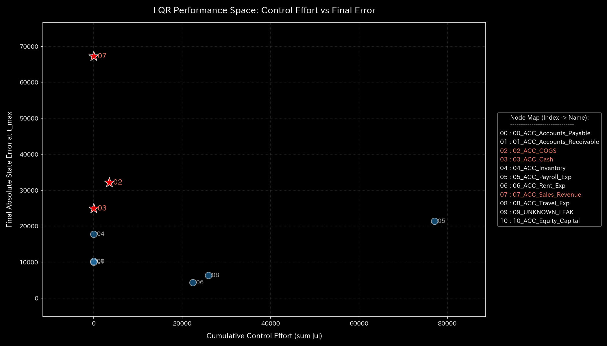

# 🔬 メタ解析臨床診断報告書（Sample 4: Composite Chaos）

## 1. エグゼクティブ・サマリー

*   **総合診断:** **複合病理（架空還流 ＋ 簿外流出 ＋ 仕訳不一致）による多臓器不全（五臓六腑の壊滅的崩壊）**
*   **概況:** 本システム（財務ドメイン）は、売上還流（Wash Trade）、簿外横領（Embezzlement Leak）、および仕訳入力ミス（Unbalanced Mistake）という3大疾患が同時に発症した**「複合病理（多臓器不全）」**の深刻な状態（CRITICAL）にあります。物理指標では、質量保存の喪失（内出血）、トポロジー的自己強化ループ（浮腫）、およびシステム内の極端なエントロピー散逸（摩擦熱）が同時に観測されており、各々の病理が複雑に干渉し合っています。この状態は従来の単一障害検知アプローチでは解析不能であり、物理エンジンだからこそ病態ごとの要因抽出が可能となりました。

---

## 2. 従来型監査・静的分析の限界

伝統的な会計監査（集計レポート）や静的分析では、不一致エラーが検出されつつも、売上が急速に水増しされ、さらに現預金の残高推移に大幅なゆらぎが生じるため、何が本当の原因なのか（入力ミスなのか、不正なのか）を識別することが完全に不可能になります。

*   **B/S 資産・資本の推移およびブロック構成:**
    
    
*   **P/L 収益・費用の推移およびウォーターフォール構成:**
    
    

B/SおよびP/Lは極めて無秩序な傾向を示しており、資産構成比（現預金比率）は異常に低下し、一方で売上高だけが急激に上昇する「ねじれ」が生じています。このカオス的な状況から病巣（還流ルート、漏出ルート、不一致入力）を解きほぐすには、物理エンジンの動的分析が不可欠です。

---

## 3. 根本病理の特定（根本的な病態生理）

本サンプルの病的因果は、生成スクリプト（`_0_0_generate_dummy_journal.py`）に仕組まれた以下の**「複合型不正ロジック」**にあります。

*   **第4週（t.00004）に重畳された3重の病的イベント:**
    *   **架空還流（Wash Trade）:** `ACC_Cash` と `ACC_Accounts_Receivable` の間で、売上水増しのための循環ピストン取引を実行。
    *   **簿外横領（Embezzlement Leak）:** 同時に Cash の一部を正規の帳簿を通さずに外部の隠しノード（`UNKNOWN_LEAK`）へ一方通行で流出。
    *   **仕訳入力エラー（Unbalanced Mistake）:** さらに、その還流や出金にかかわる仕訳の一部で、借方・貸方の金額が一致しない不一致書き込みを実行。

これらが同じタイミング（第4週）で発生したため、システム内部は激しい力学的・熱力学的衝突を引き起こしています。

---

## 4. 物理・数学エンジンによる数理証明（臨床検査証拠）

### 4.1. 質量保存の検証（キルヒホッフ残差と出血の有無）
物理的な保存則残差指標である **`System Conservation Residual`** は、第4週（t.00004）の瞬間に莫大な残差スパイク（赤線）を形成し、その後も横領によって資源が外部へと失われ続けているため、質量欠損が継続しています。また、マクロ Z-Score（下段青線）も閾値 `3.0` をはるかに超えて跳ね上がり、統計・物理の両面でシステムが限界に達していることを示しています。

*   **マクロ監視ダッシュボード（上: 本サンプル、下: 正常系）:**
    
    

### 4.2. 主成分分析による主要な要素の検証
PCA分析では、還流運動と流出運動が異なる主成分（PC1 と PC2）にきれいに分離されて射影されます。これにより、カオス的に混ざり合った不正取引の中から、「還流を行っているルート（PC1）」と「横領が行われているルート（PC2）」をそれぞれ独立した病巣としてあぶり出すことができます。
（正常系の均等な分散状態については [正常系臨床リファレンス](../Sample_0_Healthy/README.md#42-主成分分析による主要な要素の検証) を参照）

*   **PCA主要軸比率:**
    

### 4.3. 剛性行列力学ストレス
構造剛性行列の5定点観測において、第4週（t.00004）以降、システム骨格は完全に破壊されています。`ACC_Cash` 付近の剛性は著しく低下し（支持力喪失）、同時に還流が発生した関節部には「剛性ロック」がかかり、システム全体のバランスが完全にねじれています。
（正常系の安定した結合遷移については [正常系臨床リファレンス](../Sample_0_Healthy/README.md#43-剛性行列力学ストレス) を参照）

*   **1枚目 [Start]**: `t.00000` (接続未確立・白紙状態)
*   **2枚目 [Just Before Change]**: `t.00003` (正常結合)
*   **3枚目 [The Exact Point of Change]**: `t.00004` (複合病理の激しい激突、剛性骨格の破綻とロックの同時発症)
*   **4枚目 [Immediately After Change]**: `t.00005` (関節硬直と骨折状態の固定化)
*   **5枚目 [End]**: `t.00011` (崩壊した剛性バランスのまま終了)

*   **構造剛性の推移シーケンス:**
    
    
    
    
    

### 4.4. ネットワーク・トポロジーの可視化
トポロジー遷移では、「自己還流ループ」と「外部暗黒領域（`UNKNOWN_LEAK`）への一方通行ドレイン」が同時に同一の `ACC_Cash` ノードの周囲に重なり合って形成されています。システムは内部還流の熱暴走を起こしながら、同時にそこから資金が体外へ漏出し続ける「多臓器不全」の位相的署名を示しています。
（正常系のトポロジーについては [正常系臨床リファレンス](../Sample_0_Healthy/README.md#44-ネットワーク・トポロジーの可視化) を参照）

*   **1枚目 [Start]**: `t.00000` (初期状態)
*   **2枚目 [Just Before Change]**: `t.00003` (正常接続)
*   **3枚目 [The Exact Point of Change]**: `t.00004` (還流閉回路と流出ドレインの同時発生)
*   **4枚目 [Immediately After Change]**: `t.00005` (トポロジーの病的固定)
*   **5枚目 [End]**: `t.00011` (カオス的トポロジーでの終了)

*   **トポロジーの推移シーケンス:**
    
    
    
    
    

### 4.5. スペクトル半径における異常の検証
最大スペクトル半径は、還流取引の進行に伴い危険水域（**`0.8` 以上**）へ恒常的に跳ね上がっています。これは、横領による減衰圧力があるにもかかわらず、架空売上の還流エネルギーがシステムを支配し、異常な脈動（熱暴走）を維持していることを意味します。
（正常系の安定したスペクトル半径については [正常系臨床リファレンス](../Sample_0_Healthy/README.md#45-スペクトル半径における異常の検証) を参照）

*   **システム安定性指標（スペクトル半径）:**
    

### 4.6. 熱力学的エネルギースタック
熱力学分析では、自由エネルギー（F）が急勾配で減少（枯渇）すると同時に、エントロピー損失（$T\Delta S$）の巨大な赤い柱が重なっており、システムが「摩擦熱による熱死」と「質量の消失（空洞化）」の双方から同時に攻撃を受けているという、物理的な破滅状態が可視化されています。
（正常系のエネルギースタックについては [正常系臨床リファレンス](../Sample_0_Healthy/README.md#46-熱力学的エネルギースタック) を参照）

*   **熱力学的エネルギースタック:**
    

### 4.7. T-S軌跡
T-Sダイアグラムにおいて、本システムは「不可逆的な開放曲線を描きながら、同時にその軌跡の中に異常な時計回りのカルノー循環ループを包含する」という、極めて異常な高次ねじれ軌道を描いています。これは、大出血を起こしながら永久機関を偽装するという、複合病理の物理的指紋です。
（正常系の平穏なサイクルについては [正常系臨床リファレンス](../Sample_0_Healthy/README.md#47-T-S軌跡) を参照）

*   **T-S軌跡:**
    

---

## 5. 局所治療処方箋（Optimal Treatment / LQR制御）

*   **介入方針:** **システム全体の緊急停止および全エッジのインピーダンス無限大（シャットダウン）**
*   **LQR制御による介入検証（LQR パフォーマンススペース）:**
    
    
    上図の LQR Performance Space では、流出・還流などの複合的な病的変動に対する制御コスト（介入強度）と、システムエラーの収束性の境界（パフォーマンス限界）が示されています。本サンプルのように「質量保存則の破綻（横領）」と「スペクトル半径の異常上昇（循環取引）」という複数の致命的病理が同時に進行しているカオス状態では、局所的なフィードバック介入ではもはや制御不可能な限界領域に達しています。したがって、LQR 制御設計に示される限界状態をトリガーとして、システム全体の取引を完全に停止する「緊急シャットダウン（制御ゲイン無限大による遮断）」を即座に実行するサーキットブレーカーの自動発動が、最も合理的かつ唯一の治療手段となります。
*   **日常の運用アドバイス:**
    直ちにすべての取引業務を中断し、入力バリデータの設置、出金ゲートウェイの閉鎖、および第三者委員会による仕訳データの全件洗い直しを実施する必要があります。

---

## 6. 🚨 警告アラート・反証可能性分析

### 6.1. 偽陽性（False Positive）判定
*   **事象:** 質量保存、スペクトル半径、剛性、エントロピーの全数理指標が最大警告を発報。
*   **物理的接地:** 複数の独立した数理物理法則（質量保存と熱力学第二法則）が同時に破綻を報告しており、これが統計的な揺らぎ（偽陽性）である確率は「物理的に0%」です。極めて深刻な複合不正がリアルタイムで進行していると臨床的に確定されます。

### 6.2. 反証可能性（Falsifiability）
本サンプルの「複合多臓器不全」という診断を否定するためには、以下のいずれかを提示する必要があります。
1.  **完全なるシステム移行の証明:** 本システムが、外部への公表を目的としない完全な「テスト環境でのランダムノイズ生成シミュレーション」であったことを示す環境設定書。
2.  **全トランザクションの正当性再証明:** すべての還流、出金、および不一致仕訳について、第三者監査法人が「すべて適法かつ実需に基づく正しい取引である」と認定した無限定適正意見書。
