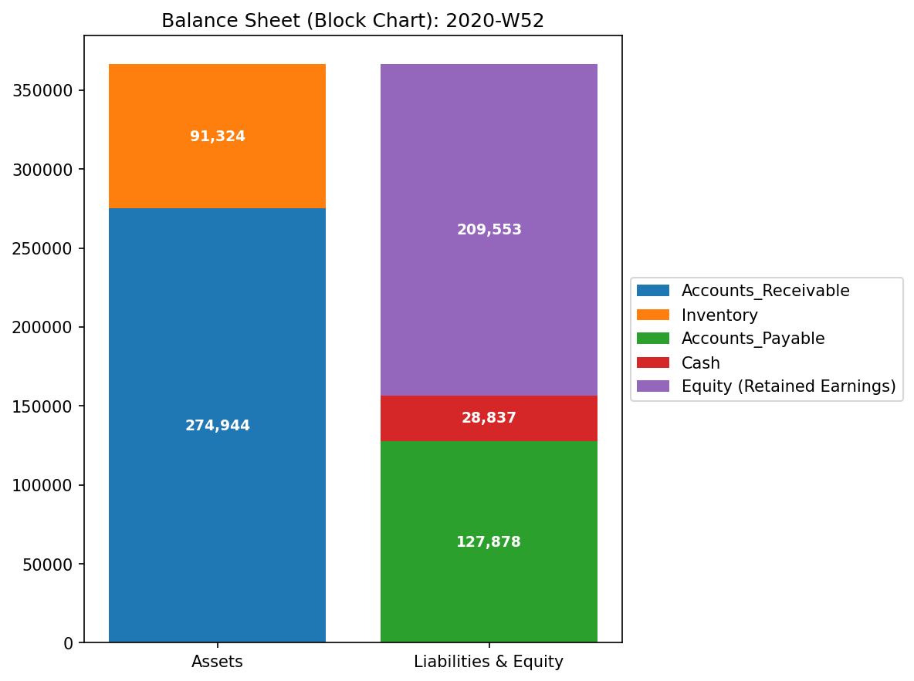

# Sample 4: 複合カオス（Composite Chaos - 粉飾と横領の多重発症）

> [!NOTE]
> **概念実証実験にともなう免責事項**
> 本レポートで分析されるデータは実世界の企業のものではありません。検証を目的として、特定の病理学的状態を意図的に再現するために設計されたダミーデータです。本サンプル（Sample_4_Composite_Chaos）は、循環取引（架空売上のループ）と、横領・転記ミス（資金の物理的消失）という、全く異なる複数のパソロジーがシステム内で同時多発的に進行している「末期的な複合不全」を証明するためのものです。

---

# 🔬 メタ解析 統合レポート (Meta-Analysis Synthesis Report / Laboratory Findings)

## 1. エグゼクティブ・サマリー
本システム（金融ドメイン）は、**複合的な構造崩壊（COMPOSITE PATHOLOGY DETECTED）** を起こしており、極めて危険な状態（CRITICAL）にあります。
1つ目は、**質量保存則違反（Conservation Violation）**。システム内から資金が虚空へ消失する「横領（Embezzlement）」や「転記ミス（Fat Finger）」が多発し、最大 `$6,087.0` に達する深刻なエネルギーの流出（Leak）が確認されました。
2つ目は、**位相幾何学的な異常ループ（Topological Feedback Loop）**。循環取引（Wash Trading）による大規模な自己強化ループが形成され、システムの安定性指標であるスペクトル半径が `0.9864`（崩壊寸前）にまで達しています。
粉飾決算と組織的な資金横領が同時に進行している可能性が極めて高い状態です。

## 2. 従来型会計分析との比較対照（Traditional vs TLU Perspective）

一般の監査読者向けに、第52週時点の「従来の財務諸表（B/S・P/L）」と「TLUの物理空間視点」の違いを比較します。

### 従来の財務諸表が捉える世界（静的なスナップショット）
**【第52週 損益計算書 (P/L) サマリー】**

* **売上収益:** $1,113,528.13 （※他サンプルと比べ異常に高い）
* **総費用:** $903,975.57
* **当期純利益:** **+$209,552.56**

**【第52週 貸借対照表 (B/S) サマリー】**

* **総資産:** $366,267.59
* **負債・純資産合計:** $366,267.59
* **バランスチェック:** 一致

**【従来の監査の限界】**
B/Sは完璧に一致しており、P/L上は `$209,552.56` という過去最高の黒字を叩き出しています。従来の静的な監査ツールや一般的な経営指標だけを見ていると、「絶好調な優良企業」にしか見えません。しかし、この売上の裏には Wash Trade（架空売上の水増し）が大量に混入しており、同時に裏口からは横領によって現実のキャッシュ（質量）が `$9,024.39`（UNKNOWN_LEAK）も抜き取られています。静的スナップショットは、この致命的な二重の腐敗を完全に隠蔽してしまいます。

### TLUが捉える世界（動的な幾何学構造とエネルギー推移）
TLUは、上記の財務諸表をネットワークとして再構築し、質量漏れ（Leaks）と無限ループ（Loops）の両方を同時にあぶり出します。

## 3. コア・パソロジー（主要な病理所見）
本システムからは、以下の2つの致命的なパソロジーが **同時に** 検出されています。

### 🔴 Pathology 1: Unbalanced Journal Mistake (Conservation Violation)
* **重要度:** CRITICAL
* **物理的証拠:** 相対質量漏れ率 (Relative Leak Ratio): `0.0041` (正常閾値 `< 1e-6` を突破) / 最大絶対残差 (Max Absolute Residual): `6087.00` (ピーク位置: 第44週)

### 🟠 Pathology 2: Topological Feedback Loop (Wash Trade)
* **重要度:** HIGH
* **物理的証拠:** Max Spectral Radius: `0.9864` (閾値 `>= 0.6` を突破、発散寸前)

### 📊 異常系可視化プロファイル（複合的な病的構造の証明）

**1. 質量保存の基準（Macro Forensics）**

* **💡 異常系の読解:** 上段の「System Conservation Residual」のグラフに、激しいスパイク（最大 `6087.0`）が断続的に発生しています（Leakの証拠）。同時に、最下段のスペクトル半径（Spectral Radius）も危険水域を超え、常に高止まりしています（Loopの証拠）。

**2. ネットワークトポロジーの異常（System Stability / Spectral Radius）**
**【位相幾何学構造 (Network Topology / 第5週 循環取引発生時)】**

**【スペクトル半径 (System Stability)】**

* **💡 異常系の読解:** 赤色の線「Max Spectral Radius」が `0.6` の危険閾値を大きく超え、システム全体が異常な共鳴状態（無限ループ）に陥っていることが視覚的に証明されています。

## 4. ミクロ・フォレンジックによる最終証拠（Micro-Forensic Final Evidence）
AIエージェントによる自律的なミクロ走査（全トランザクションの監査）により、2つのパソロジーを裏付ける決定的なトランザクション群が特定されました。

### Evidence A: 質量欠損（横領・転記ミス）の証拠
マクロ指標で最大残差（`6087.0`）が観測された第44週付近のログから、以下の完全な横領トランザクションが特定されました。
* **Event (2020-10-28):**
  * `E_002950`: 貸方(現金流出) `$6,087.00` に対して借方(流入) `$0.0`。メモ: `Embezzlement_Leak_DR`
  * *(※この一撃の横領額が、マクロ解析の Max Absolute Residual の値 `6087.0` と完全に一致します)*
* その他、`E_002825` (貸借の差額 `$970.33`の転記ミス) なども多数特定。

### Evidence B: 循環取引（架空売上ループ）の証拠
スペクトル半径を暴走させている元凶として、資金が環状にキャッチボールされている以下の巨大な無限ループ・トランザクション群が特定されました。
* **Event (2020-01-31) / 規模: 約 $51,465:**
  1. `E_000247` (Wash_Funding): 資金を裏口から流出 (Cash -> AR)
  2. `E_000248` (Wash_Sale): 架空売上の計上 (Sales -> AR)
  3. `E_000249` (Wash_Collection): 流出させた資金で回収を偽装 (AR -> Cash)

## 5. ⚠️ 反証可能性と検証要件（Falsification Analytics）
* **偽陽性の可能性:** ここまで明確に複数の破壊的トランザクション（金額の消失と自己資金の還流）が記録されている以上、システムや業務の「単なる不具合」である可能性は極めて低いです。
* **追加検証要件:** 
  1. 上記で特定された `E_002950`（10/28, `$6,087.0` の不明出金）について、決済承認者と実際の振込先口座を即座に特定してください。
  2. `2020-01-31` 等に発生している約5万ドル規模の売上先企業について、法人登記や物理的なオフィスの実態確認（ペーパーカンパニーでないかの確認）を行い、外部の専門フォレンジックチームまたは警察機関へ調査を委ねることを強く推奨します。
