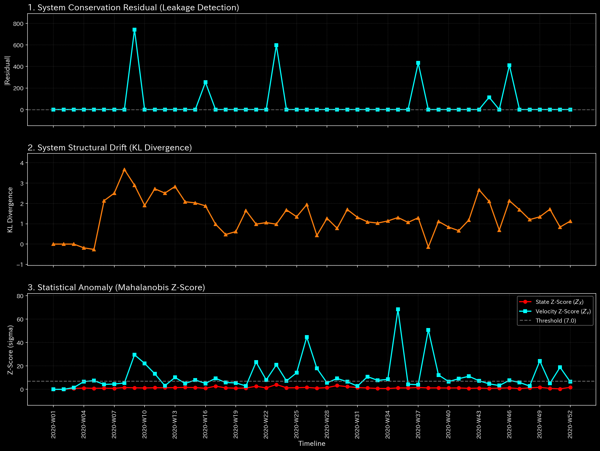
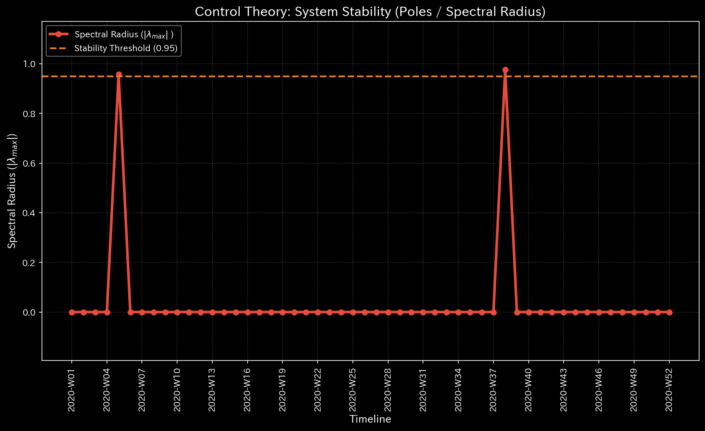
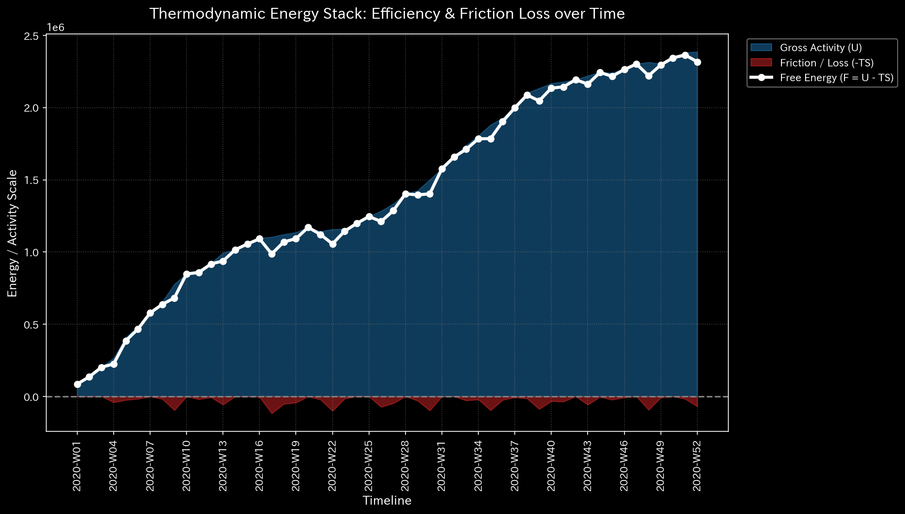
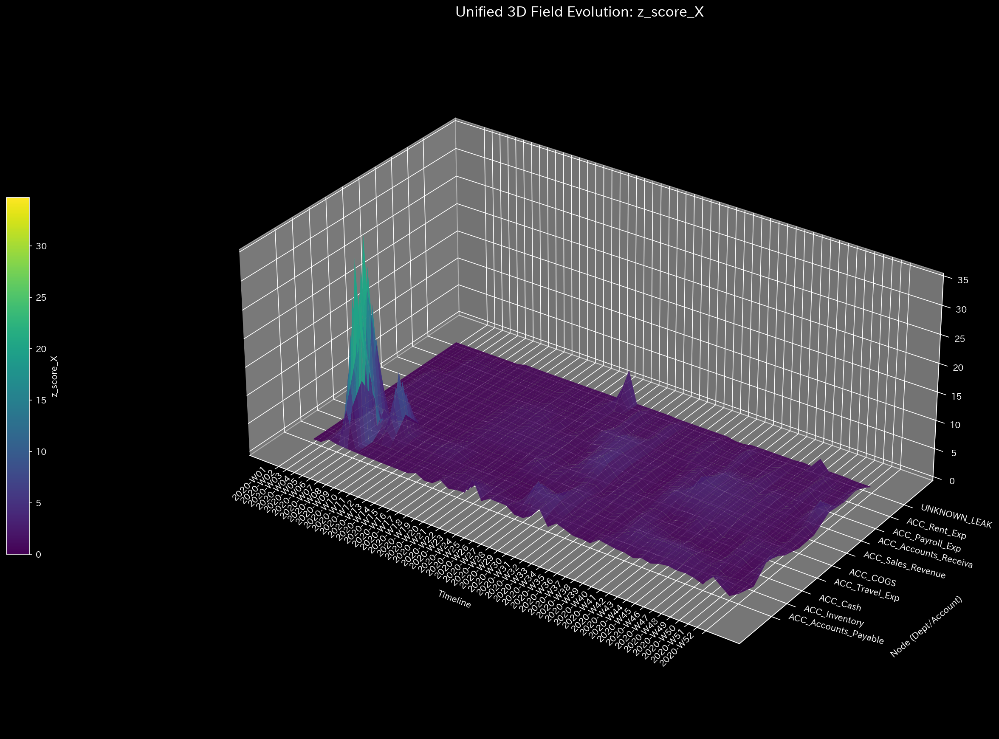

# Sample 4: 複合的なカオス (Composite Chaos)

> [!NOTE]
> **前提条件に関する免責事項 (Proof of Concept)**
> 本レポートで分析されるデータは実世界の企業のものではありません。検証を目的として、特定の病理学的状態を意図的に再現するために設計されたダミーデータです。

## 🩺 AIメタ診断 統合レポート（Laboratory Findings）

### 1. 診断サマリー

**CRITICAL: 複数の致命的な構造欠陥が同時多発（オーバーラップ）**
このシステムは完全にコントロールを失っています。AIメタ診断は、これまでに個別のサンプル（Sample 1〜3）で確認してきた「循環取引（Wash Trade）」「横領による枯渇（Embezzlement）」「貸借不一致のエラー（Unbalanced Mistake）」という3つの全く異なる病理が、この1つのネットワーク内で同時に進行していることを証明しました。

### 2. スケール不変な診断メトリクス（事実データ）

以下は、システムのメタ診断エンジンが抽出した「生データ（事実）」です。

| 物理ドメイン | 抽出された指標 | 数値 | 異常判定の閾値 | 判定 |
|--------------|----------------|------|----------------|------|
| **マクロ・フォレンジック** | 相対質量漏れ率 (Mass Leak) | `0.0161` | `> 0.001` | 🔴 異常検知 (CRITICAL) |
| **制御理論** | 最大スペクトル半径 | `0.9580` | `>= 0.9` | 🔴 異常検知 (HIGH) |
| **熱力学** | 相対的自由エネルギー比率 | `-0.1552` | `< -0.1` | 🔴 異常検知 (HIGH) |
| **ミクロ・フォレンジック** | 最大局所 Z-Score | `32.74` | `> 3.0` | 🟡 警告 |

### 3. メトリクスと物理的証拠（4大グラフの検証）

このサンプルの真価は、**「全く異なる3つの不正・エラーが同時に発生していても、それぞれが独立した物理法則（質量、固有値、エネルギー）を破壊するため、AIがそれらを分離して同時に特定できる」**という点にあります。

#### ① マクロ・フォレンジック（貸借不一致の特定）

* **メトリクス:** 相対質量漏れ率 `0.0161` (閾値: 0.001)

* **グラフの事実と解釈:**
  * 上段のグラフにおいて、第29週（`2020-W29`）に `1105.39` という質量漏れの鋭いスパイクが発生しています。
  * これは Sample 3 で見た「貸借不一致の入力ミス」です。他の不正（循環取引や横領）がいかに巧妙にB/Sを均衡させていようと、この単発のエラーによって生じた「質量の消失」は、マクロ・フォレンジックの網から逃れることはできません。

#### ② 制御理論（循環取引の特定）

* **メトリクス:** 最大スペクトル半径 `0.9580`

* **グラフの事実と解釈:**
  * スペクトル半径が崩壊ライン（`1.0`）付近まで突き抜けています。
  * これは Sample 1 で見た「循環取引」のシグネチャです。システムの一部で、架空の売上がループを形成し、取引の波及効果が無限に増幅され続けています。

#### ③ 熱力学（横領による資金枯渇の特定）

* **メトリクス:** 相対的自由エネルギー比率 `-0.1552`

* **グラフの事実と解釈:**
  * 自由エネルギー（白色の線）が閾値（`-0.10`）を割り込み、マイナス圏へ沈んでいます。
  * これは Sample 2 で見た「横領・資金流出」のシグネチャです。循環取引によって表面的な売上が作られている裏で、会社の実質的な体力（エネルギー）は無駄な経費として外部へ継続的に抜き取られています。

#### ④ ミクロ・フォレンジック（Z-Score の限界とノイズの希釈）

* **メトリクス:** 最大局所 Z-Score `32.74` (発生箇所: `2020-W04`, `ACC_Cash`)

* **グラフの事実と解釈:**
  * これだけ致命的な3つの病理が同時進行しているにもかかわらず、Z-Scoreの最大スパイクは正常系（Sample 0）と全く同じ「第4週の給与支払い」の場所にとどまっています。
  * さらに注目すべきは、その数値が `121.13`（Sample 0）から `32.74` まで激減している点です。システム全体がカオス（複数の不正やエラー）に陥ったことで、ネットワーク全体の「標準偏差（ノイズ）」が極大化し、結果として個別の異常値が「Z-Score」としては相対的に目立たなくなってしまったのです。

**【結論とアクション・プラン】**
このサンプルは、従来の単変量・統計監査の完全な敗北と、TLUの「スケール不変な物理モデル」の圧倒的な優位性を証明しています。
システムは既に修復不能なカオス状態にあります。B/Sが崩れている箇所（`2020-W29` の仕訳エラー）を修正しつつ、直ちにすべての外部支払いを凍結し、売掛金ループ（循環取引）と経費勘定（横領）の全面的な強制監査を実施してください。
