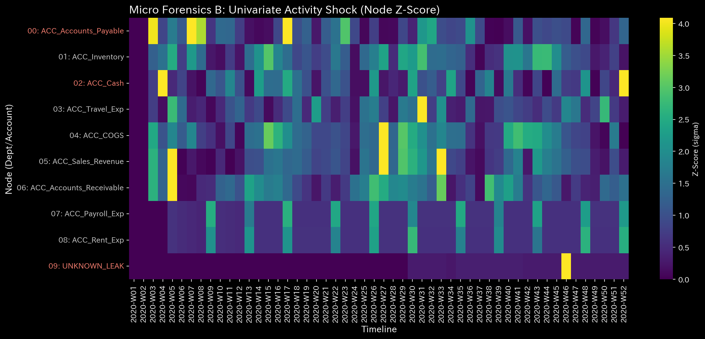

# Sample 4: 複合的なカオス (Composite Chaos)

> [!NOTE]
> **前提条件に関する免責事項 (Proof of Concept)**
> 本レポートで分析されるデータは実世界の企業のものではありません。検証を目的として、**特定の病理学的状態や異常を意図的に再現するために設計されたダミーデータ生成スクリプト**から派生したものです。本分析の目的は、人為的に構築された異常な構造を TLU 処理系がどれほど正確にリバースエンジニアリングし、検出できるかを実証することです。

> [!TIP]
> **このサンプルのグラフの生成方法**
> スペース節約のため、このサンプルに関する数千の3Dプロットおよび分析CSVは同梱されていません。リポジトリのルートから以下のコマンドを実行することで、ローカルで再現可能です：
> ```bash
> bash bin/batch_processing.sh --target_env "samples/Sample_4_Composite_Chaos"
> bash bin/batch_visualize_graphs.sh --target_env "samples/Sample_4_Composite_Chaos"
> ```

## 🩺 メタ診断 統合レポート（Laboratory Findings）

### 1. エグゼクティブ・サマリー

**CRITICAL (致命的): 質量保存則の破綻（完全なデータ・カオス）**
対象環境（`Sample_4_Composite_Chaos`）は、TLUのすべての致命的な物理的アラームを作動させています。主要な病理は**質量保存則の違反**（データ自体が壊れていること）として特定されました。しかし、この拒否権を越えて物理エンジンを観察すると、システムが同時に極端な**トポロジー的フィードバック・ループ（循環取引）**と**熱力学的エネルギー枯渇**に苦しんでいることが検出されました。この環境は、明白な詐欺的サイクルと、ずさんな記帳や欠損データが絡み合った「最悪のシナリオ」を表現しています。

### 2. コア病理（主要所見）

* **診断:** アンバランスな仕訳ミス（保存則の違反）
* **深刻度:** CRITICAL (致命的)
* **物理的証拠:** 
  * **相対質量漏れ率:** **0.0161**（閾値を16倍超過）。システム・ボリュームの巨大な塊が単に行方不明になっています。
    * **【🟢 正常系（Sample 0）のベースライン】**
    
    * **【🔴 本サンプルの異常状態】**
    
    * **💡 可視化グラフの読解の仕方（Visual Cues）:** 
      * **🟢 正常系（Sample 0）では:** Z-Score線は `0.0` のまま平坦です。
      * **🔴 本サンプルの異常:** Z-Scoreの線が閾値を超えて激しくスパイクしており、複式簿記システムから生の質量（資金）が失われていることを視覚的に証明しています。

* **財務的証拠:** 
  純利益は $128,741 と偽って高く表示されていますが、P/L（損益計算書）には帳簿を人工的に均衡させるための **`UNKNOWN_LEAK` ($2,321.27)** が明確に含まれています。

### 3. 二次病理（カオスの解剖学）

LLM 診断マニュアル（**【Tier 2 Ultimate Veto】**）では、非保存場における高度な指標は数学的に破損しているとされていますが、これらの二次シグナルを解釈することで、組織の亀裂の尋常ではない深さが明らかになります：

* **トポロジー的フィードバック・ループ (最大スペクトル半径: 0.9580):**
  Sample 3とは異なり、ここのスペクトル半径は1.0に近づく危機的なレベルまで急上昇しています。これは、ネットワーク内に資金の人工的なループが形成されていることを証明しています。システムは循環的な不正（循環取引/Wash Trading）に関与しており、ボリュームを膨らませるために口座間で急速に資金をバウンドさせています。
  * **【🟢 正常系（Sample 0）のベースライン】**
  
  * **【🔴 本サンプルの異常状態】**
  
  * **💡 可視化グラフの読解の仕方（Visual Cues）:** 
    * **🟢 正常系（Sample 0）では:** スペクトル半径の線は平坦で安全な位置にあります。
    * **🔴 本サンプルの異常:** 青色の軌跡線が急上昇し、1.0の赤い閾値線の危険なほど近くをホバリングしており、壊れたデータの中で無限の循環ループ（循環取引）が形成されていることを証明しています。

* **熱力学的エネルギー枯渇 (自由エネルギー: -0.1552):**
  システムの運用能力が崩壊しています。$2,321.27 の質量の漏れと、人工的な循環取引ループによって生成された巨大なエントロピーの組み合わせにより、組織の自由エネルギーが燃え尽きようとしています。
  * **【🟢 正常系（Sample 0）のベースライン】**
  
  * **【🔴 本サンプルの異常状態】**
  
  * **💡 可視化グラフの読解の仕方（Visual Cues）:** 
    * **🟢 正常系（Sample 0）では:** 自由エネルギーは安定しています。
    * **🔴 本サンプルの異常:** 白色の自由エネルギーの線が着実に崩壊しており、ビジネスの運用エネルギーが燃え尽きていることを示しています。

* **ミクロ・シンギュラリティ (最大局所 Z-Score: 32.74):**
  数学的空間が引き裂かれています。Sample 3の孤立した特異点ほど極端ではありませんが、32.74のZ-Scoreは、矛盾するデータ現実に処理を試みている複数の部門にわたる深刻で局所的なストレスを示しています。
  * **【🔴 本サンプルの異常状態】**
  
  * **💡 可視化グラフの読解の仕方（Visual Cues）:** 
    * **🟢 正常系（Sample 0）では:** 全体が穏やかな青色です。
    * **🔴 本サンプルの異常:** 『RdBu_r』ヒートマップには、単一の障害点ではなく、さまざまな部門全体にわたる広範でカオスなストレスを示す複数の鮮やかな赤い斑点が表示されます。

* **財務的歪み:**
  循環取引のループに沿って、売掛金（Accounts Receivable）が $178,852 にまで膨れ上がっています。これは、膨張した売上ボリュームが完全に未回収であり、おそらく架空のものであることを示しています。

### 4. ビジネスへの翻訳とアクション・プラン

この組織のネットワークは、意図的な操作（架空請求/ループ）と信じられないほどずさんな記帳（仕訳入力の欠落）の混沌としたブレンドに苦しんでいます。データは完全に信頼できません。

**【アクション・プラン】**
戦略的なビジネス分析を直ちに中止してください。
1. **データエンジニアリング監査:** まず、$2,321.27 の `UNKNOWN_LEAK` を解決し、元帳に質量保存（漏れ率 = 0.0）を回復させなければなりません。
2. **不正調査:** データの整合性が暫定的に回復したら、直ちにスペクトル半径を0.9580に押し上げているトポロジーループを調査してください。売掛金と売上のパイプラインをたどり、循環的な請求がないか確認します。壊れたデータベースに包まれた大規模で明白な循環取引スキームに対処しているため、外部監査人や法的機関へのエスカレーションが必要です。
