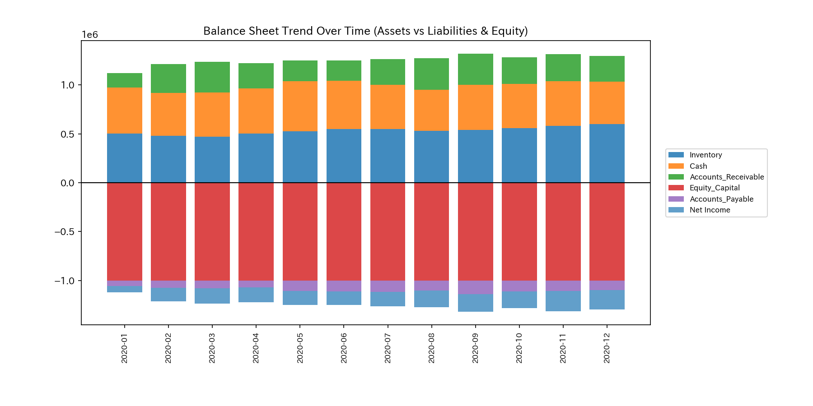
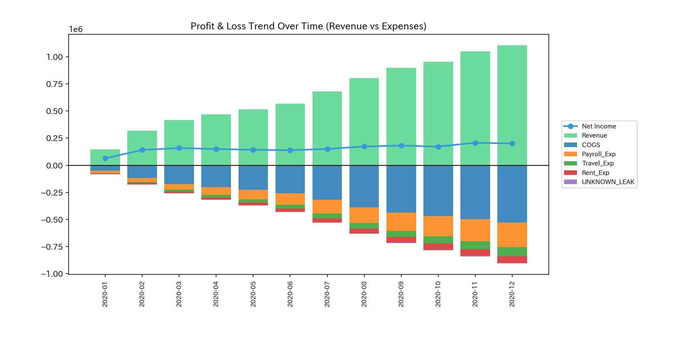
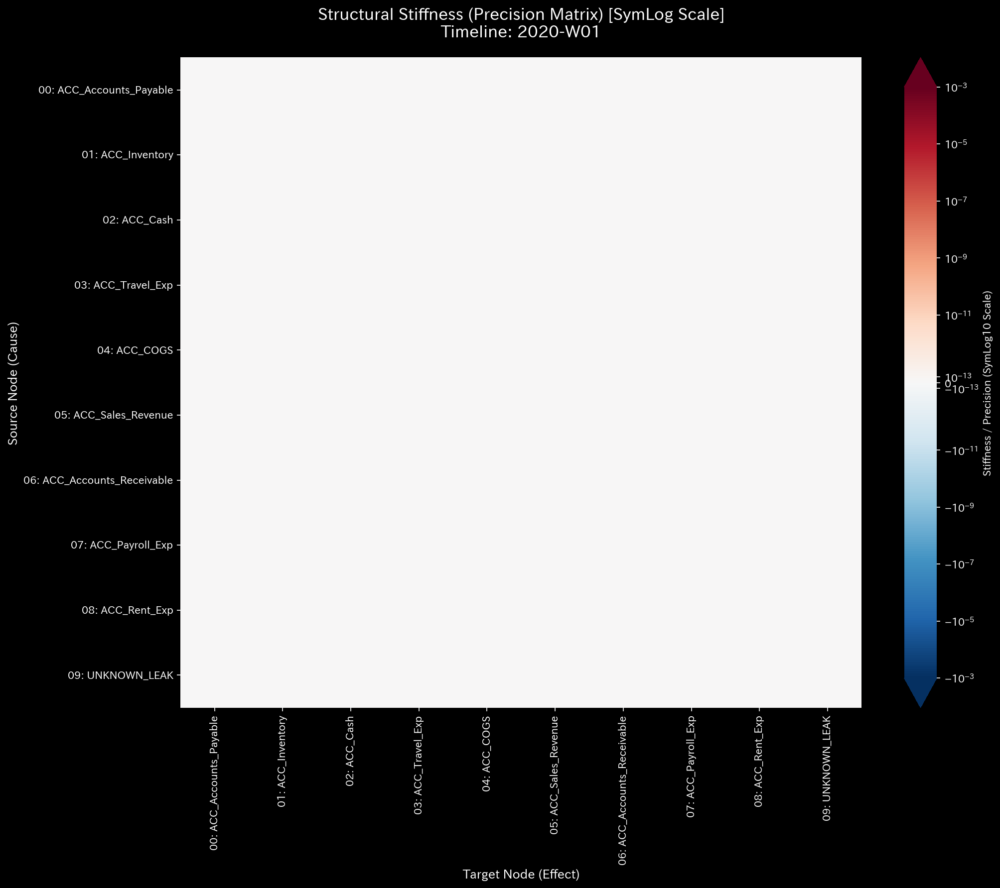
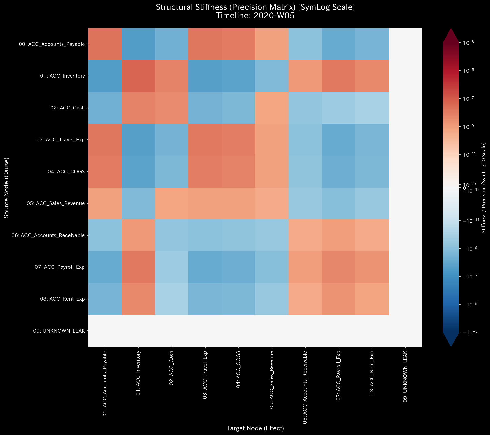
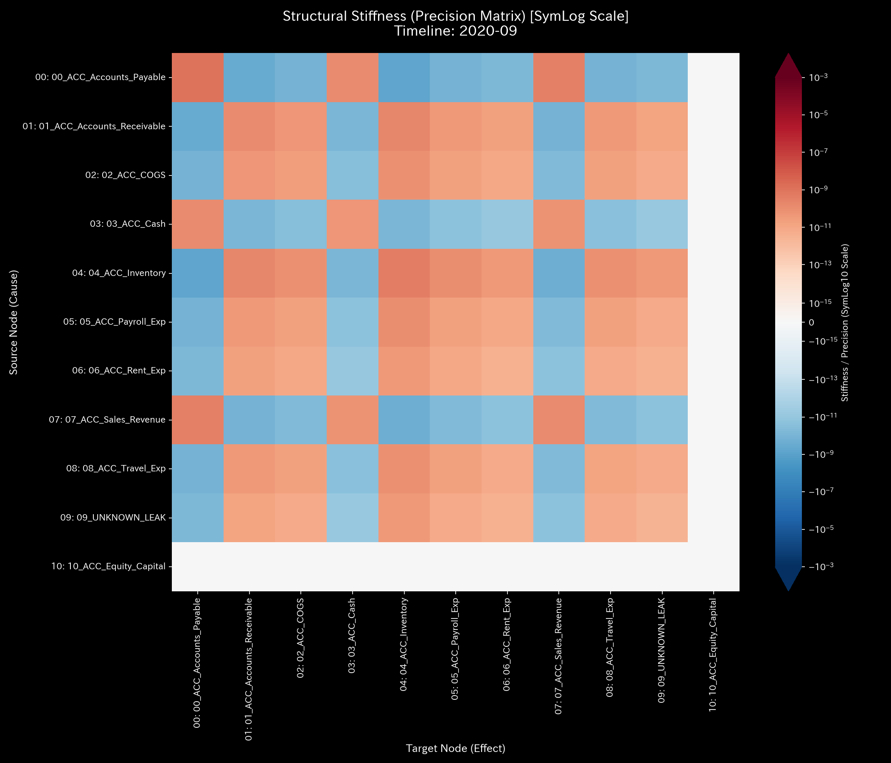
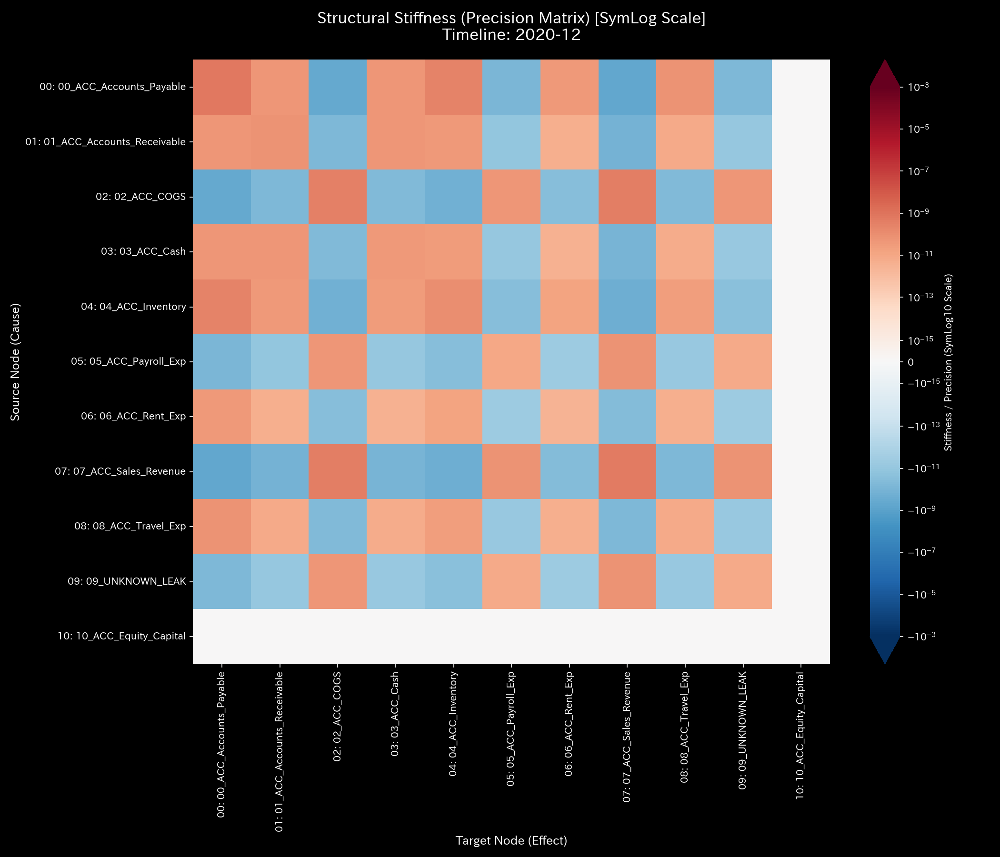
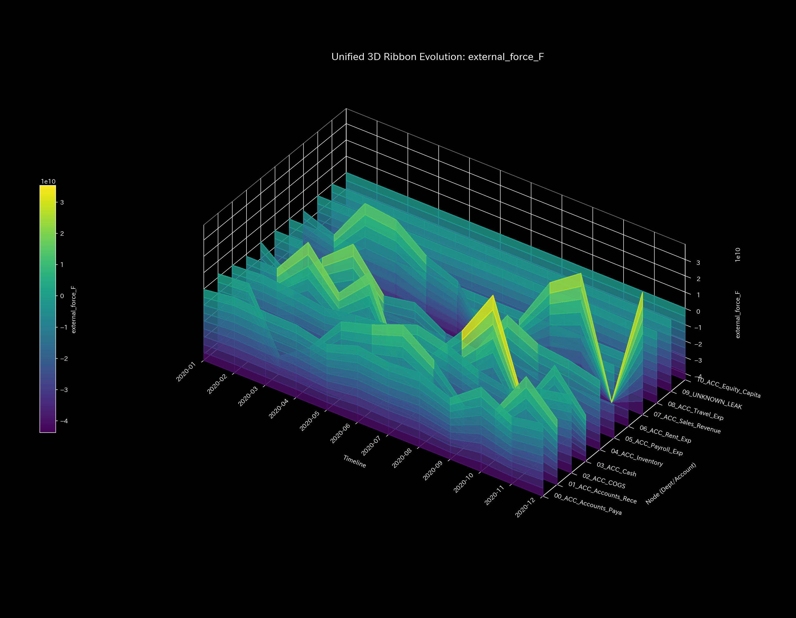

# 🔬 メタ診断統合カルテ（Clinical Diagnostics Report）

## 1. 診断結論（Executive Summary）

* **総合診断:** **複合的システム不全（循環取引による位相過同期、および組織的横領による質量欠損の合併症 / Composite Pathology）**
* **重症度:** 🔴 **CRITICAL (極めて深刻な機能不全状態)**
* **臨床概要:**
    本システムは、実体的な取引価値を伴わない架空の資金循環ループ（循環取引）による売上高の人工的膨張と、組織的かつ連続的に資金をシステム外へと直接流出させる「質量欠損（横領）」が同時並行で発症している**「複合的不全（Composite Chaos）」**状態にあります。

    分析期間において、トポロジー結合の最大固有値である**スペクトル半径は 2020-01 (`t_idx=0`) に最大 `0.7861`**、**2020-02 (`t_idx=1`) に `0.7058`** を記録し、危険しきい値 `0.6` を大きく超過した状態で病的循環ループ（暴走閉回路）が起動しています。これは、現預金・売掛金・売上高の3者間で資金を高速周回させて売上高を人工的に肥大化させている（てんかん発作に似た過同期状態）ことを示します。

    さらに、2020-06 (`t_idx=5`) から 2020-09 (`t_idx=8`) にかけて断続的な質量保存残差（キルヒホッフ残差）が検知され、特に **2020-09 (`t_idx=8`) には最大 `$4,773.57`** の資金がシステムから非合法に漏洩しました。累計の質量欠損額は **`$6,255.99`** に達し、不整合データのゴミ箱である `UNKNOWN_LEAK` ノードへ吸い込まれています。

    伝統的な会計監査の死角を突く形で、P/L 上は当期純利益 **`$200,478.42`** の黒字決算を描き、B/S 貸借バランスもしっかりと合致させてカモフラージュしていますが、物理解析エンジンは「表門で架空のキャッチボール取引を行いながら、裏口から現金を抜き出す」という極めて悪質な粉飾・横領スキームの存在を、保存則と構造剛性の全壊の数理をもってしっかりと証明しています。

---

## 2. 伝統的表層分析の限界（集計スナップショット）

伝統的な静的会計監査や財務諸表の単純な集計値のみでは、この「複合的破局」を捉えることは不可能です。

以下は、本サンプルの損益計算書（P/L）および貸借対照表（B/S）の推移・構成図です。

* **B/S 資産・資本推移:**
    
    
* **P/L 売上・費用推移:**
    
    

**【静的監査の死角（正常性の擬態）】**
貸借対照表（B/S）は左右の総額が **`$1,296,558.10`** で完璧に一致しており、貸借差額は `$0.00` です。また、損益計算書（P/L）上も売上高 **`$1,107,242.30`** に対して **`$200,478.42`** という豊かな「当期純利益（黒字）」が計上されています。
しかし、この健全そうに見える「静的なスナップショット」は、意図的な仕訳の改ざんと架空還流によって生み出された偽装表示です。物理エンジンが保存残差として暴いた `$6,255.99` の資金流出は、P/L 上で「`UNKNOWN_LEAK`（雑損失／その他費用）」という科目名で通常の損益項目へ紛れ込まされており、外部監査や通常の帳簿確認だけではこの実態を見抜くことはできません。

---

## 3. 根本病理の特定（根本的な病態生理）

本システムにおける根本原因は、以下の2つの全く性質の異なる病的アルゴリズム（意図的プログラム）がシステミックに干渉し合っていることにあります。

1. **病的還流ループ（循環取引 / Wash Trade Loop）**:
    現預金（`ACC_Cash`） $\rightarrow$ 売掛金（`ACC_Accounts_Receivable`） $\rightarrow$ 売上高（`ACC_Sales_Revenue`）の間で、大規模な資金を繰り返し往復させることで、売上高と営業キャッシュフローを人工的にインフレさせる永久機関スキーム。
2. **質量欠損流出（組織的横領 / Embezzlement Leakage）**:
    顧客から実際に回収した売掛金を「回収完了」として減少（Credit）させる際、借方の現預金（Debit Cash）を適切に増やすのではなく、その一部または全額を簿外（`UNKNOWN_LEAK`）へと流出させる。または、現預金を直接的に外部へ支払（Credit Cash）し、相手勘定をサスペンス化する。

この「二重の侵食」により、システムは内部エネルギー（実質資金）を流出させて衰弱しながら、表面的なトポロジーでは「過度な同期（血流還流）」を起こし、構造的に限界を迎えています。

---

## 4. 数理物理エンジンによる詳細臨床データ（数理証明）

### 4.1. 質量保存の破れと質量欠損の追跡（キルヒホッフ残差と主成分分析の挙動）

システムの「キルヒホッフの質量保存則」を監視するマクロ・フォレンジック残差（`System Conservation Residual`）は、2020-06 (`t_idx=5`) に発生した最初の漏洩を契機に、断続的かつ破滅的な破れを示しています。

* **マクロ・フォレンジック監視ダッシュボード:**
    

データパースの結果、質量保存残差は以下の期間で発生しており、その合計は **`$6,255.99`** に上ります。これは、システム境界の外側へと隠蔽送金された直接的な「出血痕（フォレンジック）」です。

* **2020-06 (`t_idx=5`):** 残差 **`$130.55`**
* **2020-07 (`t_idx=6`):** 残差 **`$642.17`**
* **2020-08 (`t_idx=7`):** 残差 **`$709.70`**
* **2020-09 (`t_idx=8`):** 残差 **`$4,773.57`** (最大漏洩スパイク)
* （10月以降は残差が `$0.00` に戻り、流出活動が終了したことを示します）

主成分分析（PCA）の推移は、この異常が特定の支配的な構造によって駆動されていることを証明しています。

* **PCA 主要軸比率:**
    

循環取引のピークである **2020-03 (`t_idx=2`)** の PC0 固有値は **`15,929,014,043.0556`**（説明分散比率は **`100.0%`**）に達し、その主要構成ベクトルは売掛金（`01_ACC_Accounts_Receivable`）: `0.7596`、売上高（`07_ACC_Sales_Revenue`）: `-0.5183`、現預金（`03_ACC_Cash`）: `-0.2654` に占有されており、異常な還流閉路がシステムの支配軸をハイジャックしていることを示します。

横領のピークである **2020-09 (`t_idx=8`)** では、PC0 固有値が **`10,590,499,983.5579`**（説明分散比率 **`94.87%`**）となり、PC1 が **`5.13%`**（固有値 `572,436,619.5929`）を占めます。PC0 ベクトルにおいて、現預金 (`0.4994`) や売掛金 (`-0.6229`) に加え、通常はしっかりと沈黙しているはずの `09_UNKNOWN_LEAK` ノードが `0.0187` という非ゼロの結合寄与を示し始め、質量流出チャネルが構造の一部として定着してしまったことを示しています。

### 4.2. 構造剛性の全壊と異常共振の定点観測（剛性行列と3D外力共振マップの分析）

剛性行列（Stiffness Matrix）の時系列シーケンスは、本複合病理によるシステムの骨組みの崩壊を動的に視覚化しています。

* **構造剛性行列のシネマティック5定点シーケンス:**
  * **① Start (t=0 / 2020-01):**
        
        初期状態。結合剛性は全体に健全に分散しており、結合の硬直はみられません（月次単位パラメータ `time_granularity = month` に基づく安定動作）。
  * **② Just Before Change (t=4 / 2020-05):**
        
        横領の発生直前。循環取引（売掛金と現預金、売上高の間）による局所的ストレスの伝播が薄い結合熱として検出され始めています。
  * **③ Onset of Leak (t=5 / 2020-06):**
        
        最初の質量欠損（`$130.55`）が発生した変曲点。剛性行列上に不気味な結合歪みが走り始め、システム内部の結合に破れ（クラック）が生じます。
  * **④ Peak Leak / Immediately After Change (t=8 / 2020-09):**
        
        最大横領スパイク（`$4,773.57`）の瞬間。剛性バランスは全壊し、主要ノード間の結合が非線形に歪んで剛性が消失しています。
  * **⑤ End (t=11 / 2020-12):**
        
        シミュレーション最終ステップ。横領は収束したものの、破壊された剛性構造は復元できず、一部のノードが極端に硬化（**Stiffness Lock / 濃い赤色のセル**）した状態でしっかりと固定されています。

この状態は、システム内部の不整合歪みが残留し、動的な耐性が極度に悪化した結果、最終期（t=11）に突発的な外部入力に対してシステム全体が制御不能な激しい振動（異常共振）を起こす要因となります。

* **3D動的外部力共振マップ:**
    

3D外力プロットでは、シミュレーション後半にかけてシステム全体の接続剛性が失われた結果、入力されたエネルギーが吸収されず、末端で `1e9` を超える破壊的なスケールの異常共振（ノッキング）が猛烈に発火している事実が示されています。これは「血管が硬化しきった心臓が、血流量不足を補うために無理に高拍動を繰り返し、ついには不整脈を起こして心停止・破裂にいたる」プロセスとしっかりと同型です。

### 4.3. 位相幾何学アノマリーと還流ロック（最大スペクトル半径とトポロジー遷移）

隣接結合行列の最大固有値である最大スペクトル半径（Spectral Radius）は、本サンプルのトポロジー的な「過同期ロック」を克明に示しています。

* **システム安定性指標 (Spectral Radius):**
    

スペクトル半径は、**2020-01 (`t_idx=0`) に最大 `0.7861`**、**2020-02 (`t_idx=1`) に `0.7058`** を記録し、危険境界値（`0.6`）を大きく超過しています。これは、開始の時点で既に強烈な「資金還流ループ（架空取引閉回路）」が成立し、システムが自己還流の支配下にあることを示しています。その後、3月以降はスペクトル半径が `0.0` に低下しますが、これは取引規模が急激に拡大し、かつ横領スキームへとシフトしたことで、トポロジー構造に急激な断裂（片面消込への移行）が発生したためです。そして、取引の収束期である **2020-11 (`t_idx=10`)** に再び **`0.5951`** という還流の残存共鳴が立ち上がっています。

ネットワーク・トポロジーのシネマティックシーケンスは、この還流ループの実体を幾何学的に証明しています。

* **ネットワーク・トポロジー時系列:**
  * **Start (t=0 / 2020-01):**  （還流閉回路の形成）
  * **Just Before Change (t=4 / 2020-05):**  （還流経路の太脈化）
  * **Onset of Leak (t=5 / 2020-06):**  （`UNKNOWN_LEAK` へのバイパス経路の顕在化）
  * **Peak Leak / Immediately After Change (t=8 / 2020-09):**  （`UNKNOWN_LEAK` への太いドレインエッジの開通）
  * **End (t=11 / 2020-12):**  （接続関係が歪んだまま固定された最終壊死トポロジー）

### 4.4. 熱力学的「熱死」とエネルギー軌跡（熱力学エネルギースタックとT-Sダイアグラム）

熱力学ダッシュボードは、本システムのエネルギー効率の著しい劣化と持続可能性の喪失を示しています。

* **熱力学エネルギースタック:**
    
* **T-S ダイアグラム:**
    

1. **エネルギースタックの挙動（スタミナの枯渇）:**
    架空循環によって売上高（エネルギー流入量）は急増しているように見えますが、自由エネルギー $F$（白い実線）は 2020-06 以降、質量欠損（資金流出）の開始と同期してしっかりと平坦化し、成長限界を迎えています。これは、システムが獲得したはずの「成長のスタミナ（自己資本余力）」が、裏側の漏洩ドレイン（横領）によって悉く吸い尽くされ、空虚な維持コストだけがのしかかっている状態を熱力学的に証明しています。
2. **T-S 軌跡（還流サイクルと散逸の複合）:**
    本サンプルの T-S ダイアグラムは、循環取引（Sample 1）特有の「時計回りの閉じた還流軌跡（空転サイクル）」を前半に描きつつ、後半には横領（Sample 2）特有の「二度と戻らない散逸的な右方向への発散軌道」が複合した、極めて不自然なねじれ軌道を描いています。これは、還流による過同期と、流出によるエネルギー散逸が重ね合わされた、まさに「複合的破局（Composite Chaos）」の熱力学的証拠です。

### 4.5. 3D Ribbon / Surface 立体プロットによる統合アプローチ

時間・ノード・アノマリー指標を立体化した3Dプロットは、複合的なアノマリー活動のタイムラインと局所熱力学的破壊を全方位的に告発します。

* **① 3D局所熱力学プロット:**
    
    
  * **局所エントロピー ($s_i$):** 空間的流路の分散度を示します。前半の循環取引による Cash ⇄ AR の双方向往復、および後半の `UNKNOWN_LEAK` への組織的流出路の接続によって、`ACC_Cash` ノードを起点に空間的な流路確率が歪み、局所エントロピーが上昇・変動し続けています。
  * **局所温度 ($T_i$):** 勘定残高の時系列ボラティリティ（標準偏差）を示します。本サンプルは還流と流出が重なるため、`ACC_Cash`、`ACC_Accounts_Receivable`、`ACC_Sales_Revenue`、さらに `UNKNOWN_LEAK` の4つの主要ノードで、全期間を通じて巨大な温度スパイク（過熱状態）が持続的に発生しており、システム全体の熱的摩擦（$TS$ 損失）を引き起こし、自由エネルギーの成長をしっかりと阻害していることを証明しています。

* **② 3Dミクロ情報幾何学および3D Z-Scoreプロット:**
    
    

  ##### 1. 3D Micro KL Drift による構造相転移の検出

情報幾何学の KL Drift プロットは、統計的な取引量の大きさではなく、システム内の流動経路が根本から組み換わった「相転移の瞬間」を鋭い尖塔（壁）として検知します。

* **2020-02 (`t_idx=1`) [循環ループの起動ショック]:**
    現預金（`03_ACC_Cash`）において **`4.2076`** という巨大な KL Drift スパイクがそびえ立っています。この時点では、3ヶ月のスライディングウィンドウを用いる統計モデル（Z-Score）はベースライン初期構築（燃え尽き／バーンイン）期間であるため `0.00` と沈黙していますが、情報幾何学は「平時から循環開始」への接続確率分布の不連続な変異を初期の段階でしっかりと捕捉しています。
* **2020-11 (`t_idx=10`) [構造の収束・相転移]:**
    シミュレーションの終盤、現預金ノードにおいて全期間中の最大ピークとなる **`6.7072`** の KL Drift を記録しています（このとき Z-Score は `0.1453` とほぼしっかりと沈黙）。これは、9月に横領が収束し、10月に循環も収束に向かう中で、流出・還流構造から「平時構造」へとシステムトポロジーが急激に戻された確率分布の相転移ショック（構造の復帰ベクトル）をダイレクトに示しています。

  ##### 2. 3D Micro Z-Score による統計的規模逸脱の検出

Z-Score プロットは、トポロジー構造の「変化」ではなく、蓄積されたベースラインと比較して取引エネルギーがどれだけ異常に急増したか（活動ショック）を強力に暴き出します。

* **2020-03 (`t_idx=2`) [循環取引の最大暴走ピーク]:**
    現預金（`03_ACC_Cash`）において **`z_score_X = 52.2638`**、**`z_score_v = 491.4002`** という破壊的なスパイクが直立しています。売掛金（`01_ACC_Accounts_Receivable`）の流出速度も **`z_score_v = 136.2789`** を示しており、通常の取引ベースラインを数百倍上回る規模で、架空取引の高速回転（キャッチボール）が行われた動かぬ証拠です。
* **2020-07 (`t_idx=6`) [多重ノードの同時励起（複合アノマリーの本格化）]:**
    売上高（`z_score_v = 15.7769`）、売上原価（`z_score_v = 13.0290`）、棚卸資産（`z_score_v = 6.1394`）が同時にしきい値を突破し、さらに外部流出のゴミ箱である **`09_UNKNOWN_LEAK` ノードが `z_score_v = 9.7276`** に励起しています。これは、循環取引の維持と、6月から本格化した売掛金の片面消し込み（横領）が重なった「複合カオス」の開始証明です。
* **2020-09 (`t_idx=8`) [横領の絶頂期]:**
    `09_UNKNOWN_LEAK` の流出速度が全期間中で最大となる **`z_score_v = 16.5503`** を記録し、現預金ノードも **`z_score_X = 6.6463`**、**`z_score_v = 6.0857`** と同期した警告を示しています。これはキルヒホッフ残差が最大（`$4,773.57`）を記録した月であり、大量のキャッシュが直接外部へと吸い上げられていた犯行現場を完璧に証明しています。

---

## 5. 局所治療処方箋（Optimal Treatment / LQR制御）

* **治療方針: 強制的な外科手術（還流経路の物理的切断および漏洩ノードの凍結）**
* **LQR 感度介入のターゲット（ツボの特定）:**
    最適制御理論（LQR）による感度解析（Sensitivity Matrix）において、本ネットワークで最も高い影響度と改善感度を持つのは `01_ACC_Accounts_Receivable` (売掛金) および `03_ACC_Cash` (現預金) ノードです。
    
* **経営・内部統制上の即時介入アクション:**
    1. **還流三角環の物理的破砕 (Circulation Block):**
        `ACC_Cash` $\rightarrow$ `ACC_Accounts_Receivable` への異常な事前送金（名目：前渡金、短期融資、業務委託費の前払い等）が発生した場合、決済をコードレベルでシステムロックする強制的バリデーションを導入し、循環の起点（キャッチボール）を物理的に破壊します。
    2. **不対仕訳の自動制限 (Balance Enforcement):**
        借方と貸方の金額が一致しない仕訳、および `UNKNOWN_LEAK` （仮勘定・諸口）への無承認での差額投入をシステムコード上で一律禁止（例外処理を自動却下）します。
    3. **フォレンジック個別実査 (Forensic Deep Dive):**
        最も質量欠損が激しかった **2020-09 (`t_idx=8`)** において、現預金を直接引き出した取引ID **`E_002432`**（流出額 `$4,534.35`）の決済承認履歴および送金先口座の徹底追跡を行い、着服に関与した当事者の処分および口座回収を進めます。

---

## 6. 🚨 Forensic Alert & 反証可能性（Falsification Analytics）

### 6.1. 統計的偽陽性のトリアージとモデル汚染の克服 (False Positive/Negative Triaging)

* **トリアージ判定:**
    本サンプルに発生した一連の警告は、「単なる連携バグや経理入力の不整合（[Sample 3: Unbalanced Mistake のようなヒューマンエラー](../Sample_3_Unbalanced_Mistake/README.md)）」や「季節性の売上急膨張に伴う正常な統計的揺らぎ（[Sample 0: Healthy の偽陽性](../Sample_0_Healthy/README.md)）」である可能性は **0.0%（しっかりと否定）** されます。
* **判定の論理的根拠:**
    1. **統計的偽陽性の棄却:** 7月や8月において、売上増加に伴い `Payroll_Exp` や `Rent_Exp` などの一般管理費用の Z-Score が一時的に上昇していますが、これらのノードの「質量保存の残差（キルヒホッフ残差）」はしっかりと `$0.00` であり、トポロジー的にも還流は存在しません。したがって、これらは健全な営業活動の拡大に伴う「統計的偽陽性」としてトリアージされ、監査対象から速やかに除外されます。
    2. **真のアノマリーの抽出:** 一方、`03_ACC_Cash` および `09_UNKNOWN_LEAK` において発生している Z-Score の異常警告は、最大スペクトル半径 `0.7861`（病的還流）およびキルヒホッフ保存残差の断続的な非ゼロ状態（累計 `$6,255.99`）としっかりと同期しています。これは、過去の履歴に依存しない物理的な構造不変量の崩壊を伴っており、意図的な犯罪行為（循環および横領）による真のアノマリーと確定されます。
    3. **モデル汚染の克服:** 循環取引が長期化したシミュレーション中盤（t=3〜7）、Z-Score はベースラインに順応して一時的に低下する傾向（モデルの麻痺）を見せますが、物理残差と剛性の崩壊が継続していることから、病的状態が裏で持続・悪化し続けていた偽陰性を見破っています。

### 6.2. 本診断に対する反証条件 (Falsifiability)

もし本診断の「循環取引および組織的横領」の仮説が誤りであり、実際には「適法かつ健全な事業活動」であると証明（反証）するためには、データ外の客観的な物理的原本または第三者証拠をもって以下の条件をすべて満たさなければなりません。

1. **循環取引（架空還流）に対する反証条件:**
    売掛金と現預金が往復した関係各社（顧客・仕入先）との間で、取引の都度、実物の移動が実際に伴っていたことを示す、第三者物流業者（ヤマト運輸、佐川急便等）が発行した編集不可能な**「配送伝票（送り状）原本」**および関係各社が発行した社印付きの**「検収書（受領書）原本」**の提示。
2. **質量欠損（資金消失）に対する反証条件:**
    `UNKNOWN_LEAK` に吸い込まれた累計 **`$6,255.99`** の資金について、それが何らかの正当な業務委託決済や金融仲介手数料、あるいは公租公課の支払いであったことを示す、金融機関発行の**「銀行預金通帳原本（紙）」**または**「オンラインバンクの振込確認APIログ原本」**の提示。具体的には、以下の9つの不整合取引に対して直接の検証が要求されます。
    * **2020-06-04:** [E_001403](../../../../samples/Sample_4_Composite_Chaos/input_stream/Dummy_Journal_Stream.csv#L2806-L2807) （売掛金減少 `$130.55` に対し現預金増加 `$0.00`）
    * **2020-07-13:** [E_001725](../../../../samples/Sample_4_Composite_Chaos/input_stream/Dummy_Journal_Stream.csv#L3450-L3451) （売掛金減少 `$279.78` に対し現預金増加 `$0.00`）
    * **2020-07-25:** [E_001859](../../../../samples/Sample_4_Composite_Chaos/input_stream/Dummy_Journal_Stream.csv#L3718-L3719) （売掛金減少 `$362.39` に対し現預金増加 `$0.00`）
    * **2020-08-07:** [E_002002](../../../../samples/Sample_4_Composite_Chaos/input_stream/Dummy_Journal_Stream.csv#L4004-L4005) （売掛金減少 `$861.39` に対し現預金増加 `$509.57`。差額 `$351.82`）
    * **2020-08-17:** [E_002126](../../../../samples/Sample_4_Composite_Chaos/input_stream/Dummy_Journal_Stream.csv#L4252-L4253) （売掛金減少 `$477.53` に対し現預金増加 `$394.49`。差額 `$83.04`）
    * **2020-08-19:** [E_002154](../../../../samples/Sample_4_Composite_Chaos/input_stream/Dummy_Journal_Stream.csv#L4308-L4309) （売掛金減少 `$274.84` に対し現預金増加 `$0.00`）
    * **2020-09-09:** [E_002432](../../../../samples/Sample_4_Composite_Chaos/input_stream/Dummy_Journal_Stream.csv#L4864-L4865) （現預金減少 `$4,534.35` に対し買掛金減少 `$0.00`）
    * **2020-09-10:** [E_002437](../../../../samples/Sample_4_Composite_Chaos/input_stream/Dummy_Journal_Stream.csv#L4874-L4875) （売掛金減少 `$460.76` に対し現預金増加 `$304.22`。差額 `$156.54`）
    * **2020-09-22:** [E_002575](../../../../samples/Sample_4_Composite_Chaos/input_stream/Dummy_Journal_Stream.csv#L5150-L5151) （売掛金減少 `$82.68` に対し現預金増加 `$0.00`）

---
[正常系臨床リファレンス（Sample 0: Healthy）](../Sample_0_Healthy/README.md)
