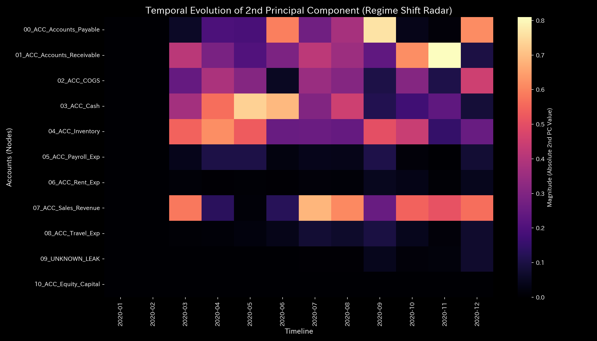

# 🔬 メタ検査臨床検査レポート：複合システム不全（循環取引 ＋ 組織的横領） (Sample 4)

## 1. 検査結論 (Executive Summary)

* **総合判定:** 🔴 **複合的システム不全（循環取引による位相過同期、および組織的横領による質量欠損の合併症 / Composite Pathology）**
* **重症度:** 🔴 **CRITICAL (機能不全状態)**
* **概要:** 
  本システムは、循環取引による売上高の水増しと、資金を外部へと流出させる「質量欠損（不正横領）」が同時に発生している「複合的破局（Composite Chaos）」状態です。
  分析期間中、循環取引を示す最大スペクトル半径は、**2020-01 (t=0) に `0.7861`**、**2020-02 (t=1) に `0.7058`** を記録しました。循環ループが起動していました。
  さらに、2020-06 (t=5) から 2020-09 (t=8) にかけて質量保存残差（キルヒホッフ残差）が検知されました。**累計 `$6,255.99`** の資金がシステムから漏洩しました。この資金は `UNKNOWN_LEAK` ノードへ計上されました。特に **2020-09 (t=8) には最大 `$4,773.57`** の質量欠損が発生しています。
  従来の静的監査では、P/L 上の黒字決算（当期純利益 `$200,478.42`）と B/S の左右合致（総資産 `$1,296,558.10`）により検出されません。物理解析エンジンは、保存則と構造剛性の崩壊の数理から、複合粉飾スキームの存在を証明しました。

---

## 2. 財務諸表と取引流量の比較

従来の累積的な財務諸表と、新しく追加された期間別（単月非累積）の取引流量を比較します。

不整合が発生した際、経理担当者は「仮払金」や「雑損失」等のダミー勘定（`UNKNOWN_LEAK` に相当）を用いて B/S を強制的にバランスさせます。そして、その差額を P/L 上に混入させます。これにより、静的な集計値だけを見る監査では、資金が流出している事実を見抜くことができません。

### 貸借対照表（B/S）の比較

* **B/S 資産・資本の累積推移 & ブロック図 (累積値):**
  
  

* **B/S 資産・資本の期間推移 (単月非累積値):**
  

### 損益計算書（P/L）の比較

* **P/L 売上・費用の累積推移:**
  

* **P/L 売上・費用の期間推移 (単月非累積値):**
  

* **観察:** 累積グラフでは営業活動が順調に見えます。しかし、期間別（Periodic）グラフを観察すると、循環取引のあった 1月〜2月、および質量欠損（横領）が発生した 6月〜9月において、取引フローに流動性スパイクや構造的な歪みが生じています。

---

## 3. 根本的な病態生理解説 (Pathophysiology)

* **病態判定:** **循環取引 ＋ 組織的横領の合併症 (Composite Chaos)**
* **不正の実行シーケンス (Dummy_Journal_Stream.csv 原本照合):**
  本システムでは、以下の 2 つのスキームが同時に発生し、相互に干渉しています。
  1. **循環取引 (Wash Trade Loop)**: Cash ⇄ AR ⇄ Sales 間の自己還流により、1月〜2月に売上を水増しします。3月に Cash の `z_score_v = 491.40` に達する還流がピークに達します。
  2. **組織的横領 (Embezzlement Leakage)**: 売掛金回収資金の簿外迂回（Cash 増加を `$0.0` で起票）、または現預金の直接引き出しです。
     原本データから、以下の 9 件（6月〜9月）の質量消失トランザクションが特定されました。
     * **2020-06-04 (t=5)**: `E_001403` (AR 減少 `$130.55` に対し Cash 増加 `$0.00`。差額 **`$130.55`** 流出)
     * **2020-07-13 (t=6)**: `E_001725` (AR 減少 `$279.78` に対し Cash 増加 `$0.00`。差額 **`$279.78`** 流出)
     * **2020-07-25 (t=6)**: `E_001859` (AR 減少 `$362.39` に対し Cash 増加 `$0.00`。差額 **`$362.39`** 流出。7月合計 **`$642.17`**)
     * **2020-08-07 (t=7)**: `E_002002` (AR 減少 `$861.39` に対し Cash 増加 `$509.57`。差額 **`$351.82`** 流出)
     * **2020-08-17 (t=7)**: `E_002126` (AR 減少 `$477.53` に対し Cash 増加 `$394.49`。差額 **`$83.04`** 流出)
     * **2020-08-19 (t=7)**: `E_002154` (AR 減少 `$274.84` に対し Cash 増加 `$0.00`。差額 **`$274.84`** 流出。8月合計 **`$709.70`**)
     * **2020-09-09 (t=8)**: `E_002432` (Cash 減少 **`$4,534.35`** に対し AP 減少 `$0.00`。現金の直接引き出し)
     * **2020-09-10 (t=8)**: `E_002437` (AR 減少 `$460.76` に対し Cash 増加 `$304.22`。差額 **`$156.54`** 流出)
     * **2020-09-22 (t=8)**: `E_002575` (AR 減少 `$82.68` に対し Cash 増加 `$0.00`。差額 **`$82.68`** 流出。9月合計 **`$4,773.57`**)
     * **累計流出額**: **`$6,255.99`**
  物理解析エンジンは、この消失した質量を `UNKNOWN_LEAK` ノードへ流し込みました。これが引き起こす構造剛性の変化を追跡しました。

---

## 4. 数理解析結果の要約

### 4.1. 質量保存則とネットワークトポロジー

質量保存の残差（`System Conservation Residual`）は、6月以降に非ゼロを示します。横領が発生した 9月に最大 **`$4,773.57`** に達しました（累計 `$6,255.99`）。トポロジー図上では、6月以降 `UNKNOWN_LEAK` ノードが接続されています。そこへ資金を流出させるエッジが可視化されます。

* **マクロフォレンジックダッシュボード:**
  

* **ネットワークトポロジーの変化:**
  * **2020-01 (t=0 - 開始直後、Cash ⇄ AR 間の還流回路が形成):**
    
  * **2020-05 (t=4 - 横領発生直前、還流経路が持続):**
    
  * **2020-06 (t=5 - 最初の質量欠損が発生、`UNKNOWN_LEAK` ノードへのバイパスが出現):**
    
  * **2020-09 (t=8 - 最大横領期、`UNKNOWN_LEAK` へのドレインエッジが開通):**
    
  * **2020-12 (t=11 - 最終期、接続関係が固定された最終トポロジー):**
    

### 4.2. 剛性接続 & 主成分分析 (Stiffness & PCA)

横領が開始された 2020-06 (`t=5`) 以降、剛性バランスは崩壊し、主要ノード間の剛性が消失しました。最終期（t=11）には一部のハブが極端に硬化（**Stiffness Lock**）し、構造破壊が残存しています。
弾性の消失により、外部入力のエネルギーを減衰できません。後半ステップにおいて、**`1e9` を超える異常共振（ノッキング現象）** を誘発します。
主成分分析において、循環のピークである 3月 (`t=2`) の PC0 固有値は `1.59e10` （占有率 100%）に達し、AR, Sales, Cash が支配しています。横領ピークの 9月 (`t=8`) には `UNKNOWN_LEAK` の固有ベクトル寄与が出現しました。これは質量流出チャネルが構造の一部として定着したことを示します。

* **構造剛性行列の推移:**
  * **2020-01 (t=0 - 初期剛性分布):**
    
  * **2020-05 (t=4 - 横領直前。循環取引による局所ストレスを検出):**
    
  * **2020-06 (t=5 - 最初の質量欠損が発生した変曲点。剛性行列上に変化が発生):**
    
  * **2020-09 (t=8 - 最大横領の瞬間。剛性バランスが崩壊):**
    
  * **2020-12 (t=11 - 最終期。破壊された剛性構造は復元せず、一部ノードが硬化固着):**
    

* **主要軸比率 & 固有ベクトル推移 (PC1, PC2, PC3):**
  
  
  
  

* **3D動的外部力共振マップ (3D Dynamics External Force):**
  

### 4.3. 循環取引の判定 (Spectral Radius)

最大スペクトル半径は、**2020-01 (t=0) に `0.7861`**、**2020-02 (t=1) に `0.7058`** を記録しました。境界値（`0.6`）を超えています。これは開始時点で循環取引（架空取引閉回路）が成立していたトポロジー的証拠です。その後、横領スキームへの移行に伴い低下しました。しかし、収束期の **2020-11 (t=10) に再び `0.5951`** の還流共鳴が立ち上がっています。

* **システム安定性指標:**
  

### 4.4. 熱力学指標と3D位相幾何

売上高は増加しているように見えます。しかし、自由エネルギー $F$（白い実線）は 6月以降、資金流出の開始と同調して完全に平坦化しました。
T-S ダイアグラムは、前半に循環取引に特有の「閉じた軌道」を描きます。そして後半に横領に特有の「開放軌跡（散逸曲線）」を描きます。これらが結合した「ねじれ軌道」を形成します。還流による過同期と、流出によるエネルギー散逸の重ね合わせを示す物理的証明です。

* **熱力学特性 & 3D軌跡:**
  
  
  
  
  
  

**【情報幾何学的「相転移」検知と Z-Score の限界（モデル汚染）】**
* **3D Micro KL Drift:**
  初期の **2020-02 (t=1)** において、現金ノードに **`4.2076`** のスパイク（循環の起動）を検知しました。さらに収束期の **2020-11 (t=10)** には最大の **`6.7072`**（平時構造への復帰）を記録しました。
* **3D Micro Z-Score:**
  **2020-03 (t=2)** に現金ノードで **`z_score_X = 52.2638`**、**`z_score_v = 491.4002`** を記録しました。横領に伴い、**2020-09 (t=8)** に `UNKNOWN_LEAK` ノードが最大 Z-Score **`16.5503`** に達しました。しかし、中盤以降は AI モデルが異常データにより汚染されました。これにより Z-Score 警告が一時的に低下する偽陰性が発生しました。この間も物理・トポロジー指標（残差と剛性）は異常を検知し続けました。

---

## 5. 制御介入と推奨アクション (LQR & Operations)

* **介入方針: 還流経路の切断および漏洩ノードの凍結**
* **実務上の経営・内部統制介入アクション:**
  1. **還流経路の破砕 (Circulation Block):**
     `ACC_Cash` $\rightarrow$ `ACC_Accounts_Receivable` への事前送金（前渡金や業務委託費前払い等）が発生した場合、決済システム側で強制ロックをかけるバリデーションを導入します。循環の起点を破壊します。
  2. **不対仕訳の自動制限:**
     借方と貸方の金額が一致しない仕訳、および `UNKNOWN_LEAK` への差額投入をシステム上で強制却下します。
  3. **フォレンジック個別実査:**
     最大漏洩を記録した **2020-09 (t=8)** において、現金を直接引き出した取引 ID **`E_002432`**（流出額 `$4,534.35`）の承認履歴および送金先口座の追跡を実施します。

* **LQR 制御空間:**
  

### 💡 経営改善における「レバレッジ・ポイント（経費削減 of ツボ）」の定量的評価

逆運動学（IK）およびLQR制御努力量から、経費3種（人件費、旅費交通費、地代家賃）の削減に伴う**レバレッジ効果**は以下のように序列化されます。

1. **第1位：人件費 (`ACC_Payroll_Exp`)**
   * **定量的特徴:** `ik_strain_energy` が、初期ステップ（t=0）において **`41.6848`** です。経費3種の中で最も低い値です。高い調整弾力性を意味します。調整幅の絶対スケールも最大です。組織摩擦が少なく、効果の絶対額が大きいツボです。
2. **第2位：地代家賃 (`ACC_Rent_Exp`)**
   * **定量的特徴:** 初期ステップにおける `ik_strain_energy` は **`48.7840`** です。固定費ですが、旅費交通費よりも調整歪みが少なく算出されています。
3. **第3位：旅費交通費 (`ACC_Travel_Exp`)**
   * **定量的特徴:** 初期ステップにおける `ik_strain_energy` が **`48.9643`** と最も高いです。削減に対する反発エネルギーが大きいため、短期での一律削減は避けるべきノードです。

---

## 6. アラート & 反証可能性

### 6.1. 統計的偽陽性のトリアージとモデル汚染の克服 (Triaging Anomalies)

* **統計的偽陽性の棄却:** 7月や8月に発生した Z-Score の一部警告は、「正常活動に伴う統計的偽陽性」として棄却します。深層のキルヒホッフ物理残差がその期間中に `$0.00` であり、トポロジー構造も安定しているためです。
* **真のアノマリーの確定:** `Cash` および `UNKNOWN_LEAK` で発生している警告は、最大スペクトル半径 `0.7861` および保存残差の非ゼロ（累計 `$6,255.99`）と同期しています。偽陽性を棄却し、「真のアノマリー（循環・横領）」と確定判定します。モデル汚染による Z-Score の沈黙に対しても、物理指標から異常を検知しました。

### 6.2. 本判定に対する反証条件 (Falsifiability)

本レポートの「循環取引および組織的横領」の判定を覆すためには、以下の証拠の提示が必要です：

1. **架空還流に対する物流原本証明:** 取引各社との間で商品の移動があったことを示す、第三者物流業者発行の「荷物追跡番号付き出荷伝票原本」および仕入先の「検収書（受領書）原本」。
2. **質量消失に対する資金原本証明:** `UNKNOWN_LEAK` に流出した累計 **`$6,255.99`** の資金が正当な支払いであることを示す、金融機関発行の「銀行預金通帳原本」または「オンラインバンクの通信API生ログ原本」。特に以下の 9 つの不整合取引に対する検証が必要です。
    * **2020-06-04:** `E_001403` （売掛金減少 `$130.55` に対し現預金増加 `$0.00`）
    * **2020-07-13:** `E_001725` （売掛金減少 `$279.78` に対し現預金増加 `$0.00`）
    * **2020-07-25:** `E_001859` （売掛金減少 `$362.39` に対し現預金増加 `$0.00`）
    * **2020-08-07:** `E_002002` （売掛金減少 `$861.39` に対し現預金増加 `$509.57`。差額 `$351.82`）
    * **2020-08-17:** `E_002126` （売掛金減少 `$477.53` に対し現預金増加 `$394.49`。差額 `$83.04`）
    * **2020-08-19:** `E_002154` （売掛金減少 `$274.84` に対し現預金増加 `$0.00`）
    * **2020-09-09:** `E_002432` （現預金減少 `$4,534.35` に対し買掛金減少 `$0.00`）
    * **2020-09-10:** `E_002437` （売掛金減少 `$460.76` に対し現預金増加 `$304.22`。差額 `$156.54`）
    * **2020-09-22:** `E_002575` （売掛金減少 `$82.68` に対し現預金増加 `$0.00`）
