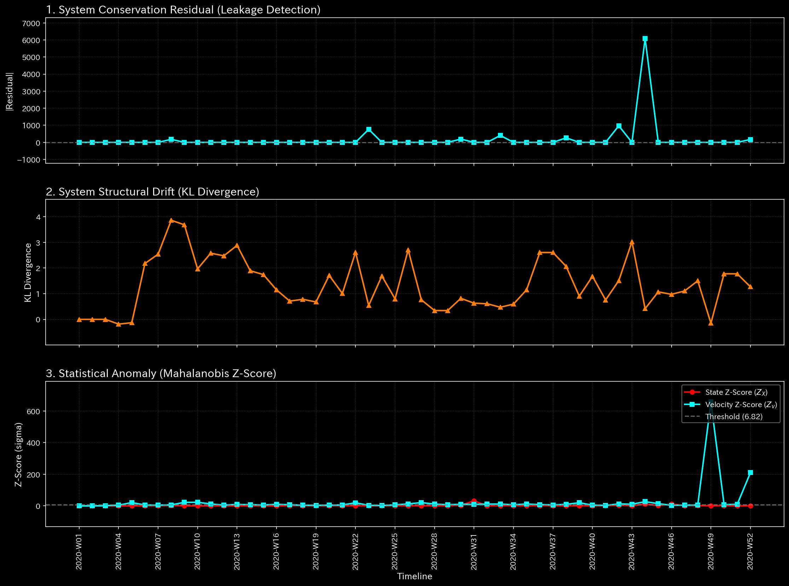

# Sample 4: 複合的なカオス (Composite Chaos)

> [!NOTE]
> **前提条件に関する免責事項 (Proof of Concept)**
> 本レポートで分析されるデータは実世界の企業のものではありません。検証を目的として、**特定の病理学的状態や異常を意図的に再現するために設計されたダミーデータ生成スクリプト**から派生したものです。本分析の目的は、人為的に構築された異常な構造を TLU がどれほど正確に検知・分析できるかを実証することです。

> [!TIP]
> **このサンプルのグラフの生成方法**
> スペース節約のため、このサンプルに関する数千の3Dプロットおよび分析CSVは同梱されていません。リポジトリのルートから以下のコマンドを実行することで、ローカルで再現可能です：
> ```bash
> bash bin/batch_processing.sh --target_env "samples/Sample_4_Composite_Chaos"
> bash bin/batch_visualize_graphs.sh --target_env "samples/Sample_4_Composite_Chaos"
> ```

## 🩺 AIメタ診断 統合レポート（Laboratory Findings）

### 1. 診断サマリー

**CRITICAL: 複式簿記の原則の破綻（完全なデータ・カオス）**
対象環境（`Sample_4_Composite_Chaos`）は、TLUのすべての致命的な物理アラートを作動させています。主要な病理は「貸借の不一致（データ自体の欠落）」として特定されました。しかし、このエラーを越えて物理エンジンを観察すると、システムが同時に極端な**「循環取引（閉ループ）」**と**「組織体力の枯渇」**に苦しんでいることが検出されました。この環境は、明白な詐欺的取引と、ずさんな記帳エラーが絡み合った「最悪のシナリオ」を表現しています。

### 2. 主要な検知結果（マクロ・ミクロ分析）

* **診断:** アンバランスな仕訳ミス（貸借不一致）と複合的不正
* **深刻度:** CRITICAL (致命的)
* **物理的証拠:** 
  * **[マクロ分析] 相対質量漏れ率:** **0.0161**（異常閾値を16倍超過）。システム内の資金の巨大な塊が単に行方不明になっています。
    * **【🟢 正常系（Sample 0）のベースライン】**
    
    * **【🔴 本サンプルの異常状態】**
    
    * **💡 グラフの読み方（マクロ）:** 
      * **🟢 正常系（Sample 0）:** マクロダッシュボードの「質量漏れ」と「Z-Score」の線は `0.0` のまま平坦です。
      * **🔴 本サンプルの異常:** 各指標線が同時に激しく跳ね上がっています（スパイク）。上の線は元帳から資金が消失したことを証明し、下の線はシステム全体が統計的なカオスに陥っていることを示しています。

* **財務的証拠:** 
  純利益は $128,741 と高く表示されていますが、P/L（損益計算書）には帳尻を人工的に合わせるための **`UNKNOWN_LEAK` ($2,321.27)** が含まれており、純利益の数値は完全に信用できません。

### 3. 副次的な分析（カオスの解剖学）

貸借が一致しないデータでの高度な分析は原則推奨されませんが、これらの副次的な指標を観察することで、組織の崩壊の深さが明らかになります。

* **[マクロ分析] 循環取引のループ (最大スペクトル半径: 0.9580):**
  Sample 3（単なるエラー）とは異なり、ここのスペクトル半径は1.0（崩壊の閾値）に近づく危機的なレベルまで急上昇しています。これは、ネットワーク内に資金の人工的なループ（循環取引）が形成されていることを証明しています。
  * **💡 グラフの読み方（マクロ）:** 赤色の線（スペクトル半径）が急上昇し、1.0の閾値線の危険なほど近くをホバリングしています。壊れたデータの中で、架空の売上を作るための無限ループが回されていることを証明しています。

* **[マクロ分析] 資金枯渇 (自由エネルギー: -0.1552):**
  システムの運用能力が崩壊しています。資金の消失と、循環取引ループが作り出す無駄な摩擦の組み合わせにより、組織の活動余力（白色の線）が燃え尽きようとしています。

* **[ミクロ分析] 連鎖的な異常値 (最大局所 Z-Score: 32.74):**
  特定の部署だけでなく、ネットワーク全体が引き裂かれています。
  * **💡 グラフの読み方（ミクロ）:** 3D Surface 全体（`002_2_2_2__micro_Z_Score_3d_surface.png`）を俯瞰すると、単一のピークではなく、**無数の鋭いスパイク（針）が地形全体に散らばっている**点に注目してください。マトリックス全体が連鎖的に崩壊しているカオス状態を視覚的に証明しています。

* **財務的歪み:**
  循環取引のループに沿って、売掛金（Accounts Receivable）が $178,852 にまで不自然に膨れ上がっています。これは、膨張した売上ボリュームが完全に未回収であり、架空のものであることを示唆しています。

### 4. ビジネスへの翻訳とアクション・プラン

この組織のネットワークは、意図的な操作（架空請求のループ）と信じられないほどずさんな記帳（仕訳入力の欠落）の混沌としたブレンドに苦しんでいます。データは完全に信頼できません。

**【アクション・プラン】**
戦略的なビジネス分析を直ちに中止してください。
1. **データエンジニアリング監査:** まず、$2,321.27 の `UNKNOWN_LEAK` を解決し、元帳の貸借を一致（質量保存）させなければなりません。
2. **不正調査:** データの整合性が回復したら、直ちにスペクトル半径を0.9580に押し上げている取引ループを調査してください。売掛金と売上の流れをたどり、循環的な架空請求がないか確認します。外部監査人や法的機関へのエスカレーションが必要です。
