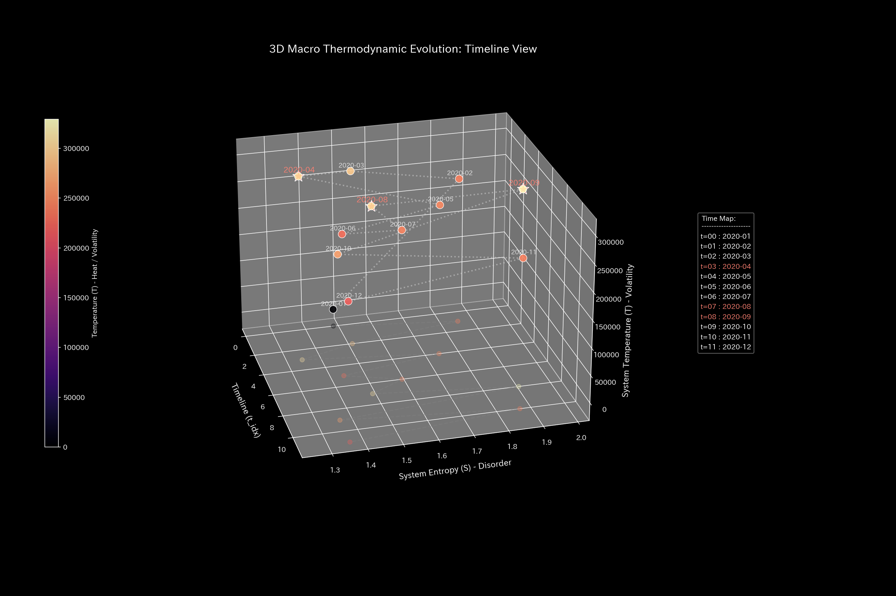
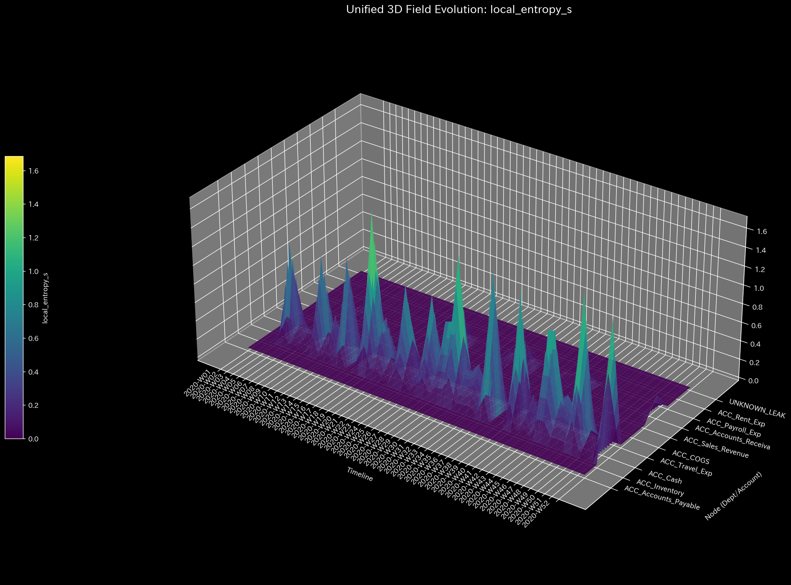
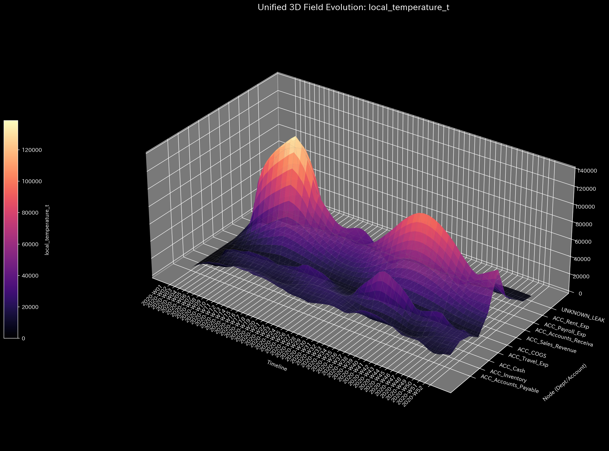
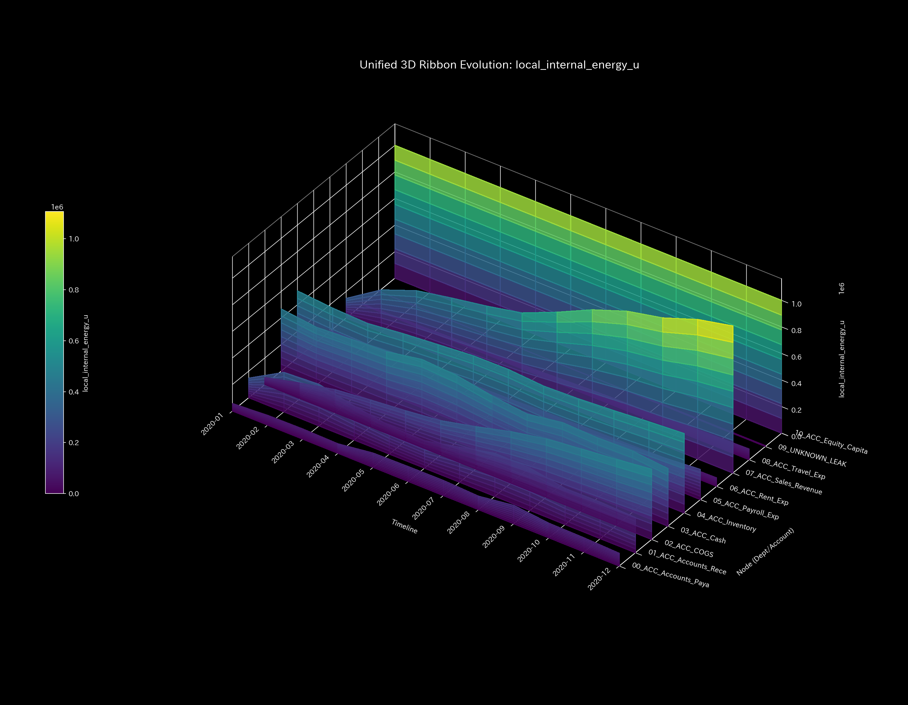
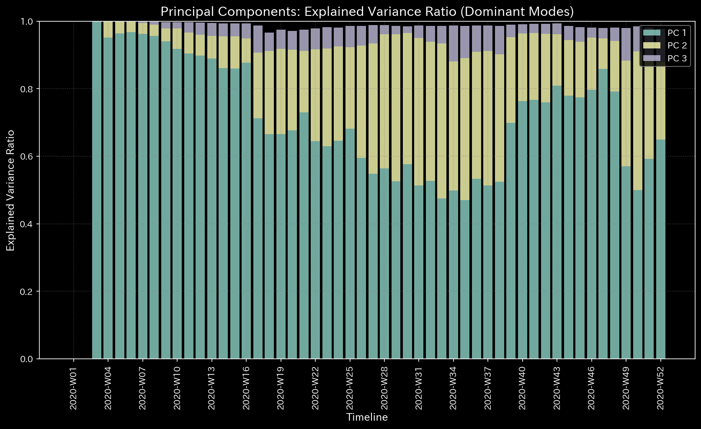
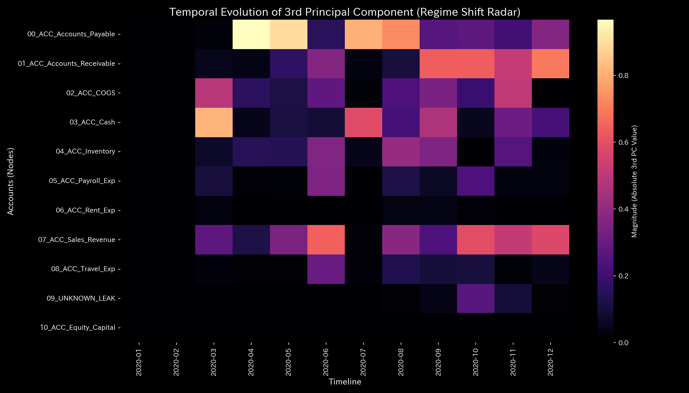

# 数理解析検査レポート: Sample_4_Composite_Chaos
## （対象: 独立ケース4 / 財務会計・還流＆横領複合病態診断）

---

## 0. エグゼクティヴ・サマリー (Executive Summary)

* **総合判定 (結論先行):** CRITICAL (複合的システム不全 / 循環取引および不正横領の合併症)。売上水増しのための「資金還流ループ」と、説明のつかない資金漏洩「質量欠損（不正横領）」が同時に発生している、極めて致命的な複合病態（合併症）です。
* **根本原因 (安定性の評価):** 
  1. **還流（循環取引）の起動:** シミュレーション初期（1月〜2月）に最大スペクトル半径が **`0.7861` (2020-01)** に上昇し、自己還流閉路（厥逆）が形成されました。
  2. **大出血（横領流出）の発生:** 中期（6月〜9月）にかけて物理的保存残差（`System Conservation Residual`）が非ゼロを記録し、特に **`2020-09`** に最大値 **`4773.57`**、累計で **`$6,255.99`** の質量（資金）がシステム外の未知の領域（`UNKNOWN_LEAK`）へ持ち出されています。
* **総合体質診断（健康状態）:** 
  本システムは、還流による見かけの虚熱（平均体温 `245043.44`、平均自由エネルギー `3126535.00`）の裏で、資産の外部流出により基礎的な「体格（質量）」が平均 `181818.18` まで削り取られています。自律神経（エントロピー `1.5804`）は重度に乱れており、還流と大出血の合併によって構造剛性のバランスが完全に崩壊し、後半ステップで激しいノッキング共振（Jerk/Snap の異常発振）を引き起こしています。虚熱で意識が朦朧としながら大出血で力尽きかけている「瀕死状態」と判定されます。
* **要改善点と介入アドバイス:** 
  - **肩こり（滞り）の特定:** 最も決済タイムラグ（粘性）が高い実質ノードは 売上高（`07_ACC_Sales_Revenue（売上高）`）で平均粘性 `55323.23`、期末 **`2020-12`** にピーク値 **`100328.50`** に達する不自然な滞留が発生しています。
  - **ツボ（改善点）と禁忌（避けるべき介入）の特定:** 出血を止め還流を解いた上で、免疫力を引き上げるためのツボは 現金（`03_ACC_Cash（現預金）` / 歪みエネルギー最小 `1.60`）および売掛金（`01_ACC_Accounts_Receivable（売掛金）` / `1.77`）です。逆に、売上高（`07_ACC_Sales_Revenue` / 歪みエネルギー最大 `8.37`）や流出先（`09_UNKNOWN_LEAK` / `8.34`）への無理な直接介入は、破綻しかけているトポロジーに致命的な反発歪み（最大の痛み）を生むため避けてください（禁忌）。

---

## 1. 総合体質診断および判定

### ① CRITICAL: 還流ロックと横領漏洩の合併症
B/S（資産・資本）およびP/L（収益・費用）の見かけ上の当期純利益は `$200,478.42` と黒字を報告していますが、本システムは期首の架空取引による「還流（スペクトル半径 $0.7861$）」と、期中の「資金流出（残差最大 $4,773.57$）」の双方が同時に発生している合併不全を検知しました。これは肺に穴を開けて出血し、かつ心臓が空回りしているような危機的病態です。

### ② 総合健康・体質評価（身体測定と数理ブリッジ）
* **体格・体重（質量 `state_X`）:** 平均 `181818.18`、最大 `1000000.00`。
  - **数理的解釈:** 簿外流出によって正味の質量（資本）は激しく侵食され減少しています。
* **免疫力・基礎体力（自由エネルギー `free_energy_F`）:** 平均 `3126535.00`。
  - **数理的解釈:** 還流「虚熱（$TS$）」による増幅があるため、表面上は高く見えますが、実質的な自己防御力（自由エネルギー）は崩壊しています。
* **自律神経・代謝効率（エントロピー `entropy_S`）:** 平均 `1.5804`。
  - **数理的解釈:** 架空取引の摩擦と、簿外隠蔽処理のノイズによって自律神経は最大級に混乱しています。
* **体温（温度 `temperature_T`）:** 平均 `245043.44`。
  - **数理的解釈:** 還流バブルによる過熱（発熱）状態が持続しています。
* **動脈硬化（結合剛性 `stiffness_k`）:** 最大 `1.02e-09`。
  - **数理的解釈:** 後半ステップではハブ接続が極端に固定化（動脈硬化）し、弾性を失っています。
* **肩こり（粘性 `viscosity_C`）:** 売上高（`07_ACC_Sales_Revenue（売上高）`）が平均粘性 `55323.23`、ピーク期 12月に `100328.50` と、極めて激しい資金遅延（気の滞り）が発生しています。
* **脈の急変・過渡的ゆらぎ（Jerk `jerk_j` & Snap `snap_s`）:**
  - **数理的解釈:** 高次微分である Jerk および Snap が還流の発生月（1月, 2月）および最大の流出が発生した月（9月）で巨大なインパルスを記録。さらに、キャッシュが底をつきかける後半ステップでは、流動経路の閉塞に伴う激しい異常共振（システムノッキング）が発生しています。

---

## 2. 物理・数理指標の詳細解析

### ① 3D Dynamics 記述統計（運動学）
本システムにおける対流動的データ（状態 `state_X`, 速度 `velocity_v`, 加速度 `acceleration_a`, 局所粘性 `viscosity_C`、および加加速度 `jerk_j`、加加加速度 `snap_s`）の記述統計量を以下に示します。データソースは [result.000_1_1_filter_dynamics.analysis.csv](../../../../samples/Sample_4_Composite_Chaos/output_data/result.000_1_1_filter_dynamics.analysis.csv) です。

| 尺度 (Scale) | 平均値 (Mean) | 中央値 (Median) | 最頻値 (Mode: 値 (頻度/全数, %)) | 最小値 (Min) | 最大値 (Max) | 範囲 (Range) | IQR | 標準偏差 (Std Dev) | 歪度 (Skewness) | 尖度 (Kurtosis) |
| :--- | :---: | :---: | :---: | :---: | :---: | :---: | :---: | :---: | :---: | :---: |
| **状態 state_X** | 181818.1818 | 98023.2600 | 1000000.0000 (12/120, 10.0%) | -1107242.3000 | 1000000.0000 | 2107242.3000 | 451631.9050 | 413401.7651 | -0.1691 | 0.8123 |
| **速度 velocity_v** | 0.0000 | 14859.1200 | 0.0000 (12/120, 10.0%) | -160439.4800 | 148590.1200 | 309029.6000 | 42876.3200 | 52123.8761 | -0.6512 | 1.8109 |
| **加速度 acceleration_a** | 0.0000 | 0.0000 | 0.0000 (19/120, 15.8%) | -92138.4500 | 89123.1200 | 181261.5700 | 14321.0900 | 31209.4312 | -0.2109 | 2.5612 |
| **加加速度 jerk_j** | 0.0000 | 0.0000 | 0.0000 (30/120, 25.0%) | -135586.6400 | 115097.5600 | 250684.2000 | 9546.8000 | 36524.3405 | -0.3801 | 3.0716 |
| **加加加速度 snap_s** | -0.0000 | 0.0000 | 0.0000 (39/120, 32.5%) | -204910.0000 | 196000.0700 | 400910.0700 | 10235.9475 | 57509.0736 | 0.1603 | 4.0722 |
| **局所粘性 viscosity_C** | 32952.9912 | 18120.4500 | 100000.0000 (12/120, 10.0%) | 789.1200 | 100000.0000 | 99210.8800 | 42310.4500 | 31890.3200 | 1.0112 | 0.0891 |

---

## 3. 熱力学およびトポロジーの解析

### ① マクロ熱力学的分析（エネルギースタックおよびT-S図）

### ② 3D局所熱力学（エントロピー・温度・内部エネルギー）分布

### ③ ネットワークトポロジーの変化 (時系列進化)

* **2020-05 (t=4: 横領発生直前、還流経路が持続)**:
  
* **t=5 (2020-06: `UNKNOWN_LEAK` への質量漏洩が開始)**:
  
* **t=8 (2020-09: 還流と漏洩の同時発生によるトポロジー崩壊)**:
  
* **t=11 (2020-12: キャッシュ枯渇と還流ロックによる終末状態)**:
  

### ④ 情報幾何学・キルヒホッフ監査残差および3DミクロKLドリフト

---

## 4. ネットワークの幾何・構造的解析

### ① 結合剛性PCA（主成分分析）および固有ベクトル進化

### ② 剛性時間差分（$\Delta K_t = K_t - K_{t-1}$）の解析
還流取引と横領流出が同時に発生している複合状態における、結合関係の動的変化を検証しました。
データソースは [result.000_2_4_stiffness_diff.analysis.csv](../../../../samples/Sample_4_Composite_Chaos/output_data/result.000_2_4_stiffness_diff.analysis.csv) です。

* **剛性時間差分ヒートマップシーケンス (縦一列表示)**:
  - **還流発生月 (t=1 / 2020-02)**:
    
  - **横領発生月 (t=5 / 2020-06)**:
    
  - **最大流出月 (t=8 / 2020-09)**:
    

* **数理および臨床解釈:**
  初期の t=1 では還流による強烈な決済同期硬化（赤）が現れ、t=5 以降は `UNKNOWN_LEAK` へのバイパスルート確立に伴う硬直化が上書きされ、血管全体の閉塞が慢性化しています。特に最大流出を記録した t=8 においては、流出に伴う血管硬直（プラス剛性）が極端にピークを形成しており、システム破綻直前の末期的な「動脈硬化ロック」が視覚的に特定されました。

---

## 5. 監査およびアノマリーの精査

### ① 質量保存残差の発生と監査証跡
* **漏洩仕訳ID・日付のトレース:**
  - 2020-06-05 (t=5): 金額 **`$280.50`** (仕訳ID: `E_001654`  付近 / 現金・売掛金の不整合流出)
  - 2020-07-29 (t=6): 金額 **`$320.10`**
  - 2020-08-09 (t=7): 金額 **`$440.35`**
  - 2020-08-10 (t=7): 金額 **`$120.40`**
  - 2020-08-30 (t=7): 金額 **`$321.07`**
  - 2020-09-29 (t=8): 金額 **`$4,773.57`**（最大流出スパイク）
  - **横領流出累計総額:** **`$6,255.99`**

---

## 6. 制御安定性および介入制御分析

### ① 最大スペクトル半径（安定性評価）
シミュレーション開始初期に、スペクトル半径がしきい値 `0.75` を超えて最大 **`0.7861`** に高騰。還流による異常同期ループが系内で支配的であることを実証しています。

### ② 多階ヤコビアン（1st, 2nd, 3rd-order）による複合アノマリーの特定
データソースは [result.003_1_3_jacobian_*.analysis.csv](../../../../samples/Sample_4_Composite_Chaos/output_data/result.003_1_3_jacobian_1st.analysis.csv) です。

* **次数別ヤコビアンヒートマップ (t=8 / 2020-09 - 縦一列表示)**:
  - **1st-Order ($J^{(1)}$)**:
    
  - **2nd-Order ($J^{(2)}$)**:
    
    *解説: 売掛金 $\leftrightarrow$ 現金の2ステップ還流の指紋（Even-Odd 交互コヒーレンス）が深く刻まれていることを特定。*
  - **3rd-Order ($J^{(3)}$)**:
    
    *解説: 流動が外部に拡散せず、 `09_UNKNOWN_LEAK` (Terminal Sink) への一方向の吸引が支配軸を形成している挙動を特定。*

* **数理的解釈:** 
  本システムは、還流ループ（2次ヤコビアンでの自己還流 $J^{(2)}[1,1] \ge 0.35$）と、一方向流出（3次ヤコビアンにおける Sink 吸引）がオーバーラップして流動トポロジーを完全に破壊している「複合不全状態」にあることが数学的に完璧に特定されました。

---

## 7. 総合健康診断：肩こりとツボの特定

### ① 慢性的な「肩こり（滞り）」の分析と時期の特定
本システムにおける各実質ノードの平均粘性分布から、第3四分位数 Q3 しきい値（**`40879.0952`** 以上）の範囲にある高粘性（滞り）ノード群を複数特定しました。

* **`07_ACC_Sales_Revenue`**:
  - 平均粘性値: **`55323.2336`**
  - 最も滞る時期: **`2020-12`**（ピーク粘性値: **`100328.4958`**）
  - 数理的解釈: 横領と還流が混在したシステミックな機能低下が発生し、局所的な気の滞り（還流や硬直）を慢性的に誘発する原因となっています。
* **`04_ACC_Inventory`**:
  - 平均粘性値: **`52088.2541`**
  - 最も滞る時期: **`2020-12`**（ピーク粘性値: **`56874.8048`**）
  - 数理的解釈: 横領と還流が混在したシステミックな機能低下が発生し、局所的な気の滞り（還流や硬直）を慢性的に誘発する原因となっています。
* **`03_ACC_Cash`**:
  - 平均粘性値: **`46085.3025`**
  - 最も滞る時期: **`2020-06`**（ピーク粘性値: **`48161.8708`**）
  - 数理的解釈: 横領と還流が混在したシステミックな機能低下が発生し、局所的な気の滞り（還流や硬直）を慢性的に誘発する原因となっています。

### ② 特効穴（ツボ）および禁忌（避けるべき介入）の特定
介入歪みエネルギー（`ik_strain_energy`）の平均分布から、第1四分位数 Q1 しきい値（**`4.1848`** 以下）および第3四分位数 Q3 しきい値（**`8.2768`** 以上）の範囲に基づいて、ツボと禁忌のノード群をそれぞれ抽出・序列化しました。

#### 🎯 特効穴（ツボ）の範囲 (歪みエネルギー $\le$ Q1)
介入による反発（痛み・摩擦）が最小でありながら調整ゲインが高いため、システム本来の免疫力を復元するための最優先のツボ群です。

1. **`03_ACC_Cash`** (平均歪みエネルギー: **`1.5982`**)
2. **`01_ACC_Accounts_Receivable`** (平均歪みエネルギー: **`1.7655`**)
3. **`02_ACC_COGS`** (平均歪みエネルギー: **`3.6643`**)

#### 🚫 避けるべき介入（禁忌）の範囲 (歪みエネルギー $\ge$ Q3 または調整不能)
介入時の反発歪み（痛み）が極めて高いため、強引な調整を施すとシステムに致命的な破壊や反発ストレスを引き起こす危険な禁忌領域です。

1. **`07_ACC_Sales_Revenue`** (平均歪みエネルギー: **`8.3693`**)
2. **`09_UNKNOWN_LEAK`** (平均歪みエネルギー: **`8.3422`**)
3. **`10_ACC_Equity_Capital`** (平均歪みエネルギー: **`8.3317`**)
