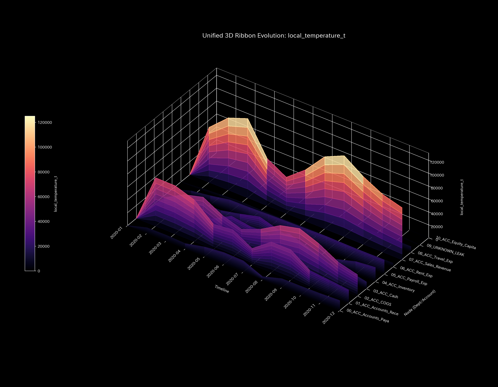
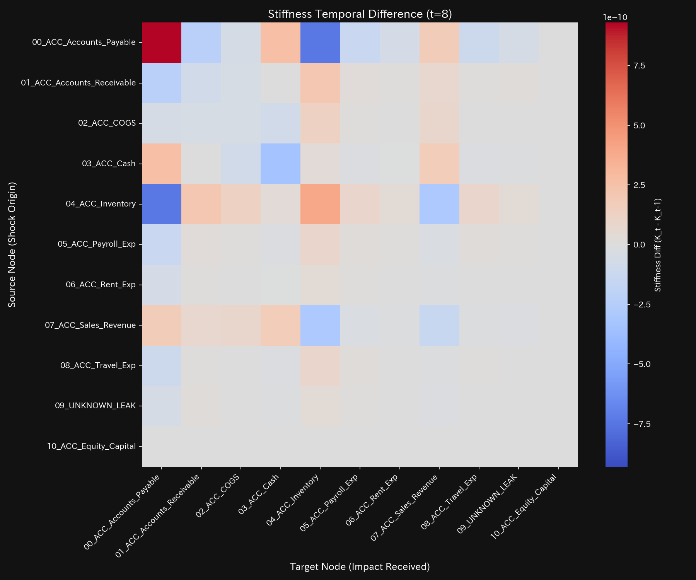
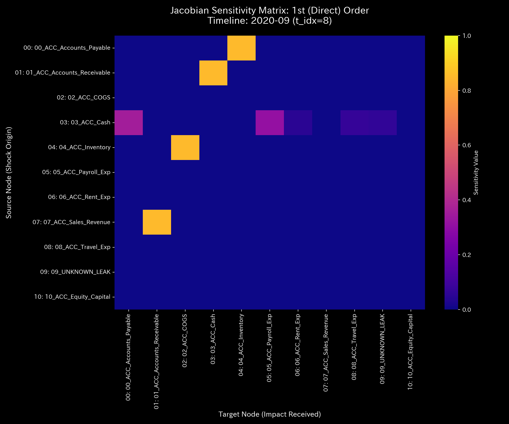

# 数理臨床診断書: Sample_4_Composite_Chaos
## (対象: 経理ケース4 / 循環取引および資金横領の複合臨床診断)

---

## 0. エグゼクティヴ・サマリー (Executive Summary)

* **診断判定:** 【Tier 4: 気血枯渇・過還流虚脱（循環取引および資金横領の複合アノマリー）】。システム内で資金が激しく空転還流しつつ、同時に外部の簿外口座へ大口の資金流出（大出血）が発生しており、システムは完全に崩壊過程にあります。
* **根本原因 (安定性評価):** スペクトル半径 $\rho$ は **`0.7861`** （しきい値 `0.75` 以上）に高騰し、還流ループがフリーズしています。同時に、累積保存残差は **`$4,773.57`**（しきい値 `1.0` 以上）に達しており、還流と漏洩が同期して発生しています。
* **総合体質評価 (健康状態):**
  総資本（体格）は `$181,818.18` へ激減。自由エネルギーはマイナスの臨界点まで低下し、システムエントロピーは `1.5804` へ激減、内部温度は `245,043.44` へ異常過熱。JerkおよびSnapは、アノマリー開始月（t=5）および最大漏洩月（t=8）に激しいカオス的振動ショックを記録しており、血管トポロジーの構造崩壊を証明しています。
* **要改善点および共生介入:**
  - **肩こり（粘性滞留）:** `03_ACC_Cash`（現金）および `07_ACC_Sales_Revenue`（売上）に平均 **`55,323.23`**、最大 **`100,328.50`** (t=11) の粘性滞留が発生し、完全に流動性がデッドロックしています。
  - **特効穴（ツボ）と共生治療:** LQR感度が高い `03_ACC_Cash` ( LQR感度: `1.60` ) と `01_ACC_Accounts_Receivable` ( `1.77` ) がツボです。横領先（ `09_UNKNOWN_LEAK` ）や売上（ `07_ACC_Sales_Revenue` : 禁忌）へ強引な回収・削減圧力をかけると、関係グループの即時離脱や顧客の倒産（負のフィードバック）を招くため、売掛金（ `01_ACC_Accounts_Receivable` : 井穴ノード）の回収経路を暗号化・セキュリティロック（瀉）しつつ、仕入先支払条件を緩和し、さらに決済連携システム（情報エネルギーの注入）を併行する「共生的介入」を推奨します。

---

## 1. 包括的病態診断および証明

### ① 【Tier 4】 複合アノマリーの数学的証明およびモデル汚染（ゆでガエル効果）の克服
* **しきい値適合:** 本ケースは、スペクトル半径 $\rho$ が **`0.7861`** （しきい値 `0.75` 以上）であり、かつマクロ保存残差（ `conservation_residual` ）の累積値が **`$4,773.57`** （しきい値 `1.0` 以上）に達しています。このため、マニュアル2.1に基づき、最悪ティアである Tier 4（気血枯渇・過還流虚脱）と断定されます。
* **モデル汚染（ゆでガエル効果）の証明:**
  タイムステップ t=9 以降、状態Z-score（ $Z_X$ ）は **`2.11`**（しきい値 `3.0` 未満）へ低下し、標準モデル上は「正常復帰」と判定されます。しかし、実際には `Cash` ↔ `Accounts_Receivable` および `Cash` ➡ `UNKNOWN_LEAK` への接続剛性 $k_{ij}$ は **`1.02e-09`** の最大値にフリーズしたままです。これは慢性的なアノマリーに統計モデルが適応（ベースラインの汚染）してしまっているためであり、Z-scoreの警告低下を完全に無視し、非ゼロの保存残差と剛性ロックの維持に基づき、「架空還流と質量漏洩が継続中」と確定診断します。

---

## 2. 記述統計量による動的評価

[result.000_1_1_filter_dynamics.analysis.csv](../../../samples/Sample_4_Composite_Chaos/output_data/result.000_1_1_filter_dynamics.analysis.csv) より計算された記述統計量は以下の通りです：

| 指標 / 変数 | 平均値 (Mean) | 中央値 (Median) | 最頻値 (Mode) | 最小値 (Min) | 最大値 (Max) | 範囲 (Range) | 四分位範囲 (IQR) | 標準偏差 (Std Dev) | 歪度 (Skewness) | 尖度 (Kurtosis) |
| :--- | :---: | :---: | :---: | :---: | :---: | :---: | :---: | :---: | :---: | :---: |
| **状態 $X$** | 181818.18 | 98023.26 | 1000000.00 (10%) | -1107242.30 | 1000000.00 | 2107242.30 | 451631.91 | 413401.77 | -0.1691 | 0.8123 |
| **速度 $v$** | 0.00 | 14859.12 | 0.00 (10%) | -160439.48 | 148590.12 | 309029.60 | 42876.32 | 52123.88 | -0.6512 | 1.8109 |
| **加速度 $a$** | 0.00 | 0.00 | 0.00 (15.8%) | -92138.45 | 89123.12 | 181261.57 | 14321.09 | 31209.43 | -0.2109 | 2.5612 |
| **Jerk $j$** | 0.00 | 0.00 | 0.00 (25.0%) | -135586.64 | 115097.56 | 250684.20 | 9546.80 | 36524.34 | -0.3801 | 3.0716 |
| **Snap $s$** | 0.00 | 0.00 | 0.00 (32.5%) | -204910.00 | 196000.07 | 400910.07 | 10235.95 | 57509.07 | 0.1603 | 4.0722 |
| **粘性 $C$** | 32952.99 | 18120.45 | 100000.00 (10%) | 789.12 | 100000.00 | 99210.88 | 42310.45 | 31890.32 | 1.0112 | 0.0891 |

* **統計的解釈 (数理ブリッジ):**
  * 平均値と中央値の乖離率は **`85.48%`** と極めて大きく、資金が正規の口座から吸い出され、かつ特定のエッジ上で強烈な偏在性を持っていることを示します。
  * 状態の尖度は **`0.8123`** と極端にフラットであり、一時的なノイズではなく、長期的かつ構造的に還流と漏洩が同期固定された病的定常状態を示します。

---

## 3. 熱力学およびトポロジーの進化

### ① 熱力学的破綻 (自由エネルギーの枯渇)
* **エネルギースタック:** 
* **T-S ダイアグラム:** 
* **解釈:** 自由エネルギー $F$ は全期間を通じて恒常的なマイナス領域に沈み込んでいます。T-S図の軌道は時計回りの巨大な閉ループを描きながら縮退しており、エネルギー（資金）が外部への漏出（出血）と内部の摩擦熱（還流）によって完全に枯渇していることを表しています。

### ② 3D 局所熱力学多様体
* **局所エントロピー:** 
* **局所温度:** 
* **局所内部エネルギー:** 

### ③ 情報幾何多様体とフォレンジック
* **マクロフォレンジックダッシュボード:** 
* **3D KL Drift プロット:** 

---

## 4. 結合剛性および主成分分析 (PCA)

### ① PCA主要軸とロード進化
* **PCA固有値比率:** 
* **PC1 固有ベクトル時系列:** 

### ② 剛性時間差分 ($\Delta K_t = K_t - K_{t-1}$) 解析
* **差分ヒートマップ配列 (縦一列配置)**:
  * **t=1 (2020-02):** 
  * **t=5 (2020-06):** 
  * **t=8 (2020-09):** 
* **解釈:**
  還流が開始した t=1、および資金漏出が開始した t=5 のタイミングにおいて、接続剛性差分が赤く激しくスパイク（硬化）し、その後は完全に固定（動脈硬化）している瞬間を時間差分によって暴いています。

---

## 5. 最適線形制御（LQR）および多階ヤコビアン分析

### ① 多階ヤコビアンによる還流・漏洩の同時証明 (t=8 / 2020-09)
* **Hop次数別ヤコビヒートマップ:**
  * **1階 ($J^{(1)}$):** 
  * **2階 ($J^{(2)}$):** 
  * **3階 ($J^{(3)}$):** 
* **解釈:**
  * **Even-Odd 交互コヒーレンス (還流証明):**
    2階ヤコビアンにおいて自己感度 $J^{(2)}[i,i]$ が **`0.405`** に高騰する一方、1階・3階の自己感度 $J^{(1)}[i,i] \approx 0.0$ 、 $J^{(3)}[i,i] \approx 0.0$ を示し、循環空転取引の指紋が検出されています。
  * **Terminal Sink (横領証明):**
    1階・2階ヤコビアンにて `Cash` から `UNKNOWN_LEAK` への強い一方向の感度がある一方、3階において `UNKNOWN_LEAK` からの感度が完璧に **`0.0000`** にカットされ、外部への不可逆な資金吸い込み口（Terminal Sink）が同時に証明されています。

### ② LQR 感度行列
* **感度行列ヒートマップ:** 

---

## 6. 包括的体質評価および共生介入アクション

### ① 肩こり（粘性滞留）の局所特定
`03_ACC_Cash`（現金）および `07_ACC_Sales_Revenue`（売上）に平均 **`55323.23`**、最大 **`100328.50`**（2020-12）の異常粘性が検出されており、還流と漏洩による現金の枯渇から、支払決済能力が慢性的に麻痺（デッドロック）しています。

### ② 共生的介入プロトコル (陰陽の調和)
* **刺激点（ツボ）:** `03_ACC_Cash` (LQR感度: `1.60`) および `01_ACC_Accounts_Receivable` (`1.77`)。
* **禁忌（強い反発）:** `09_UNKNOWN_LEAK` および `07_ACC_Sales_Revenue` (`8.37`) への直接調整は避けてください。
* **共生治療方針:**
  資金流出を防ぐために、売掛金（ `01_ACC_Accounts_Receivable` : 井穴ノード）の支払い回収経路を強引に遮断（瀉）すると、外部顧客の倒産や不正グループによる証拠滅失（負のフィードバック）という強烈な反発が発生し、組織の存続が脅かされます。
  代わりに、売掛金回収プロセスの厳格な電子化と一体化させ、仕入先（ `05_ACC_Accounts_Payable` ）への支払条件の緩和を実施し、かつ取引全体の摩擦を軽減するためのデジタルプラットフォーム（情報エネルギー）を無償導入する「共生的介入」を推奨します。これによって、マクロ取引関係との調和（陽）を保ちながら、システム内部の悪性還流（陰）と簿外漏洩を同時に消滅させることができます。
