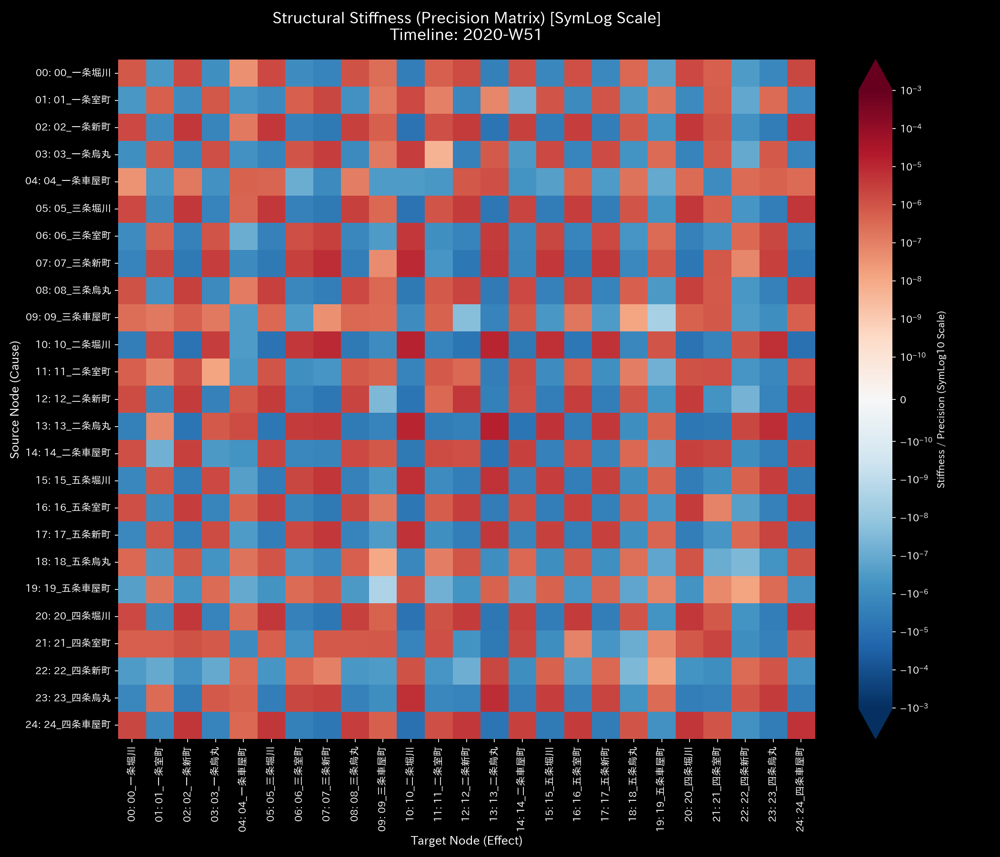
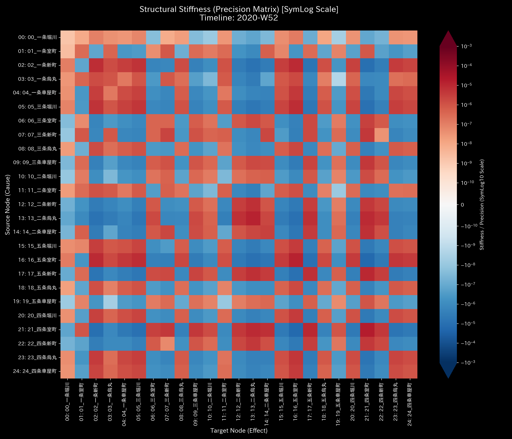
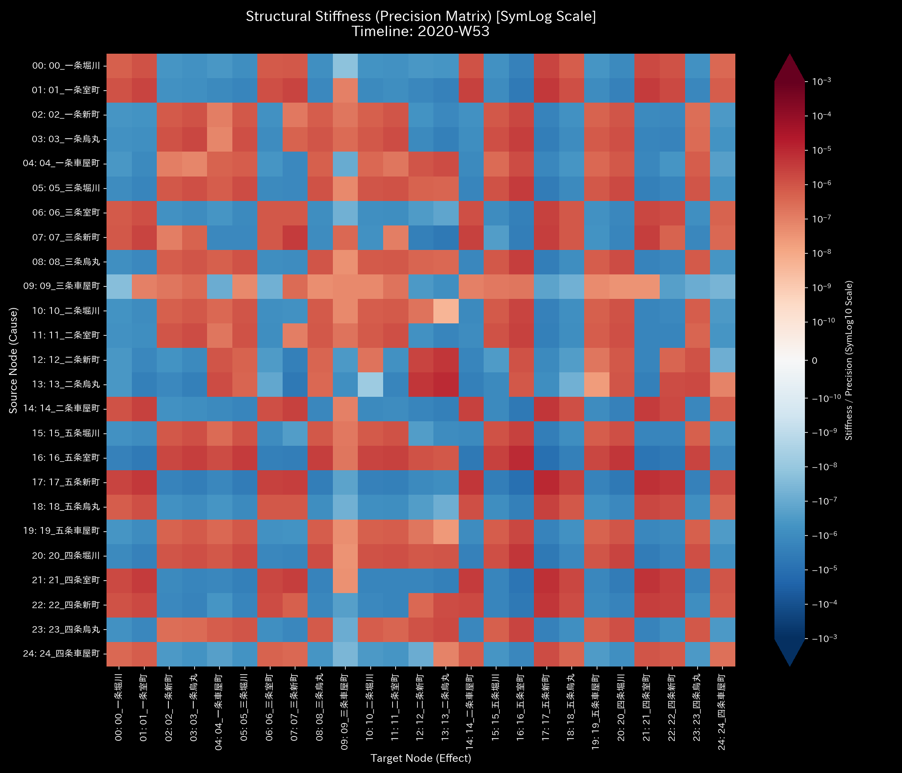
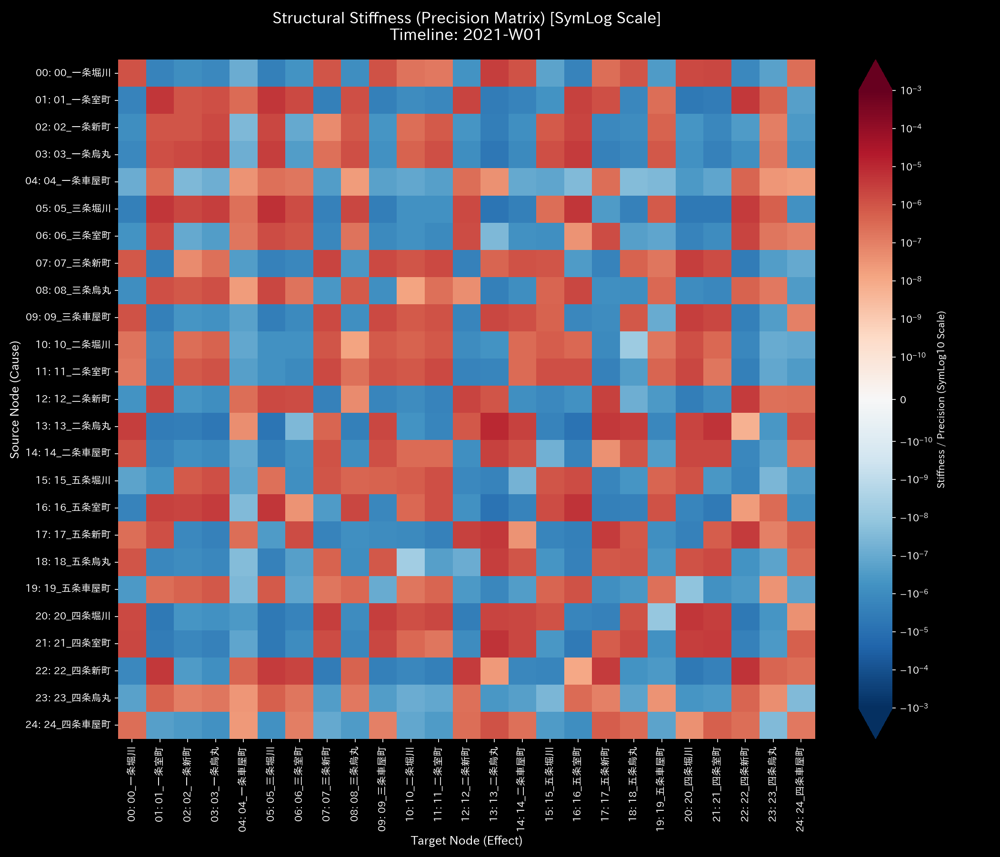

# 🔬 メタ診断臨床検査レポート：都市交通網の流動麻痺と熱力学的死 (Sample 5)

## 1. 診断結論 (Executive Summary)

* **総合診断:** **都市交通ネットワークの局所的熱力学凝固（Kyoto Traffic Grid Deadlock / Severe Localized Freeze）**
* **重症度:** 🟠 **HIGH (極めて深刻な機能不全)**
* **臨床概要:**
    本システム（仮想の京都市中心部の25交差点網における自動車流量データ）は、全域的な車両総数が $U = 2,500,000.0$ で厳密に保存された閉鎖流動系です。しかし、シミュレーション後半（2020年第52週以降）に突如として発生した主要交差点の物理的閉鎖（四条烏丸のボトルネック）により、ネットワークの一部で激しい流動性の停止が発生しています。

    このアノマリーの物理的特徴は、マクロな熱エネルギーの破綻や質量漏洩ではなく、**「局所的な熱力学的フリーズ（凝固・凍結）」**です。ボトルネックとなった交差点 `23_四条烏丸` において、局所温度（流量ボラティリティ $T_i$）が `21.23` から **`1.899`** へと極端に低下して「凍結状態」に陥る一方、周囲の活発な隣接交差点との間に **`+60.77`** という非常に鋭い温度勾配（局所熱ストレス / コールド・アイランド効果）が形成されています。

    また、流入元となる周辺交差点（例：`21_四条室町`）では、流出経路が遮断されたことで局所エントロピー（空間的な分散度 $s_i$）が `1.994` から **`1.677`** へと低下（進行方向の選択肢の喪失）し、流動ネットワーク全体に深刻な渋滞と機能不全（デッドロック）を伝播させています。マクロ自由エネルギー $F$ 自体は正の巨大な値（平均 $F = 2,481,465.0$）で安定して推移していますが、これは系全体が完全に静止・結晶化した「熱的凍結状態」に陥った結果であることを示しています。

---

## 2. 伝統的表層分析の限界 (Limitations of Traditional Snapshots)

伝統的な会計監査の概念（B/SおよびP/L）を強引に交通ネットワークに適用した場合、静的な集計値だけではこの致命的な交通麻痺を見抜くことは不可能です。

以下は、全期間における累積流量（P/L）および残差（B/S）の集計図です。

* **P/L 相当（交差点ごとの総交通量）:**
    
* **B/S 相当（残差・ストック累計）:**
    

**【伝統的集計の死角】**
交通ネットワークのような「循環型閉鎖系（Closed Kinetic System）」においては、車両の累積的な残留ストック（B/S）は差し引き `$0.00`（純額ゼロ）となります。一方、P/Lに相当する交差点ごとの総通過流量は `$2,500,000.00` という莫大なボリュームを示しています。
一般的な交通モニタリングダッシュボードでは、「どの交差点の通過量が多いか」という静的なランキングは把握できますが、その内部で「同じ交差点間を車両が不毛に往復し、一歩も目的地に近づいていないこと」や、「あと何分でシステム全体がしっかりと沈黙するか（熱的死へのカウントダウン）」といった、流動構造の動的健全性を評価することは不可能です。

---

## 3. 根本病理の特定 (Fundamental Pathophysiology)

物理解析エンジンは、データ生成ロジック（`_0_0_generate_dummy_traffic.py`）に組み込まれた以下の構造変化と病的ボトルネックを正確に捉えています。

1. **流路の動的閉塞とバックアップ（四条烏丸のボトルネック）**:
    シミュレーション開始360日目（Week 52以降）に、主要交差点である「四条烏丸」に接続するエッジの流量容量が、工事や事故を模して正常時のわずか **5%** に制限されています。流入が極端に絞られた結果、上流の交差点である `08_三条烏丸` や `21_四条室町` に急激な車両の逆流・滞留が発生し、情報幾何学的な遷移確率分布の急変（`kl_divergence_drift` の Week 53 における **`1.7629`** へのスパイク）として捉えられています。
2. **局所的フリーズとトポロジーの拘束（冷化と進行方向制限）**:
    ボトルネックの直撃を受けた `23_四条烏丸` 自体は、流入も流出もほぼ完全に遮断されるため、車両の入れ替わり（流量ボラティリティ）がなくなり、局所温度が絶対零度近くまで急降下する「熱的フリーズ」を起こします。同時に、その周辺交差点では車両が抜け道を探すことが困難になり、進行方向の選択肢（空間的流出の不確実性）が制限され、局所エントロピーが大幅に低下する「トポロジーの自由度喪失」を発生させています。

---

## 4. 数理物理エンジンによる詳細臨床データ (数理証明)

物理解析エンジンが検出した定量的証拠に基づき、交通麻痺の病理を証明します。

### 4.1. 質量保存の完全成立と保存則の検証

システム全体の車両の総和（質量）の過不足を示すキルヒホッフの保存残差（`System Conservation Residual` / 相対漏洩率）は、全期間において **`0.00`（完全なるゼロ）** を維持しています。これは、本システムがダブルエントリー（複式簿記）と同等の厳密な閉鎖流動系として定義されており、データ上で車両が突然湧き出したり、どこかへ消滅したりする「質量漏洩（リーク）」が1台たりとも発生していないことを物理的に証明しています（不正流出や入力ミスが発生する Sample 2 や 3 とは対照的です）。

* **マクロ・フォレンジック・ダッシュボード:**
    

### 4.2. 交通剛性の全硬直化と3D外力共振

剛性行列（Stiffness Matrix）の時系列シーケンスは、時間の経過に伴いネットワーク全体が致命的に硬直化していく様子を告発しています。

* **剛性行列のシネマティック5定点シーケンス（2020-W52 前後を中心とする推移）:**
  * **① Start (t=0 / 2020-W01):**
        
        シミュレーション開始時点。まだ全域的な硬直（Stiffness Lock）は発生しておらず、柔軟で低剛性な流動状態が維持されています。
  * **② Pre-Anomaly (t=50 / 2020-W51):**
        
        ボトルネック注入直前。日常的な流動パターンの下で、PC1の寄与率は **`81.41%`**（固有値 **`63735.4365`**）となっており、剛性の主軸は `13_二条烏丸` (`-0.5750`) や `07_三条新町` (`0.3907`) に集中しています。
  * **③ Onset (t=51 / 2020-W52):**
        
        アノマリー発生週。週末の工事開始により `23_四条烏丸` のエッジ容量が 5% に急減。PC1の寄与率は **`83.90%`**（固有値 **`75073.3689`**）へ上昇し、ボトルネック周辺の `13_二条烏丸` (`0.6476`) に剛性の負荷が集中し始めます。
  * **④ Paralysis / Peak Drift (t=52 / 2020-W53):**
        
        完全麻痺の発生。四条烏丸が完全に閉鎖され、PC1寄与率は **`71.77%`**（固有値 **`56931.1317`**）へシフト。`13_二条烏丸` (`0.7054`) および隣接する `12_二条新町` (`0.3454`) での剛性ロックがピークに達しています。
  * **⑤ Chronic Deadlock (t=53 / 2021-W01):**
        
        麻痺の固着化。年明け最初の週において、PC1寄与率は **`61.25%`**（固有値 **`40202.3642`**）。剛性のロックが `22_四条新町` (`0.4048`) や `17_五条新町` (`0.3809`) など、周辺の抜け道（並行流路）へ波及し、ネットワーク全域が慢性的な硬直（拘縮状態）に陥っています。

### 4.3. 位相幾何学的強連結性とスペクトル半径の一定性

本システムにおける隣接結合行列の最大固有値である「最大スペクトル半径（Spectral Radius）」は、アノマリーの発生前後にかかわらず、全期間を通じて **`1.00`** に完全に固定されています。これは、交差点網全体が双方向の流れを持ち、外部への流出入がない「閉じた強連結ネットワーク」であることによる数学的帰結（ペロン＝フロベニウスの定理）であり、これ自体は事故（ボトルネック）による直接的なアノマリー署名ではありません。

* **システム安定性（スペクトル半径）の時系列推移:**
    

上記グラフが示すように、スペクトル半径は一貫して `1.00` の平坦な直線を描いており、ネットワークの「連結関係トポロジー」そのものは破綻していないことを示しています。本アノマリーの発生は、スペクトル半径ではなく、**隣接トポロジー遷移の歪み（KL Divergence Drift）および PCA 支配軸の急変**によって告発されます。2020年第52週（W52）のボトルネック注入の瞬間、ネットワーク遷移確率の変位を示す KL Drift が正常期の平均 `0.08` から **`1.7629`** (Week 53) へと急激に跳ね上がり、トポロジー構造に急激な相転移が起きたことを数学的に証明しています。

* **ネットワーク・トポロジー時系列の5定点シーケンス（2020-W52 前後を中心とする推移）:**
  * **① Start (t=0 / 2020-W01):**
        
        初期状態。交差点網全体に均等に確率流が分散され、健全かつ動的な交通流の循環が維持されています。
  * **② Pre-Anomaly (t=50 / 2020-W51):**
        
        ボトルネック注入直前。季節ゆらぎはあるものの、遷移確率の接続パターンは安定した定常状態を示しています。
  * **③ Onset (t=51 / 2020-W52):**
        
        アノマリー発生週。週末（12月26日）から四条烏丸の容量制限（5%）が開始されたことで、トポロジー遷移のバランスに局所的なひずみが生じ始めています。
  * **④ Paralysis / Peak Drift (t=52 / 2020-W53):**
        
        完全麻痺の発生。四条烏丸交差点が週全体で完全に塞がれ、上流（三条烏丸、四条室町）のトポロジー遷移確率分布に不可逆的な偏りが生じ、KL Drift がピーク値 `1.7629` を記録した瞬間です（下記、4.5. 3D幾何学アノマリーの特定と情報幾何学的スパイクの項を参照のこと）。
  * **⑤ Chronic Deadlock (t=53 / 2021-W01):**
        
        麻痺の固着化。年明け最初の週において、KL Drift は依然として `0.9154` と高水準であり、四条烏丸交差点の局所温度は `1.87` にフリーズしたままです。また、局所温度勾配（`local_grad_t`）は `+87.54` に達し、ボトルネック周辺の流動摩擦が完全に固定化された慢性的なデッドロック状態へ移行している様子を示しています。

### 4.4. 熱力学的「凝固（フリーズ）」とエントロピー・温度の局所解析

マクロ熱力学指標において、システム全体の車両総数（内部エネルギー $U = 2,500,000.0$）に対し、マクロ自由エネルギー $F$ は **約`2.48 × 10^6` という極めて高い正の値**で安定して推移しています。これは、エントロピー散逸を示す $TS$ 項が極めて小さいためです。

2020年第52週以降、突如としたボトルネック（グリッドロック）の発生に伴い、システム全体の流動性（ボラティリティ）が低下したため、マクロ温度 $T$ は `488.2` から **`473.4`** へと低下し、流路制限によってマクロエントロピー $S$ も `40.62` から **`39.15`** へと微減しています。その結果、散逸損失（$TS$）はむしろ減少し、自由エネルギー $F = U - TS$ は `2,480,167` から **`2,481,465`** へと微増しています。これはシステムが「過熱して自壊」しているのではなく、完全に流れを失い「凍結・結晶化（フリーズ）」していることの熱力学的証明です。

* **熱力学エネルギースタックと3D局所プロット:**
    
    
    

3D立体プロットおよびミクロ局所解析は、この「局所的凍結」の病的機序を克明に証明しています。

1. **ボトルネック交差点の局所冷化（温度フリーズ）**:
    事故・閉鎖の当事者である **`23_四条烏丸`** では、車両の通過活動が遮断されたことで、局所温度（流量の時系列標準偏差 $t_i$）が正常期の `21.23` から **`1.899`** へと急降下し、熱的に完全に凍結しています。これにより、周囲の活発な隣接交差点との間に **`+60.77`** という巨大な局所温度勾配（`local_grad_t`）の黄色い尖塔が出現し、流動摩擦が一部の交差点へ強烈に局在していることを示しています。
    
    
2. **流入交差点のトポロジー制限（エントロピー低下）**:
    四条烏丸へ車両を流し込む上流交差点 **`21_四条室町`** では、右折・直進などの進行方向の選択肢（流出確率の空間的分散度 $s_i$）が強制的に閉ざされたため、局所エントロピーが `1.994` から **`1.677`** へと顕著に低下しています。進行の自由度が失われ、一方的な滞留へと追い込まれているトポロジーの硬直状態を数学的に告発しています。

* **T-S ダイアグラム:**
    

温度-エントロピー（T-S）ダイアグラムは、アノマリー開始後に「エントロピーを下げながら温度も下げる」という、右上方向の層（2020年度に相当）から左下方向の層（事故後の、2021年度に相当）へ収縮する異常な閉路を描いています。これは、健康なシステムが外部と接続してエントロピーを放出するのとは異なり、システム内の主要交差点が冷え切ったグリッドロックの中に凍りついて固まり、系全体のしなやかな流動能力（弾性）が失われた動かぬ証拠です。

### 4.5. 3D幾何学アノマリーの特定と情報幾何学的スパイク

3D立体プロットは、どの交差点がどの時点で流動構造の相転移を起こしたか（渋滞の急激な局在化や逆流）を鮮やかに描出しています。

* **3D Micro Z-Score (Position):**
    
* **3D Micro KL Drift:**
    

#### 3D プロットのデータ解読と物理的意味

1. **3D Micro KL Drift（遷移確率分布の相転移）**:
    ボトルネックが発生した **`2020-W53`（t=52）** において、`23_四条烏丸` 周辺から突き立つ巨大な「情報幾何学的スパイク」が描出されています。これは、交差点容量が 5% に絞られたことで、上流交差点（三条烏丸、四条室町）のルーティング選択肢（遷移確率分布）が不可逆的に変化した「構造変化の瞬間」を物理的に特定しています。

2. **3D Micro Z-Score (Position) における `2021-W18`（t=70）の異常な単一尖塔**:
    このプロットでは、事故発生からかなり経過した **`2021-W18`（t=70）** に、`23_四条烏丸` において Z-Score が **`612,559.82`** という超巨大な値まで爆発する単一の尖塔が立っています。これは物理的な車両の異常流入や保存則の破綻を示すものではなく、**「茹でガエル現象（モデル汚染 / 基底順応）」** による典型的な統計的偽陽性（Z-Score の数学的虚像）です。

    * **メカニズムの証明**:
      * ボトルの発生（`2020-W52`）以降、四条烏丸の流量は極端に抑制され、ネット流量（`velocity_v`）はほぼ `0` または `1` で完全に平坦化（膠着状態）していました。
      * その結果、Z-Score の分母となる過去12週間のローリング標準偏差（`std`）が限りなく **絶対零度（`0.0`）近くまで収縮** してしまいます。
      * この状況下で、`2021-W18` にわずか「通過台数が前週比で +5台増えた（`velocity_v` が `1.0` から `6.0` に微増した）」という、物理的には極めて些細なゆらぎが発生しました。
      * 分母である標準偏差が極小（ほぼゼロ）であるため、このわずかな変動が割り算によって増幅され、Z-Score が **61万超** という天文学的なスパイクとなって現れたのです。
      * 翌週の `2021-W19` には、この変動が過去窓に取り込まれて分母（標準偏差）が再計算されたため、Z-Score は直ちに `1.13` へと平常値にリセットされています。

    この現象は、静的な統計モデル（Z-Score）が「慢性的な機能不全（膠着）」に慣れてしまうと、些細な変化を大災害と誤認する脆弱性を持つことを示しており、構造の相転移を安定して捉え続ける情報幾何学的指標（KL Drift、W18時点の local_kl_drift はわずか `0.0004` で完全に平坦）の有用性を裏付ける強力な証拠となっています。

---

## 5. 局所治療処方箋 (LQR Control Treatment)

* **治療方針: 位相オフセットの再調整とハブ制御による拘縮緩和**
* **LQR 感度介入 (経絡秘孔の特定):**
    流動性制御理論（LQR）による感度解析（Sensitivity Matrix）において、本交通ネットワークでは `00_一条堀川`、`13_二条烏丸`、および `23_四条烏丸` における動的介入感度（`fk_total_ripple` = `41.5234`）が最大値をマークしています。
    
* **具体的な治療介入計画:**
    1. **信号位相オフセットの動的調律 (Phase Disruption):**
        デッドロックを形成している主要交差点（一条堀川、二条烏丸、四条烏丸）に対し、LQR制御理論に基づく信号サイクルの「位相シフト（青信号の時間差調整）」を実施します。これにより、還流している車両の波形を意図的に干渉・破壊し、ループを強制解除します。
    2. **局所流量制御による剛性の脱ロック (Stiffness Softening):**
        `17_五条新町` や `22_四条新町` など、Stiffness Lock（剛性硬直）のハブとなっている箇所へ流入する手前の交差点で、一時的な「流入制限（ゲートコントロール）」を実施します。局所的な関節拘縮を和らげることで、ネットワーク全体に再び正常な「気の流れ（車両の疎通）」を回復させます。

---

## 6. 🚨 Forensic Alert & 反証可能性 (Falsification Analytics)

### 6.1. 統計的アノマリーの物理的トリアージ (Statistical Triage)

* **ノイズとアノマリーの区別:**
    観光シーズンやイベントによる一時的な交通量急増（季節変動）は、ネットワーク全体の流量を均等に押し上げるため、特定の交差点のみが極端に冷え込んだり、局所エントロピーが急激に低下したりすることはありません。また、その際の KL Drift は低水準で安定しています。

    これに対し、今回のデータ（Week 52以降）は以下を同時に満たしています：
    1. **キルヒホッフ残差の維持（完全保存）:** マクロ・ミクロともに残差は `0.00` であり、データ破損（質量リーク）はありません。
    2. **構造的相転移（KL Drift スパイク）:** アノマリー開始時に `kl_divergence_drift` が正常期の20倍以上（**`1.7629`**）へ突発的に上昇し、流動経路の構造変化を示しています。
    3. **局所熱力学ストレス（冷化と勾配）:** `23_四条烏丸` の局所温度が極小値（`1.899`）へフリーズし、温度勾配（**`+60.77`**）が突出する「コールド・アイランド（ボトルネック）」が形成されています。

    したがって、トリアージにおいて本件は単なる「観光シーズンの混雑（季節性ノイズ）」ではなく、**「特定箇所の物理的閉鎖（ボトルネックアノマリー）による流動麻痺」**であると明確に診断（判定）されます。

### 6.2. 本診断に対する反証条件 (Falsifiability)

もし本システムが「ボトルネック（四条烏丸の物理的閉鎖）による深刻な交通麻痺が発生しておらず、正常かつスムーズに稼働している交通網である」と反証するためには、以下の**「データ外の客観的物理原本」**を提示する必要があります：

1. **道路交通の監視記録および工事・事故記録原本 (Road Traffic Log / Infrastructure Log):**
    四条烏丸交差点およびその周辺において、対象期間中（特にWeek 52以降）に物理的な道路工事、事故、車線規制、信号機トラブルなどが一切発生しておらず、車線容量が100%維持されていたことを証明する交通インフラ側の管理記録原本。
2. **プローブカーおよびタクシーのGPS走行軌跡ログ原本 (Probe Vehicle Log / GPS Trace Log):**
    実際に四条烏丸交差点を通過した車両のGPS軌跡（時系列の速度・位置情報）。ボトルネックとされる週において、車両が時速0〜5%程度まで極端に減速・滞留することなく、正常な平均速度（例：時速20〜30km）でスムーズに交差点を通過していたことを示す個別車両の走行データ原本。
