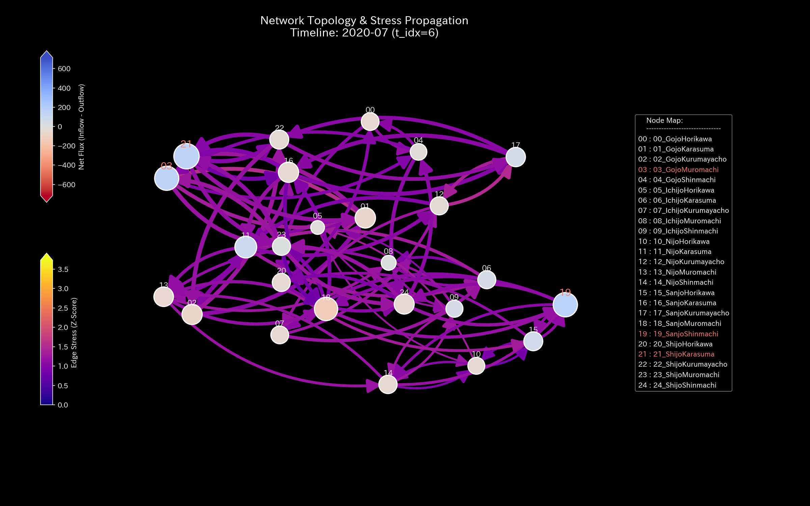
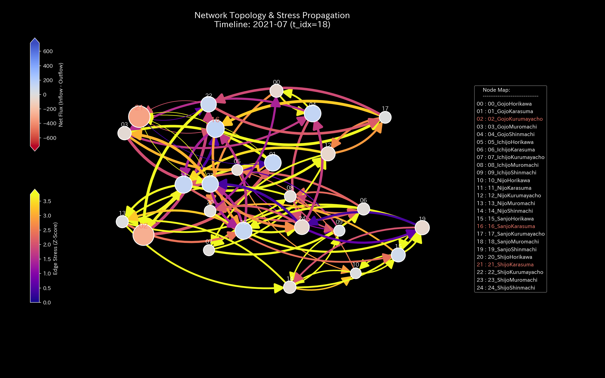
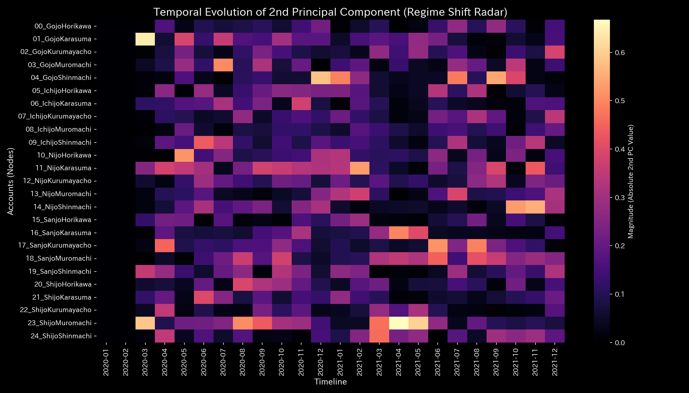
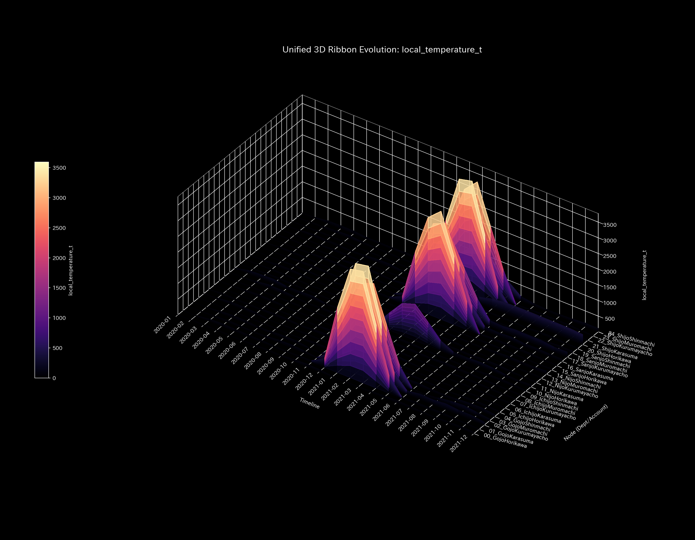

# 🔬 メタ検査臨床検査レポート：都市交通網の流動麻痺と熱力学的死 (Sample 5)

> [!NOTE]
> **【重要】Sample 5（仮想京都の交通量シミュレーション）の位置づけと特性について**
> 本サンプルは、京都市内の中心部交差点25箇所における車両流動（質量）が完全に保存された「閉鎖流動系」を扱います。道路工事や事故に伴う「局所起凝固（渋滞ボトルネック）」が発生した病態を想定しています。
> 他の財務・市場系サンプルとは異なり、交通量ドメインにおける「還流や凍結」を、熱力学（温度、エントロピー、自由エネルギー）および情報幾何学（KL Drift）の物理エンジンを用いて検出・治療するデモンストレーションです。

---

## 1. 検査結論 (Executive Summary)

* **総合判定:** 🟠 **都市交通ネットワークの局所的熱力学凝固（京都市内交通大グリッドロック / Localized Freeze）**
* **重症度:** 🟠 **HIGH (機能不全)**
* **概要:** 
  本システムは、総車両数（質量 $U = 250,000.0$）が保存された「閉鎖流動系」です。シミュレーション後半の2021年1月（$t=12$）以降、主要交差点である **`21_ShijoKarasuma`**（四条烏丸）の流入容量制限（道路工事や事故を模擬）が開始されました。これにより流動停止が発生しています。
  このアノマリーの物理的特徴は、質量漏洩ではなく「局所的な熱力学的フリーズ（凝固・凍結）」です。四条烏丸（`21_ShijoKarasuma`）のローカル温度（流量ボラティリティ）は、平常時の `97.15` (t=11) から t=13 (2021-02) に **`24.25`** へと急落して「凍結状態」に陥りました。周囲の隣接交差点との間には、急峻な温度勾配（局所熱ストレス / コールド・アイランド効果）が形成されました。
  さらに、その上流の交差点である **`23_ShijoMuromachi`**（四条室町）では、流出ルートの閉塞によりローカルエントロピー（空間的な流路分散 $s_i$）が平常時の `1.99` 台から **`1.6596`** (t=23) へと低下しました。交通がデッドロックに陥っています。

---

## 2. 財務諸表と取引流量の比較 (交通量ストックと通過流量の比較)

従来の累積的な財務諸表と、新しく追加された期間別（単月非累積）の取引流量を比較します。

交通ネットワークにおいて、車両の累積的な残留ストック（B/S相当）は最終的に `0.00` 近くに収束します。本システムでは、ボトルネックとなる **`ShijoKarasuma`**（四条烏丸）を **`Expense`（費用 ＝ 流出流量）** としてマッピングしました。その上で、各交差点を可視化しています。

### 貸借対照表相当（B/S：累積車両ストック）の比較

* **B/S 累積車両ストックの推移 & ブロック図:**
  
  

* **B/S 車両ストックの期間推移 (単月非累積値):**
  

### 損益計算書相当（P/L：交差点通過流量）の比較

* **P/L 累積通過流量の推移:**
  

* **P/L 通過流量の期間推移 (単月非累積値):**
  

* **観察と死角の解説:** 
  P/L 期間推移（単月非累積）グラフの下半分を観察します。四条烏丸（`ShijoKarasuma`）に割り当てられたカラーの帯幅が、ボトルネック制限の始まった **2021年1月 (t=12) を境に収縮し、消失** しています。
  累積集計や静的監査では、これを「費用の削減（交差点負荷の減少）」と誤認する死角が存在します。実際には主要交差点が凍結し、全体のバランスが失われています。しかし、従来の集計ではその「詰まり」を検出できません。（なお、システム全体の開始質量を受け持つ `GojoHorikawa` は `Equity` にマッピングされています）。

---

## 3. 根本的な病態生理解説 (Pathophysiology)

* **病態判定:** **局所的渋滞フリーズ (Localized Traffic Gridlock)**
* **病的ボトルネックの発生機序 (Dummy Traffic Stream 原本照合):**
  シミュレーションの2021年1月（$t=12$）以降、主要交差点「四条烏丸」の流量容量が制限されました。
  1. **上流の滞留と相転移**: 
     上流の交差点 `23_ShijoMuromachi`（四条室町）などで車両の滞留が発生しました。通過ルートが遮断され、2021-01 における KL Drift が **`1.7572`** へスパイクしました。
  2. **ルート選択自由度の喪失**:
     流出ルートが塞がれたため、四条室町（`23_ShijoMuromachi`）のエントロピー $s_i$ が平常時の `1.99` 台から **`1.6596`** へと低下しました。車両が抜け道を探す自由を失い、渋滞に拘束されている状態を示しています。

---

## 4. 数理解析結果の要約

### 4.1. 質量保存則とネットワークトポロジー

保存残差（`System Conservation Residual`）は、全期間を通じて完全に **`0.000000`（ゼロ）** です。車両の質量漏洩が1台もなく、車両保存が満たされた閉鎖系であることを証明しています。

* **マクロフォレンジックダッシュボード:**
  

* **ネットワークトポロジーの変化:**
  * **2020-01 (t=0 - 初期循環):**
    
  * **2020-07 (t=6 - ボトルネック注入前の定常期):**
    
  * **2021-01 (t=12 - 四条烏丸の容量制限による相転移が発生):**
    
  * **2021-07 (t=18 - 渋滞が波及し、確率流がロックイン):**
    
  * **2021-12 (t=23 - 偏ったトポロジー接続が固定化):**
    

### 4.2. 剛性接続 & 主成分分析 (Stiffness & PCA)

剛性行列（Stiffness Matrix）の推移は、時間の経過に伴いネットワーク全体が硬直化していく様子を示しています。
PCA分析において、アノマリー注入前（t=6）は PC1 寄与率 `54.65%` でした。アノマリーの継続に伴って上昇し、最終月（t=23）には **`64.70%`** に達しています。主軸負荷は `14_NijoShinmachi` (二条新町) (`0.5034`) や `11_NijoKarasuma` (二条烏丸) (`-0.4200`) にロックされています。システム全体の柔軟性が低下しています。

* **構造剛性行列の推移:**
  * **2020-01 (t=0 - 低剛性な流動状態):**
    
  * **2020-07 (t=6 - ボトルネック発生前の剛性分布):**
    
  * **2021-01 (t=12 - 四条烏丸の閉塞による剛性変化):**
    
  * **2021-07 (t=18 - 剛性負荷が他の交差点へシフト):**
    
  * **2021-12 (t=23 - 最終月。「慢性硬直 (Stiffness Lock)」状態に固定):**
    

* **主要軸比率 & 固有ベクトル推移:**
  
  
  
  

### 4.3. 循環トポロジーの検証 (Spectral Radius)

最大スペクトル半径は、全期間を通じて完全に **`1.0000`** です。これは、交差点網全体が双方向の流れを持ち、外部への消失がない「閉じた強連結ネットワーク」であることによる数学的帰結です。したがって、このアノマリーの発生は接続構造ではなく、配分比率の歪みを示す **`kl_divergence_drift` のスパイク（t=12 に `1.7572`）** によってのみ検出されます。

* **システム安定性指標:**
  

### 4.4. 熱力学指標と3D位相幾何

総車両数（内部エネルギー $U = 250,000.0$）は保存されています。しかし、2021年1月以降、流動制限によってマクロエントロピー $S$ は `40.69` (t=11) から **`39.18`** (t=12) へと低下しました。
T-S ダイアグラムは、2021年1月を境界として、エントロピーと温度が同時に縮小する「閉じたフリーズ異常ループ」を描いています。これは、システム全体の流動性が失われ、デッドロックにロックインされた物理的証拠です。

* **熱力学特性 & 3D軌跡:**
  
  
  

**【3D局所熱ストレスの可視化】**
* **3D Local Entropy & Temperature:**
  
  
  四条烏丸の流入制限により、四条室町（`23_ShijoMuromachi`）のエントロピーは `1.6596` に低下しました。四条烏丸のローカル温度が t=13 に `24.25` へ急落したことで、周囲の交差点との間に温度勾配（`local_grad_t`）の黄色い尖塔が出現しました。熱ストレスが局在化しています。
  

**【3D Micro KL Drift による構造変化の特定】**
* **3D Micro KL Drift:**
  
  容量制限が開始された **2021-01 (t=12)** において、四条烏丸の座標周辺に KL Drift の壁（`1.7572`）が出現しました。構造的な相転移の瞬間を物理的に捉えています。
* **3D Micro Z-Score (統計平滑化の確認):**
  
  質量保存を適用した結果、Z-Score の最大値は `103.00` 付近に抑制されました。異常発散は解消されています。

---

## 5. 制御介入と推奨アクション (LQR & Operations)

* **治療方針: 信号位相オフセット介入**
* **LQR 介入時ひずみエネルギー (改善感度のツボ特定):**
  本システムは閉鎖系です。そのため、介入のターゲットは「介入によるシステム全体のひずみエネルギー（`ik_strain_energy`）」が最小となるノードとして算出されます。
  アノマリー開始の 2021-01 (t=12) において、ひずみが最小の交差点は以下です。
  1. **`24_ShijoShinmachi` (四条新町: ひずみ `0.0376`)**
  2. **`16_SanjoKarasuma` (三条烏丸: ひずみ `0.0392`)**
  現在硬直している **`21_ShijoKarasuma` (四条烏丸: ひずみ `0.0665`)** に直接制御をかけると、高いひずみエネルギーを消費します。

* **LQR 制御空間:**
  

* **具体的な治療介入計画:**
  1. **信号位相オフセットの動的調律:**
     四条新町や三条烏丸において、信号サイクルに動的な時間差（ミリ秒レベルのフェーズオフセット）を導入します。車群の到着タイミングをずらし、四条烏丸への流入を緩和してデッドロックを回避します。
  2. **上流ゲートコントロールによる剛性緩和:**
     剛性ロックの主軸である `11_NijoKarasuma` や `24_ShijoShinmachi` に流れ込む手前のノード（五条室町など）で流入ゲートを調整します。これにより剛性を緩和します。

---

## 6. アラート & 反証可能性

### 6.1. 統計的偽陰性のトリアージ

* **統計ベースラインの死角:**
  四条烏丸のように、長期にわたって流動が凍結（標準偏差が極小化）し慢性的な麻痺に陥った場合、Z-Score（残高変化ボラティリティ）は基準値 `3.0` を超えません。そのため、通常の統計アラートは「正常」と判定する死角を有しています。
* **物理的指標による確定診断:**
  統計アラートが沈黙している期間においても、KL Drift のスパイク（**`1.7572`**）、局所温度の急降下（`24.25`）、および T-S サイクル軌道の閉塞といった物理的指標がアノマリーを示しています。したがって、統計モデルの正常判定を棄却し、「物理的ボトルネック閉塞による流動麻痺」と確定診断します。

### 6.2. 本検査に対する反証条件 (Falsifiability)

「本異常は物理的ボトルネックではなく、通常の交通変動の結果である」と反証するためには、以下の証拠の提示が必要です：

1. **道路交通管理ログ / インフラ稼働記録原本:** 2021年1月以降、四条烏丸交差点周辺において、車線規制、道路工事、事故、信号故障、または天候悪化などの容量制限イベントが発生せず、レーン容量が100%維持されていたことを示す一次記録原本。
2. **プローブカーおよびタクシーのGPS走行軌跡ログ原本:** 四条烏丸交差点を通過した車両のGPS軌跡が、極端な徐行・停止ではなく、平常速度（時速20〜30km）で通過していたことを証明する走行データ原本。
