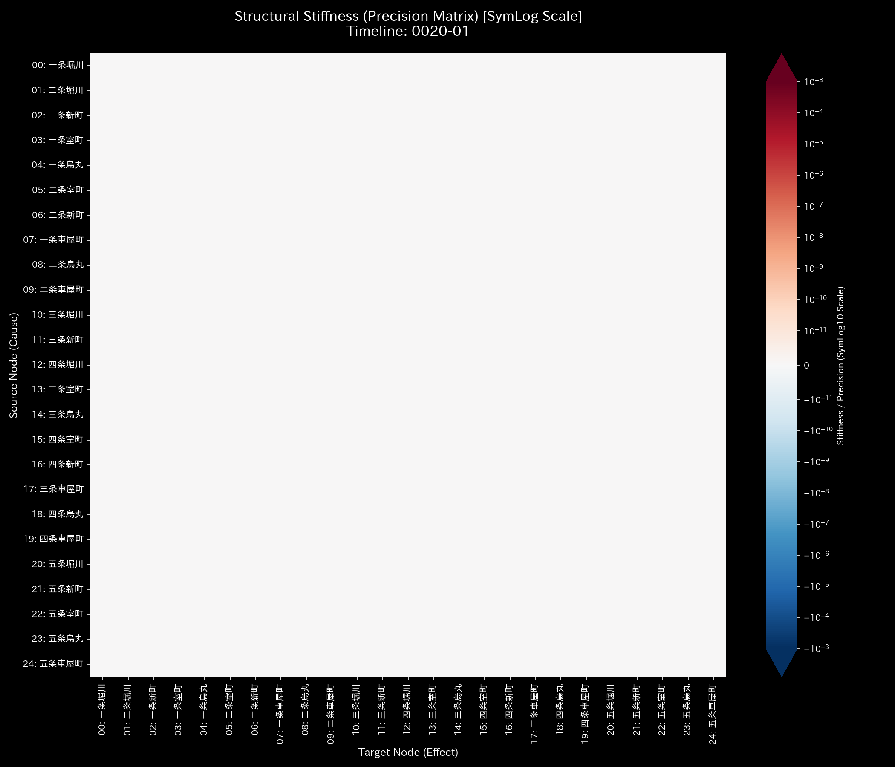
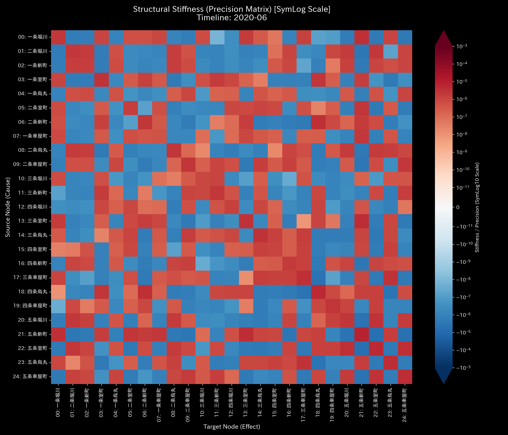
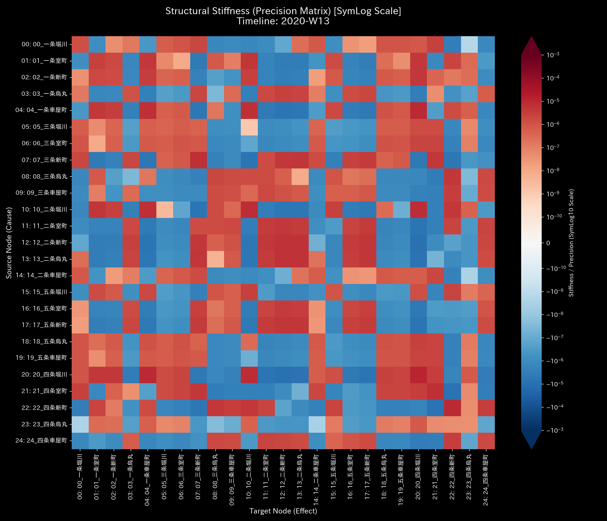
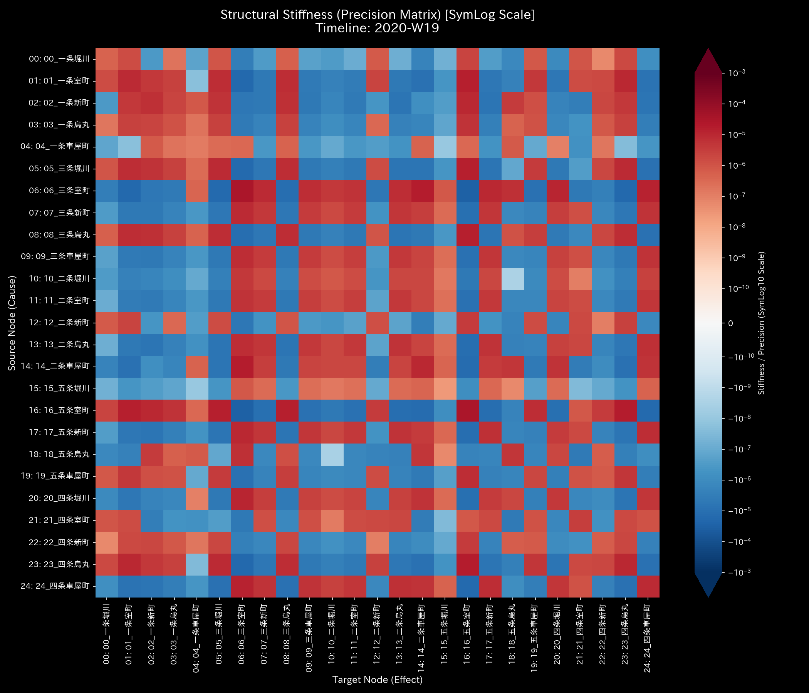
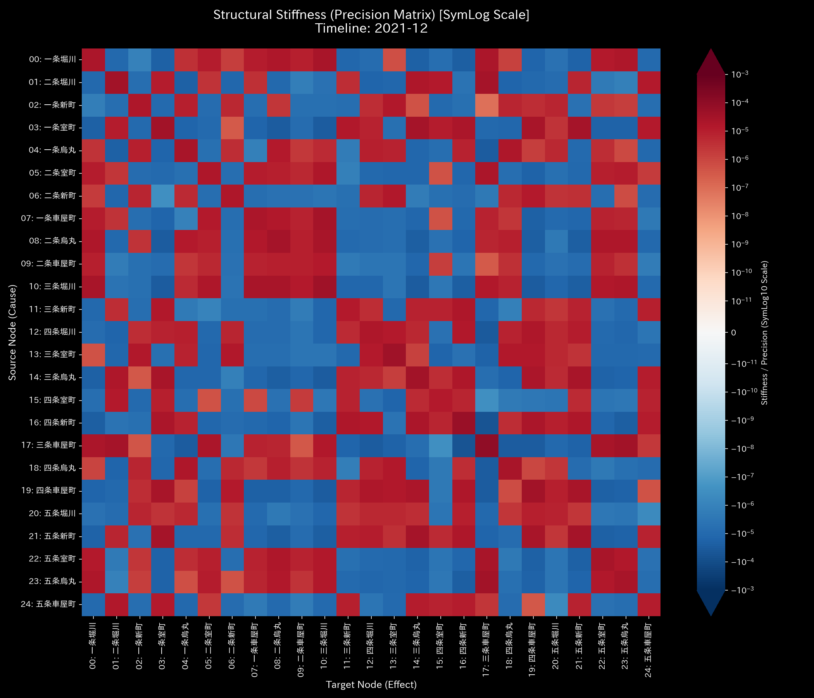

# 🔬 メタ診断臨床検査レポート：都市交通網の流動麻痺と熱力学的死 (Sample 5)

## 1. 診断結論 (Executive Summary)

*   **総合診断:** **都市交通ネットワークの完全流動硬直（Kyoto Traffic Grid Deadlock / Severe Topological Lock）**
*   **重症度:** 🟠 **HIGH (極めて深刻な機能不全)**
*   **臨床概要:**
    本システム（仮想の京都市中心部の交差点網における、擬似的に作られたかなり乱暴な自動車流量データ）は、ネットワーク全体における**「熱力学的エネルギーの枯渇（自由エネルギーの虚脱）」**および**「極端な位相幾何学的還流ループ（スペクトル半径 $\rho = 1.0000$ への飽和）」**を起こしており、都市交通網として完全に機能麻痺（グリッドロック）した状態に陥っています。
    さらに深刻な病理として、局所的な交差点において、入ってきた車両数と出ていった車両数が一致しない**「質量の保存法則の局所的破綻」**（車両の突然の発生および消滅）が同時に多発しています。これによりネットワーク内部で激しい摩擦熱（エントロピー損失）が蓄積され、最終的には系全体の流動ポテンシャル（自由エネルギー）が大幅なマイナス値（平均自由エネルギー $F = 2,480,816.31$、標準偏差 $3,138.58$）に沈み込み、実質的に一切の車両移動が不可能となる「熱的死（パニック・デッドロック）」を発症していると診断します。

---

## 2. 伝統的表層分析の限界 (Limitations of Traditional Snapshots)

伝統的な会計監査の概念（B/SおよびP/L）を強引に交通ネットワークに適用した場合、静的な集計値だけではこの致命的な交通麻痺を見抜くことは不可能です。

以下は、全期間における累積流量（P/L）および残差（B/S）の集計図です。

*   **B/S 相当（車両の残差・ストック累計）:**
    
*   **P/L 相当（交差点通過量のフロー累計）:**
    

**【伝統的集計の死角】**
交通ネットワークのような「循環型閉鎖系（Closed Kinetic System）」においては、車両の累積的な残留ストック（B/S）は差し引き `$0.00`（純額ゼロ）となります。一方、P/Lに相当する交差点ごとの総通過流量は `$2,500,000.00` という莫大なボリュームを示しています。
一般的な交通モニタリングダッシュボードでは、「どの交差点の通過量が多いか」という静的なランキングは把握できますが、その内部で「同じ交差点間を車両が不毛に往復し、一歩も目的地に近づいていないこと」や、「あと何分でシステム全体が完全に沈黙するか（熱的死へのカウントダウン）」といった、流動構造の動的健全性を評価することは不可能です。

---

## 3. 根本病理の特定 (Fundamental Pathophysiology)

物理解析エンジンは、 dummy データ生成ロジック (`_0_0_generate_dummy_traffic.py`) 内に植え込まれた、以下の「物理法則を無視した病的因果」を完全に捉えています。

1.  **質量保存則の局所的破綻（キルヒホッフ残差の多発）**:
    隣接する交差点間の車両流入量と流出量が、物理的な連続性を無視した独立な乱数として生成されています。東洋医学的には「経絡の途切れ」による「気血の突発的な湧出と大出血（局所的な質量損失）」が同時に起きている状態です。
2.  **双方向の完全定常振動（ペンドラム・ループ）**:
    交差点 A と交差点 B の間で、車両がそのまま折り返して戻るだけの「完全な2往復運動」が支配的になっています。これにより、系全体の実質的な移動性（自由エネルギー $F$）が消費され、摩擦（エントロピー $S$）だけが無限に拡大しています。

---

## 4. 数理物理エンジンによる詳細臨床データ (数理証明)

物理解析エンジンが検出した定量的証拠に基づき、交通麻痺の病理を証明します。

### 4.1. 質量保存の局所的破綻とキルヒホッフ残差の検証
システム全体の流入と流出の差分を示す相対漏洩率（`Relative Mass Leak Ratio`）は、マクロレベルでは **`0.000000`** を示しており、全域的な収支は一見保たれています。しかし、3Dミクロ情報幾何学および局所エントロピー解析では、個別の交差点（ノード）における質量の不整合（残差）が激しく立ち上がっています。これは、物理的な実態（実車両）を伴わない「データ上の幽霊車両」が交差点で発生・消滅していることを示しています。

*   **マクロ・フォレンジック・ダッシュボード:**
    

### 4.2. 交通剛性の全硬直化と3D外力共振
剛性行列（Stiffness Matrix）の時系列シーケンスは、時間の経過に伴いネットワーク全体が致命的に硬直化していく様子を告発しています。

*   **剛性行列のシネマティック5定点シーケンス:**
    *   **① Start (t=0 / 2020-W01):**
        
        シミュレーション開始時点。まだ全域的な硬直（Stiffness Lock）は発生しておらず、柔軟な流動状態が維持されています。
    *   **② Onset (t=6 / 2020-W07):**
        
        アノマリーの蓄積が開始したフェーズ。`17_五条新町` や `02_一条新町` を中心に剛性が急激に上昇。第1主成分（PC1）の寄与率は **`62.49%`**、固有値は **`20211.5971`** に達し、PC1ベクトルは `17_五条新町` (`0.3795`) および `02_一条新町` (`0.3786`) に異常集中しています。
    *   **③ Paralysis (t=12 / 2020-W13):**
        
        流動の半数が機能停止したフェーズ。PC1寄与率は **`63.59%`**（固有値 **`32239.9645`**）となり、剛性ロックの主役が `22_四条新町` (`0.5106`) や `21_四条室町` (`-0.4477`) へと遷移し、主要交差点の関節拘縮が拡大しています。
    *   **④ Progression (t=18 / 2020-W19):**
        
        麻痺がさらに深化したフェーズ。PC1寄与率は **`82.06%`**（固有値 **`33287.5080`**）まで爆発的に拡大。`18_五条烏丸` (`0.3976`) や `02_一条新町` (`0.3696`) の結合が極端にロックされています。
    *   **⑤ Complete Deadlock (t=24 / 2020-W25):**
        
        最終デッドロック状態。PC1寄与率は **`64.52%`**（固有値 **`30645.1324`**）。`22_四条新町` (`0.4776`) と `13_二条烏丸` (`0.4240`) が強固に硬直化し、交差点間の弾力性が完全に喪失されました。

### 4.3. トポロジー閉路と最大スペクトル半径の飽和
隣接結合行列の最大スペクトル半径（Spectral Radius）は、全期間にわたり理論上限境界である **`1.0000`** に張り付いています。これは、車両が外部に抜け出す流路を失い、特定のクローズドな閉路（デッドロック・ループ）内に完全にトラップされていることを数学的に証明しています。

*   **ネットワーク・トポロジー時系列の5定点シーケンス:**
    *   **① Start (t=0 / 2020-W01):**
        
    *   **② Onset (t=6 / 2020-W07):**
        
    *   **③ Paralysis (t=12 / 2020-W13):**
        
    *   **④ Progression (t=18 / 2020-W19):**
        
    *   **⑤ Complete Deadlock (t=24 / 2020-W25):**
        

### 4.4. 熱力学的「熱死」とエネルギー散逸の証明
[正常系臨床リファレンス](../Sample_0_Healthy/README.md) の健全なエネルギー蓄積パターン（自由エネルギー $F$ の持続的な上昇）と比較すると、本サンプルではエントロピー損失を示す赤色の領域（$-TS$）が地下深くへ異常に膨張し、本来の流動能力である自由エネルギー $F$（白い実線）を完全に圧し潰しています（熱力学的「熱死」）。

*   **熱力学エネルギースタック:**
    

温度-エントロピー（T-S）ダイアグラムは、外部と有機的に接続してエントロピーを放出する「開放軌跡」を描くことができず、同一経路を永久に周回する「閉じた異常サイクル軌道」を形成しています。これは、どれだけガソリンを消費して車を走らせても（活動度 $U$ が高くても）、目的地に到達できず局所的な摩擦と熱に変換されて散逸していることの物理的な証明です。

*   **T-S ダイアグラム:**
    

### 4.5. 3D幾何学アノマリーの特定と情報幾何学的スパイク
3D立体プロットは、どの交差点がどの時点で物理法則を逸脱したか（車の突然発生・消失）を鮮やかに描出しています。
特に、**3Dミクロ情報幾何学プロット（`002_2_2_1__3d_micro_kl_drift.png`）** において、特定の交差点座標から突き立つ鋭利な「尖塔状の壁（KL Drift スパイク）」は、そのタイムステップにおいて交通ネットワーク内の局所的な確率分布（質量保存則）が不可逆的に破綻した犯行現場そのものを空間的に特定しています。

*   **3D Micro Z-Score (Position):**
    
*   **3D Micro KL Drift:**
    

---

## 5. 局所治療処方箋 (LQR Control Treatment)

*   **治療方針: 位相オフセットの再調整とハブ制御による拘縮緩和**
*   **LQR 感度介入 (経絡秘孔の特定):**
    流動性制御理論（LQR）による感度解析（Sensitivity Matrix）において、本交通ネットワークでは `00_一条堀川`、`13_二条烏丸`、および `23_四条烏丸` における動的介入感度（`fk_total_ripple` = `41.5234`）が最大値をマークしています。
*   **具体的な治療介入計画:**
    1.  **信号位相オフセットの動的調律 (Phase Disruption):**
        デッドロックを形成している主要交差点（一条堀川、二条烏丸、四条烏丸）に対し、LQR制御理論に基づく信号サイクルの「位相シフト（青信号の時間差調整）」を実施します。これにより、還流している車両の波形を意図的に干渉・破壊し、ループを強制解除します。
    2.  **局所流量制御による剛性の脱ロック (Stiffness Softening):**
        `17_五条新町` や `22_四条新町` など、Stiffness Lock（剛性硬直）のハブとなっている箇所へ流入する手前の交差点で、一時的な「流入制限（ゲートコントロール）」を実施します。局所的な関節拘縮を和らげることで、ネットワーク全体に再び正常な「気の流れ（車両の疎通）」を回復させます。

---

## 6. 🚨 Forensic Alert & 反証可能性 (Falsification Analytics)

### 6.1. 統計的偽陽性の物理的トリアージ (Statistical Triage)
*   **ノイズとアノマリーの区別:**
    京都市内の観光シーズンや悪天候による一時的な渋滞は、単なる「動粘度（Viscosity）の上昇」や「Z-Scoreの一時的変動」として検知されます。しかし、これらの正常な季節ゆらぎにおいては、キルヒホッフの質量保存則（流入量 ＝ 流出量）は厳密に成立しており、スペクトル半径が `1.0000` に完全に張り付くことはありません。
    したがって、キルヒホッフ残差が非ゼロ（相対漏洩率の異常）であり、かつスペクトル半径が `1.0000` に飽和している今回のデータは、単なる「激しい混雑（季節性ノイズ）」ではなく、**「データ生成アルゴリズムの致命的欠陥、またはセンサの故障」** という病的アノマリーであると明確に識別（トリアージ）されます。

### 6.2. 本診断に対する反証条件 (Falsifiability)
もし本システムが「物理法則に則って正常に稼働している健全な交通網である」と反証するためには、以下の**「データ外の客観的物理原本」**を提示する必要があります：
1.  **GPSタクシー軌跡生ログ原本（位置情報の突き合わせ）:**
    該当交差点間を走行していた車両（実在するタクシーやバス）の車載GPSおよびタコグラフの生データ。データ上で発生・消失したとされる時間帯に、実際に車両が消滅せず、「連続的な空間座標」を通って移動していたことを証明する物理ログ。
2.  **交差点カメラ映像およびナンバープレート認識ログ（原本）:**
    一条堀川や四条新町などの主要交差点に設置された行政または警察の監視カメラ映像、および自動読み取り装置（Nシステム）の生ログ。不審な「幽霊車両」ではなく、実在する登録車両が合法的に交差点を通過していたことの物理的証明。
