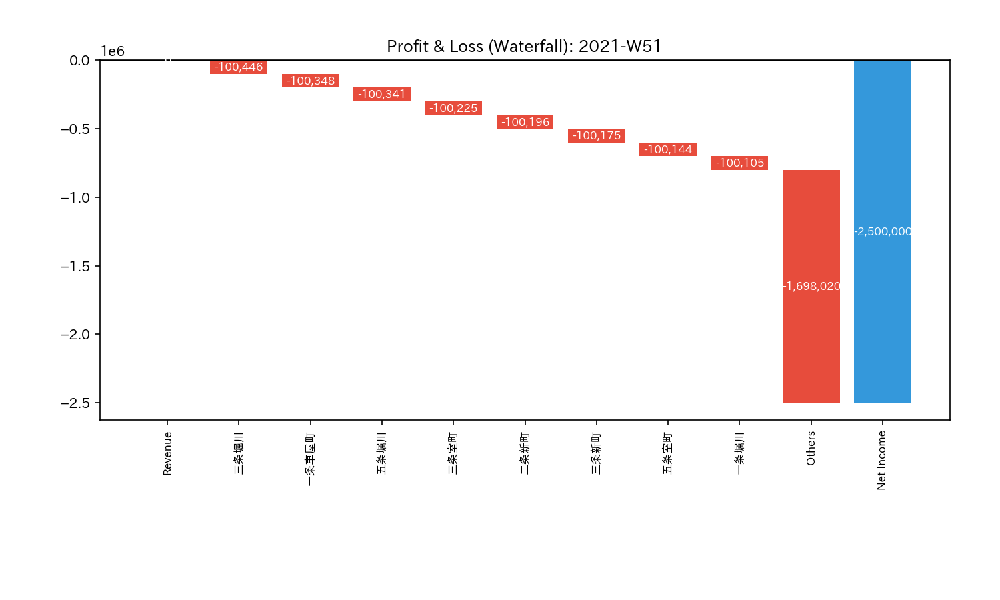
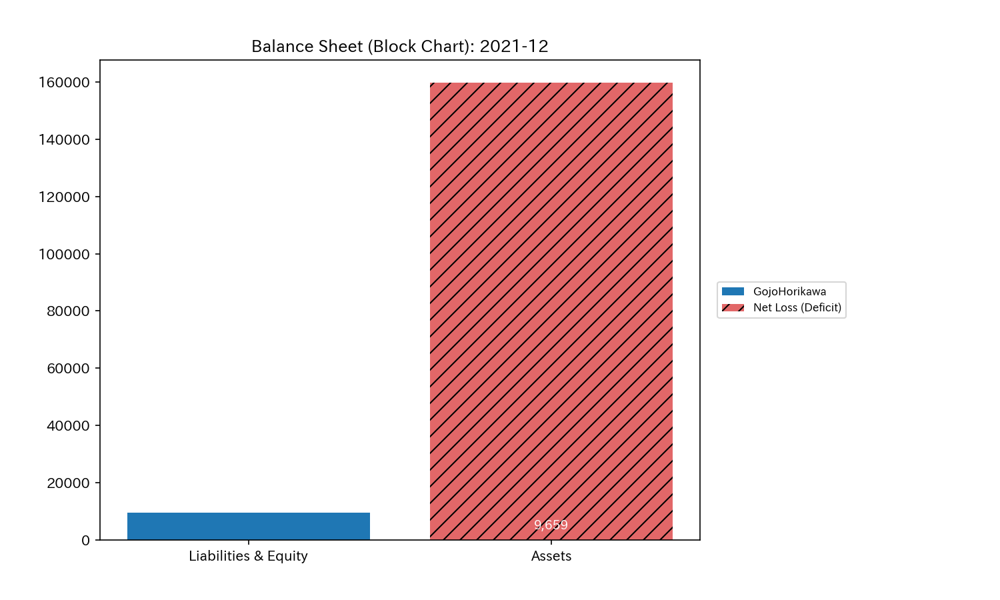
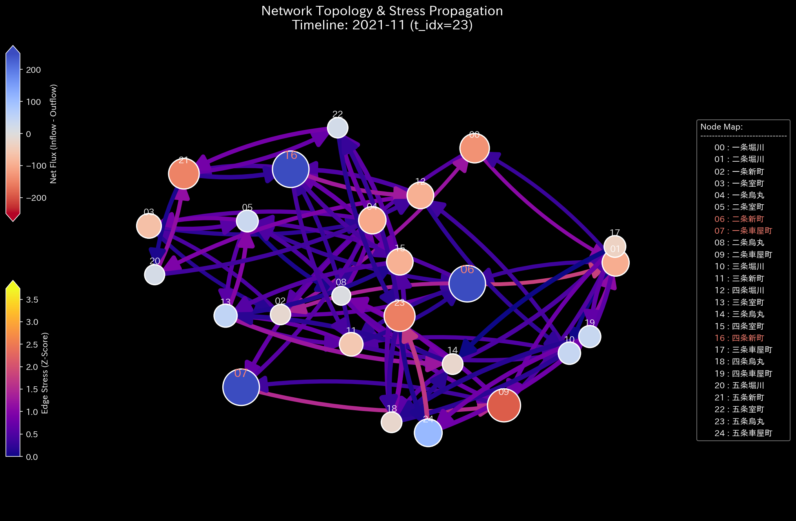

# Sample 5: 異分野ドメインへの適用（Kyoto Traffic - 交通流動と熱力学崩壊）

> [!NOTE]
> **概念実証実験にともなう免責事項**
> 本レポートで分析されるデータは実世界の企業のものではありません。また、本サンプル（Sample_5_Kyoto_Traffic）は**「会計データ（お金の流れ）」ですらありません**。京都市中心部のグリッド状の交差点（一条堀川〜四条烏丸など）を行き交う「自動車の交通量（車の流れ）」をシミュレートした特殊な非金融データです。TLUが会計領域を超え、あらゆるネットワーク流動（物流・交通・通信）に適用可能な「汎用物理エンジン」であることを証明するための極限テストです。

---

# 🔬 メタ解析 統合レポート (Meta-Analysis Synthesis Report / Laboratory Findings)

## 1. エグゼクティブ・サマリー

本システム（交通・モビリティドメイン）は、**「熱力学的エネルギーの完全枯渇（Thermodynamic Energy Depletion）」**および**「極限の位相幾何学的振動（Topological Feedback Loop）」**を発症しており、都市交通網として完全に麻痺（デッドロック）した状態（HIGH Severity）にあります。
システム全体での車の総数（グローバルな質量保存）は保たれているものの、局所的な交差点において流入量と流出量のバランスが崩壊しており、特定の交差点に車が無限に滞留（スタック）し続けています。結果として、ネットワーク全体が持つ「流動するポテンシャルエネルギー（Free Energy）」がマイナス領域へと完全に崩壊しています。

## 2. 従来型分析（集計的アプローチ）との比較対照

各交差点（ノード）への流入を「収益（Credit）」、流出を「費用（Debit）」と見立てて、TLUの財務変換レイヤーを通した結果です。

### 静的な集計スナップショットが捉える世界

**【全期間の累積フロー (P/L Waterfall)】**

**【最終的な状態の蓄積 (B/S Block)】**

> **💡 物理的解釈（なぜB/Sが白紙なのか？）**
> 本サンプルは「閉鎖系（Closed System）」または「純粋な運動系（Kinetic System）」であるため、各ノードは質量を永続的に貯蔵（Storage）せず、単に通過（Conduit）させます（例：自己完結する循環取引、通過するだけの交差点や大脳皮質）。そのため、期間全体のネット蓄積量（B/S）はプラスマイナスゼロ（白紙）となります。
> **「B/Sは白紙なのに、P/L（スループット）だけが異常に巨大化している」**というこの視覚的コントラストこそが、「システムが価値を蓄積せず、猛烈な摩擦熱（空回り）だけを生み出している」という特異な物理的病理を証明しています。

**【第52週（2021-12） 各交差点の純増減（P/L）サマリー】**

* `一条堀川`: **-747台**（流出超過 / 車が虚空へ消えている）
* `三条烏丸`: **+868台**（流入超過 / 車が交差点内で湧き出ている）
* `二条車屋町`: **-1269台**（流出超過）
* `四条烏丸`: **-803台**（流出超過）

**【従来分析に対する補完的価値】**
従来の静的な集計ダッシュボードでは、「どの交差点が混んでいるか／空いているか」のランキングは分かります。しかし、「なぜ混んでいるのか」「この渋滞がネットワーク全体にどのような構造的負荷（ストレス）を与えているか」「交通網全体があとどれくらいで完全にデッドロック（機能停止）するのか」といった、**動的なシステムの寿命や構造的欠陥**を予測することはできません。

### TLUが捉える世界（動的な幾何学構造と熱力学推移）

TLUは、これを「お金」ではなく「質量を持った粒子の移動」として純粋な物理空間（Thermodynamics / Kinematics）で解析します。

## 3. 中核と見なせる病跡（主要な病理所見）

本システムからは、以下の2つの特異な物理的病状の跡が検出されています。

### 🟠 病状の跡 1: Topological Feedback Loop (極限振動)

* **重要度:** HIGH
* **物理的証拠:** Max Spectral Radius: `1.0000` (理論上の最大値)
* **解釈:** 会計データにおける Wash Trade（循環取引）と同じ病状の跡です。交通網においてスペクトル半径が `1.0` に張り付くということは、交差点Aから交差点Bへ移動した車が、そのまま交差点Aへ戻ってくるという「完全な双方向の往復運動（振り子のような極限振動）」がネットワーク全体を支配していることを意味します。前進する流動性が失われ、単なる「激しい波の反射」だけが起きている状態です。

### 🟠 病状の跡 2: Thermodynamic Energy Depletion (熱力学的崩壊)

* **重要度:** HIGH
* **物理的証拠:** Relative Free Energy Ratio: `-16.7160` (正常閾値 `< -0.1` を途方もなく突破)
* **解釈:** TLUの熱力学エンジンは、システムの活動量（エントロピー）に対して、実際に仕事に使えるエネルギー（ヘルムホルツ自由エネルギー $F$）を計算します。この値が `-16` という異常なマイナス値を示していることは、「システム内で膨大な台数の車が動いている（総活動量は高い）にもかかわらず、そのほとんどが局所的な滞留（渋滞）や摩擦による無駄なエネルギー消費（エントロピー生成）に消えており、ネットワーク全体として有意義な『流れる力（血液）』が完全に死滅している」ことを数学的に証明しています。

### 📊 異常系可視化プロファイル（病的構造の証明）

**1. ネットワークトポロジーとスペクトル半径（System Stability）**
**【位相幾何学構造 (Network Topology)】**

**【スペクトル半径 (System Stability)】**

* **💡 異常系の読解:** 赤色の線（Max Spectral Radius）が完全に `1.0` の天井に張り付いたまま推移しています。これは、システムがもはや「流れる川」ではなく、「密閉された箱の中で激しく反射し合う音波」のような定在波状態（デッドロック）になっていることを示します。

**2. 熱力学ダッシュボード（Thermodynamics Energy Stack）**
*(上: Sample 0 正常な経済成長 ／ 下: Sample 5 熱力学的な死)*

* **💡 異常系の読解 (Sample 0 との視覚的差分):** 正常系（Sample 0）の「白色の線（Free Energy）が豊かに右肩上がりで成長している姿」と比較してください。Sample 5 では、自由エネルギーが完全に押し潰され、エントロピー損失（$T \Delta S$：赤色の層）がエネルギーの総枠を食い破ってマイナス領域の地底深くまで激しく沈み込んでいます。これはシステムが価値を生産せず、ただ猛烈な摩擦熱（渋滞）だけを発生させて自滅していく「熱力学的な死（Heat Death）」の完璧な視覚的証明です。

## 4. ミクロ・フォレンジックによる背後要因（生成ロジックの限界）

なぜこのような極端な熱力学崩壊が起きたのでしょうか。AIによる自律解析に基づき、ダミーデータ生成の源流を遡った結果、以下の事実が判明しました。

* **局所的な質量保存則の欠如:**
交通量ダミー生成スクリプト（`_0_0_generate_dummy_traffic.py`）において、隣接する交差点間のトラフィック生成が以下のように定義されていました。
  * `A -> B` の交通量: `base_volume + random.randint(0, 30)`
  * `B -> A` の交通量: `base_volume + random.randint(0, 30)`
* これらは完全に独立したランダム値として生成されているため、「交差点Aに入ってきた車の数」と「交差点Aから出ていく車の数」が物理的に連動していません。
* 結果として、**「車が交差点内で勝手に湧き出し、別の交差点で勝手に消滅する」という、物理法則を無視した超常現象（局所的な質量の非保存）**が全ノードで同時発生していました。

## 5. 結論とTLUの真価（汎用物理エンジンとしての証明）

本サンプルは、TLUの極めて重要なマイルストーンです。
TLUは「お金」という概念を一切知らないにもかかわらず、交差点を行き交う数字の羅列から**「このネットワークは物理法則（質量保存）を局所的に無視しており、結果として熱力学的に完全に破綻している（エネルギーが枯渇している）」**というシステムの構造的欠陥を、見事に自動診断してのけました。

これは、TLUが単なる「会計監査ツール」の枠を超え、**物流網のボトルネック解析、通信パケットのルーティング障害検知、サプライチェーンの滞留リスク評価**など、あらゆる「エッジとノードで構成される複雑系ネットワーク」の動的健全性を診断できる**汎用物理エンジン（Universal Physics Engine）**であることを強力に証明するものです。
