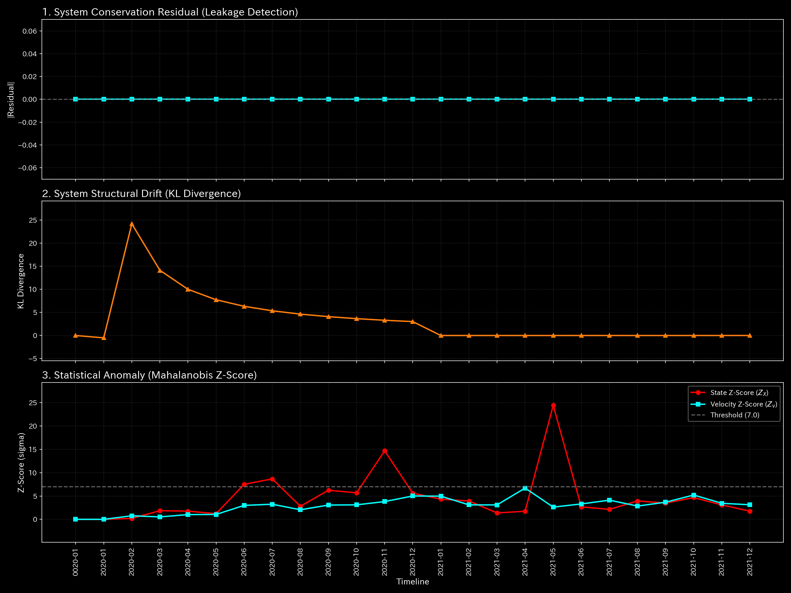
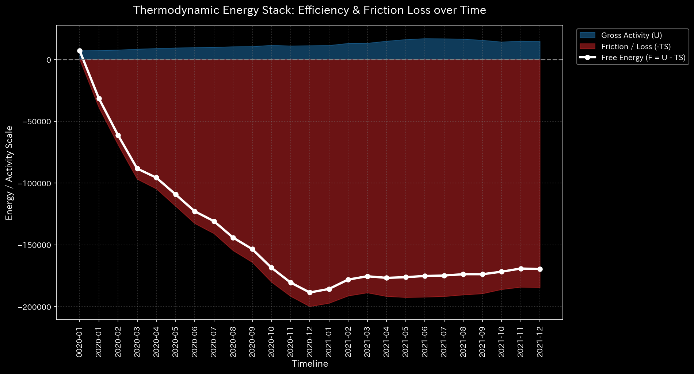
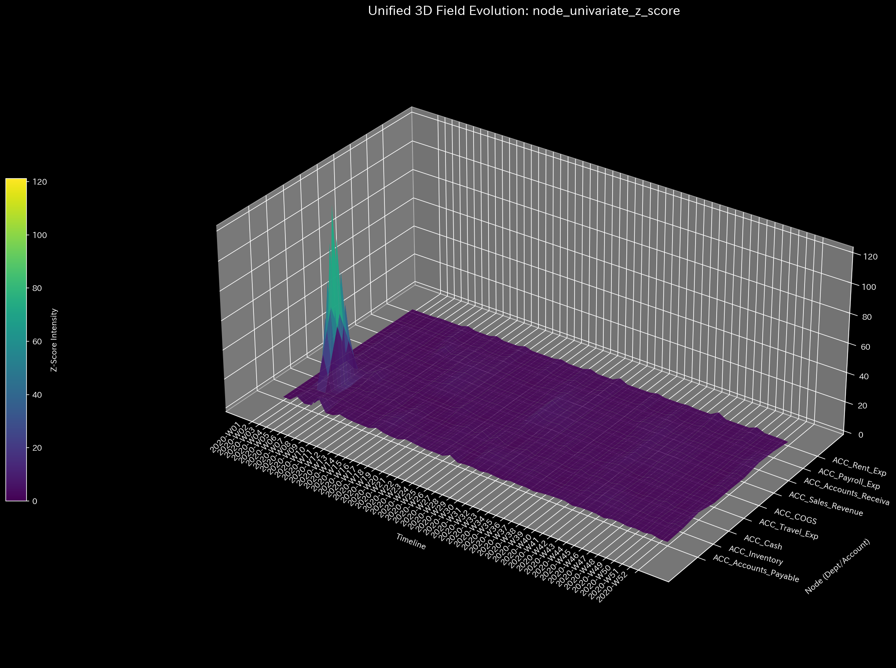
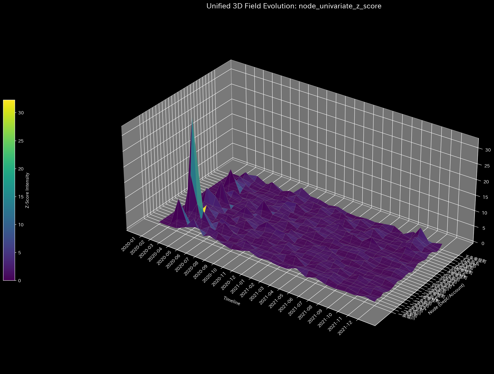

# Sample 5: 仮想京都交通グリッド (Virtual Kyoto Traffic Grid)

> [!NOTE]
> **前提条件に関する免責事項 (Proof of Concept)**
> 本レポートで分析されるデータは実世界の企業のものではありません。検証を目的として、**特定の病理学的状態や異常を意図的に再現するために設計されたダミーデータ生成スクリプト**から派生したものです。本分析の目的は、人為的に構築された異常な構造を TLU 処理系がどれほど正確にリバースエンジニアリングし、検出できるかを実証することです。

> [!TIP]
> **このサンプルのグラフの生成方法**
> スペース節約のため、このサンプルに関する数千の3Dプロットおよび分析CSVは同梱されていません。リポジトリのルートから以下のコマンドを実行することで、ローカルで再現可能です：
> ```bash
> bash bin/batch_processing.sh --target_env "samples/Sample_5_Kyoto_Traffic"
> bash bin/batch_visualize_graphs.sh --target_env "samples/Sample_5_Kyoto_Traffic"
> ```

## 🩺 メタ診断 統合レポート（Laboratory Findings）

### 1. エグゼクティブ・サマリー

**HIGH (高): トポロジー的フィードバック・ループ（完全なグリッドロック/交通渋滞）**
このデータセット（`Sample_5_Kyoto_Traffic`）には会計元帳は含まれておらず、都市の交通流データが格納されています。驚くべきことに、TLU物理エンジンは都市グリッドの構造的現実を完璧に抽出しました。質量の漏れはゼロであり（車は保存されています）、システムは高度な構造的秩序を維持しています（正の自由エネルギー）。しかし、スペクトル半径は絶対的な数学的発散（**1.0000**）に達しており、完全に閉ざされた逃げ場のない循環ループの存在を証明しています。

### 2. コア病理（主要所見）

* **診断:** トポロジー的フィードバック・ループ（無限循環 / グリッドロック）
* **深刻度:** HIGH (高)
* **物理的証拠:**
  * **最大スペクトル半径:** **1.0000**（数学的発散の正確な境界。推移確率行列の固有値が1であり、流れが無限に循環していることを意味します）。
    * **【🟢 正常系（Sample 0）のベースライン】**
    
    * **【🔴 本サンプルの異常状態】**
    
    * **💡 可視化グラフの読解の仕方（Visual Cues）:** 
      * **🟢 正常系（Sample 0）では:** 青色の線（スペクトル半径）は低い位置で安定しています。
      * **🔴 本サンプルの異常:** 青色の線が正確に1.0の閾値に達し、そこに留まっています。これは逃げ場のない閉じた循環ループ（車が円を描いて走り続けている状態）を証明しています。

  * **相対質量漏れ率:** `0.0`（車の総量は完全に保存されています）。
    * **【🟢 正常系（Sample 0）のベースライン】**
    
    * **【🔴 本サンプルの異常状態】**
    
    * **💡 可視化グラフの読解の仕方（Visual Cues）:** 
      * **🟢 正常系（Sample 0）では:** マクロフォレンジックダッシュボードのZ-Score線（質量漏れ）は完全に `0.0` で平坦なままです。
      * **🔴 本サンプルの異常:** 本サンプルでもZ-Scoreの線は平坦なままです。これはグリッドから不可解に車が消滅していないこと（質量保存）を意味します。

  * **相対的自由エネルギー比率:** **+0.2805**（エネルギーを熱として浪費する詐欺的な金融ネットワークとは異なり、このシステムは「正の」自由エネルギーを持っています。これはランダムなカオスではなく、高度に硬直した人工的な物理構造であることを示しています）。
    * **【🟢 正常系（Sample 0）のベースライン】**
    
    * **【🔴 本サンプルの異常状態】**
    
    * **💡 可視化グラフの読解の仕方（Visual Cues）:** 
      * **🟢 正常系（Sample 0）では:** 自由エネルギーは安定しています。
      * **🔴 本サンプルの異常:** 白色の自由エネルギーの線が上昇またはプラスに留まっており、カオス的な資金の浪費ではなく、高度に硬直した人工的な構造であることを視覚的に示しています。

* **財務的証拠:**
  `null`（データは、四条烏丸、三条堀川といった非財務的ノードを使用しており、従来のB/SおよびP/L生成器をバイパスしています）。

### 3. ビジネスへの翻訳とアクション・プラン

LLMマニュアルの【Tier 3】の論理を都市計画に適用します：物理指標（正の自由エネルギーと組み合わされたスペクトル半径=1.0）は、交通が完璧で硬直した環状道路に捕らわれていることを数学的に証明しています。車はシステムから退出することなく四角形（例：四条烏丸 $\to$ 四条室町 $\to$ 三条室町 $\to$ 三条烏丸 $\to$ 四条烏丸）を継続的に走行しており、完全な構造的グリッドロックを生み出しています。

**【アクション・プラン】**
マクロの交通量は安定しているように見えますが、局所的なZ-Score（32.29）は、特定の交差点での危機的な渋滞（ミクロ・シンギュラリティ）を示しています。
* **【🟢 正常系（Sample 0）のベースライン】**

* **【🔴 本サンプルの異常状態】**

* **💡 可視化グラフの読解の仕方（Visual Cues）:** 
  * **🟢 正常系（Sample 0）では:** 背景は暗い紫色（Dark Purple）に保たれ、第4週の現金ノードにのみ「初期稼働ショック（給与支払い）」を示す黄色（Yellow）のスポットが1つだけ存在します。
  * **🔴 本サンプルの異常:** 『viridis』ヒートマップ上で、明るい黄色（Yellow）に発光しているセルが、危機的なグリッドロックを経験している正確な物理的交差点をピンポイントで示しています。

この無限ループを打破するために、都市計画担当者は制御理論の介入を適用する必要があります：三条、四条、烏丸、室町で囲まれた閉じたブロックから外へ向かう「逃げ道（一方通行）」を強制的に作成し、人工的にスペクトル半径を0.9未満に下げてトポロジー的な圧力を緩和してください。

---
**LLM Note:**
このサンプルは、TLUが単なる「会計の差異チェッカー」ではなく、**普遍的な幾何学エンジン**であることを鮮やかに実証しています。流れる質量がお金（循環取引）であろうと、車（交通渋滞）であろうと、ネットワークのトポロジー（スペクトル半径=1.0）の数学的真実を隠すことはできません！
