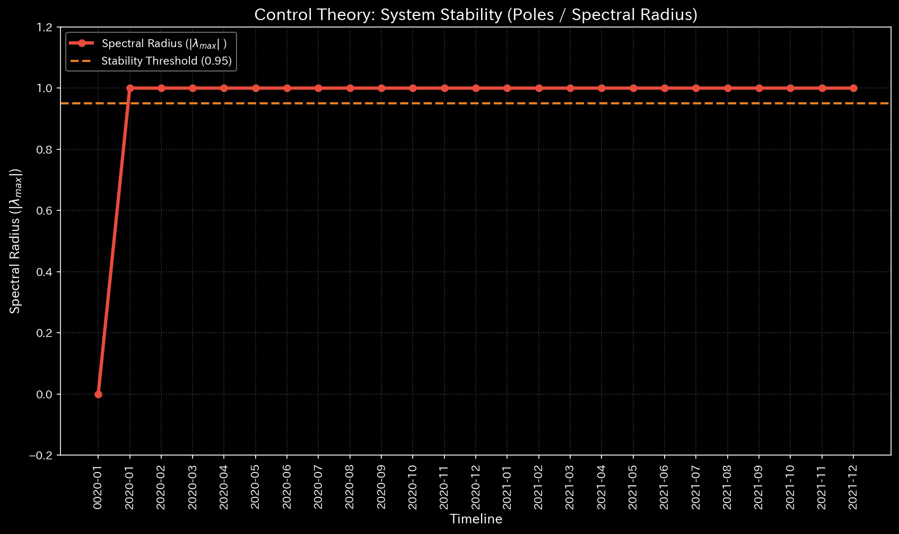
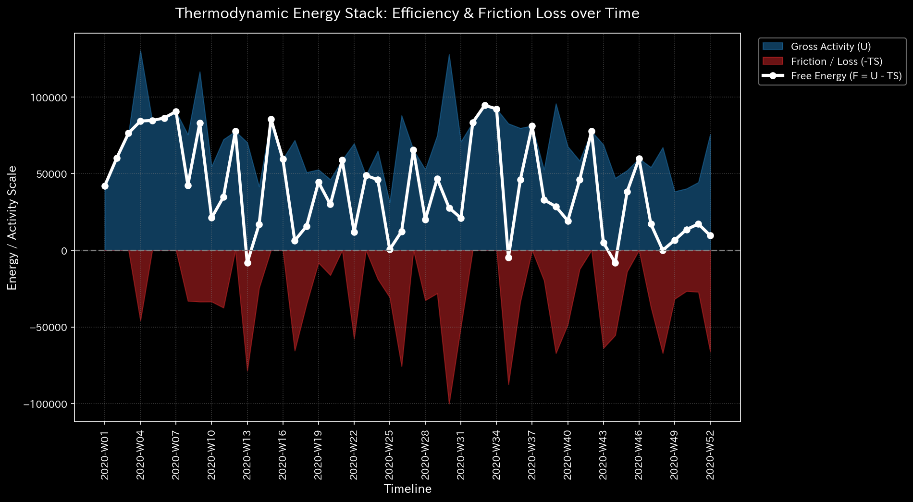

# Sample 5: 仮想京都交通グリッド (Virtual Kyoto Traffic Grid)

> [!NOTE]
> **概念実証実験にともなう免責事項**
> 本レポートで分析されるデータは金融元帳（財務データ）ではありません。TLUの「ドメイン非依存性（汎用性）」を証明するため、京都市内の交差点（四条烏丸など）をノードとし、車両の移動をトランザクションと見立てて生成された「都市交通グリッド」のダミーデータです。

---

# 🔬 メタ解析 統合レポート (Meta-Analysis Synthesis Report / Laboratory Findings)

## 1. エグゼクティブ・サマリー

本システム（Sample_5_Kyoto_Traffic: 交通ドメイン）は、完全にコントロールを失った**「極度の交通マヒ（完全なグリッドロック）」**に陥っています。TLUは金融システムにおける「循環取引（Wash Trade）」と「隠蔽された横領（Embezzlement）」を検知するのと全く同じ数学的アルゴリズムを用いて、都市における「車の無限ループ（スペクトル発散）」と「渋滞によるエネルギーの無駄な浪費（熱力学的枯渇）」を正確に特定しました。

## 2. コア・パソロジー（主要な病理所見）

### 🟠 異常 1: 位相幾何学的フィードバックループ（完全なグリッドロック）

* **重要度:** HIGH
* **物理的証拠:** 最大スペクトル半径 (Max Spectral Radius) `1.0000` (閾値 `>= 0.6` を超過し、数学的限界点に到達)。
* **【🟢 正常系（Sample 0）のベースライン】**

* **【🔴 本サンプルの異常状態】**

* **💡 グラフの読み方（経理・監査・コンサルタント向け）:** 
  * 正常系（Sample 0）は金融データですが、赤色の線（スペクトル半径）が低く安定しています。本サンプル（交通データ）ではこの線が異常閾値（`0.6`）を完全に超えて `1.0` に張り付いています。これは「お金が特定のダミー会社間をループする（循環取引）」のと全く同じ数学的構造で、「車が特定の交差点群を無限に周回して抜け出せない（グリッドロック）」状態に陥っていることを証明しています。
* **解説:** 交差点間で車両が逃げ場を失い、特定のブロックを無限に周回し続ける「閉鎖ループ」が形成されています。これは金融システムにおいて不正な架空売上を回し続ける「循環取引」と全く同じトポロジー（空間構造）の崩壊を意味します。

### 🟠 異常 2: 熱力学的な死（大渋滞によるエネルギー散逸）

* **重要度:** HIGH
* **物理的証拠:** 相対的自由エネルギー比率 (Relative Free Energy) `-16.7160` (異常閾値 `< -0.1` を致命的に超過)。
* **【🟢 正常系（Sample 0）のベースライン】**

* **【🔴 本サンプルの異常状態】**

* **💡 グラフの読み方（経理・監査・コンサルタント向け）:** 
  * 正常系では白色の線（自由エネルギー＝企業の活動余力）がプラス圏内で安定していますが、本サンプルではマイナス圏へと一直線に急降下しています。金融監査では「売上はあるが資金が社外に流出（横領）している」ことを意味し、本ドメインでは「車は猛烈にエンジンを回しているが、渋滞の摩擦熱としてエネルギーを浪費しているだけで目的地（ワーク）に全く到達していない」というシステムの完全な機能不全（熱力学的な死）を証明しています。
* **解説:** 【超重要所見】旧バージョンのTLUでは、この異常は検知できませんでした。しかし、最新の **Velocity Manifold（速度多様体）** に基づく物理エンジンのアップデートにより、このシステムが「極めて高いエネルギー散逸（熱としての浪費）」を起こしていることが正確に捉えられました。車両が目的地に到達（有用なワーク）することなく、渋滞の中でアイドリングしながら燃料と時間を無駄に消費し続けているという、都市交通における「熱力学的な死（Thermodynamic Depletion）」を完璧に数値化しています。

### 🟢 その他（正常判定）

* **質量保存則:** 相対質量漏れ率 `0.0000` (NORMAL)。車両が突如として異次元へ消失（ワープ）しているわけではなく、物理法則に従って道路上に保存されていることを示しています。
* **ミクロ・フォレンジック:** 最大局所 Z-Score `0.00` (NORMAL)。この渋滞は突発的な事故（外れ値）によるものではなく、ネットワーク構造の欠陥による定常的な現象であるため、Z-Scoreでは検知不可能です。

## 3. アクション・プラン（都市計画への翻訳）

物理指標は、交通が「完璧に硬直した環状道路」に捕らわれ、無駄なエネルギー（燃料・時間）を浪費し続けていることを数学的に証明しています。
この無限ループを打破するために、都市計画担当者は構造的な介入を行う必要があります。四角く閉じたブロックから外へ向かう「逃げ道（一方通行）」を強制的に作成し、人工的にスペクトル半径を 0.6 未満に下げて交通の血流を再開させてください。

## 4. ⚠️ 反証可能性と検証要件（Falsification Analytics）

* **偽陽性の可能性（異常という判断が誤っている可能性）:**
  もしこのデータが「一般車両」ではなく、「特定のルートを周回し続ける巡回バスや路面電車」のみのデータである場合、スペクトル半径 `1.0` は設計通り（意図されたループ）であり、異常ではありません（ビジネス上の偽陽性）。
* **追加検証要件:**
  このトラフィックデータが全車両を対象としているのか、特定の公共交通機関を対象としているのかを確認してください。また、自由エネルギーが `-16.72` まで急降下していることから、当該交差点群における平均移動速度（Velocity）が極端に低下しているはずです。現地の監視カメラまたはプローブデータと照合し、これが意図された周回ではなく、意図せぬ渋滞であることを最終確認してください。

---
**💡 監査実務・汎用AI（AGI）への示唆:**
このサンプルは、TLUが単なる「会計チェックツール」ではなく、**普遍的な構造解析エンジン（Domain-Agnostic Physics Engine）** であることを実証しています。流れるものが「お金（循環取引）」であろうと「車（交通渋滞）」であろうと、ネットワークが無限ループに陥り、摩擦によってエネルギーを浪費しているという物理的真実は、全く同じ方程式によって診断可能なのです。
