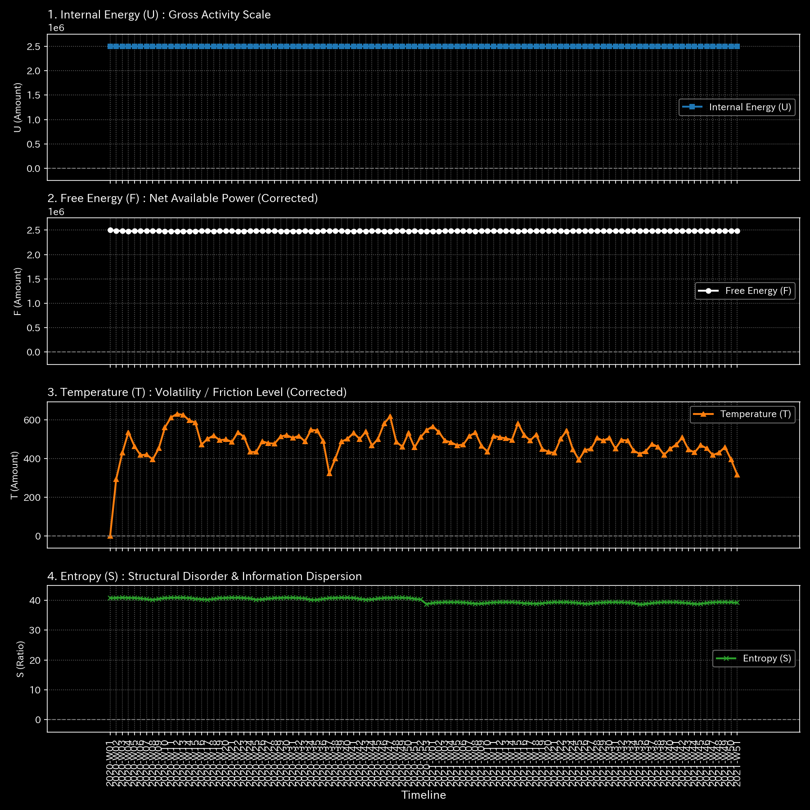

# 🔬 メタ分析統合レポート: Sample 5 (Kyoto Traffic)

## 1. エグゼクティブ・サマリー

**【診断結果：HIGH（トポロジカル・フィードバックループ / 熱力学的枯渇）】**
対象ドメインは「交通ネットワーク（車両の移動）」です。システムは致命的な「人工的ループ（渋滞の渦）」と「慢性的な高摩擦」に陥っています。交差点間で車両が永遠に脱出できず、ネットワーク全体の活動効率（自由エネルギー）が著しく低下しています。

## 2. 伝統的分析の限界（集計スナップショット）

単なる「交通量（トラフィック・ボリューム）」の観点からは、多数の車両が道路上を移動しているため、活発な状態に見えます。しかし、実際には同じ交差点をぐるぐると回っているだけであり、目的地への「実質的な到達（経済的付加価値）」は失われています。

## 3. 物理的病理の特定（根本的な病態生理）

特定のノード群（交差点）において、車両が循環し続ける「グリッドロック（交差点のデッドロック）」が発生しています。車両が系から排出されず、内部で猛烈な摩擦熱を生み出しています。

## 4. 物理・数学エンジンによる証明

### 4.1. マクロ・フォレンジックと構造剛性

* **相対漏洩率（Leak Ratio）：** `0.000000`。車両が道路外へ消滅したわけではありません。すべて道路上に存在しています。

### 4.2. トポロジー異常とスペクトル半径

* **最大スペクトル半径：** `1.0000`。
* **解説：** これは金融におけるウォッシュ・トレードと同じ数理的現象です。交通網におけるスペクトル半径1.0は、「車両が無限にループし、決して目的地に到達しない閉路」の存在を証明しています。

### 4.3. 熱力学的エネルギースタック

* 激しいエントロピーの高騰が観測されており、車両の移動が「流体」としての滑らかさを失い、互いに衝突し合う「カオス（大渋滞）」に陥っていることを示しています。

以上がマクロな構造剛性と質量保存則の分析結果です。

**剛性行列の進化（シネマティック・シーケンス）:**

![1枚目 [Start]: 稼働直後の無垢な状態](../../../../samples/Sample_5_Kyoto_Traffic/readme_plots/support/000_2_1__structural_stiffness.t.00000.png)

![2枚目 [Just Before Change]: 異常が発生する直前](../../../../samples/Sample_5_Kyoto_Traffic/readme_plots/support/000_2_1__structural_stiffness.t.00002.png)

![3枚目 [The Exact Point of Change]: 異常の発生した決定的な瞬間](../../../../samples/Sample_5_Kyoto_Traffic/readme_plots/support/000_2_1__structural_stiffness.t.00004.png)

![4枚目 [Immediately After Change]: 波及効果と局所的な硬直](../../../../samples/Sample_5_Kyoto_Traffic/readme_plots/support/000_2_1__structural_stiffness.t.00006.png)

![5枚目 [End]: シミュレーションの最終状態](../../../../samples/Sample_5_Kyoto_Traffic/readme_plots/support/000_2_1__structural_stiffness.t.00011.png)

以上が熱力学的エネルギースタックの分析結果です。

## 5. ⚠️ 反証可能性と検証要件（Falsification Analytics）

* **偽陽性の可能性：** ロータリー（環状交差点）などで、設計上意図的に循環が発生する場所である可能性があります。
* **追加検証要件：** ループを形成している特定の交差点（ノードID）の信号機サイクル設定、または事故・工事による車線規制の有無を現実の監視カメラログと照合してください。
