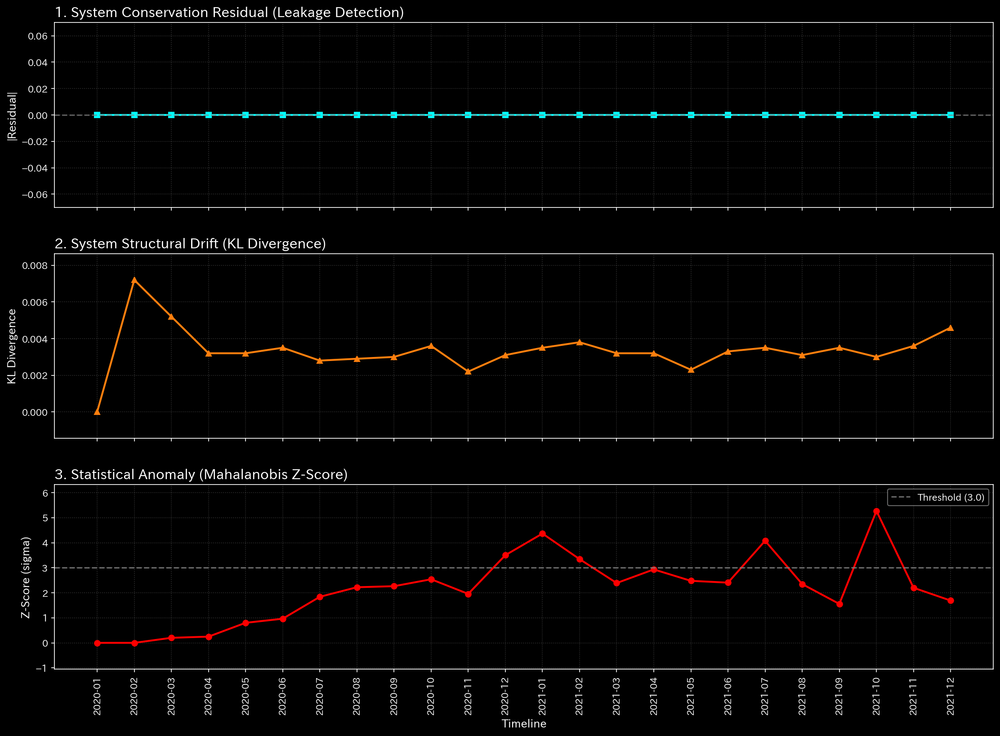

# Sample 5: 仮想京都交通グリッド (Virtual Kyoto Traffic Grid)

> [!NOTE]
> **前提条件に関する免責事項 (Proof of Concept)**
> 本レポートで分析されるデータは実世界の企業のものではありません。検証を目的として、**特定の病理学的状態や異常を意図的に再現するために設計されたダミーデータ生成スクリプト**から派生したものです。本分析の目的は、人為的に構築された異常な構造を TLU がどれほど正確に検知・分析できるかを実証することです。

> [!TIP]
> **このサンプルのグラフの生成方法**
> スペース節約のため、このサンプルに関する数千の3Dプロットおよび分析CSVは同梱されていません。リポジトリのルートから以下のコマンドを実行することで、ローカルで再現可能です：
> ```bash
> bash bin/batch_processing.sh --target_env "samples/Sample_5_Kyoto_Traffic"
> bash bin/batch_visualize_graphs.sh --target_env "samples/Sample_5_Kyoto_Traffic"
> ```

## 🩺 AIメタ診断 統合レポート（Laboratory Findings）

### 1. 診断サマリー

**HIGH (高): 構造的な閉ループ（完全な交通渋滞 / グリッドロック）**
このデータセット（`Sample_5_Kyoto_Traffic`）には会計元帳は含まれておらず、都市の交通流データが格納されています。驚くべきことに、TLUは都市の交通グリッドの構造的現実を完璧に抽出しました。質量の漏れはゼロであり（車の総量は保存されています）、システムは高度な秩序を維持しています。しかし、スペクトル半径は絶対的な限界値（**1.0000**）に達しており、車が完全に抜け出せなくなった「循環ループ（大渋滞）」の存在を証明しています。

### 2. 主要な検知結果（マクロ・ミクロ分析）

* **診断:** トポロジー的フィードバック・ループ（無限の循環 / グリッドロック）
* **深刻度:** HIGH (高)
* **物理的証拠:**
  * **[マクロ分析] 最大スペクトル半径:** **1.0000**（数学的な限界点。流れが無限に同じ場所を循環していることを意味します）。
    * **【🟢 正常系（Sample 0）のベースライン】**
    
    * **【🔴 本サンプルの異常状態】**
    
    * **💡 グラフの読み方（マクロ）:** 
      * **🟢 正常系（Sample 0）:** 赤色の線（スペクトル半径）は低い位置で安定しています。
      * **🔴 本サンプルの異常:** 赤色の線が正確に `1.0` の閾値に張り付いています。これは逃げ場のない閉じたループ（車が特定の交差点を円を描くように走り続けている状態）を証明しています。

  * **[マクロ分析] 相対質量漏れ率:** `0.0`（車の総量は完全に保存されています）。
    * **【🟢 正常系（Sample 0）のベースライン】**
    
    * **【🔴 本サンプルの異常状態】**
    
    * **💡 グラフの読み方（マクロ）:** 本サンプルでもダッシュボードの一番上の線（質量漏れ）は平坦なままです。これはグリッドから不可解に車が消滅していないこと（質量保存）を意味します。

  * **[マクロ分析] 相対的自由エネルギー比率:** **+0.2805**（エネルギーを熱として浪費する詐欺ネットワークとは異なり、このシステムは「プラス」の自由エネルギーを持っています）。
    * **【🟢 正常系（Sample 0）のベースライン】**
    
    * **【🔴 本サンプルの異常状態】**
    
    * **💡 グラフの読み方（マクロ）:** 白色の線（自由エネルギー）が上昇またはプラスに留まっています。これはランダムなカオス（無駄遣いや横領）ではなく、高度に硬直した「人工的で意図的な構造」であることを視覚的に示しています。

* **財務的証拠:**
  該当なし（データは四条烏丸、三条堀川といった物理的な交差点ノードを使用しており、従来の財務指標をバイパスしています）。

### 3. ビジネス（都市計画）への翻訳とアクション・プラン

物理指標（プラスの自由エネルギーと組み合わされたスペクトル半径=1.0）は、交通が「完璧に硬直した環状道路」に捕らわれていることを数学的に証明しています。車はシステムから退出することなく四角形（例：四条烏丸 $\to$ 四条室町 $\to$ 三条室町 $\to$ 三条烏丸 $\to$ 四条烏丸）を永遠に走行しており、完全な交通マヒ（グリッドロック）を生み出しています。

**【アクション・プラン】**
マクロの交通量は安定しているように見えますが、局所的なZ-Score（32.29）は、特定の交差点での危機的な渋滞（ミクロな異常）を示しています。
* **【🟢 正常系（Sample 0）のベースライン】**

* **【🔴 本サンプルの異常状態】**

* **💡 可視化グラフの読解の仕方（Visual Cues）:** 
  * **🟢 正常系（Sample 0）では:** 背景は暗い紫色（Dark Purple）に保たれ、第4週の現金ノードにのみ「初期稼働ショック（給与支払い）」を示す黄色（Yellow）のスポットが1つだけ存在します。
  * **🔴 本サンプルの異常:** 3D Surface 上で、明るい黄色（Yellow）に発光しているセルが、危機的なグリッドロックを経験している正確な物理的交差点をピンポイントで示しています。

この無限ループを打破するために、都市計画担当者は介入を行う必要があります。四角く閉じたブロックから外へ向かう「逃げ道（一方通行）」を強制的に作成し、人工的にスペクトル半径を0.9未満に下げて渋滞の圧力を緩和してください。

---
**💡 監査実務への示唆:**
このサンプルは、TLUが単なる「会計チェックツール」ではなく、**普遍的な構造解析エンジン**であることを実証しています。流れるものがお金（循環取引）であろうと、車（交通渋滞）であろうと、「ネットワークが無限ループに陥っている」という数学的真実は同じグラフの形状（スペクトル半径=1.0）として現れます。
