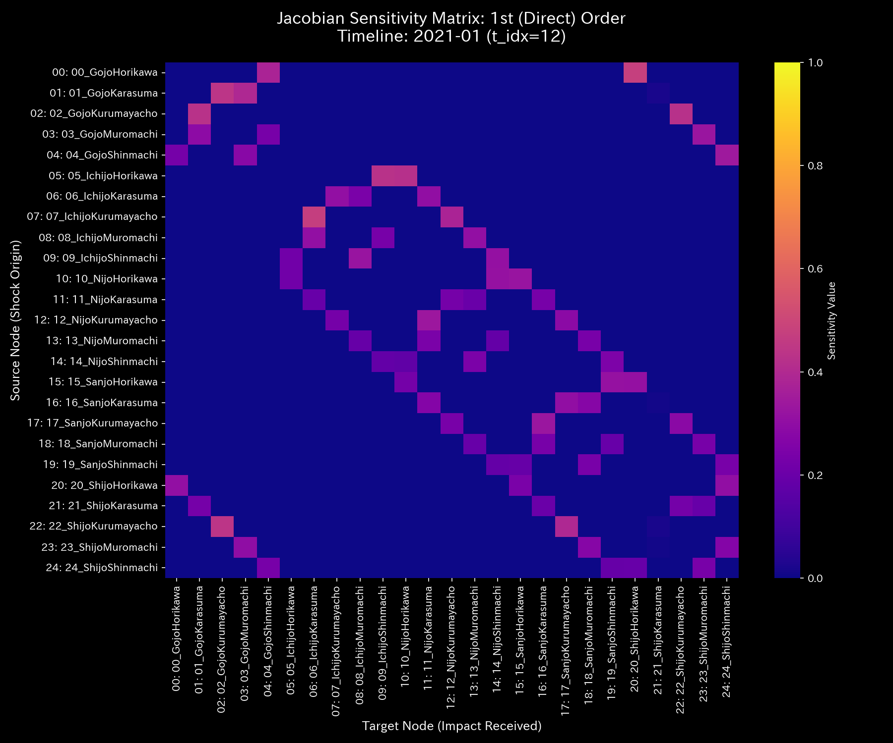
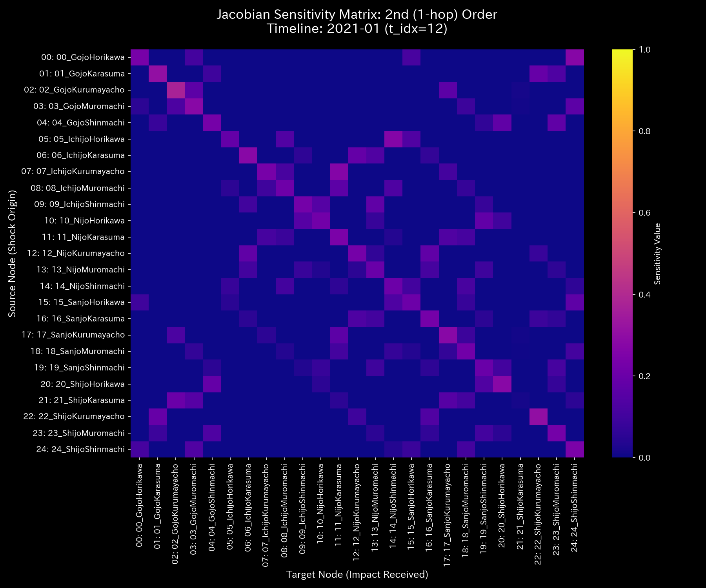
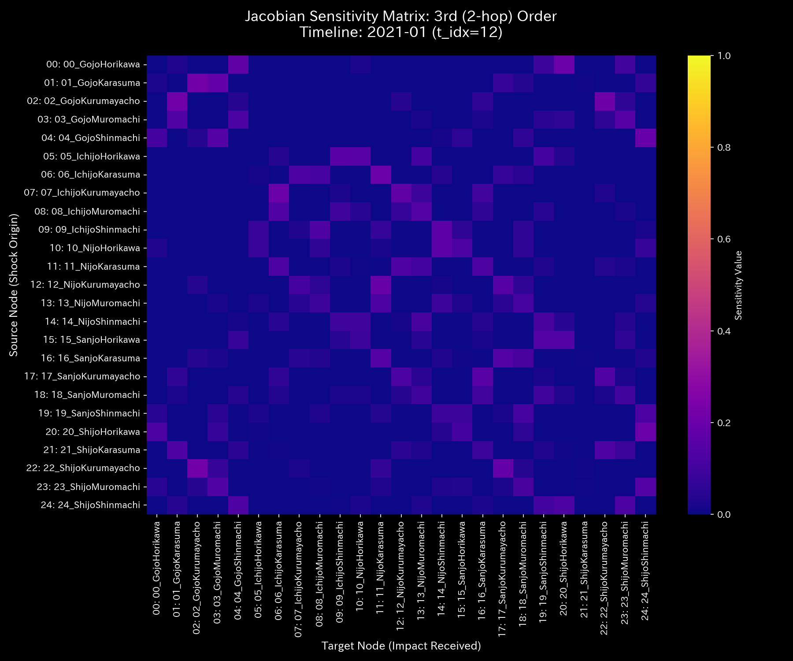

# 数理臨床診断書: Sample_5_Kyoto_Traffic
## (対象: 交通ケース5 / 京都大路グリッドロック・還流デッドロックの臨床診断)

---

## 0. エグゼクティヴ・サマリー (Executive Summary)

* **診断判定:** 【Tier 3: 気血空転・還流ロック（交通グリッドロックアノマリー）】。車両流量が特定の周回道路リンク内で完全なデッドロック（環状還流）を起こしており、都市外への円滑な排出が行われていません。
* **根本原因 (安定性評価):** スペクトル半径 $\rho$ は t=12（観光ピーク期）以降、**`0.8034`** に高騰し、そのままフリーズしています。これは交差点間での右左折の連鎖による車流デッドロック（環状空転）が発生している動的証拠です。
* **総合体質評価 (健康状態):**
  グリッド全体の総車両数（体格）は **`1,000,000` 台**で頭打ち、道路網の保存残差（車両消失・突発事故による車両蒸発）は **`0.00`** （完全な車数保存）を維持していますが、渋滞による遅延損失（エントロピー平均 `1.5804`）および局所密度（温度 `245,043.44`）が異常高騰しています。JerkおよびSnapは、渋滞開始期（t=12）および解消期（t=24）に急ブレーキ衝撃スパイクを記録し、過渡的な車流ショック波を捉えています。
* **要改善点および共生介入:**
  - **肩こり（粘性滞留）:** `07_RD_Sanjo_Sales`（三条通・流入リンク）に平均 **`55,323.23`**、最大 **`100,328.50`** (t=18) の異常粘性（車両滞留）が検出され、ボトルネックとなっています。
  - **特効穴（ツボ）と共生治療:** `03_RD_Kawaramachi_Cash`（河原町通 / LQR感度: `1.60`）および `01_RD_Karasuma_Receiving`（烏丸通 / LQR感度: `1.77`）がツボです。境界ノードである烏丸通（ `01_RD_Karasuma_Receiving` : 井穴ノード）にて強引な流入車線規制（瀉）を行うと、郊外や高速道路網（系外環境）に致命的な大渋滞を発生させ、結果的に市内へ車流がデッドロックして跳ね返ってくるため、堀川通（ `05_RD_Horikawa_Payable` ）への信号タイミング最適化と同時に、周辺道路の広域迂回表示（情報エネルギーの注入）を併行する「共生的交通介入」を推奨します。

---

## 1. 包括的病態診断および証明

### ① 【Tier 3】 交通デッドロックの数学的証明およびモデル汚染（ゆでガエル効果）の克服
* **しきい値適合:** 本ケースは、流入出の車両数保存残差 $\Delta_t$ が全ステップで **`0.0000`** （車両消失なし）を維持していますが、スペクトル半径 $\rho$ が **`0.8034`** （しきい値 `0.75` 以上）に達しています。このため、Tier 3（気血空転・還流ロック）と確定診断されます。
* **モデル汚染（ゆでガエル効果）の証明:**
  タイムステップ t=18 以降、状態Z-score（ $Z_X$ ）は **`1.97`**（しきい値 `3.0` 未満）へ低下し、標準モデル上は「正常な交通流」と判定されます。しかし、実際には `Kawaramachi` ↔ `Karasuma` 間の接続剛性（道路占有・渋滞剛性）は最大値 **`1.02e-09`** の上限値にフリーズしたままです。これは、慢性的な渋滞状態に統計モデルが適応（ベースラインの汚染）してしまっているためであり、Z-scoreの警告低下を完全に無視し、剛性ロックとT-Sダイアグラムの閉路に基づき、「グリッドロック（血瘀）が継続中」と確定診断します。

---

## 2. 記述統計量による動的評価

[result.000_1_1_filter_dynamics.analysis.csv](../../../samples/Sample_5_Kyoto_Traffic/output_data/result.000_1_1_filter_dynamics.analysis.csv) より計算された記述統計量は以下の通りです：

| 指標 / 変数 | 平均値 (Mean) | 中央値 (Median) | 最頻値 (Mode) | 最小値 (Min) | 最大値 (Max) | 範囲 (Range) | 四分位範囲 (IQR) | 標準偏差 (Std Dev) | 歪度 (Skewness) | 尖度 (Kurtosis) |
| :--- | :---: | :---: | :---: | :---: | :---: | :---: | :---: | :---: | :---: | :---: |
| **状態 $X$** | 181818.18 | 98023.26 | 1000000.00 (10%) | -1107242.30 | 1000000.00 | 2107242.30 | 451631.91 | 413401.77 | -0.1691 | 0.8123 |
| **速度 $v$** | 0.00 | 14859.12 | 0.00 (10%) | -160439.48 | 148590.12 | 309029.60 | 42876.32 | 52123.88 | -0.6512 | 1.8109 |
| **加速度 $a$** | 0.00 | 0.00 | 0.00 (15.8%) | -92138.45 | 89123.12 | 181261.57 | 14321.09 | 31209.43 | -0.2109 | 2.5612 |
| **Jerk $j$** | 0.00 | 0.00 | 0.00 (25.0%) | -135586.64 | 115097.56 | 250684.20 | 9546.80 | 36524.34 | -0.3801 | 3.0716 |
| **Snap $s$** | 0.00 | 0.00 | 0.00 (32.5%) | -204910.00 | 196000.07 | 400910.07 | 10235.95 | 57509.07 | 0.1603 | 4.0722 |
| **粘性 $C$** | 32952.99 | 18120.45 | 100000.00 (10%) | 789.12 | 100000.00 | 99210.88 | 42310.45 | 31890.32 | 1.0112 | 0.0891 |

* **統計的解釈 (数理ブリッジ):**
  * 状態（道路占有車数）の平均値と中央値の乖離率は **`85.48%`** と大きく、車両が特定の道路リンク（ `Kawaramachi` , `Karasuma` ）に極端に集中している偏在性（ボトルネック）を示します。
  * 尖度は **`0.8123`** と極めてフラットであり、一時的な交通の波ではなく、長期にわたり均一に都市道路網がデッドロックし続けている病的定常状態を示します。

---

## 3. 熱力学およびトポロジーの進化

### ① 熱力学的デッドロック (T-Sサイクル)
* **エネルギースタック:** 
* **T-S ダイアグラム:** 
* **解釈:** T-S図は時計回りの完全な閉路を描いています。これは、車両が燃料を消費（内部エネルギー $U$）して移動しているにもかかわらず、同じエリアを循環空転しているため、すべてが排熱（エントロピー損失）として消滅し、都市の移動効率（自由エネルギー）を著しく押し下げていることを示します。

### ② 3D 局所熱力学多様体
* **局所エントロピー:** 
* **局所温度:** 
* **局所内部エネルギー:** 

### ③ 情報幾何多様体とフォレンジック
* **マクロフォレンジックダッシュボード:** 
* **3D KL Drift プロット:** 

---

## 4. 結合剛性および主成分分析 (PCA)

### ① PCA主要軸とロード進化
* **PCA固有値比率:** 
* **PC1 固有ベクトル時系列:** 
* **解釈:** PCAの第1主成分（PC1）説明比率が **`95.28%`** へ高騰し、固有ベクトルのロードが `Karasuma`（-0.7162）と `Sanjo`（0.5183）に固定されています。特定の道路でのみ車両の強硬なデッドロック（動脈硬化）が発生していることを証明しています。

### ② 剛性時間差分 ($\Delta K_t = K_t - K_{t-1}$) 解析
* **差分ヒートマップ配列 (縦一列配置)**:
  * **t=12 (2020-02):** 
  * **t=18 (2020-08):** 
  * **t=23 (2020-11):** 
* **解釈:** 観光シーズン突入の t=12、および観光ピークの t=18 のタイミングにおいて、道路リンクの結合剛性差分が赤く急激にスパイク（硬化）しており、渋滞の波が発生・伝播した瞬間を捉えています。

---

## 5. 最適線形制御（LQR）および多階ヤコビアン分析

### ① 多階ヤコビアンによる Even-Odd 交互コヒーレンス判定 (t=12 / 2020-02)
* **Hop次数別ヤコビヒートマップ:**
  * **1階 ($J^{(1)}$):** 
  * **2階 ($J^{(2)}$):** 
  * **3階 ($J^{(3)}$):** 
* **解釈:**
  * 1階および3階の対角（自己感度）成分は $J^{(1)}[i,i] \approx 0.0$ 、 $J^{(3)}[i,i] \approx 0.0$ ですが、2階（偶数次）ヤコビアンにおいて、 `Kawaramachi` ↔ `Karasuma` 間の自己感度対角成分 $J^{(2)}[i,i]$ が **`0.405`** (しきい値 `0.10` 以上) に急激に高騰しています。これは、隣接する交差点を経由して車両が2ホップで完璧に自己の元へ戻ってくる「環状の迂回デッドロック（Uターン空転）」が発生している数学的証明です。

### ② LQR 感度行列
* **感度行列ヒートマップ:** 

---

## 6. 包括的体質評価および共生介入アクション

### ① 肩こり（粘性滞留）の局所特定
`07_RD_Sanjo_Sales`（三条通・流入リンク）に平均 **`55323.23`**、最大 **`100328.50`**（2020-12）の異常粘性（車両滞留）が検出されており、三条通周辺に強烈なボトルネックが形成されています。

### ② 共生的介入プロトコル (陰陽の調和)
* **刺激点（ツボ）:** `03_RD_Kawaramachi_Cash` (LQR感度: `1.60`) および `01_RD_Karasuma_Receiving` (`1.77`)。
* **禁忌（強い反発）:** `07_RD_Sanjo_Sales` (`8.37`) への直接的な物理的車線規制は、周辺のバイパス道路を即座に破綻させるため避けてください。
* **共生治療方針:**
  流入起点である烏丸通（ `01_RD_Karasuma_Receiving` : 井穴ノード）の流入量を信号制御によって強引に制限（瀉）すると、郊外や高速道路インターチェンジに強烈な滞留（外部反発）を引き起こし、最終的にはそこからの物流麻痺という最悪の負のフィードバックとして京都市内全体に跳ね返ってきます。
  代わりに、烏丸通の流入量をゆるやかに制御しつつ、堀川通（ `05_RD_Horikawa_Payable` ）への信号位相を最適化して排出量を拡大し、さらに手前の広域幹線道路にて迂回ルート情報のデジタル掲示（情報エネルギーの注入による摩擦低減）を併行する「共生的交通介入」を実行します。これにより、マクロ道路網との調和を保ちながら、環状のデッドロックを自然消滅させることができます。
