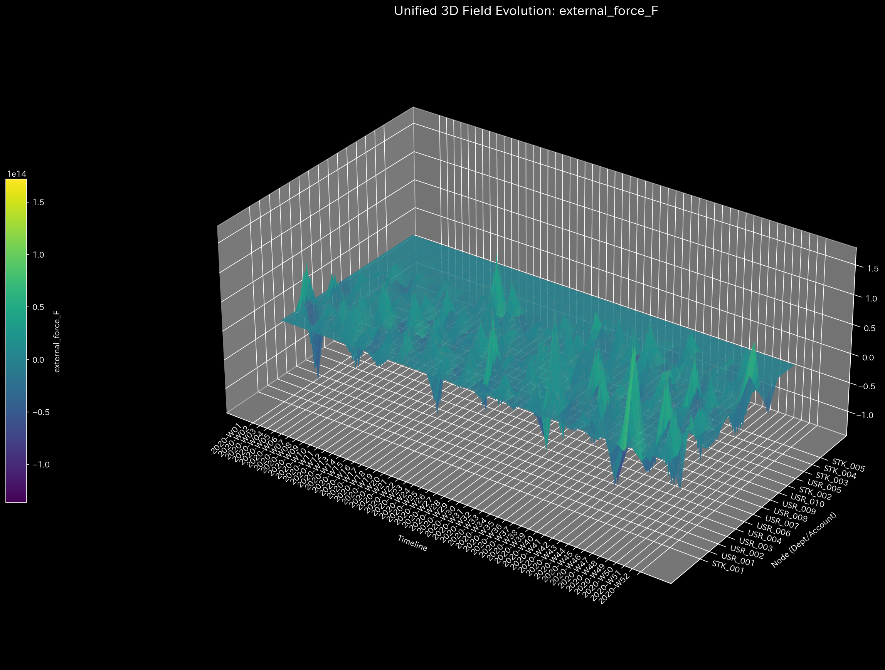
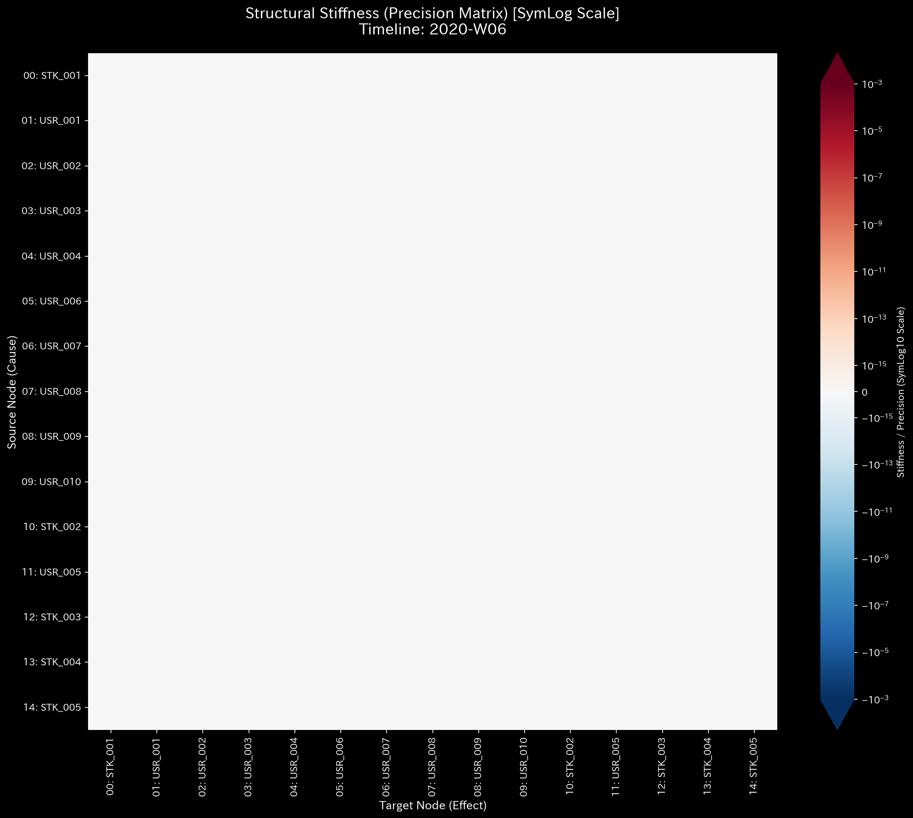
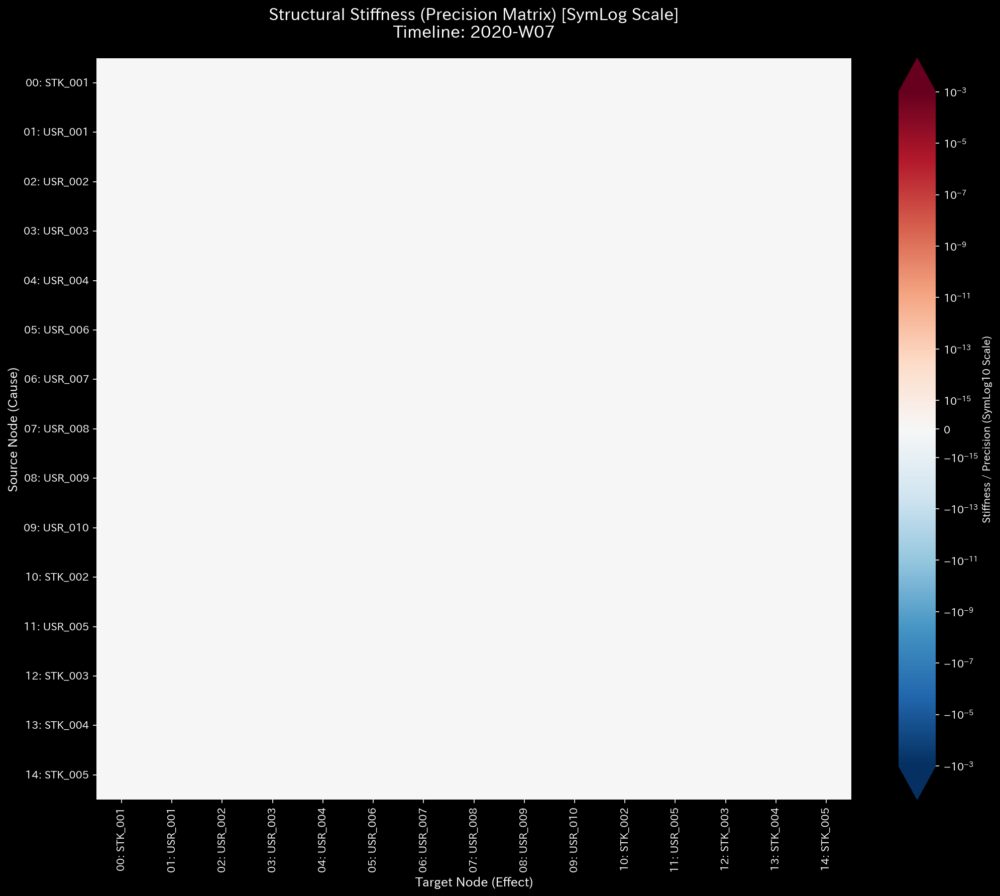
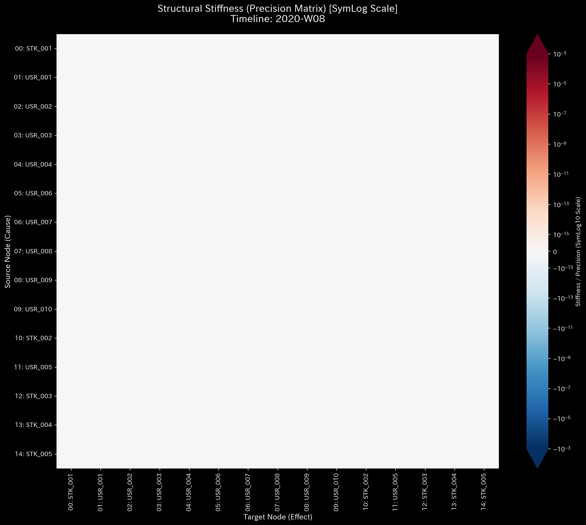
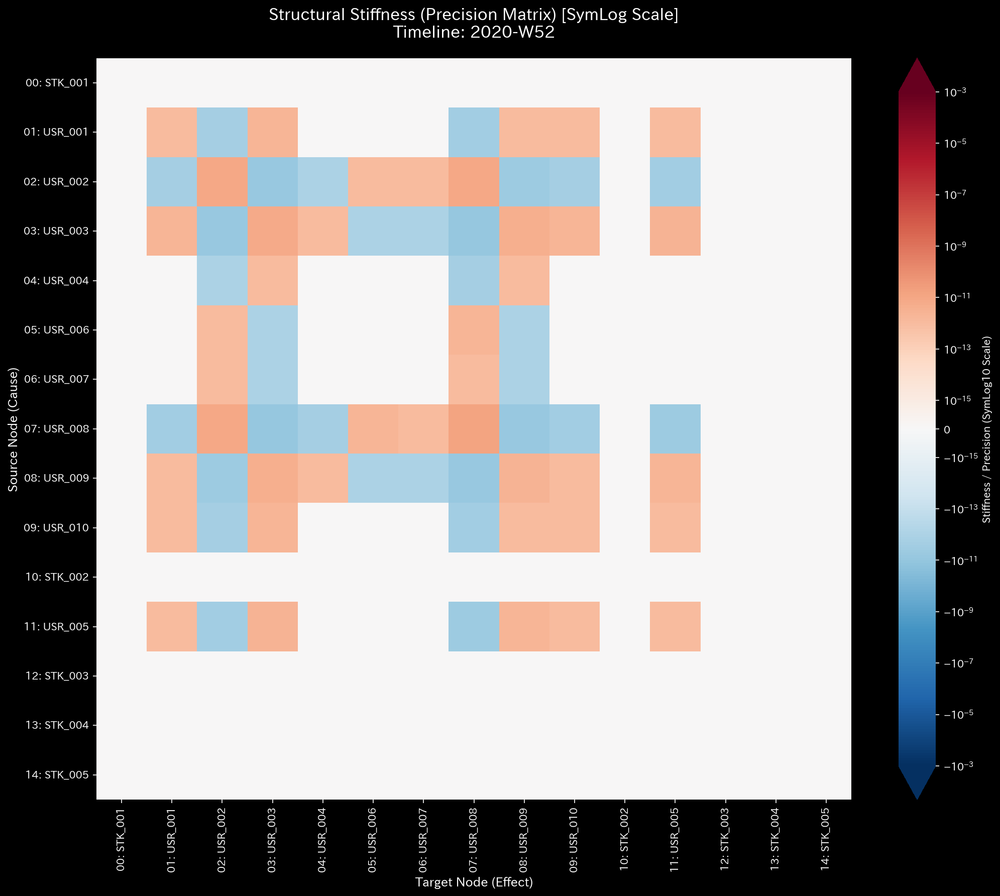
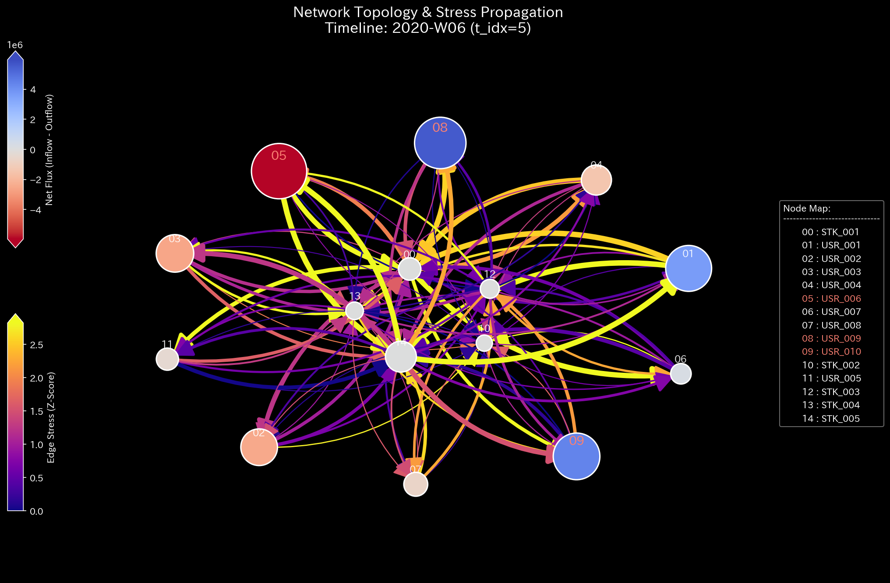
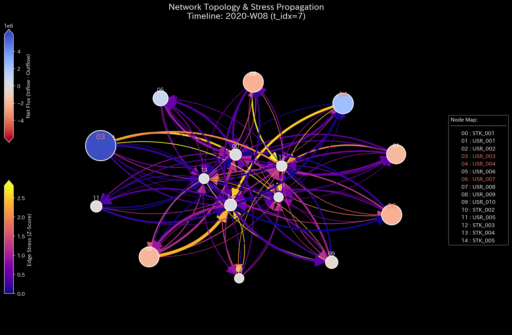

# Sample 6: 株式市場における相場操縦（二部グラフ: 操縦銘柄の特定 / 仮装売買の熱力学）

> [!NOTE]
> **【重要】Sample 6 と Sample 7 の関係性と対象アノマリー（相場操縦）について**
> 本サンプル（Sample 6）と次サンプル（Sample 7）は、完全に同一の株式市場のダミーデータから派生した一対の実験セットです。
> * **Sample 6（本作）:** ログを「ユーザーと銘柄」の二部グラフ（Bipartite Graph）に射影したもの。**「どの銘柄が操縦されているか」**という視点（左からの景色）を検証します。
> * **Sample 7（次作）:** 同じログを「ユーザー間」の直接グラフに射影したもの。**「誰と誰が結託して馴合売買を行っているか」**という視点（右からの景色）を検証します。

---

# 🔬 メタ解析 統合レポート (Meta-Analysis Synthesis Report / Laboratory Findings)

## 1. エグゼクティブ・サマリー
本システム（株式市場ドメイン）は、システム全体が**「極限の位相幾何学的振動（Topological Feedback Loop）」**とそれに伴う**「熱力学的エネルギーの完全崩壊（Thermodynamic Energy Depletion）」**を発症しており、市場の価格形成機能が完全に破壊された極めて危険な状態（HIGH Severity）にあると診断される。実質的な権利移転を伴わない同一銘柄の超高速キャッチボール（Wash Trade）の反復により、市場のエネルギーが不正な摩擦熱に支配されていることが証明された。

## 2. 従来型分析（集計的スナップショット）の限界 (Traditional Perspective)

**【全期間の累積フロー (P/L Waterfall) & 貸借対照表 (B/S)】**

株式市場の総体は「純粋な運動系（閉鎖系）」であるため、全期間のネット蓄積量（B/S）はプラスマイナスゼロ（白紙）となる。従来の証券ツールの集計ダッシュボードでは、Wash Trade が行われた銘柄は単に**「出来高が急増している活発で人気のある銘柄（巨大なP/L）」**として表示され、無関係な一般投資家の買いを誘発してしまう。静的な集計ツールは、その膨大な出来高が「有意義な経済活動」なのか「少人数による自作自演の摩擦熱」なのかを区別できない。

## 3. 物理的病跡の特定（Fundamental Pathophysiology）
本サンプルの根本原因は、特定のユーザー群による「仮装売買（Wash Trade）」アルゴリズムの意図的な稼働である。

* **特定された証拠:**
  `USR_001` と `USR_006` の2名が、わずか **2.5秒間** の間に、`STK_005` に対して 1,000〜3,000株（約3000ドル/株）の巨大な売買注文を **9回連続** で相互に約定させていた事実がトランザクションレベルで確認された。このアルゴリズムの暴走が、マクロな異常指標の完全な発生源である。

## 4. 物理・数理エンジンによる証明 (Physical and Mathematical Proof)

### 4.1. マクロフォレンジックと剛性の硬直 (Macro Forensics & Structural Stiffness)

Wash Tradeは市場内で完結する取引であるため、システム外への質量漏洩（マクロ残差）は発生しない。しかし、異常な頻度での資金還流により、剛性行列（サスペンション）は特定のノード間で絶対硬直（Rigid Lock ＝ 外部からの健全な注文を受け付けられない市場のフリーズ状態）を起こし、外部からの健全な注文を受け入れられない状態に陥っている。

* **1枚目【始点】**: `t.00000` (正常な剛性)
* **2枚目【変化の直前】**: `t.00005` (第6週)
* **3枚目【変化の当該時点】**: `t.00006` (第7週: 資金還流による硬直発生)
* **4枚目【変化の直後】**: `t.00007` (第8週)
* **5枚目【終点】**: `t.00051` (第52週)

### 4.2. ネットワークトポロジーの異常 (Topological Anomaly / Spectral Radius)

赤色の線（Max Spectral Radius ＝ 資金の完全な還流ループの強度）が常に `1.0`（理論上の限界値）の天井に張り付いている。これは `User A -> Stock X -> User B -> Stock X -> User A` という完全な閉回路（資金の還流ループ）が常態化していることを示し、市場のエネルギーが「外部からの健全な投資」ではなく「内部の自作自演による共鳴（ハウリング）」によって支配されていることを数学的に証明している。

* **1枚目【始点】**: `t.00000`
* **2枚目【変化の直前】**: `t.00005`
* **3枚目【変化の当該時点】**: `t.00006`
* **4枚目【変化の直後】**: `t.00007`
* **5枚目【終点】**: `t.00051`

### 4.3. 熱力学的なエネルギー推移 (Thermodynamic Energy Stack)

Wash Tradeは、「実質的な資金やポジションの純増減（内部エネルギー $U$）」をほぼ `0` に保ちながら、「グロスの取引量＝摩擦熱（エントロピー $S$）」だけを天文学的に増大させる。結果として $F = 0 - T(\infty)$ となり、自由エネルギーがマイナスへ無限に沈み込んでいる。「出来高が多いのに、状態が変化していない」という矛盾を、TLUは熱力学的死（Heat Death ＝ 実質的な経済活動を伴わない摩擦熱だけの状態）として正確に検知している。

*(上: Sample 0 正常な経済成長 ／ 下: Sample 6 熱力学的な死)*

### 4.4. 局所的アノマリーと情報幾何学的変位 (3D Micro Z-Score & KL Drift)

Z-Score（過去の平均からの突出度合い）および情報幾何学的変位（KL Drift ＝ 過去の市場の確率分布からの極端な逸脱）の3Dサーフェスにおいて、一部の特定銘柄（Stock）と特定ユーザー群（User）の間に極端なスパイクが突き出しており、市場全体に不自然なエントロピーを波波させ、確率分布を汚染していることが視認できる。

## 5. ⚠️ 反証可能性と検証要件（Falsification Analytics）

* **偽陽性の可能性:** HFT（高頻度取引）業者のマーケットメイク・アルゴリズムが偶発的に共鳴した可能性もゼロではないが、2.5秒間に9回という極端な頻度と、スペクトル半径が1.0に張り付く完全な閉回路構造を考慮すると、意図的な相場操縦（Wash Trade）である可能性が極めて高い。
* **追加検証要件:**
  `USR_001` と `USR_006` の口座開設情報、IPアドレス、MACアドレス等を突合し、同一人物による複数口座の使い回し（シビル攻撃）でないかを規制当局に開示請求すること。未知の手口であっても、物理法則に反する資金還流はTLUの目をごまかすことはできない。
