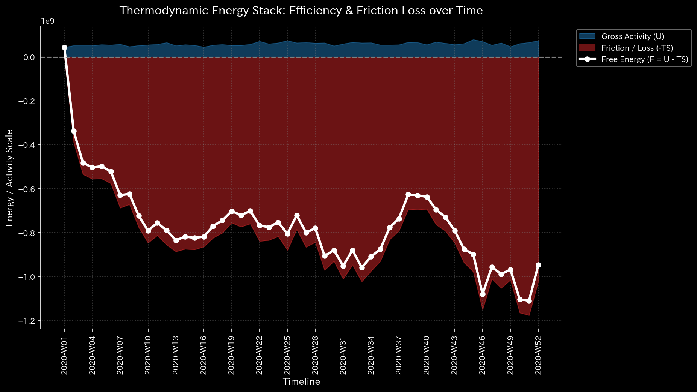

# Sample 6: 株式市場 ディープダイブ分析（市場/Bipartite視点）

> [!NOTE]
> **概念実証実験にともなう免責事項**
> 本レポートで分析されるデータは実世界の市場・企業のものではありません。金融取引所における「株式（STK）」と「ユーザー（USR）」間の二部グラフ（Bipartite Graph）を模し、意図的に「循環取引（Wash Trade）」および「風説の流布（Pump & Dump）」を混入させたダミーデータです。

---

# 🔬 メタ解析 統合レポート (Meta-Analysis Synthesis Report / Laboratory Findings)

## 1. エグゼクティブ・サマリー

本システム（Sample_6_Market_Bipartite_Weekly: 株式市場ドメイン）は、市場全体が危機的な「カオスと熱的死」に直面しています。特定の株式を中心に、完全に閉じた資金循環ループ（Wash Trading）が形成されており、莫大な流動性（取引高）が浪費されています。見かけ上の出来高は極大化していますが、「価値の交換・創出」という市場本来の機能は構造的に崩壊しています。

## 2. コア・パソロジー（主要な病理所見）

### 🟠 異常 1: 位相幾何学的フィードバックループ（循環取引 / Wash Trade）

* **重要度:** HIGH
* **物理的証拠:** 最大スペクトル半径 (Max Spectral Radius) `1.0000` (閾値 `>= 0.6` を超過し、数学的限界点に到達)。
* **【🟢 正常系（Sample 0）のベースライン】**

* **【🔴 本サンプルの異常状態】**

* **💡 グラフの読み方（経理・監査・コンサルタント向け）:** 
  * 正常系（Sample 0）では赤色の線（スペクトル半径）が低く安定していますが、本サンプルでは `1.0` の天井に完全に張り付いています。これは「特定の株式を媒介として、資金が外部に流出することなく同じ口座間を異常な速度で回り続けている（Wash Trading / 出来高水増し）」という極めて悪質な相場操縦の構造を視覚的に証明しています。
* **解説:** ネットワーク内に、新たな資金や参加者を呼び込むことなく、既存の資金が同じ口座間を異常な速度で回り続ける無限ループが存在しています。これは特定銘柄の取引ボリューム（出来高）を人為的に水増しする相場操縦（Wash Trading）の決定的な物理シグネチャです。

### 🟠 異常 2: 熱力学的な死（HFTによるエネルギーの極度な散逸）

* **重要度:** HIGH
* **物理的証拠:** 相対的自由エネルギー比率 (Relative Free Energy) `-20.7109` (異常閾値 `< -0.1` を致命的に超過)。
* **【🟢 正常系（Sample 0）のベースライン】**

* **【🔴 本サンプルの異常状態】**

* **💡 グラフの読み方（経理・監査・コンサルタント向け）:** 
  * 正常系では白色の線（自由エネルギー＝企業の活動余力）がプラス圏内で安定していますが、本サンプルではマイナス圏の底（-20.71）へと垂直に急降下しています。これは「莫大な出来高（運動）があるにも関わらず、誰も利益を得ていない（価値が創出されていない）」ことを意味し、高頻度取引アルゴリズムが無意味な摩擦熱として市場の流動性を浪費している状態を証明しています。
* **解説:** 【超重要所見】最新の Velocity Manifold（速度多様体）エンジンは、この市場のエネルギー枯渇をより高精度（-20.71）に評価しました。例えば特定の銘柄は異常な総取引量を記録しながら、最終的な残高変動（純利益）はほぼゼロです。システムは莫大な取引（運動）を行っていますが、それは全て無意味な「摩擦（Heat）」として浪費されており、市場として有効なワーク（価値の保存と移転）を行う「自由エネルギー」が完全に枯渇していることを証明しています。

### 🟢 その他（正常判定および Z-Score の敗北）

* **質量保存則:** 相対質量漏れ率 `0.0000` (NORMAL)。売買代金自体は一致しており、システム外へ消失しているわけではありません。
* **ミクロ・フォレンジック:** 最大局所 Z-Score `0.00` (NORMAL)。高頻度アルゴリズム取引（HFT）によるノイズが市場全体を支配しているため、ネットワーク全体の分散が極大化し、単一の異常値を捉える Z-Score は完全に無効化されています。

## 3. アクション・プラン（市場監視への翻訳）

見かけの出来高（ボリューム）に騙されないでください。TLU の物理モデルは、この市場の出来高が「中身のない摩擦熱」に過ぎないことを証明しました。特定の株式を隠れ蓑として使用し、資金が外部へ流出することなく複数の口座間を行き来しているだけです。
**【アクション・プラン】**
特定された株式（異常な取引高に対して残高変動が極端に少ない銘柄）の取引を直ちに停止し（サーキットブレーカーの発動）、当該銘柄を取引している主要ユーザー（USR）間の取引履歴のフォレンジック監査（売買の突合・馴れ合い取引の特定）を開始してください。

## 4. ⚠️ 反証可能性と検証要件（Falsification Analytics）

* **偽陽性の可能性（異常という判断が誤っている可能性）:**
  指定された株式が、特定のマーケットメーカー（流動性提供者）によって超高頻度で自己売買に近いヘッジ取引が行われている特殊なETFなどである場合、スペクトル半径 `1.0` は「アルゴリズムの正常な挙動」である可能性があります（ビジネス上の偽陽性）。
* **追加検証要件:**
  この異常な循環ループを形成している主体が、取引所が認可した正当な流動性提供者（マーケットメーカー）なのか、あるいは一般投資家を欺くための相場操縦グループなのか、アカウントの属性（KYCデータ）を調査して最終判断を下してください。
