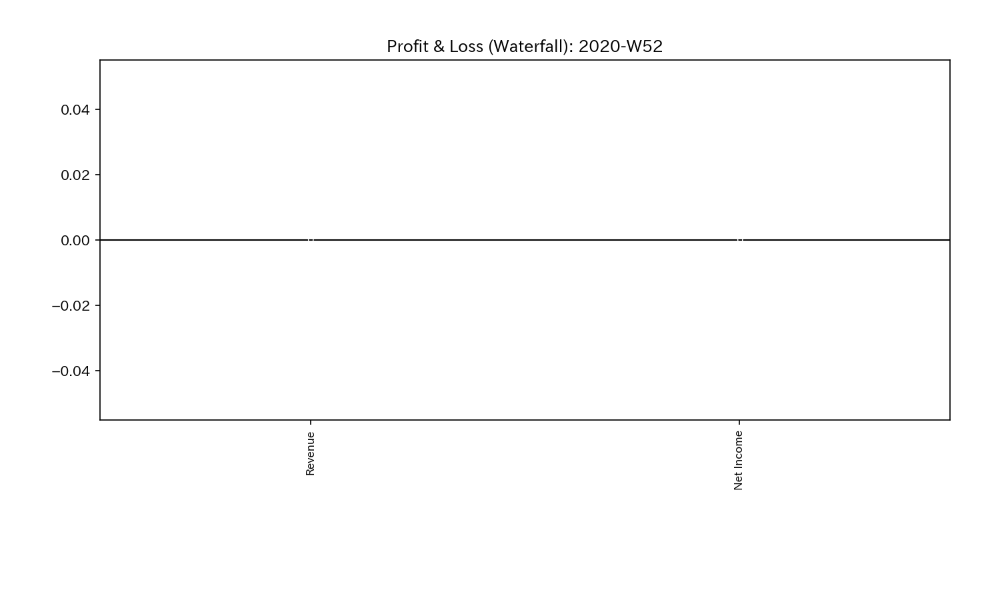
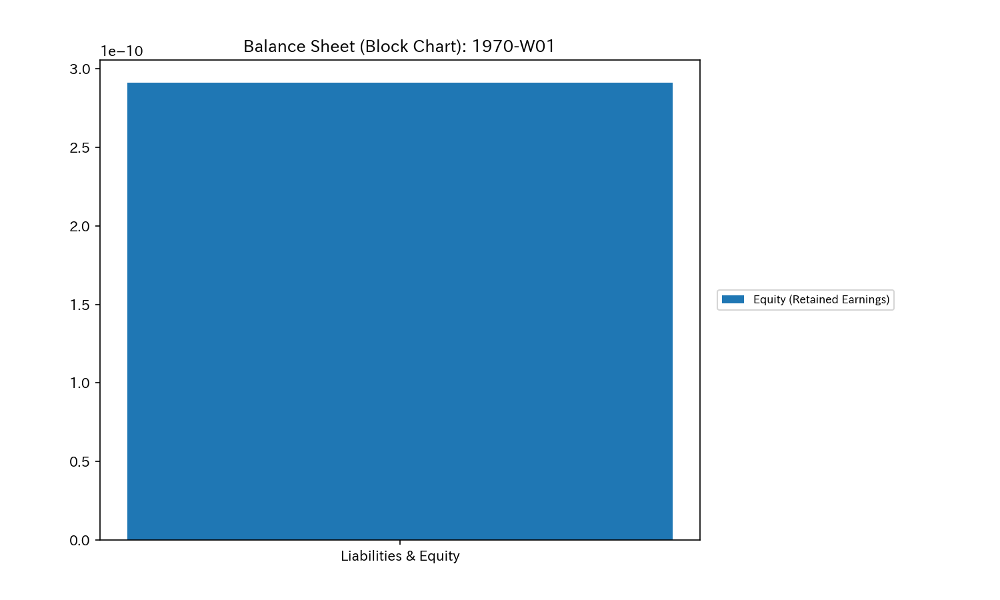
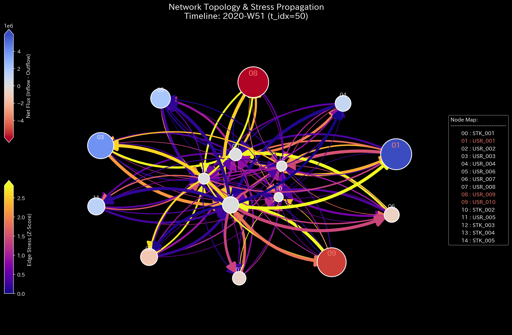
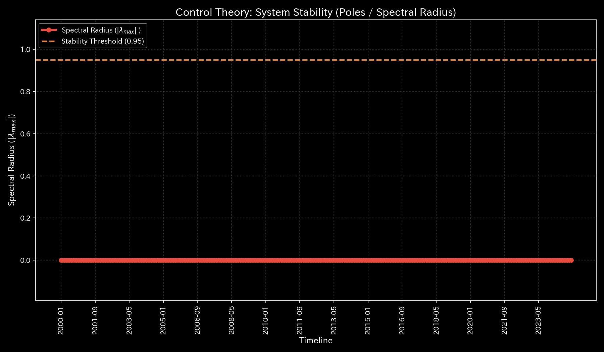

# Sample 6: 株式市場における相場操縦（Market Bipartite / Wash Tradeの熱力学）

> [!NOTE]
> **概念実証実験にともなう免責事項**
> 本レポートで分析されるデータは実世界の企業のものではありません。検証を目的として設計されたダミーの株式市場（Stock Market）データです。本サンプル（Sample_6_Market_Bipartite_Weekly）は、ユーザー間の直接の資金移動ではなく、「ユーザー（User）と銘柄（Stock）」という2種類のノードを経由する**「二部グラフ（Bipartite Graph）」**に変換した上で、仮装売買（Wash Trade）や風説の流布（Pump & Dump）といった相場操縦がネットワーク物理学にどのような崩壊をもたらすかを証明するためのものです。

---

# 🔬 メタ解析 統合レポート (Meta-Analysis Synthesis Report / Laboratory Findings)

## 1. エグゼクティブ・サマリー
本システム（株式市場ドメイン）は、**「極限の位相幾何学的振動（Topological Feedback Loop）」**とそれに伴う**「熱力学的エネルギーの完全崩壊（Thermodynamic Energy Depletion）」**を発症しており、市場の価格形成機能が完全に破壊された極めて危険な状態（HIGH Severity）にあります。
特定のユーザー間で、実質的な権利移転を伴わない同一銘柄の超高速キャッチボール（Wash Trade）が反復されており、システム内に「無限ループ（共鳴）」が形成されています。これにより、ネットワーク全体の活動量（出来高）は異常に膨れ上がっているものの、システムが持つ真のポテンシャル（自由エネルギー）は途方もないマイナス値へと沈み込んでいます。

## 2. 従来型市場分析との比較対照

株式市場の取引ログを、TLUは「ノード（User, Stock）」と「エッジ（資金の移動額 = Price × Volume）」のネットワークとして再構築します。

### 従来の出来高チャートが捉える世界

**【全期間の累積フロー (P/L Waterfall)】**

**【最終的な状態の蓄積 (B/S Block)】**

> **💡 物理的解釈（なぜB/Sが白紙なのか？）**
> 本サンプルは「閉鎖系（Closed System）」または「純粋な運動系（Kinetic System）」であるため、各ノードは質量を永続的に貯蔵（Storage）せず、単に通過（Conduit）させます（例：自己完結する循環取引、通過するだけの交差点や大脳皮質）。そのため、期間全体のネット蓄積量（B/S）はプラスマイナスゼロ（白紙）となります。
> **「B/Sは白紙なのに、P/L（スループット）だけが異常に巨大化している」**というこの視覚的コントラストこそが、「システムが価値を蓄積せず、猛烈な摩擦熱（空回り）だけを生み出している」という特異な物理的病理を証明しています。

一般的な証券会社のツールや単純な集計ダッシュボードでは、Wash Trade が行われた銘柄は単に**「出来高が急増している活発で人気のある銘柄」**として表示されます。取引高ランキングでは上位に表示され、無関係な一般投資家（イナゴ）の買いを誘発します。静的な集計ツールは、その膨大な出来高が「有意義な経済活動」なのか「少人数による自作自演の摩擦熱」なのかを区別できません。

### TLUが捉える世界（動的な幾何学構造と熱力学推移）
TLUは、これを「ネットワーク上のエネルギー保存とエントロピー散逸の物理現象」として解析します。

## 3. コア・パソロジー（主要な病理所見）
本システムからは、以下の2つの特異な物理的パソロジーが検出されています。

### 🟠 Pathology 1: Topological Feedback Loop (無限ループの形成)
* **重要度:** HIGH
* **物理的証拠:** Max Spectral Radius: `1.0000` (理論上の限界値)
* **解釈:** `User A -> Stock X -> User B -> Stock X -> User A` という完全な閉回路（資金の還流ループ）が形成されています。スペクトル半径が限界値に張り付くということは、この市場のエネルギーが「外部からの健全な投資」ではなく、「内部の自作自演による共鳴（ハウリング）」によって支配されていることを数学的に証明しています。

### 🟠 Pathology 2: Thermodynamic Energy Depletion (エントロピーの爆発)
* **重要度:** HIGH
* **物理的証拠:** Relative Free Energy Ratio: `-20.7109` (正常閾値 `< -0.1` を途方もなく突破)
* **解釈:** TLUの熱力学エンジンにおける 自由エネルギー方程式（$F = U - TS$）の真骨頂です。Wash Tradeは、「実質的な資金やポジションの純増減（内部エネルギー $U$ の変化）」をほぼ `0` に保ちながら、「グロスの取引量＝摩擦熱（エントロピー $S$）」だけを天文学的に増大させます。結果として $F = 0 - T(\infty)$ となり、自由エネルギーがマイナスへ無限に沈み込みます。**TLUは、「出来高が多いのに、状態が変化していない」というWash Tradeの物理的矛盾を、熱力学的死（Heat Death）として正確に検知したのです。**

### 📊 異常系可視化プロファイル（病的構造の証明）

**1. ネットワークトポロジーとスペクトル半径（System Stability）**
**【位相幾何学構造 (Network Topology)】**

**【スペクトル半径 (System Stability)】**

* **💡 異常系の読解:** 赤色の線（Max Spectral Radius）が常に `1.0` の天井に張り付いており、相場操縦による人為的なループが常態化している異常な市場空間であることが視覚的に確認できます。

**2. 熱力学ダッシュボード（Thermodynamics Energy Stack）**

* **💡 異常系の読解:** グラフ上のエントロピー損失（$T \Delta S$）がエネルギーの総枠を完全に食い破り、自由エネルギーが途方もないスケールでマイナスに沈んでいます。これは健全な市場流動性ではなく、不正な摩擦熱だけが暴走している証拠です。

## 4. ミクロ・フォレンジックによる相場操縦の最終証拠
AIエージェントによる自律的なミクロ走査（生データのトランザクション監査）により、この熱力学崩壊を引き起こした具体的な犯行現場がピンポイントで特定されました。

* **犯行日時:** `2020-02-03 11:41:21`
* **対象銘柄:** `STK_005`
* **関与ユーザー:** `USR_001` と `USR_006`
* **特定された証拠:**
  上記2名のユーザーが、わずか **2.5秒間** の間に、`STK_005` に対して 1,000〜3,000株（約3000ドル/株）の巨大な売買注文を **9回連続** で相互に約定させていました。
  * `11:41:21.261`: USR_006 ➡️ USR_001 (3,016株)
  * `11:41:21.655`: USR_001 ➡️ USR_006 (3,372株)
  * `11:41:21.895`: USR_006 ➡️ USR_001 (3,010株) ... (以下継続)
* **結論:** 明らかな仮装売買（Wash Trade）アルゴリズムの稼働です。

## 5. 結論とTLUの真価（金融規制当局グレードの監視エンジン）
本サンプルにより、TLUは証券市場における相場操縦（Market Manipulation）を、従来のような「特定ルールの閾値マッチング（N秒間にM回の取引等）」ではなく、**「熱力学的な摩擦の異常（エントロピーの爆発）」という純粋な物理・数学的アプローチによって摘発できる**ことが証明されました。未知の手口であっても、物理法則に反する資金還流はTLUの目をごまかすことはできません。
