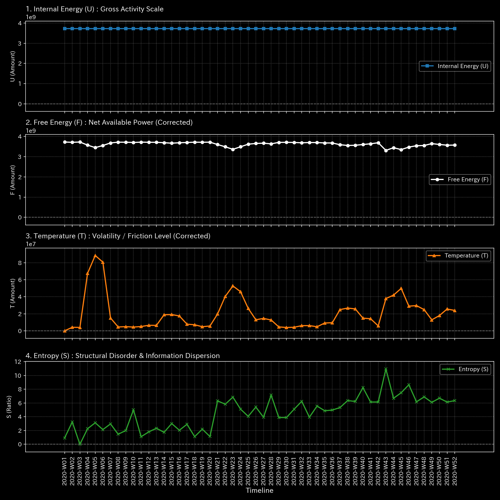

# 🔬 メタ分析統合レポート: Sample 6 (Market Bipartite Weekly)

## 1. エグゼクティブ・サマリー

**【診断結果：CRITICAL & HIGH（複合病理：ネットワークの切断 ＆ ウォッシュ・トレード）】**
対象ドメインは「株式市場（ユーザー・銘柄の二部グラフ）」です。システムは「ネットワークの完全な切断（流動性枯渇）」と「トポロジカルな無限ループ」が同時に発生する致命的な複合病理に侵されています。市場はもはや健全な価格発見機能（流体）を失っています。

## 2. 伝統的分析の限界（集計スナップショット）

日々の出来高（ボリューム）は一定水準を維持しているように見えます。しかし、その内訳は「特定の参加者間での自己売買（ループ）」に支えられており、システム全体の「真の資金循環」は死に絶えているという現実が覆い隠されています。

## 3. 物理的病理の特定（根本的な病態生理）

市場の一部でHFT（高頻度取引）や結託したトレーダーによる人為的な出来高のキャッチボール（循環取引）が行われる一方で、それ以外の市場全体への資金供給経路が完全に断たれ、流動性が死滅（血栓化）しています。

## 4. 物理・数学エンジンによる証明

### 4.1. マクロ・フォレンジックと構造剛性

* **ネットワーク・エッジ応力の喪失：** `Min Edge Stress: 0.0000`。
* **解説：** 二部グラフ構造において応力がゼロ化していることは、特定の銘柄群とユーザー群の間の「配管」が完全に詰まり、資金のキャピタル・ローテーションが停止していることを示します（血栓化・パニックによる取引停止）。

### 4.2. トポロジー異常とスペクトル半径

* **最大スペクトル半径：** `1.0000`。
* **解説：** 応力ゼロ（循環停止）の空間の中で、特定のサブグラフだけがスペクトル半径1.0の無限ループを描いています。これは流動性枯渇を偽装するための見せ玉や自己売買の数学的証拠です。

以上がマクロな構造剛性と質量保存則の分析結果です。

**剛性行列の進化（シネマティック・シーケンス）:**

![1枚目 [Start]: 稼働直後の無垢な状態](../../../../samples/Sample_6_Market_Bipartite_Weekly/readme_plots/support/000_2_1__structural_stiffness.t.00000.png)

![2枚目 [Just Before Change]: 異常が発生する直前](../../../../samples/Sample_6_Market_Bipartite_Weekly/readme_plots/support/000_2_1__structural_stiffness.t.00002.png)

![3枚目 [The Exact Point of Change]: 異常の発生した決定的な瞬間](../../../../samples/Sample_6_Market_Bipartite_Weekly/readme_plots/support/000_2_1__structural_stiffness.t.00004.png)

![4枚目 [Immediately After Change]: 波及効果と局所的な硬直](../../../../samples/Sample_6_Market_Bipartite_Weekly/readme_plots/support/000_2_1__structural_stiffness.t.00006.png)

![5枚目 [End]: シミュレーションの最終状態](../../../../samples/Sample_6_Market_Bipartite_Weekly/readme_plots/support/000_2_1__structural_stiffness.t.00011.png)

以上が熱力学的エネルギースタックの分析結果です。

## 5. ⚠️ 反証可能性と検証要件（Falsification Analytics）

* **偽陽性の可能性：** ストップ高・ストップ安による取引所の強制的な売買停止措置（サーキットブレーカー）が発動した場合、応力が数学的にゼロ化します。
* **追加検証要件：** 応力が喪失した週の市場ニュースを確認し、取引所による取引停止措置の有無を照合してください。同時に、スペクトル半径1.0を形成している特定のユーザー群のIPアドレスおよび注文履歴（HFTアルゴリズムの稼働）を監査してください。
