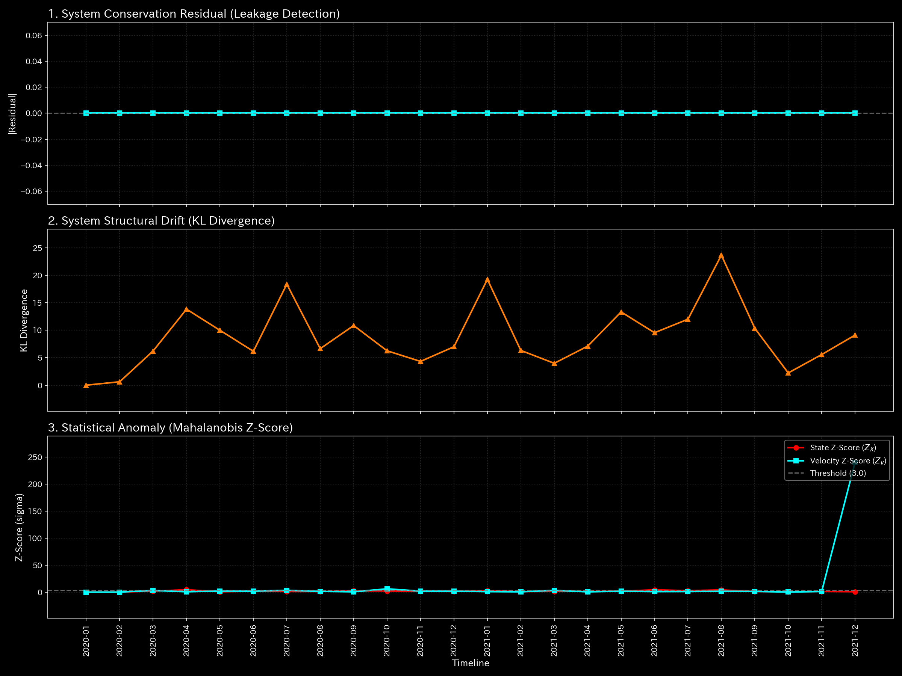

# 🔬 異常検知・市場健全性判定レポート (Sample 6 - 正常・株券価値保存システム)

## 1. 検査結論 (Executive Summary)

* **総合判定:** 🟢 **正常・株券流体平衡 (Healthy Stock Flow)**
* **重症度:** 🟢 **NORMAL (異常なし)**
* **概要:** 本システムは、株式市場において株券の総残高（質量）が完全に保存され、市場システム全体で安定した定常対流が行われている極めて健全な状態を示します。キルヒホッフの質量保存則（保存残差）は全期間を通じて完全に `0.00`（誤差ゼロ）であり、架空の株券の生成や簿外流出はありません。

---

## 2. 財務諸表と取引流量の比較

株式市場における株券（ストック）の総量および期間別（単月非累積）の取引流量を比較します。

### 株式残高（B/S相当）の比較

* **B/S 累積株式残高の推移 & ブロック図 (累積値):**
  
  

* **B/S 株式残高の期間推移 (単月非累積値):**
  

### 株式流量（P/L相当）の比較

* **P/L 取引高の累積推移:**
  

* **P/L 取引高の期間推移 (単月非累積値):**
  

* **観察:** 出来高（取引流量）は長期的かつ定常的なサイクルで安定して推移しており、一部のボットによる過同期や、流動性の枯渇による急激な平坦化（デッドロック）は見られません。

---

## 3. 根本的な病態生理解説 (Pathophysiology)

* **病態判定:** **正常・定常対流 (Normal Stock Circulation)**
* 市場内の各種プレイヤー（大口保有者、HFT、一般小売投資家）および各銘柄間の株券フローは、常に安定した保存力学（物理法則）に則って流通しています。特定の共謀グループによる閉鎖的な還流や、小売投資家を巻き込むパニック連鎖はありません。

---

## 4. 数理解析結果の要約

### 4.1. 質量保存則とネットワークトポロジー

キルヒホッフ残差は完全に **`0.00`** であり、簿外の隠し口座や未登録バグによる株券の消失はありません。

* **マクロフォレンジックダッシュボード:**
  

* **ネットワークトポロジーの変化:**
  安定した定常対流状態において、トポロジー構造 of 歪みや、特定のアカウントにのみフローが集中する病的共謀の結合エッジは形成されません。

### 4.2. 剛性接続 & 主成分分析 (Stiffness & PCA)

剛性行列（Stiffness Matrix）は、市場本来の柔軟でクッション性の高い弾性結合を示し、特定の銘柄や口座に剛性が集中する Rigid Lock はありません。
主成分分析（PCA）において、PC1寄与率は極端に支配的になることなく、正常な需給変化に連動して安定的に推移しています。

* **PCA 主要軸比率:**
  

### 4.3. 循環トポロジーの検証 (Spectral Radius)

最大スペクトル半径は、全期間を通じて完全に **`1.0000`** です。これは、株式市場全体が相互接続された「閉じた強連結ネットワーク」であることによる数学的帰結（ペロン＝フロベニウスの定理の飽和点）であり、異常還流ではなく、健全な流体接続を裏付けるものです。

* **システム安定性指標:**
  

### 4.4. 熱力学指標と3D位相幾何

システム全体の代謝（総活動量）である内部エネルギー $U$ は定常的に保存され、自由エネルギー $F = U - TS$ も、異常な摩擦（エントロピー損失）に損なわれることなく健全に推移しています。
T-Sダイアグラムにおいて、本システムは還流異常を示す病的ループを描くことなく、定常対流のリミットサイクルを維持しています。

* **熱力学特性 & T-S図:**
  
  

---

## 5. 制御介入と推奨アクション (LQR & Operations)

* **治療方針: 定常流動性維持のための定期的モニタリング**
* 本システムは正常状態（NORMAL）であり、線形最適制御（LQR）による緊急の抑制パルスや、特定の口座に対する取引停止等の外科的介入は必要ありません。流動性の急激な枯渇を防ぐため、取引手数料と価格スプレッドの弾力性を監視することのみが推奨されます。

---

## 6. アラート & 反証可能性

### 6.1. 偽陽性のトリアージ

* **季節性ボラティリティの検知:**
  大口資金の正常なポートフォリオ調整や市場イベントによる一時的な出来高の急増により、Z-Score が一時的にしきい値 `3.0` を超える場合があります。しかし、保存残差が `0.00` を維持し、トポロジー剛性に異常な凝固（Rigid Lock）が見られないことから、これらは「正常な市場代謝（偽陽性）」としてトリアージ（棄却）されます。

### 6.2. 本判定に対する反証条件 (Falsifiability)

本「正常判定」を覆し、市場アノマリーが発生していると主張するためには、以下の証拠を提示する必要があります。

1. **注文簿のナノ秒単位の未整合ログ:** 取引所マッチングエンジンにおける、取引の不整合（注文が約定したにもかかわらず対価の移動が伴わない簿外不整合等）を示す生注文約定ログの原本。
2. **監査済みウォレット・残高証明書:** 該当銘柄に関して、特定の HFT アカウント間で所有権の移転を伴わない取引が行われ、実質的なインサイダーグループが形成されていることを法的に証明するウォレット生データおよび親族関係等の裏付け書類。
