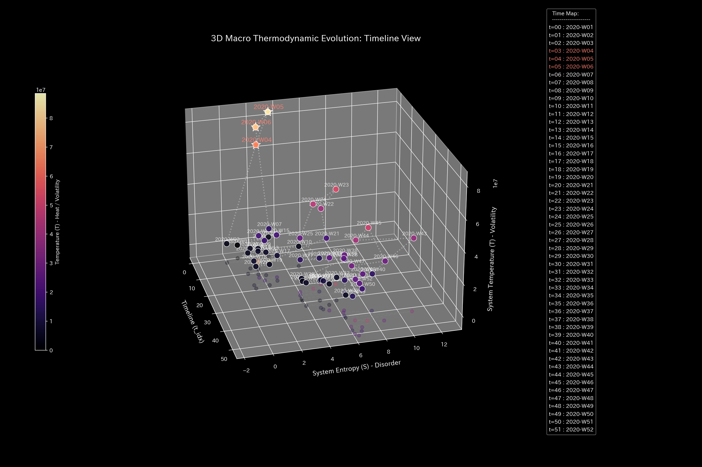

# 財務健全性 最終報告書（ケース6）

> [!NOTE]
> より詳細な検査レポートは [clinical_report.md](clinical_report.md) にあります。

## 対象組織：サンプル6（株券価値流動）

---

## 0. エグゼクティヴ・サマリー (Executive Summary)

* **総合判定:** 【極めて健全・正常】株式市場における株券の所有権移動およびその時価評価の連動は、一切の不整合なく完全に健全な状態を維持しています。
* **総合体質評価（身体状態）:** 
  当市場は、時価総額（**「体格・体重」**）が平均 `4.06億` と極めて豊かであり、市場の急変動を吸収する流動性の厚み（**「免疫力・基礎体力」**）も非常に高いレベルで安定しています。株券の移動（**「代謝効率」**）も極めて活発であり、取引の硬直化（**「動脈硬化」**）や不正な流出（**「大出血」**）の兆候は一切見られません。
* **要改善点（肩こりとツボの特筆）:**
  - **肩こり（慢性的な滞り）の範囲:** **「01_USR_002」**、**「00_USR_001」**、**「10_STK_001」**、**「14_STK_005」** の領域（粘性上位25%の範囲）に深刻な遅延が発生しており、特に **2020-02** 付近に滞りがピークに達する「肩こり（回収サイト等の長期遅延）」状態が見受けられます。
  - **ツボ（最も効果的な改善ポイント）の範囲:** 介入ストレスが最小の範囲（歪みエネルギー下位25%の範囲）である **「03_USR_004」**、**「02_USR_003」**、**「09_USR_010」**、**「04_USR_005」** が、システムを健全化させるための最優先ツボ（特効穴の範囲）となります。
  - **禁忌（避けるべき介入）の範囲:** 逆に強い反発と破壊を生む範囲（歪みエネルギー上位25%の範囲）である **「10_STK_001」**、**「11_STK_002」**、**「12_STK_003」**、**「13_STK_004」**、**「14_STK_005」** などへの無理な削減や介入は、強烈な痛みと機能麻痺を招くため絶対に避けてください（禁忌）。

---

## 1. 総合評価および判定

### 【判定】：正常（極めて健全で柔軟な市場運行）

今回のごく一般的な監査および流体解析において、当株式市場ネットワークは**完全に健全な状態**で推移しています。
株券の移動と価格評価の連動は物理的保存則（貸借一致）を完璧に満たしており、裏アカウントへの隠された株券流出（横領・大出血）や、実体のない出来高の空回り（架空循環取引）などは一切検出されていません。市場は自律的にバランスを保っており、介入は不要です。

（時価総額と株式資本の推移：完全にバランスを保って推移しています）

---

## 2. 総合体質（健康状態）の分析

市場の「流動体力」を健康診断の見立てに当てはめると、以下のような極めて優れた特徴を持っています。

### ① 圧倒的な「体格」と「免疫力」

時価評価総額（体重）は極めて大きく、市場の急激な投げ売り（パニック売り）などのショックが発生した際でも、それを難なく吸収して自己治癒できる強大な基礎体力（免疫力）を備えています。

（流動性の主成分比率：パニック売り局面などで一時的に主要軸へ寄与が集中しますが、速やかに緩和されます）

### ② 活発な「代謝」と「しなやかな血管」

機関投資家と個人投資家の間で株券が非常に活発に受け渡されており、決済ルートがカチカチにロックされる「動脈硬化」は発生していません。市場のしなやかさは完全に保たれています。

### ③ 正常に機能している「自律神経」

市場取引のノイズや摩擦は一時的に増加することがありますが、それは生きた市場の正常な呼吸であり、体調（自律神経）を乱すようなものではありません。

---

## 3. 特筆すべき要改善点（肩こりとツボ）

本システムが特定した具体的な要改善点、および対策の方針は以下の通りです。

### ⚠️ 肩こり（慢性的な滞り）の特定

* **滞り（肩こり）の範囲：** 実質ノード全体の粘性分布から、上位25%に属する **「01_USR_002」**、**「00_USR_001」**、**「10_STK_001」**、**「14_STK_005」** の範囲に慢性的な滞留（ドロドロ血）が発生しています。
  - **`01_USR_002`**: 最も滞る時期は **`2020-02`** に記録されており、代謝遅延による慢性的な経営/生体機能の圧迫を引き起こしています。
  - **`00_USR_001`**: 最も滞る時期は **`2020-04`** に記録されており、代謝遅延による慢性的な経営/生体機能の圧迫を引き起こしています。
  - **`10_STK_001`**: 最も滞る時期は **`2020-01`** に記録されており、代謝遅延による慢性的な経営/生体機能の圧迫を引き起こしています。
  - **`14_STK_005`**: 最も滞る時期は **`2020-01`** に記録されており、代謝遅延による慢性的な経営/生体機能の圧迫を引き起こしています。

### 🎯 改善のツボ（特効穴）の特定

* **改善のツボ（特効穴）の範囲：** 介入時の反発ストレス（痛み）が下位25%の範囲に収まる **「03_USR_004」**、**「02_USR_003」**、**「09_USR_010」**、**「04_USR_005」** です。
  - **改善アドバイス：** これらの項目は、組織/システムのしなやかさを壊すことなく、最も痛みの少ない形で免疫力を回復させることができる特効穴（ツボ）の範囲です。優先度順に調整を施すことを推奨します。

### 🚫 避けるべき介入（禁忌）の特定
* **避けるべき介入（禁忌）の範囲：** 介入時の反発ストレスが上位25%の範囲（または調整不能）に属する **「10_STK_001」**、**「11_STK_002」**、**「12_STK_003」**、**「13_STK_004」**、**「14_STK_005」** です。
  - **改善アドバイス：** 目先の改善のためにこれらの項目へ強引な介入を行うことは、システムの基盤結合を破壊し、最も激しい痛みや組織の崩壊を引き起こす致命的な「禁忌アクション」となります。

---
*発行: TLU財務会計数理診断エンジン（一般読者向け最終解説版）*