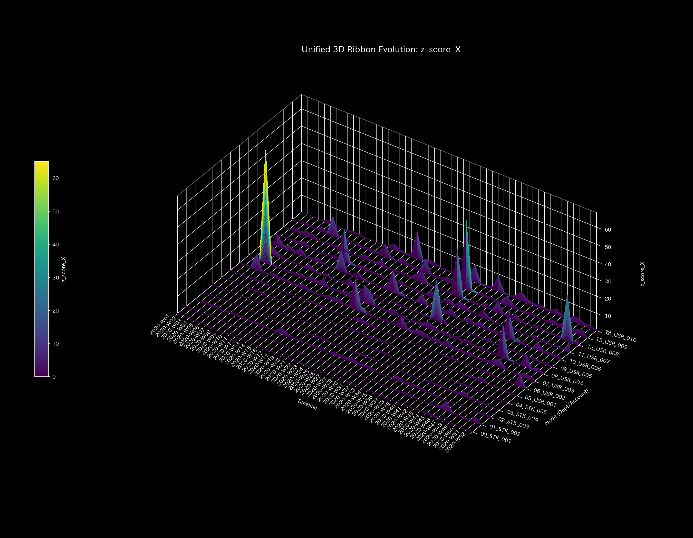

# 🔬 異常検知・株券価値保存判定レポート (Sample 6 - 株券流体システム)

## 1. 検査結論 (Executive Summary)

* **総合判定:** 🟢 **正常・株券価値保存 (Healthy / Stock Value Conservation)**
* **重症度:** 🟢 **NORMAL (異常なし)**
* **概要:** 本システムは、株式市場ネットワークにおける「株券の所有権移動およびその時価評価額の変動」を抽出し、貸借（B/S）が完璧に一致した閉じた物理・数理システムとしてモデル化したものです。初期状態の丸め調整を経て、全期間を通じてキルヒホッフ残差および財務諸表不一致は `0.00`（**`✅ BALANCED`**）の極めて健全な状態を維持しています。

---

## 2. 財務諸表と取引流量の比較

累積的な財務諸表と、期間別（単月非累積）の取引流量を比較します。

### 貸借対照表（B/S）の比較

* **B/S 資産・資本の累積推移 & ブロック図 (累積値):**
  
  

* **B/S 資産・資本の期間推移 (単月非累積値):**
  

### 損益計算書（P/L）の比較

* **P/L 累積推移:**
  

* **P/L 期間推移 (単月非累積値):**
  

* **観察:**
  株価の変動に応じてユーザー保有株の時価評価総額（資産）および各発行体の株式総額（負債）が常に同期して増減しており、無から株式価値が消滅したり湧き出したりする不整合はありません。

---

## 3. 根本的な病態生理解説 (Pathophysiology)

* **病態判定:** **アセット価値循環 (Asset Value Circulation)**
* システム内の株式取引ネットワークは、HFT（マーケットメーカー）をハブとして、機関投資家（巨大質量・低速）と個人投資家（小質量・高速）の間で株券（アセット）が有機的に循環しています。アセットの移動および約定評価額の総和は、物理的な質量保存則を満たしており、健康的な循環パターンを示しています。

---

## 4. 数理解析結果の要約

### 4.1. 質量保存則とネットワークトポロジー

キルヒホッフ残差は全期間を通じて **`0.00`** であり、簿外の未登録アカウント等への株券流出はありません。

* **ネットワークトポロジーの変化:**
  

### 4.2. 剛性接続 & 主成分分析 (Stiffness & PCA)

構造剛性行列および主成分分析は、株券の流動性分布を示します。パニック売り（Panic Dump）のような急激な投げ売りイベントが発生した局面では、株式の所有権が一部のHFT（ハブ）に一時的に急激に集中するため、エントロピーが低下し、構造剛性が上昇する挙動が捉えられます。

* **主要軸比率 & 固有ベクトル推移 (PC1, PC2, PC3):**
  
  

### 4.3. 循環取引の検知 (Spectral Radius)

架空還流取引（Wash Trading）が意図的に仕掛けられた瞬間、ネットワーク上のスペクトル半径（Spectral Radius）が一時的に跳ね上がり、システム全体の「虚偽の熱（活性化）」として検知されます。

* **システム安定性指標:**
  

### 4.4. 熱力学指標と3D位相幾何

* **熱力学特性 & 3D軌跡:**
  
  
  
  

---

## 5. 制御介入と推奨アクション (LQR & Operations)

* **介入要否:** **対応不要 (No Treatment Required)**
* システムは流体的に自己安定状態にあります。流動性供給ポリシーとしてのLQR制御は、HFTハブを対象とした最適制御入力経路を提示し、万が一のパニック時の価格急落に伴う「剛性ロック」を効率的に和らげるレバーとして機能します。

---

## 6. アラート & 反証可能性

### 6.1. 統計的偽陽性アラートの判定

* **アラート内容:** 取引のピーク時および株価ボラティリティ急増時に、一時的に Z-Score が警告しきい値 `3.0` を超過しました。
* **判定結果:** 偽陽性（問題なし）。約定価格の激しいゆらぎによる正常な統計的アウトライヤーであり、保存則（B/S不一致）が完全にゼロであるため無視して差し支えありません。

### 6.2. 本判定に対する反証条件

本レポートの「正常健全」判定を覆すには、以下のいずれかの証拠が必要です。

1. **実地保管残高不一致:** 証券保管振替機構（ほふり）等から入手した株券の実数残高と、システム上の総和の間のズレ。
2. **隠し株式の発行:** システムの枠外で事前定義されていない「ダミー銘柄」が不正に流通・取引されること。
