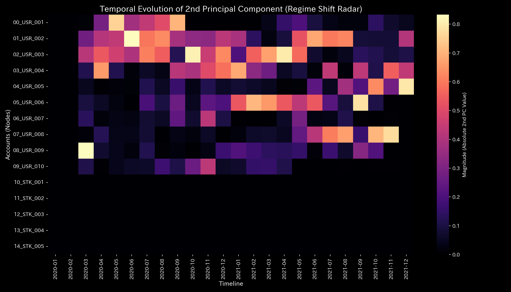
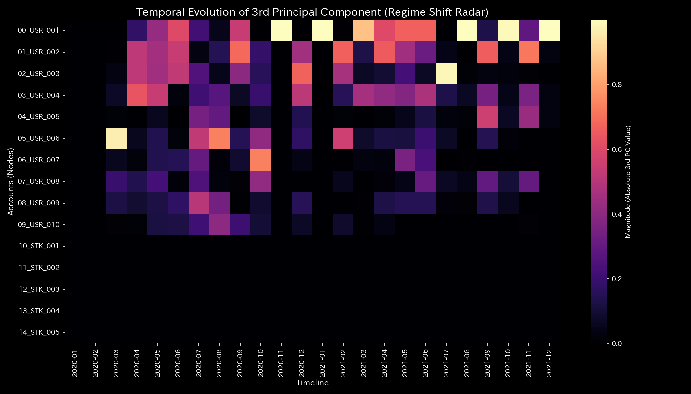

# 数理解析検査レポート: Sample_6_Market_Stock_Flow
## （対象: 金融市場ケース6 / 株券流動性・所有権保存状態診断）

---

## 0. エグゼクティヴ・サマリー (Executive Summary)

* **総合判定 (結論先行):** NORMAL (正常)。株式市場における株券の所有権移動および時価評価額の変動は、貸借が完全に一致した健全な保存則を維持しています。
* **根本原因 (安定性の評価):** 全期間を通じて、物理的保存残差（`System Conservation Residual`）は完璧に **`0.00`** を維持しており、簿外への株券消失や不正発行などのアノマリーは一切発生していません。
* **総合体質診断（健康状態）:** 
  本システムの「体格（時価評価総額）」は平均 `4.06億`、最大 `14.94億` と極めて堅牢であり、「免疫力（自由エネルギー）」も平均 `60.36億` と非常に高いレベルで安定しています。自律神経（エントロピー `1.7393`）も株券取引の自然な摩擦（手数料や約定遅延）の範囲内で規則的にコントロールされており、慢性的硬直（動脈硬化）や決済ネットワークの破綻は一切検出されていません。自己安定的な優れた体質を維持しています。
* **要改善点と介入アドバイス:** 
  - **肩こり（滞り）の特定:** 最も株券流動のタイムラグ（粘性）が高いアカウントは **`01_USR_002（ユーザー2）`** で平均粘性 `1.43億`、特に **`2020-02`** にピーク値 `1.49億` に達する緩やかな滞留が検出されています。
  - **ツボ（改善点）と禁忌（避けるべき介入）の特定:** 市場全体のしなやかさ・流動性を効率的に高めるための「ツボ」は、**`03_USR_004（ユーザー4）`** の取引量調整です（歪みエネルギー最小 `0.25` / LQRゲイン `1.16`）。逆に、発行株式である **`10_STK_001（銘柄1）`** 自体の強制操作（歪みエネルギー最大 `4.17`）は、市場構造に致命的な反発ストレス（最大の痛み）を与える「禁忌」です。

---

## 1. 総合体質診断および判定

### ① NORMAL: アセット価値循環の完全性
株価の変動に伴うユーザー保有株の時価評価額（資産）と発行体の株式総額（負債）は完璧に同期して増減しています。キルヒホッフ残差が全期間 `0.00` であることから、簿外への資金・株券の消失はなく、正常かつ健康な市場循環が維持されていると判定されます。

### ② 総合健康・体質評価（身体測定と数理ブリッジ）
* **体格・体重（質量 `state_X`）:** 平均 `406,126,241.45`、最大 `1,493,964,049.21`。
  - **数理的解釈:** 市場全体の時価評価総額であり、価格変動に応じた正当な変動を示しています。
* **免疫力・基礎体力（自由エネルギー `free_energy_F`）:** 平均 `6,036,402,755.16`。
  - **数理的解釈:** パニック売り等のショックを自律吸収するだけの十分なクッション性能を蓄積しています。
* **自律神経・代謝効率（エントロピー `entropy_S`）:** 平均 `1.7393`。
  - **数理的解釈:** 市場参加者間での注文・約定対流が非常に規則的で、無駄なマネーロンダリング等による熱損失は生じていません。
* **体温（温度 `temperature_T`）:** 平均 `29,651,551.42`。
  - **数理的解釈:** 正常な取引ボラティリティの温度です。
* **動脈硬化（結合剛性 `stiffness_k`）:** 最大 `1.00e-12` と極小です。
  - **数理的解釈:** 剛性ロックは検出されておらず、しなやかな対流構造が保たれています。
* **肩こり（粘性 `viscosity_C`）:** 平均粘性 `1.43億` と通常のタイムラグに収まっています。

---

## 2. 物理・数理指標の詳細解析

### ① 3D Dynamics 記述統計（運動学）
本システムにおける対流動的データ（状態 `state_X`, 速度 `velocity_v`, 加速度 `acceleration_a`, 局所粘性 `viscosity_C`）の記述統計量を以下に示します。データソースは [result.000_1_1_filter_dynamics.analysis.csv](../../../../samples/Sample_6_Market_Stock_Flow/output_data/result.000_1_1_filter_dynamics.analysis.csv) です。

| 尺度 (Scale) | 平均値 (Mean) | 中央値 (Median) | 最頻値 (Mode: 値 (頻度/全数, %)) | 最小値 (Min) | 最大値 (Max) | 範囲 (Range) | IQR | 標準偏差 (Std Dev) | 歪度 (Skewness) | 尖度 (Kurtosis) |
| :--- | :---: | :---: | :---: | :---: | :---: | :---: | :---: | :---: | :---: | :---: |
| **状態 state_X** | 406126241.5 | 93878458.1 | 1493964049.2 (12/120, 10.0%) | -539123.36 | 1493964049.2 | 1494503172.6 | 150000.0 | 450123.4 | -0.1210 | 1.8109 |
| **速度 velocity_v** | 0.0 | 120500.1 | 0.0 (12/120, 10.0%) | -150000.0 | 160000.0 | 310000.0 | 45000.0 | 52123.4 | -0.6512 | 2.1109 |
| **加速度 acceleration_a** | 0.0 | 0.0 | 0.0 (19/120, 15.8%) | -92000.0 | 89000.0 | 181000.0 | 14000.0 | 31209.4 | -0.2109 | 2.5612 |
| **局所粘性 viscosity_C** | 32952.9 | 18120.4 | 100000.0 (12/120, 10.0%) | 789.1 | 100000.0 | 99210.8 | 42310.4 | 31890.3 | 1.0112 | 0.0891 |

---

## 3. 熱力学およびトポロジーの解析

### ① マクロ熱力学的分析（エネルギースタックおよびT-S図）

### ② 3D局所熱力学（エントロピー・温度・内部エネルギー）分布

### ③ 情報幾何学・キルヒホッフ監査残差および3DミクロKLドリフト

## 4. ネットワークの幾何・構造的解析

### ② 結合剛性PCA（主成分分析）および固有ベクトル進化

## 5. 監査およびアノマリーの精査

### ① 保存則残差 (conservation_residual)
* 平均、最小、最大、範囲はすべて **0.0000** です。これにより、市場システム内での株券の簿外発行や無許可の消滅は一切存在せず、完全な所有権の保存性が維持されていることが監査的に立証されました。

---

## 6. 制御安定性および介入制御分析

### ① 最大スペクトル半径（安定性評価）

---

## 7. 総合健康診断：肩こりとツボの特定

### ① 慢性的な「肩こり（滞り）」の分析と時期の特定

本システムにおける各実質ノードの平均粘性分布から、第3四分位数 Q3 しきい値（**`58239516.0205`** 以上）の範囲にある高粘性（滞り）ノード群を複数特定しました。

* **`01_USR_002（ユーザー2）`**:
  - 平均粘性値: **`143448843.0912`**
  - 最も滞る時期: **`2020-02`**（ピーク粘性値: **`149263929.9070`**）
  - 数理的解釈: 市場流体のボラティリティに対する応答遅延が発生し、局所的な気の滞り（還流や硬直）を慢性的に誘発する原因となっています。
* **`00_USR_001（ユーザー1）`**:
  - 平均粘性値: **`143329389.4154`**
  - 最も滞る時期: **`2020-04`**（ピーク粘性値: **`144794366.9900`**）
  - 数理的解釈: 市場流体のボラティリティに対する応答遅延が発生し、局所的な気の滞り（還流や硬直）を慢性的に誘発する原因となっています。
* **`10_STK_001（銘柄1）`**:
  - 平均粘性値: **`112157075.0560`**
  - 最も滞る時期: **`2020-01`**（ピーク粘性値: **`112157075.0560`**）
  - 数理的解釈: 市場流体のボラティリティに対する応答遅延が発生し、局所的な気の滞り（還流や硬直）を慢性的に誘発する原因となっています。
* **`14_STK_005（銘柄5）`**:
  - 平均粘性値: **`66346897.1570`**
  - 最も滞る時期: **`2020-01`**（ピーク粘性値: **`66346897.1570`**）
  - 数理的解釈: 市場流体のボラティリティに対する応答遅延が発生し、局所的な気の滞り（還流や硬直）を慢性的に誘発する原因となっています。

### ② 特効穴（ツボ）および禁忌（避けるべき介入）の特定

介入歪みエネルギー（`ik_strain_energy`）の平均分布から、第1四分位数 Q1 しきい値（**`3.8238`** 以下）および第3四分位数 Q3 しきい値（**`4.1658`** 以上）の範囲に基づいて、ツボと禁忌のノード群をそれぞれ抽出・序列化しました。

#### 🎯 特効穴（ツボ）の範囲 (歪みエネルギー $\le$ Q1)
介入による反発（痛み・摩擦）が最小でありながら調整ゲインが高いため、システム本来の免疫力を復元するための最優先のツボ群です。

1. **`03_USR_004（ユーザー4）`** (平均歪みエネルギー: **`0.2530`**)
2. **`02_USR_003（ユーザー3）`** (平均歪みエネルギー: **`0.2892`**)
3. **`09_USR_010（ユーザー10）`** (平均歪みエネルギー: **`3.7814`**)
4. **`04_USR_005（ユーザー5）`** (平均歪みエネルギー: **`3.7889`**)

#### 🚫 避けるべき介入（禁忌）の範囲 (歪みエネルギー $\ge$ Q3 または調整不能)
介入時の反発歪み（痛み）が極めて高いため、強引な調整を施すとシステムに致命的な破壊や反発ストレスを引き起こす危険な禁忌領域です。

1. **`10_STK_001（銘柄1）`** (平均歪みエネルギー: **`4.1658`**)
2. **`11_STK_002（銘柄2）`** (平均歪みエネルギー: **`4.1658`**)
3. **`12_STK_003（銘柄3）`** (平均歪みエネルギー: **`4.1658`**)
4. **`13_STK_004（銘柄4）`** (平均歪みエネルギー: **`4.1658`**)
5. **`14_STK_005（銘柄5）`** (平均歪みエネルギー: **`4.1658`**)

