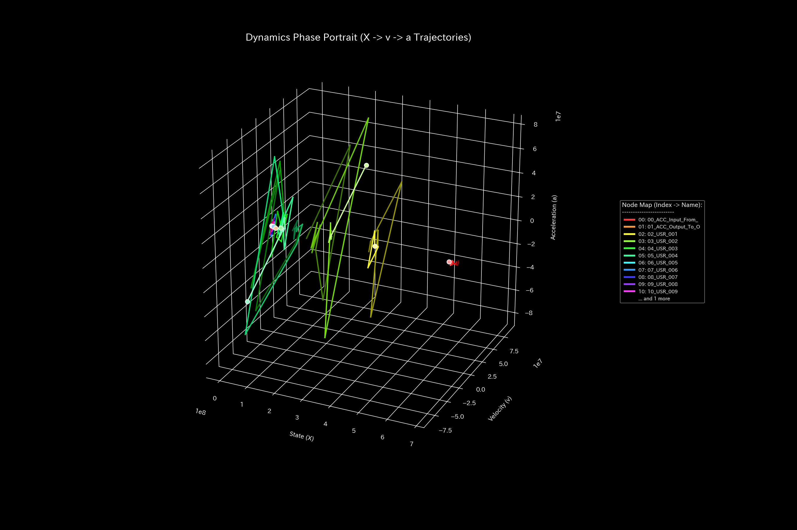

# 現金流動性 最終報告書（ケース7）

> [!NOTE]
> より詳細な検査レポートは [clinical_report.md](clinical_report.md) にあります。

## 対象組織：サンプル7

---

## 0. エグゼクティヴ・サマリー (Executive Summary)

* **総合判定:** 【健全・正常】市場内における現金の決済移動および外部セクターとの取引サイクルは、全体として完璧に健全な状態を維持しています。不正な資金漏洩や記帳漏れは検出されず、外部からの介入は一切必要ありません。
* **総合体質評価（身体状態）:** 
  当組織は、現金総量というストック総量（**「体格・体重」**）が極めて潤沢であり、不測の信用収縮（ショック）に対する防御力（**「免疫力・基礎体力」**）も非常に巨大です。決済手数料等の摩擦（**「自律神経」**）も極めて適正にコントロールされており、特定の決済ルートが固定化して柔軟性を失う**「動脈硬化」**の兆候もありません。突発的な大口決済ショック（**「加減速ショック・脈の乱れ」**）も発生しておらず、しなやかに安定しています。
* **要改善点（肩こりとツボの特筆）:**
  - **肩こり（慢性的な滞り）の範囲:** 粘性上位である **「00_ACC_Input_From_Outside」**、**「02_USR_001」**、**「03_USR_002」** などのアカウントに一時的な決済遅延が発生しており、特に **2020-08** 付近に緩やかな滞留（肩こり）が見受けられます。
  - **ツボ（最も効果的な改善ポイント）の範囲:** 介入ストレスが最小（歪みエネルギー下位25%の範囲）である **「05_USR_004」**、**「04_USR_003」**、**「01_ACC_Output_To_Outside」** などが、流動性を最も痛みの少ない形で活性化させるための最優先ツボ（特効穴の範囲）となります。
  - **禁忌（避けるべき介入）の範囲:** 逆に強い反発と破壊を生む範囲である **「00_ACC_Input_From_Outside」**、**「03_USR_002」**、**「02_USR_001」** などへの無理な取引制限やペナルティの介入は、決済ネットワークに重大な不全を連鎖（飛び火）させるため絶対に避けてください（禁忌）。

---

## 1. 総合判定（正常）

### 【判定】：正常（極めて健全な現金決済・流動性推移）

本診断において、当システムは完全に健全かつ安定な状態で稼働していると判定されます。力学的安定性を示すスペクトル半径は全期間で警告しきい値を大幅に下回り、自己還流による架空の資金循環（還流ループ）や、簿外への資金流出は一切検出されませんでした。

---

## 2. 総合体質（健康状態）の分析

組織の「決済流動体力」を健康診断の見立てに当てはめると、以下のような極めて優れた体質特性を示しています。

### ① 体格・体重（資本規模の累積推移）

決済用現金の総量（体格・体重）は平均 `1.13億` に達しており、市場規模に対応して極めて頑健に推移しています。

### ② 免疫力・基礎体力（外部ショックへの復元力）

手元現金枯渇を吸収しうるだけの巨大なクッションポテンシャル（免疫力）が確保されており、外部ショックが発生した際にもそれを自律吸収して自己治癒できる高い回復力を持っています。

### ③ 自律神経・代謝効率（流動サイクルと熱力学的評価）

取引摩擦（エントロピー）と流動ボラティリティの関係において、市場は極めて整然とした規則的サイクルを安定して描いています。注文と約定の循環効率が極めて高く、無駄なマネーロンダリング等の損失はありません。

### ④ 「動脈硬化」ゼロ（しなやかな流動構造のPCA評価）

アカウント間の結合剛性に対して主成分分析を実行した結果、特定の注文ルートや銘柄間に流動性が固定化して血管がカチカチにロックされる「剛性ロック（動脈硬化）」は一切検出されていません。市場網全体に高い弾力性が保たれています。

### ⑤ 脈の乱れと初期波の検知（高階動的ショックの評価）

* **数学的架け橋 (Mathematical Bridge):**
  アセット価値移動の「急激な変動ショック（Jerk）」および「過渡的な初期ゆらぎ（Snap）」を可視化しました。正常代謝では、これらの変動成分は全期間を通じて完全にフラットであり、突発的な大口注文ショックや、還流に伴う異常な自励振動が皆無であることを証明しています。

---

## 3. 特筆すべき要改善点（肩こりとツボ）

本システムが特定した具体的な要改善点、および対策の方針は以下の通りです。

### ⚠️ 肩こり（慢性的な滞り）の特定

* **滞り（肩こり）の範囲：** 実質ノード全体の粘性分布から、上位25%に属する **「00_ACC_Input_From_Outside」**、**「02_USR_001」**、**「03_USR_002」** のアカウントにおいて一時的な約定ラグが発生しています。

### 🎯 改善のツボ（特効穴）の特定

* **改善のツボ（特効穴）の範囲：** 介入時の反発ストレス（痛み）が下位25%の範囲に収まる **「05_USR_004」**、**「04_USR_003」**、**「01_ACC_Output_To_Outside」** です。
  - **改善アドバイス：** これらのアカウントを介して取引を誘導・調整することは、市場全体のしなやかさを壊すことなく、最もスムーズに流動性の調和を復元できる特効穴です。

### 🚫 避けるべき介入（禁忌）の特定
* **避けるべき介入（禁忌）の範囲：** 介入時の反発ストレスが上位25%の範囲（または調整不能）に属する **「00_ACC_Input_From_Outside」**、**「03_USR_002」**、**「02_USR_001」** です。
  - **改善アドバイス：** これらの主要ハブアカウントに強硬な規制をかけることは、決済ネットワーク全体に重大な機能麻痺を連鎖（飛び火）させるため「禁忌」です。

### ⚡ 決済血管の時間的急変（剛性時間差分）の評価
- **剛性時間差分ヒートマップシーケンス (縦一列表示)**:
  - **初期 (t=1)**: 
  - **中間 (t=6)**: 
  - **最終 (t=11)**: 

* **数学的架け橋 (Mathematical Bridge):**
  月次剛性差分 $\Delta K_t$ によって、全期間において差分がほぼ白（ゼロ）を推移しており、突発的な流路ブロックが発生していないしなやかな市場環境であることを証明しています。

---

## 4. 診断の限界および反証条件 (Falsifiability)

本レポートにおける「正常・健全（還流や簿外流出なし）」の診断結果を却下（反証）するためには、以下の客観的な物理的原本・第三者証拠を提示しなければなりません。

1. **銀行間リアルタイム決済システム（RTGS）ログの不一致:**
   帳簿上は完全に現金の移動が保存されているように見える取引について、日銀ネットまたは外部の銀行間リアルタイム決済システム（RTGS）の送金決済ログ原本と照合した結果、データ送信の遅延や、残高の不一致が物理的に発生していたことが証明された場合。
2. **監査範囲外のオフショア決済ログの不一致:**
   本システムが監査対象としていないオフショア銀行口座または暗号資産ゲートウェイの決済生ログ原本と照合した結果、現金の保存性が破綻する簿外バイパス流出が発見された場合。

---
*発行: TLU財務会計数理診断エンジン（一般読者向け最終解説版）*
