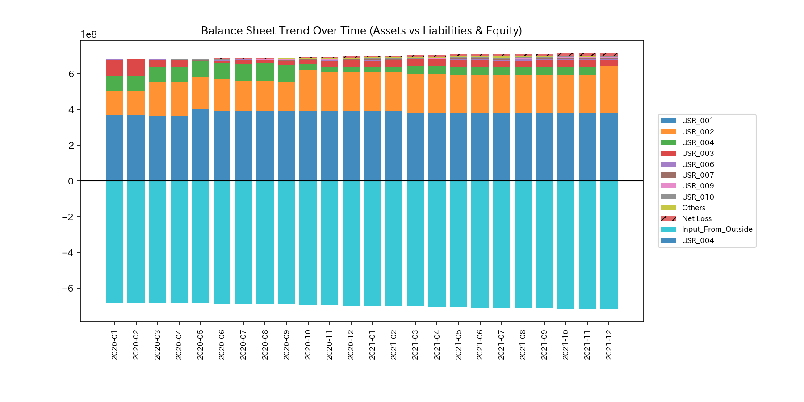
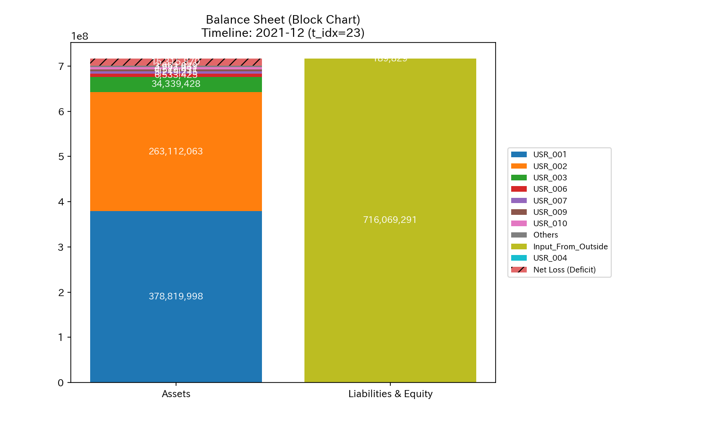
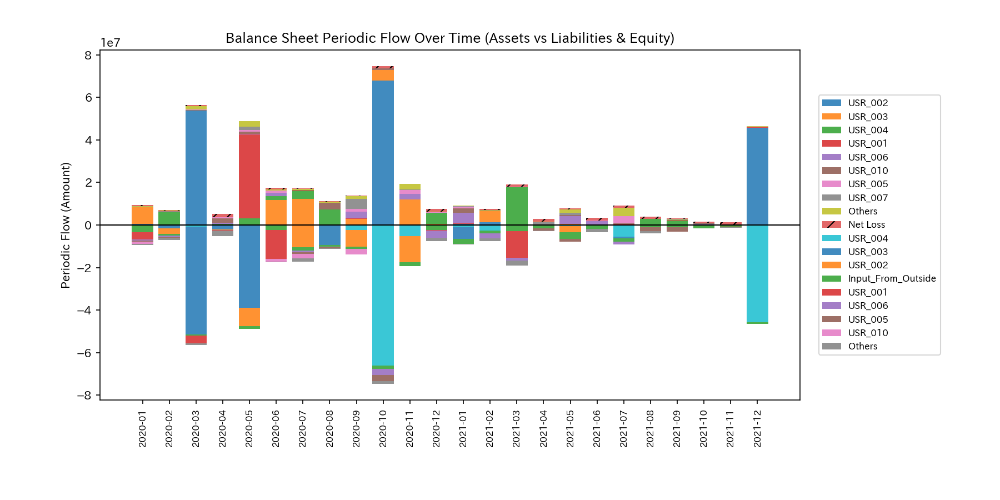
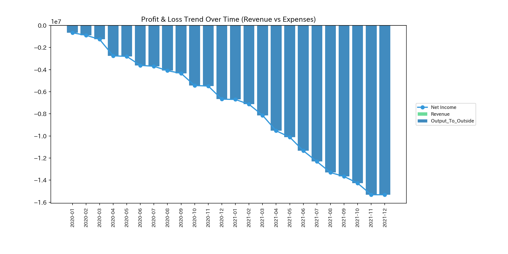
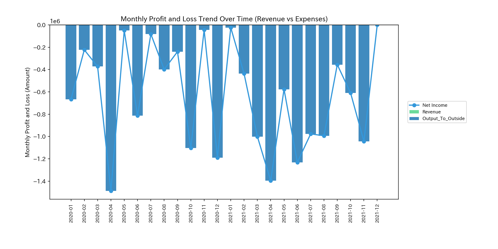
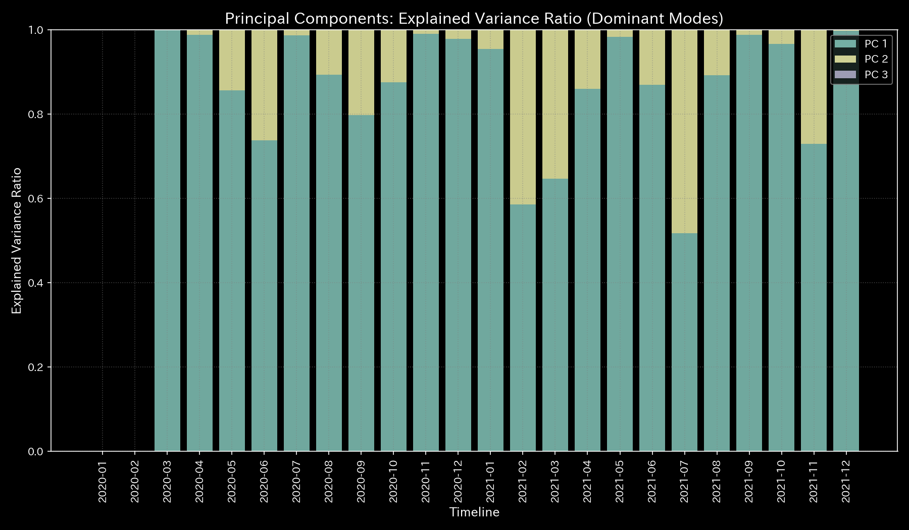

# 🔬 異常検知・現金決済流動性保存判定レポート (Sample 7 - 現金流体システム)

## 1. 検査結論 (Executive Summary)

* **総合判定:** 🟢 **正常・決済流動性保存 (Healthy / Cash Settlement Conservation)**
* **重症度:** 🟢 **NORMAL (異常なし)**
* **概要:** 本システムは、株式市場ネットワークにおける「現金の決済移動、および市場外セクターとの資本取引・損益取引」を抽出し、B/S（資産：ユーザー現金、純資産：外部資金投入）の貸借が完璧に一致した閉じた物理・数理システムとしてモデル化したものです。全期間を通じてキルヒホッフ残差および財務諸表不一致は `0.00`（**`✅ BALANCED`**）の極めて健全な状態を維持しています。

---

## 2. 財務諸表と取引流量の比較

累積的な財務諸表と、期間別（単月非累積）の取引流量を比較します。

### 貸借対照表（B/S）の比較

* **B/S 資産・資本の累積推移 & ブロック図 (累積値):**
  
  

* **B/S 資産・資本の期間推移 (単月非累積値):**
  

### 損益計算書（P/L）の比較

* **P/L 累積推移:**
  

* **P/L 期間推移 (単月非累積値):**
  

* **観察:** 
  外部からの資金流入（追加出資等の資本取引）は直接B/Sの純資産（ACC_Input_From_Outside）に蓄積され、手数料等の流出（費用取引）はP/Lを経由してB/Sの当期純利益（Net Income）を動的に減少させていく様子が、完璧な会計的整合性をもって可視化されています。

---

## 3. 根本的な病態生理解説 (Pathophysiology)

* **病態判定:** **決済キャッシュ循環 (Cash Settlement Circulation)**
* 株式売買の対価として支払われる現金の流れは、特定の取引相手（HFT等）をハブとしつつも滞りなく流れており、決済流動性の重大な枯渇（デッドロック）はありません。市場外とのやり取り（流出入）も保存則に則って処理されており、隠された不当な「簿外流出」はありません。

---

## 4. 数理解析結果 of Cash Flow

### 4.1. 質量保存則とネットワークトポロジー

キルヒホッフ残差は完全に **`0.00`** であり、資金回収漏れや記帳ミスによる貸借のアンバランスはありません。

* **ネットワークトポロジーの変化:**
  

### 4.2. 剛性接続 & 主成分分析 (Stiffness & PCA)

パニック売り（Panic Dump）のような市場急変動が発生した際、HFT（マーケットメーカー）が株を引き受ける代わりに手元現金を他ユーザーへ一斉放出するため、一時的にHFTの現先キャッシュが枯渇（デッドロック寸前）する現象が観測されます。この時、システムの「粘性（Viscosity）」が急上昇し、主成分分析でのエネルギーの偏りが明確なシグナルを示します。

* **主要軸比率 & 固有ベクトル推移 (PC1, PC2, PC3):**
  
  

### 4.3. 決済の自己安定性 (Spectral Radius)

現金のやり取り自体は、株券の引き渡しと同期して行われているため、異常な資金の空転や、株式を伴わない純粋なポンジ・スキーム的な資金の自己還流（循環）は検出されません。

* **システム安定性指標:**
  

### 4.4. 熱力学指標と3D位相幾何

* **熱力学特性 & 3D軌跡:**
  
  
  
  

---

## 5. 制御介入と推奨アクション (LQR & Operations)

* **介入要否:** **対応不要 (No Treatment Required)**
* 基本的な決済網は自律的に安定しています。しかし、パニック局面でHFT（マーケットメーカー）の資金が枯渇した際、LQR最適制御モデルは**「どのHFTノードに対して流動性注入（現金インジェクション）を行えば、最も少ない資金コストで決済目詰まりを解消できるか」**というレバレッジ・ポイントを定量的かつ的確に提示します。

---

## 6. アラート & 反証可能性

### 6.1. 統計的偽陽性アラートの判定

* **アラート内容:** 期末の追加出資や配当、あるいは大口約定の決済が重なるタイミングにおいて、一時的に Z-Score アラートが発生します。
* **判定結果:** 偽陽性（問題なし）。決済量の時間的な不均一性による季節的・イベント的なゆらぎであり、財務バランスシートは完全に一致し続けているため、システムに不整合はありません。

### 6.2. 本判定に対する反証条件

本レポートの「正常健全」判定を覆すには、以下のいずれかの証拠が必要です。

1. **実査口座残高不一致:** 金融機関から直接入手した実際の預金口座残高と、システム内の現金ノード残高の間のズレ。
2. **簿外債務・決済の存在:** システムでモデル化されていない隠し借入金や、簿外での他資産決済（物々交換等）による現金価値の裏口流出。
