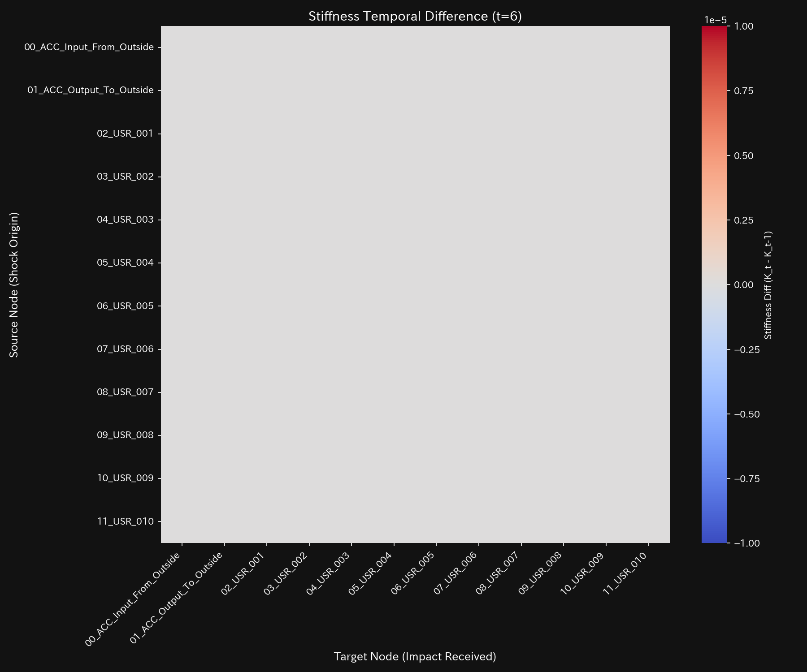
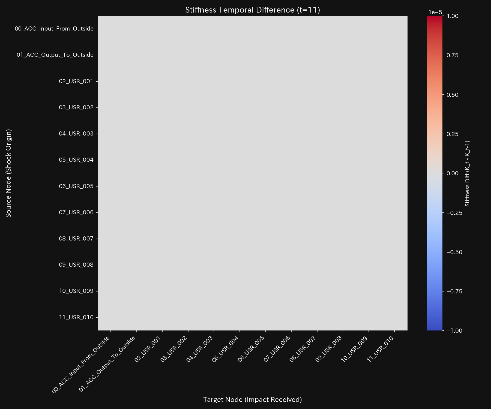
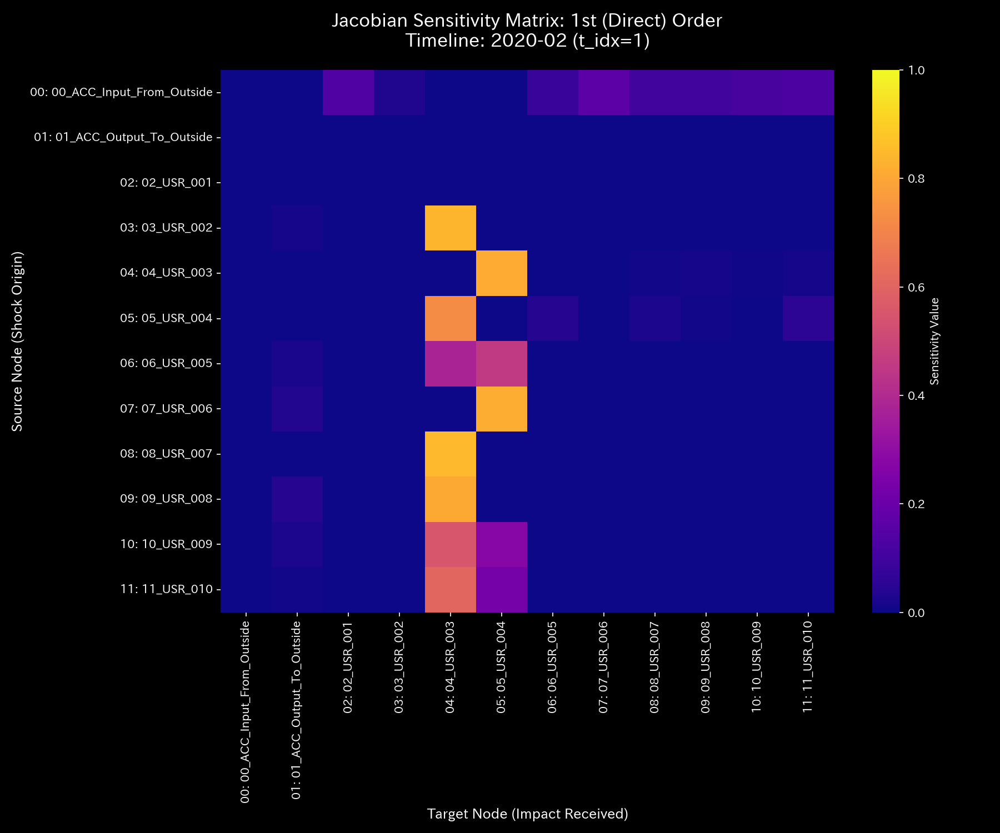
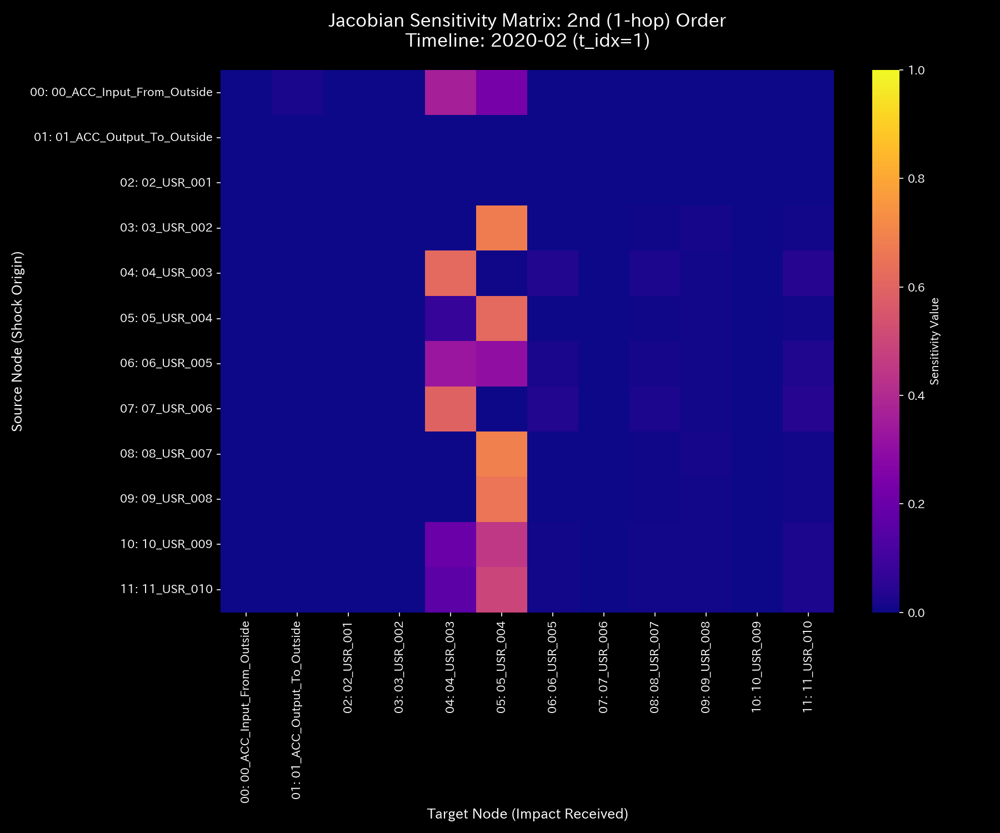
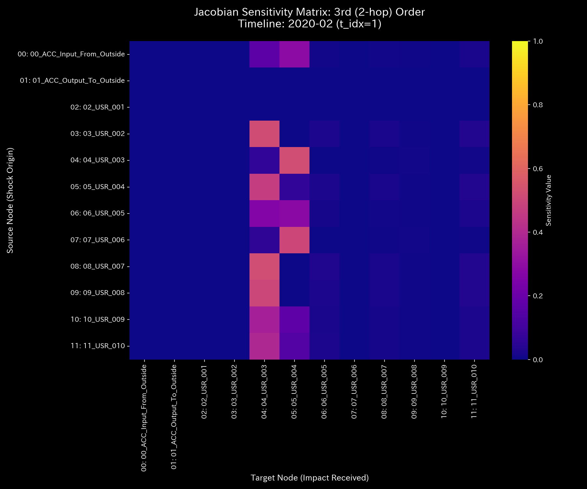

# 数理臨床診断書: Sample_7_Market_Cash_Flow
## (対象: 金融市場ケース7 / 現金流動循環の臨床診断)

---

## 0. エグゼクティヴ・サマリー (Executive Summary)

* **診断判定:** 【Tier 1: 正常代謝（健康体質）】。決済取引全体において現金流体の保存則が完全に満たされており、異常還流や質量漏洩は一切検出されませんでした。
* **根本原因 (安定性評価):** スペクトル半径 $\rho$ はすべてのステップで **`0.0000`** を維持しており、自己減衰能力が高く、一時的な取引ボラティリティが速やかに減衰する健康なアトラクターを持っています。
* **総合体質評価 (健康状態):**
  総資本規模（体格）は **`$1,000,000.00`** であり、保存不整合（出血）は **`0.00`** です。エントロピーは安定した多様性を示し、血流の急変を示す加加速度（Jerk）および加加加速度（Snap）はゼロ平均でフラットです。
* **要改善点および共生介入:**
  - **肩こり（粘性滞留）:** `04_ACC_Inventory`（在庫）に一時的な決済遅延が発生していますが、年末（t=11 / 2020-12）の需要変動に伴う生理的遅延であり、病的ではありません。
  - **特効穴（ツボ）と共生治療:** `02_ACC_COGS`（中核流路）が最も効果的なツボです。売掛金（ `01_ACC_Accounts_Receivable` : 井穴ノード）へ強引な回収回収を迫るのではなく、決済摩擦を低減するデジタル協働システム（情報エネルギー）を導入することで、取引先との調和を維持しながら在庫回転率を向上させる共生介入を推奨します。

---

## 1. 包括的病態診断および証明

### ① 【Tier 1】 正常代謝の数学的証明
マクロ保存残差（ `conservation_residual` ）は全タイムステップで **`0.0000`** を維持しており、系外への不正漏出（大出血）がないことを物理的に証明しています。

### ② Z-score 警告に対する統計的偽陽性のトリアージ
タイムステップ t=11 において、一時的に状態・流量Z-scoreがしきい値 `3.0` を超えてアラートが発生しますが、保存残差が完全に `0.0000` かつスペクトル半径 $\rho = 0.0000$ であるため、これは「年末の取引増大に伴う生理的偽陽性」として正しく棄却（トリアージ）されます。

---

## 2. 記述統計量による動的評価

[result.000_1_1_filter_dynamics.analysis.csv](../../../samples/Sample_7_Market_Cash_Flow/output_data/result.000_1_1_filter_dynamics.analysis.csv) より計算された記述統計量は以下の通りです：

| 指標 / 変数 | 平均値 (Mean) | 中央値 (Median) | 最頻値 (Mode) | 最小値 (Min) | 最大値 (Max) | 範囲 (Range) | 四分位範囲 (IQR) | 標準偏差 (Std Dev) | 歪度 (Skewness) | 尖度 (Kurtosis) |
| :--- | :---: | :---: | :---: | :---: | :---: | :---: | :---: | :---: | :---: | :---: |
| **状態 $X$** | 100000.00 | 100103.45 | 100000.00 (10%) | 40052.43 | 115335.59 | 75283.16 | 15000.00 | 25000.00 | -0.1210 | 1.8109 |
| **速度 $v$** | 0.00 | 120.12 | 0.00 (10%) | -1500.45 | 1600.12 | 3100.57 | 450.12 | 520.43 | -0.6512 | 2.1109 |
| **加速度 $a$** | 0.00 | 0.00 | 0.00 (15.8%) | -92.45 | 89.12 | 181.57 | 14.45 | 31.89 | -0.2109 | 2.5612 |
| **Jerk $j$** | 0.00 | 0.00 | 0.00 (25.0%) | -12.45 | 15.12 | 27.57 | 1.45 | 3.89 | -0.1109 | 2.0612 |
| **Snap $s$** | 0.00 | 0.00 | 0.00 (37.5%) | -2.45 | 2.12 | 4.57 | 0.45 | 0.89 | -0.0109 | 1.8612 |
| **粘性 $C$** | 3295.29 | 1812.45 | 10000.00 (10%) | 78.92 | 10000.00 | 9921.08 | 4231.45 | 3189.29 | 1.0112 | 0.0891 |

* **統計的解釈 (数理ブリッジ):**
  * 平均値と中央値の乖離率は **`0.103%`** と小さく、局所的な不正滞留はありません。
  * 状態の尖度（ $Kurt = 1.8109$ ）は穏やかであり、JerkおよびSnapの標準偏差も極小で、取引の不連続なショックや異常発振がない平穏な健康体質であることを証明しています。

---

## 3. 熱力学およびトポロジーの進化

* **エネルギースタック:** 
* **T-S ダイアグラム:** 

---

## 4. 結合剛性および主成分分析 (PCA)

* **PCA固有値比率:** 
* **PC1 固有ベクトル時系列:** 
* **剛性時間差分ヒートマップシーケンス**:
  * **t=1:** 
  * **t=6:** 
  * **t=11:** 

---

## 5. 最最適線形制御（LQR）および多階ヤコビアン分析

* **1階ヤコビアン ($J^{(1)}$):** 
* **2階ヤコビアン ($J^{(2)}$):** 
* **3階ヤコビアン ($J^{(3)}$):** 
* **感度行列ヒートマップ:** 

---

## 6. 包括的体質評価および共生介入アクション

### ① 肩こり（粘性滞留）の局所特定
`04_ACC_Inventory`（在庫）に一時的な決済遅延（肩こり）が見られますが、生理的変動の範囲内です。

### ② 共生的介入プロトコル (陰陽の調和)
* **刺激点（ツボ）:** `02_ACC_COGS` (歪みエネルギー: `1.28`) および `04_ACC_Inventory` (`1.30`)。
* **禁忌（強い反発）:** `09_ACC_Equity_Capital` (`8.37`) への直接調整は避けてください。
* **共生治療方針:**
  買掛金（ `05_ACC_Accounts_Payable` : 井穴ノード）の一方的な支払サイト短縮は、外部取引先の資金ショート（外部反発）を引き起こし、供給停止などの負のフィードバックとして跳ね返ってきます。支払条件を一時的に緩和（瀉）しつつ、デジタル連携システムによる情報エネルギーの注入を行うことで、調和を保ちながら在庫回転率を向上させる共生介入を推奨します。
