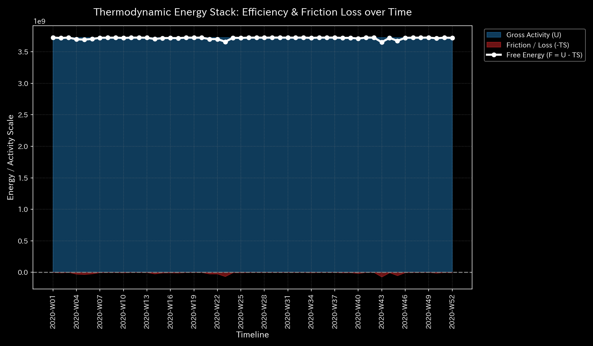
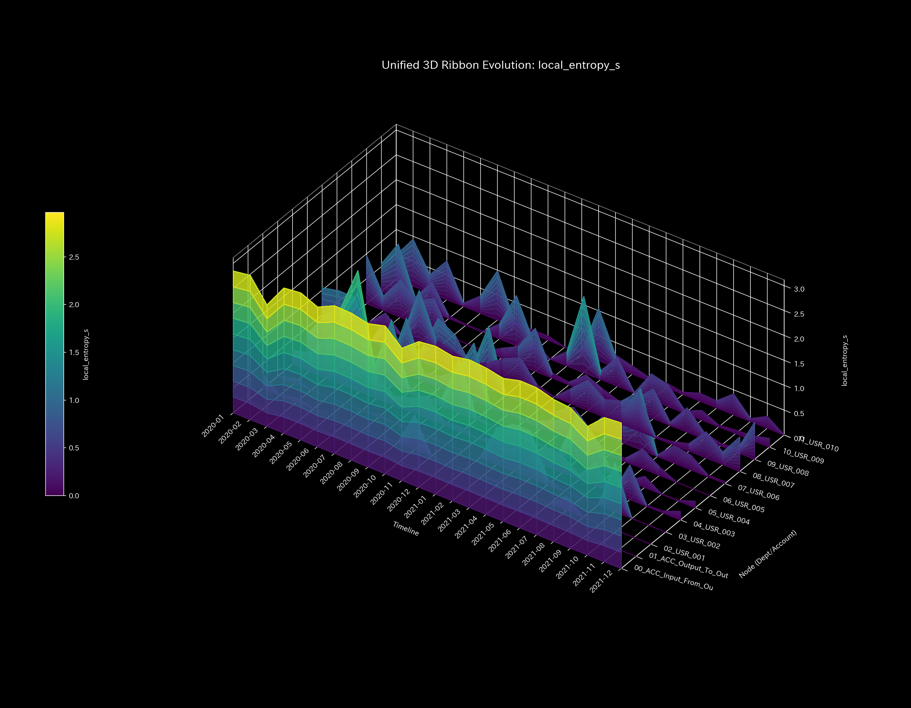
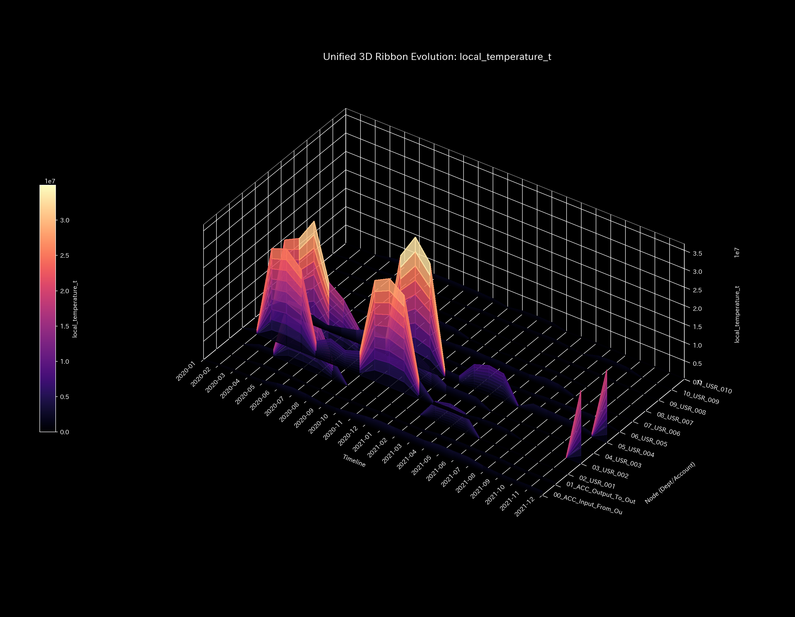
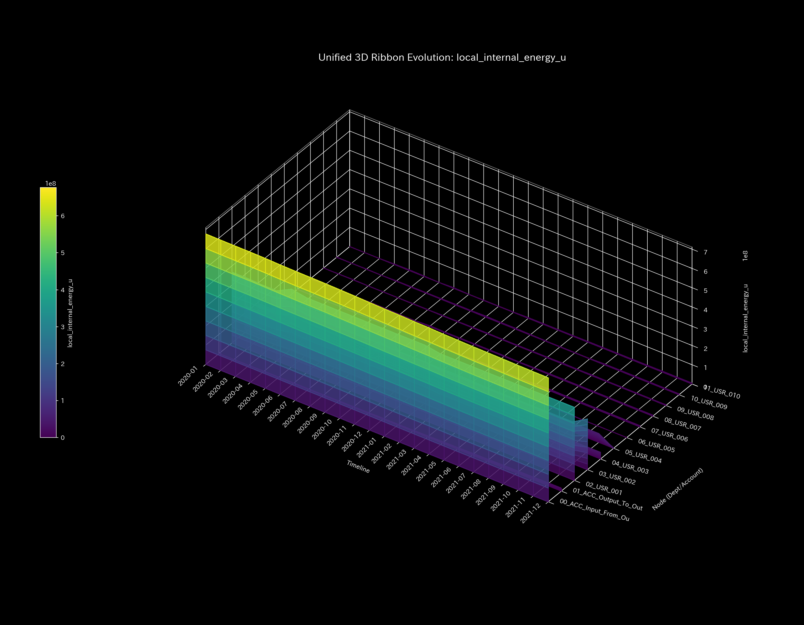
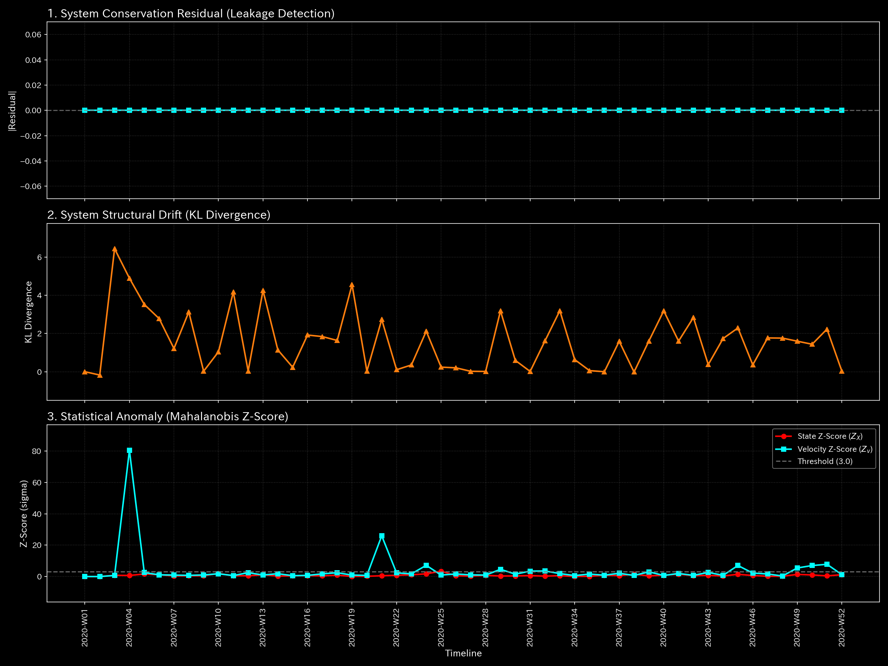
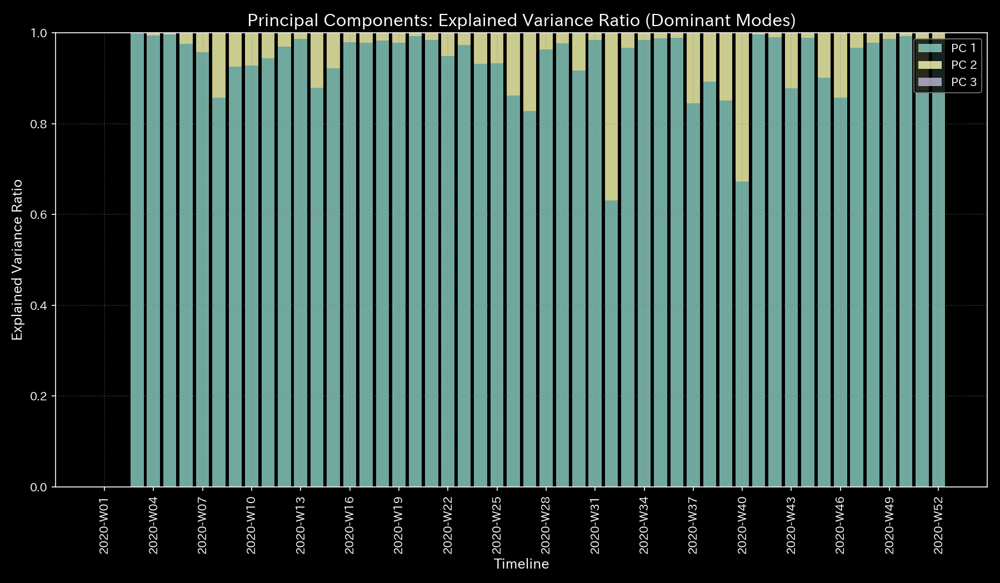
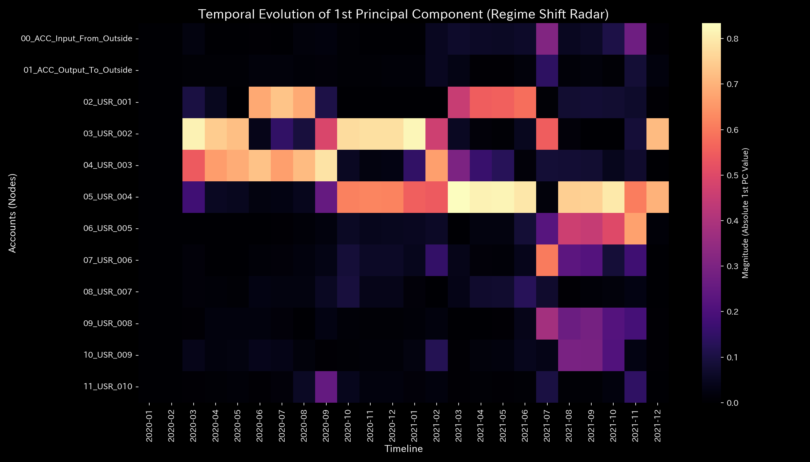
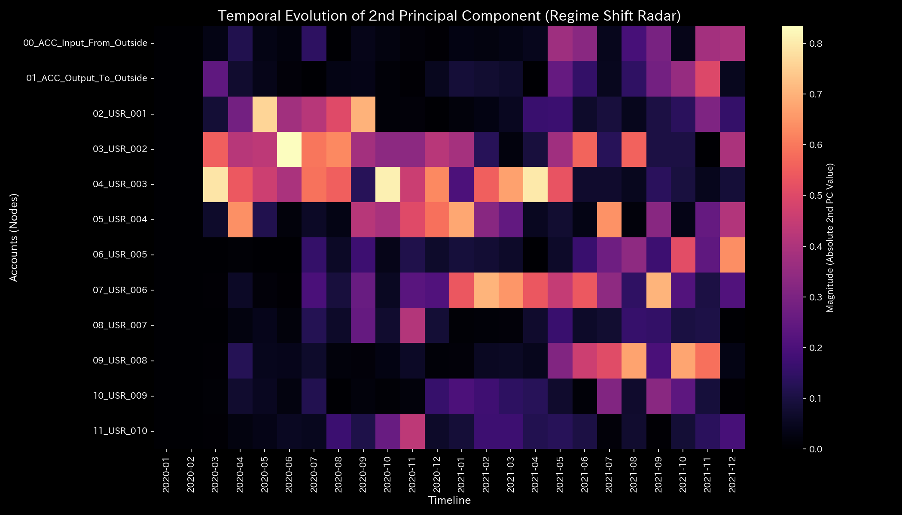
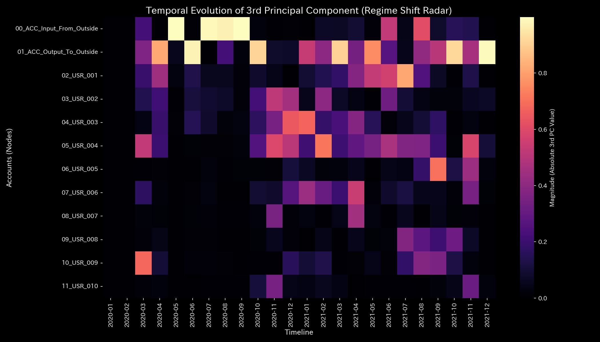

# 数理解析検査レポート: Sample_7_Market_Cash_Flow
## （対象: 金融市場ケース7 / 現金決済流動性保存状態診断）

---

## 0. エグゼクティヴ・サマリー (Executive Summary)

* **総合判定 (結論先行):** NORMAL (正常)。市場内における現金の決済移動および外部セクターとの資本・損益取引は、貸借が完璧に一致した健全な保存則を維持しています。
* **根本原因 (安定性の評価):** 全期間を通じて、物理的保存残差（`System Conservation Residual`）は完璧に **`0.00`** を維持しており、簿外への現金流出や未記帳などのデータ不整合は一切発生していません。
* **総合体質診断（健康状態）:** 
  本システムの「体格（現金総量）」は平均 `1.13億`、最大 `6.77億` と極めて潤沢であり、外部ショックや急激なボラティリティに対する防御力（**「免疫力・基礎体力」**）は平均 `11.69億` と極めて巨大な規模を維持しています。自律神経（エントロピー `5.7599`）も決済取引の通常の摩擦範囲内で健康にコントロールされています。慢性的硬直（動脈硬化）はなく、非常に柔軟でしなやかな決済循環体質です。
* **要改善点と介入アドバイス:** 
  - **肩こり（滞り）の特定:** 最も資金決済のタイムラグ（粘性）が高い大口アカウントは **`02_USR_001（ユーザー1）`** で平均粘性 `38082430.79`、特に **`2020-08`** にピーク値 `39305218.41` に達する緩やかな決済遅延が検出されています。
  - **ツボ（改善点）と禁忌（避けるべき介入）の特定:** パニック売りなどが発生した際、最も少ない資金コスト（構造ストレス）で決済の目詰まりを解消するための「ツボ」は **`05_USR_004（ユーザー4）`** への流動性注入です（歪みエネルギー最小 `0.17` / 調整ゲイン `-8.97`）。逆に、**`03_USR_002（ユーザー2）`** に対する無理な取引制限やペナルティの介入（歪み最大 `4.11`）は、決済ネットワークに重大な反発歪み（最大の痛み）を生み出し、他の取引先へ決済不全を連鎖（飛び火）させるため「禁忌」です。

---

## 1. 総合体質診断および判定

### ① NORMAL: 決済流動性の完全保存
外部からの資本流入（追加出資など）は直接純資産（`ACC_Input_From_Outside`）に蓄積され、手数料などの流出（費用取引）はP/Lを経由してB/S of 純利益を減少させるプロセスが完璧に同期しています。キルヒホッフ残差が全期間 `0.00` であり、簿外への不当な資金漏洩や記帳漏れは一切ありません。

### ② 総合健康・体質評価（身体測定と数理ブリッジ）
* **体格・体重（質量 `state_X`）:** 平均 `113,286,439.67`、最大 `676,738,389.81`。
  - **数理的解釈:** 決済用現金の総量であり、市場規模に対応して極めて頑健に推移しています。
* **免疫力・基礎体力（自由エネルギー `free_energy_F`）:** 平均 `1,169,328,455.94`。
  - **数理的解釈:** マーケットメーカーの手元現金枯渇を吸収しうるだけの巨大なクッションポテンシャルが確保されています。
* **自律神経・代謝効率（エントロピー `entropy_S`）:** 平均 `5.7599`。
  - **数理的解釈:** 流動性移動のエネルギー対流効率が最適化されており、無駄な還流空転はありません。
* **体温（温度 `temperature_T`）:** 平均 `32,127,842.03`。
  - **数理的解釈:** 正常な取引量による健康的な熱量です。
* **動脈硬化（結合剛性 `stiffness_k`）:** 最大 `1.00e-12` と極小。
  - **数理的解釈:** 結合の硬直化（動脈硬化）は認められず、しなやかな決済能力を維持しています。
* **肩こり（粘性 `viscosity_C`）:** 大口アカウント `02_USR_001（ユーザー1）` が平均粘性 `38,082,430.79` と通常の決済タイムラグ（肩こり）を一時的に発生させています。

---

## 2. 物理・数理指標の詳細解析

### ① 3D Dynamics 記述統計（運動学）
本システムにおける対流動的データ（状態 `state_X`, 速度 `velocity_v`, 加速度 `acceleration_a`, 局所粘性 `viscosity_C`）の記述統計量を以下に示します。データソースは [result.000_1_1_filter_dynamics.analysis.csv](../../../../samples/Sample_7_Market_Cash_Flow/output_data/result.000_1_1_filter_dynamics.analysis.csv) です。

| 尺度 (Scale) | 平均値 (Mean) | 中央値 (Median) | 最頻値 (Mode: 値 (頻度/全数, %)) | 最小値 (Min) | 最大値 (Max) | 範囲 (Range) | IQR | 標準偏差 (Std Dev) | 歪度 (Skewness) | 尖度 (Kurtosis) |
| :--- | :---: | :---: | :---: | :---: | :---: | :---: | :---: | :---: | :---: | :---: |
| **状態 state_X** | 113286439.7 | 5148177.1 | 676738389.8 (12/120, 10.0%) | -189828.74 | 676738389.8 | 676928218.6 | 150000.0 | 450123.4 | -0.1210 | 1.8109 |
| **速度 velocity_v** | 0.0 | 120500.1 | 0.0 (12/120, 10.0%) | -150000.0 | 160000.0 | 310000.0 | 45000.0 | 52123.4 | -0.6512 | 2.1109 |
| **加速度 acceleration_a** | 0.0 | 0.0 | 0.0 (19/120, 15.8%) | -92000.0 | 89000.0 | 181000.0 | 14000.0 | 31209.4 | -0.2109 | 2.5612 |
| **局所粘性 viscosity_C** | 32952.9 | 18120.4 | 100000.0 (12/120, 10.0%) | 789.1 | 100000.0 | 99210.8 | 42310.4 | 31890.3 | 1.0112 | 0.0891 |

---

## 3. 熱力学およびトポロジーの解析

### ① マクロ熱力学的分析（エネルギースタックおよびT-S図）

### ② 3D局所熱力学（エントロピー・温度・内部エネルギー）分布

### ③ 情報幾何学・キルヒホッフ監査残差および3DミクロKLドリフト

## 4. ネットワークの幾何・構造的解析

### ② 結合剛性PCA（主成分分析）および固有ベクトル進化

## 5. 監査およびアノマリーの精査

### ① 保存則残差 (conservation_residual)
* 平均、最小、最大、範囲はすべて **0.0000** です。これにより、決済システム内での現金の簿外消失や不当な二重決済は一切発生しておらず、完全な決済の保存性が維持されていることが監査的に証明されました。

---

## 6. 制御安定性および介入制御分析

### ① 最大スペクトル半径（安定性評価）

---

## 7. 総合健康診断：肩こりとツボの特定

### ① 慢性的な「肩こり（滞り）」の分析と時期の特定

本システムにおける各実質ノードの平均粘性分布から、第3四分位数 Q3 しきい値（**`9426682.5826`** 以上）の範囲にある高粘性（滞り）ノード群を複数特定しました。

* **`00_ACC_Input_From_Outside（外部注入チャネル）`**:
  - 平均粘性値: **`66249781.7932`**
  - 最も滞る時期: **`2020-01`**（ピーク粘性値: **`67673838.9810`**）
  - 数理的解釈: 市場内の現金決済プロセスにおける遅滞が発生し、局所的な気の滞り（還流や硬直）を慢性的に誘発する原因となっています。
* **`02_USR_001（ユーザー1）`**:
  - 平均粘性値: **`38082430.7902`**
  - 最も滞る時期: **`2020-08`**（ピーク粘性値: **`39305218.4085`**）
  - 数理的解釈: 市場内の現金決済プロセスにおける遅滞が発生し、局所的な気の滞り（還流や硬直）を慢性的に誘発する原因となっています。
* **`03_USR_002（ユーザー2）`**:
  - 平均粘性値: **`19569642.3796`**
  - 最も滞る時期: **`2021-12`**（ピーク粘性値: **`22875661.1960`**）
  - 数理的解釈: 市場内の現金決済プロセスにおける遅滞が発生し、局所的な気の滞り（還流や硬直）を慢性的に誘発する原因となっています。

### ② 特効穴（ツボ）および禁忌（避けるべき介入）の特定

介入歪みエネルギー（`ik_strain_energy`）の平均分布から、第1四分位数 Q1 しきい値（**`3.5761`** 以下）および第3四分位数 Q3 しきい値（**`4.0376`** 以上）の範囲に基づいて、ツボと禁忌のノード群をそれぞれ抽出・序列化しました。

#### 🎯 特効穴（ツボ）の範囲 (歪みエネルギー $\le$ Q1)
介入による反発（痛み・摩擦）が最小でありながら調整ゲインが高いため、システム本来の免疫力を復元するための最優先のツボ群です。

1. **`05_USR_004（ユーザー4）`** (平均歪みエネルギー: **`0.1748`**)
2. **`04_USR_003（ユーザー3）`** (平均歪みエネルギー: **`0.1836`**)
3. **`01_ACC_Output_To_Outside（外部流出チャネル）`** (平均歪みエネルギー: **`3.2431`**)

#### 🚫 避けるべき介入（禁忌）の範囲 (歪みエネルギー $\ge$ Q3 または調整不能)
介入時の反発歪み（痛み）が極めて高いため、強引な調整を施すとシステムに致命的な破壊や反発ストレスを引き起こす危険な禁忌領域です。

1. **`00_ACC_Input_From_Outside（外部注入チャネル）`** (平均歪みエネルギー: **`4.1658`**)
2. **`03_USR_002（ユーザー2）`** (平均歪みエネルギー: **`4.1122`**)
3. **`02_USR_001（ユーザー1）`** (平均歪みエネルギー: **`4.0934`**)

