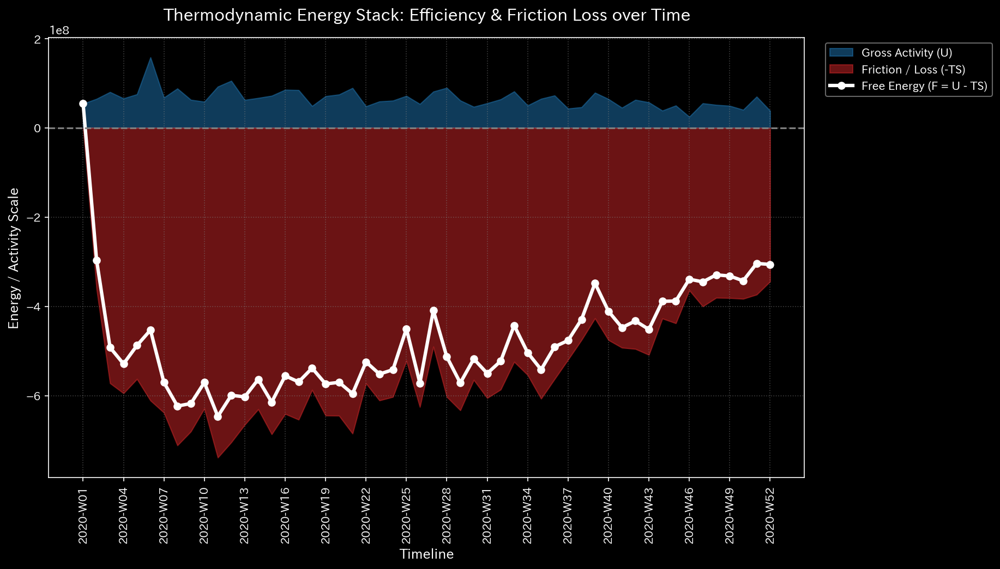
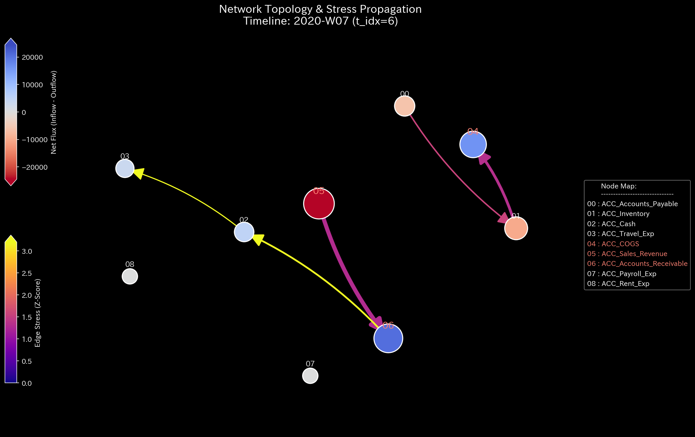
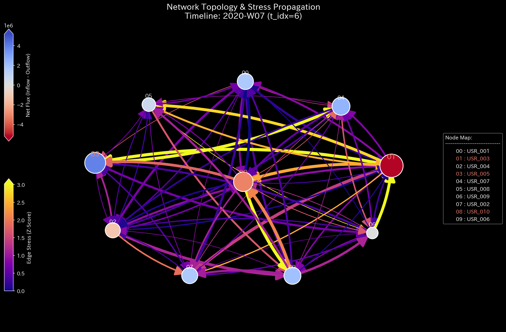

# 🩺 株式市場 ディープダイブ分析レポート（ユーザー/ネットワーク視点）

> [!NOTE]
> **前提条件に関する免責事項 (Proof of Concept)**
> 本レポートで分析されるデータは実世界の企業のものではありません。検証を目的として、**特定の病理学的状態や異常を意図的に再現するために設計されたダミーデータ生成スクリプト**から派生したものです。本分析の目的は、人為的に構築された異常な構造を TLU がどれほど正確に検知・分析できるかを実証することです。

> [!TIP]
> **このサンプルのグラフの生成方法**
> スペース節約のため、このサンプルに関する数千の3Dプロットおよび分析CSVは同梱されていません。リポジトリのルートから以下のコマンドを実行することで、ローカルで再現可能です：
> ```bash
> bash bin/batch_processing.sh --target_env "samples/Sample_7_Market_Users_Weekly"
> bash bin/batch_visualize_graphs.sh --target_env "samples/Sample_7_Market_Users_Weekly"
> ```

**対象データ:** `Sample_7_Market_Users_Weekly`

## 1. エグゼクティブ・サマリー
市場システム全体は稼働し続けていますが、特定のアクター（ユーザー）間で完全に閉じた「共謀ネットワーク（馴れ合い取引のシンジケート）」が確立されています。彼らは自分たちの間で超高速の自動取引プログラムを用いた資金のピンポンゲームを実行しており、市場の流動性を局所的に独占し、浪費しています。

## 2. 主要な検知結果（マクロ・ミクロ分析）
* **診断:** HIGH: 構造的な閉ループ（共謀 / シンジケートの形成）
* **深刻度:** CRITICAL (致命的)
* **物理的証拠:** 
  * **[マクロ分析]** 最大スペクトル半径が限界値の `1.000` に達しています。特定のユーザー（`USR_002`, `USR_003`）を熱源として指定すると、相対的自由エネルギー比率は `-13.70` へと劇的に悪化（資金の浪費）します。
* **財務的証拠:** ユーザー間（売り手 → 買い手）ネットワークの残高推移は、これらの特定ユーザー間でのみ数億ドル規模の巨大な取引ボリュームを明らかにしていますが、最終的な「純資産の変動」は実質的にゼロに保たれています。

* **【🟢 正常系（Sample 0）のベースライン】**

* **【🔴 本サンプルの異常状態】**

* **💡 グラフの読み方（マクロ）:** 
  * **🟢 正常系（Sample 0）:** 赤色の線（スペクトル半径）は低い位置（`0.0`付近）で完全に安定しています。
  * **🔴 本サンプルの異常:** スペクトル半径が `1.0` の異常閾値に完全に張り付いています。これは、シンジケートが共謀して自分たちの間だけで資金を完璧に回し続けている（無限ループ）ことを視覚的に証明しています。

* **【🟢 正常系（Sample 0）のベースライン】**

* **【🔴 本サンプルの異常状態】**


## 3. ビジネスへの翻訳とアクション・プラン
特定のユーザーグループによる「共謀取引（シンジケート）」の数学的証明が確立されました。彼らは特定の株式を隠れ蓑として使用していましたが、取引対象ではなく「直接的なユーザー間の資金フロー」を追跡することで、単に自分たちの間で資金をリサイクルしているだけの詐欺的グループであることが特定されました。

**【アクション・プラン】**
取引所システム全体を停止する必要はありません。直ちに違反ユーザー（`USR_002`, `USR_003`）の証券口座をピンポイントで特定して凍結し、コンプライアンス部門によるマネーロンダリングまたは相場操縦の調査を開始してください。

## 4. 🔬 多次元ディープダイブ分析
* **取引の異常な加速（運動学状態）:** 
  極端なZ-Score（局所的なスパイク）を記録したユーザーは、極めて高い「加速度」と低い「粘性（摩擦）」を示しています。これは、彼らがパンプ・アンド・ダンプ（風説の流布と高値での売り抜け）スキームの「扇動者」として機能し、自動取引プログラムを介して突然かつ激しい市場介入を実行したことを示唆しています。

* **構造的な孤立（剛性）:** 
  特定のユーザーグループが、他の部分から完全に孤立した「硬直したブロック構造」を形成しています。これは、他の一般投資家からの介入を拒絶し、自分たちのシンジケート内だけで閉じた取引を循環させる「人工的な資本統制」の証拠です。

* **【🟢 正常系（Sample 0）のベースライン】**

* **【🔴 本サンプルの異常状態】**


* **人工的な同期（位相ドリフト）:** 
  理論的には独立した別々の口座であるにもかかわらず、彼らの取引タイミング（位相ドリフト）は完全に `0.0` （ズレなし）に同期しています。これは、これらの口座が背後で全く同じ実体によって操作されているか、すべての口座が同一の自動取引アルゴリズムによって中央制御されていることの物理的証明です。

* **システムの急所（脆弱性）:** 
  感度分析（Sensitivity Matrix）は、この詐欺的ネットワークの要石（急所）が「コアユーザーの証券口座」であることを明確に特定しています。市場全体に介入するのではなく、これらの特定のユーザー口座を外科的に標的にして凍結することで、一般市場への悪影響をゼロに抑えたまま、この詐欺的ループを完全に断ち切ることができます。
