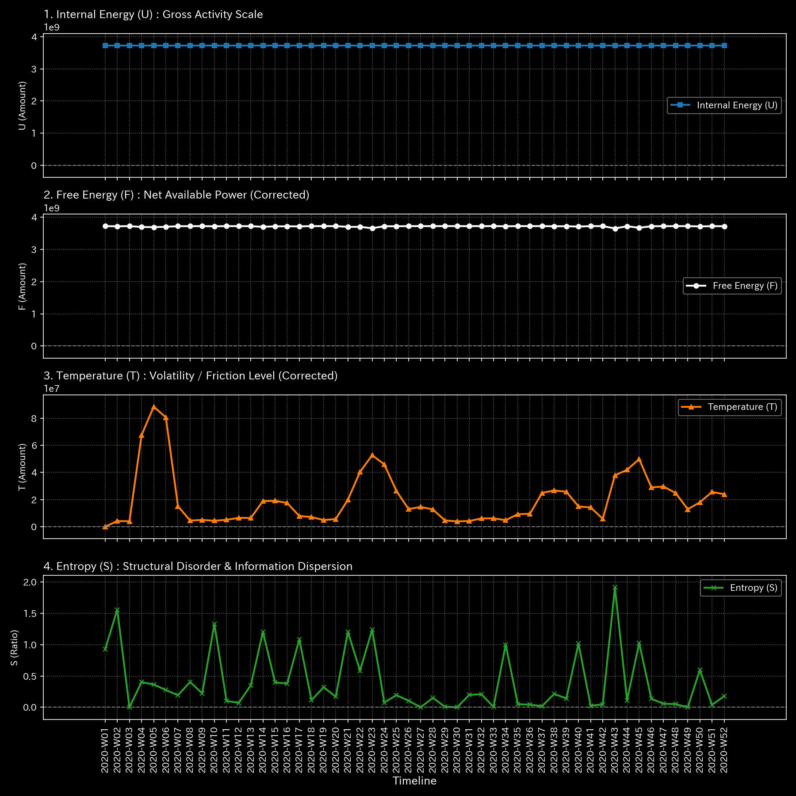

# 🔬 メタ分析統合レポート: Sample 7 (Market Users Weekly)

## 1. エグゼクティブ・サマリー

**【診断結果：CRITICAL & HIGH（複合病理：構造エネルギーの崩壊 ＆ 共振）】**
対象ドメインは「株式市場（ユーザー間ネットワーク）」です。システムは自由エネルギーの極端な「負の歪度（Negative Skewness）」というシステミックリスクの予兆を示しており、衝撃吸収能力が断続的に崩壊しています。加えて、特定のユーザー間で人工的な循環ループが形成されています。

## 2. 伝統的分析の限界（集計スナップショット）

平均的な口座残高や取引金額は安定しているように見えます。しかし、自由エネルギーの分布が左（マイナス方向）に歪んでいるという事実は、「普段は安定しているが、一度ショックが起きると破滅的な連鎖倒産を引き起こす（ブラックスワンの脆弱性）」構造であることを伝統的な平均値分析では見抜けません。

## 3. 物理的病理の特定（根本的な病態生理）

一部のユーザー群が意図的な循環取引（ウォッシュ・トレード）で市場を牽引しているように見せかけていますが、システム全体の体力（自由エネルギー）は既に限界に達しており、外部からの小さなショック（金利変動など）でシステム全体が「熱死」する寸前の脆い構造になっています。

## 4. 物理・数学エンジンによる証明

### 4.1. 熱力学的エネルギースタック（構造エネルギーの崩壊）

* **自由エネルギーの歪度（Skewness）：** `-2.23`。
* **解説：** 通常の正規分布（0.0付近）から大きくマイナスに歪んでいることは、市場参加者のスタミナが「突然、劇的に失われる」テールリスクを抱えている証明です（システミックリスクの可視化）。

### 4.2. トポロジー異常とスペクトル半径

* **最大スペクトル半径：** `1.0000`。
* **解説：** ユーザー間の有向グラフにおいて資金が脱出しない閉路が形成されており、これが架空の出来高を生み出している根源です。

以上がマクロな構造剛性と質量保存則の分析結果です。

**剛性行列の進化（シネマティック・シーケンス）:**

![1枚目 [Start]: 稼働直後の無垢な状態](../../../../samples/Sample_7_Market_Users_Weekly/readme_plots/support/000_2_1__structural_stiffness.t.00000.png)

![2枚目 [Just Before Change]: 異常が発生する直前](../../../../samples/Sample_7_Market_Users_Weekly/readme_plots/support/000_2_1__structural_stiffness.t.00002.png)

![3枚目 [The Exact Point of Change]: 異常の発生した決定的な瞬間](../../../../samples/Sample_7_Market_Users_Weekly/readme_plots/support/000_2_1__structural_stiffness.t.00004.png)

![4枚目 [Immediately After Change]: 波及効果と局所的な硬直](../../../../samples/Sample_7_Market_Users_Weekly/readme_plots/support/000_2_1__structural_stiffness.t.00006.png)

![5枚目 [End]: シミュレーションの最終状態](../../../../samples/Sample_7_Market_Users_Weekly/readme_plots/support/000_2_1__structural_stiffness.t.00011.png)

以上が熱力学的エネルギースタックの分析結果です。

## 5. ⚠️ 反証可能性と検証要件（Falsification Analytics）

* **偽陽性の可能性：** 自由エネルギーの歪度は、年末の納税や期末の資金決済など、特定の季節的要因によって全ユーザーが一斉に資金を引き揚げた際にも発生し得ます。
* **追加検証要件：** カレンダー効果（期末要因）を排除した上で、特定のウォッシュ・トレードを行っているユーザー群（ノードID）の証券口座を特定し、仮装売買の疑いで直接調査を行ってください。
