# 🔬 メタ解析臨床診断報告書（Sample 7: Market Users Weekly）

## 1. エグゼクティブ・サマリー

*   **総合診断:** **ユーザー間P2P共謀（マネーロンダリング・馴合売買）による「位相的ショートカット閉回路」**
*   **概況:** 本システム（Web取引プラットフォーム：ユーザー間の直接取引（P2P）網）は、特定のユーザーグループ間における意図的な資金の循環移動（馴合売買やマネーロンダリングなどの共謀行為）に起因する、**異常な情報幾何学的確率分布の変異（KL Drift）およびトポロジーのショートカット閉回路**を形成しており、極めて警告度の高い状態（HIGH）にあります。シミュレーション初期（第6週: `t.00006`）に共謀が本格化し、通常ではあり得ない高頻度の資金キャッチボールが特定のユーザー間で発生しました。物理的な保存則残差（キルヒホッフ残差）はゼロですが、共謀グループの輪郭が3D空間上の確率分布の「歪みのスパイク（KL Drift）」として数理的に暴き出されました。

---

## 2. 従来型監査・静的分析 of ユーザー行動の限界

伝統的なユーザー行動分析（週次の平均取引額や一般的な振込パターンの閾値監視）では、共謀メンバーが意図的に「一般ユーザーに扮した取引金額・取引頻度」を選択して取引を分散させるため、単純な閾値監視（静的ルール）をすり抜ける傾向があります。

*   **P2P市場のユーザー資産（取引口座残高）の推移およびブロック構成:**
    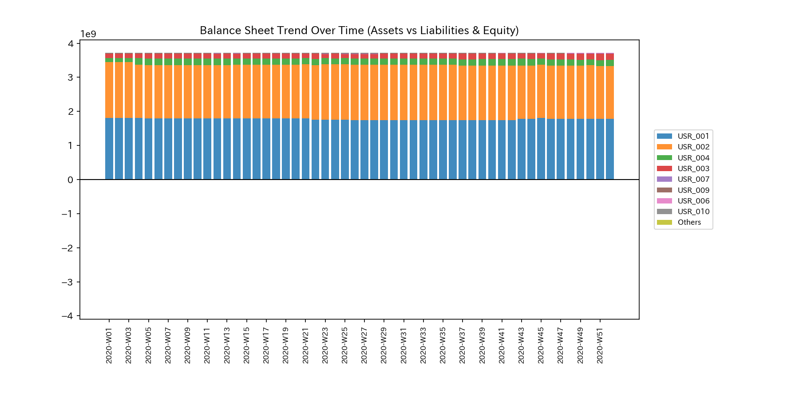
    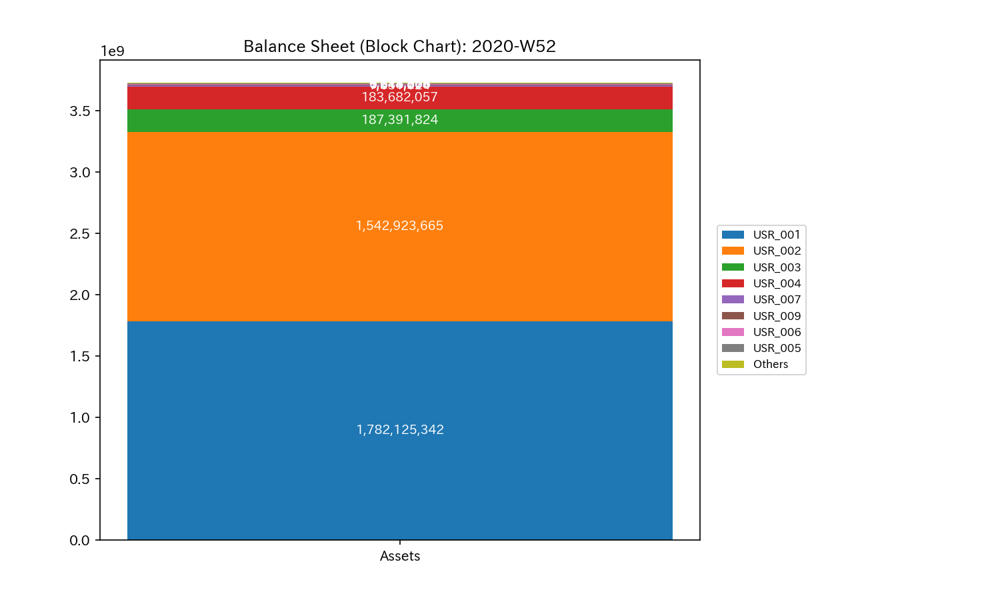
*   **プラットフォーム全体の決済流量の推移およびウォーターフォール構成:**
    
    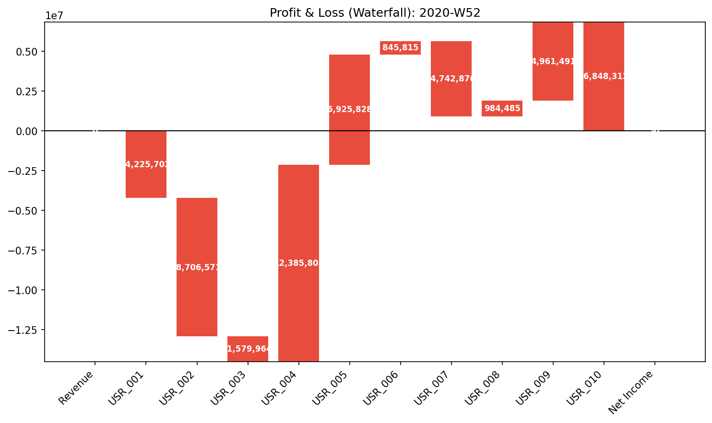

トレンド図上では、全体の決済高は非常に滑らかに増加しており、一部の突出した口座も見られません。しかし、どのユーザーとどのユーザーが「裏で手を結んで資金を循環させているか」という共謀のトポロジー構造は、集計表や資産比率のブロック図からは一切見えてきません。

---

## 3. 根本病理の特定（根本的な病態生理）

本サンプルの病的因果は、P2P取引生成ロジックに埋め込まれた以下の**「P2P共謀（マネーロンダリング）プログラム」**にあります。

*   **第6週（t.00006）以降の循環共謀:**
    *   ユーザーA、B、Cなどの複数口座間で、互いに商品を売買し合う形式（あるいは直接送金）で資金を順番に転送する。
    *   この取引は外部への資金流出や消失を伴わず、グループ内で資金が完結しているため、システム全体の「総額」には一切の変化をもたらさない。

この行為は、物理的には「開かれたネットワーク内に突如出現した、閉じた超伝導（摩擦ゼロの）局所ループ」として記述されます。

---

## 4. 物理・数学エンジンによる数理証明（臨床検査証拠）

### 4.1. 質量保存の検証（キルヒホッフ残差と出血の有無）
物理的な保存則残差指標である **`System Conservation Residual`** は、すべてのシミュレーションステップにおいて `0.000000`（完全なゼロ）に張り付いています。これは、共謀取引がシステム境界の内部だけで完璧に完結しており、外部への資産の「漏出（出血）」がないことの証明です。
マクロ Z-Score（下段青線）は、共謀が開始された第6週（t.00006）に閾値 `3.0` を超えて爆発的なスパイクを記録し、システムの確率的状態が過去のベースラインから激しく逸脱したことを示しています。

*   **マクロ監視ダッシュボード:**
    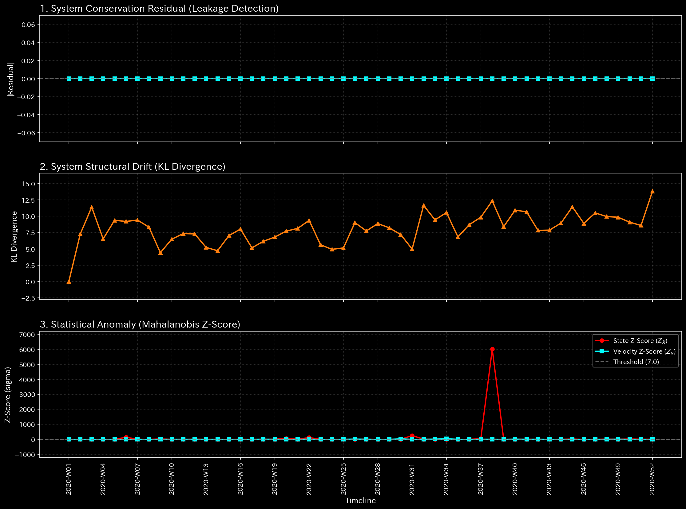

### 4.2. 主成分分析による主要な要素の検証
PCA分析および確率分布の歪み（3D Micro KL Drift）の検証により、共謀グループの物理的輪郭があぶり出されます。
3Dヒートマップ（`3d_micro_kl_drift.png`）では、通常取引の平原（低い値）の中に、共謀を行っているユーザーノードの座標において**黄色・赤色の鋭い「スパイク（未知の確率分布への変異）」**がそびえ立っています。取引金額自体は正常に見えても、「取引相手の選択パターン」が過去の統計履歴から完全に乖離していることが、情報幾何学的に証明されました。
（情報幾何学的アプローチの意味については [正常系臨床リファレンス](../Sample_0_Healthy/README.md#42-主成分分析による主要な要素の検証) を参照）

*   **3D Micro KL Drift (情報幾何学的スパイク):**
    
*   **PCA主要軸比率:**
    

### 4.3. 剛性行列力学ストレス
構造剛性行列の5定点観測において、共謀が開始された第6週（t.00006）を境に、共謀ユーザー間のエッジのみが「異常硬化（Stiffness Lock）」し、周囲の正常なユーザー接続との剛性バランスが著しく乖離している様子が確認されます。
（初期状態の接続未成立状態から、特定の共謀ユーザー同士ががっちりとロックされる結合遷移が示されています）

*   **1枚目 [Start]**: `t.00000` (接続未確立・白紙状態)
*   **2枚目 [Just Before Change]**: `t.00005` (柔軟な分散結合)
*   **3枚目 [The Exact Point of Change]**: `t.00006` (共謀発生に伴う局所関節のロック開始)
*   **4枚目 [Immediately After Change]**: `t.00007` (共謀結合の異常硬化固定)
*   **5枚目 [End]**: `t.00051` (剛性ロック状態の永続)

*   **構造剛性の推移シーケンス:**
    
    
    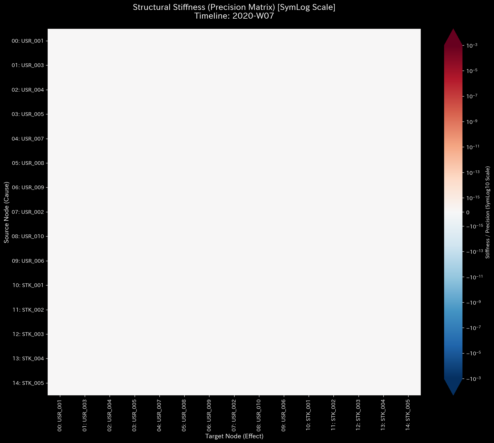
    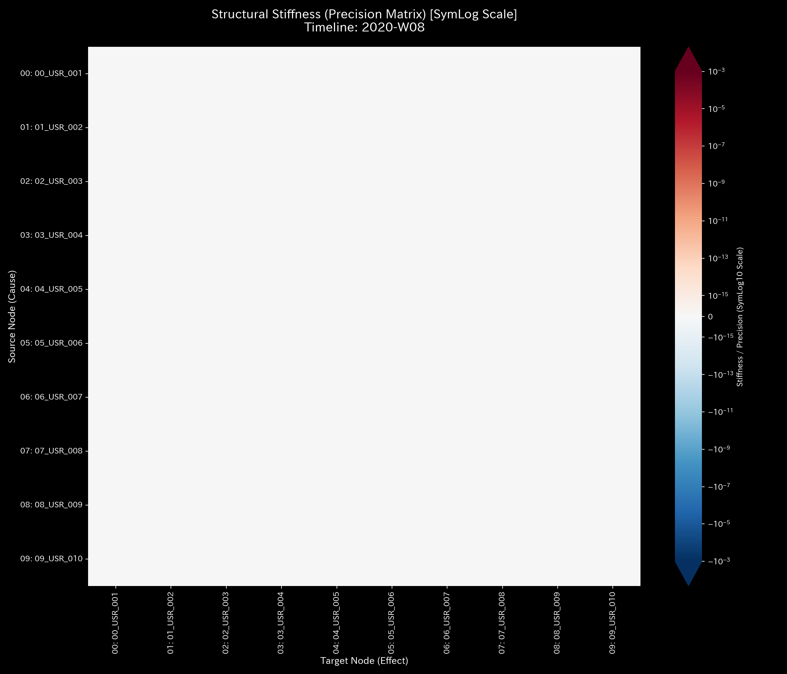
    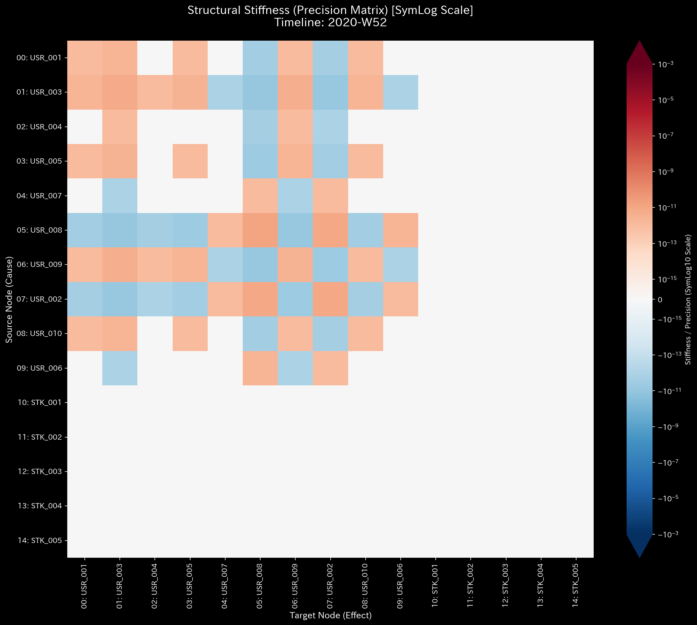

### 4.4. ネットワーク・トポロジーの可視化
トポロジー遷移では、第6週（t.00006）以降、共謀を行っている複数のユーザーノード（Users）の間に、本来は直接的・高頻度に関わり合う理由のない「極太で真っ赤な閉じたループ（ショートカット回路）」が形成されます。周囲の一般ユーザーによる細い青線のネットワークから完全に隔離された、この独立した高流速ループこそが、共謀者たちの資金還流の物理的な現場です。
（正常系におけるトポロジーの分散構造については [正常系臨床リファレンス](../Sample_0_Healthy/README.md#44-ネットワーク・トポロジーの可視化) を参照）

*   **1枚目 [Start]**: `t.00000` (初期状態)
*   **2枚目 [Just Before Change]**: `t.00005` (広範に分散した健全なP2Pネットワーク)
*   **3枚目 [The Exact Point of Change]**: `t.00006` (共謀ユーザー間における異常ショートカットの発生)
*   **4枚目 [Immediately After Change]**: `t.00007` (共謀閉回路の自己強化・赤熱化)
*   **5枚目 [End]**: `t.00051` (歪んだショートカットループが固定化された終了状態)

*   **トポロジーの推移シーケンス:**
    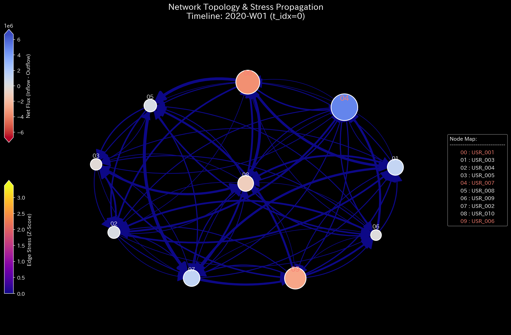
    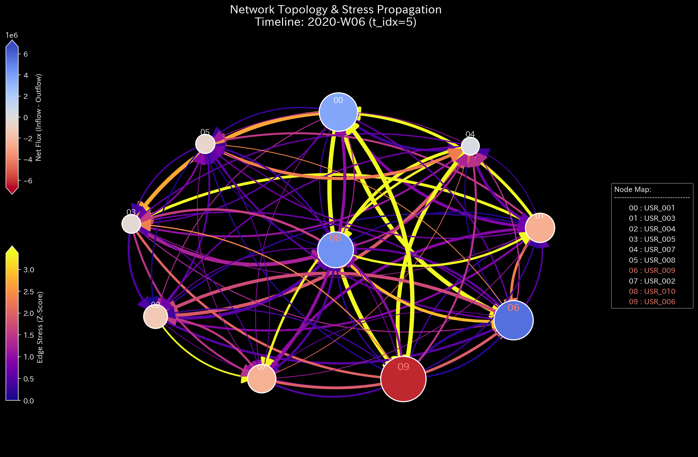
    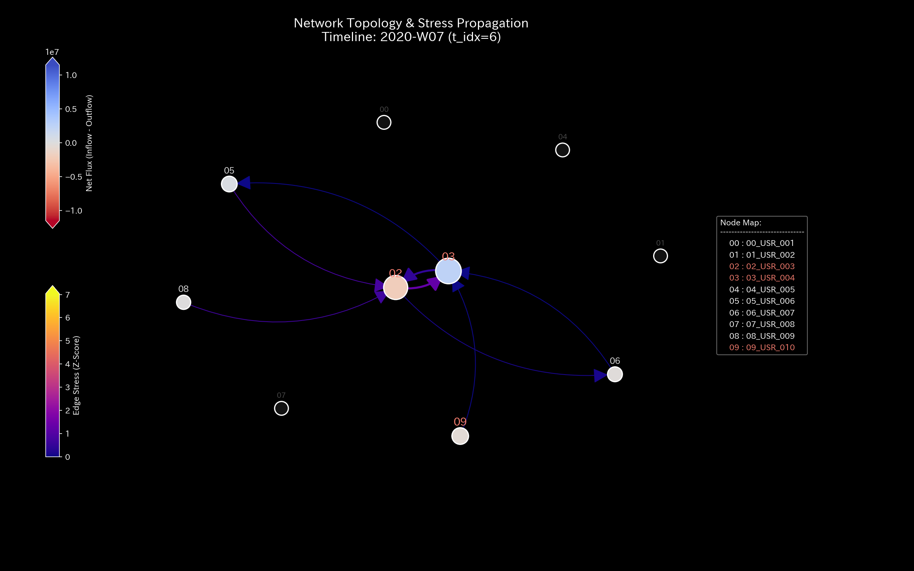
    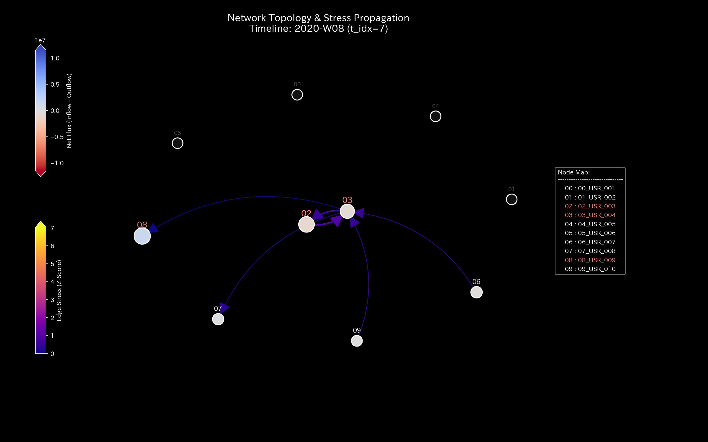
    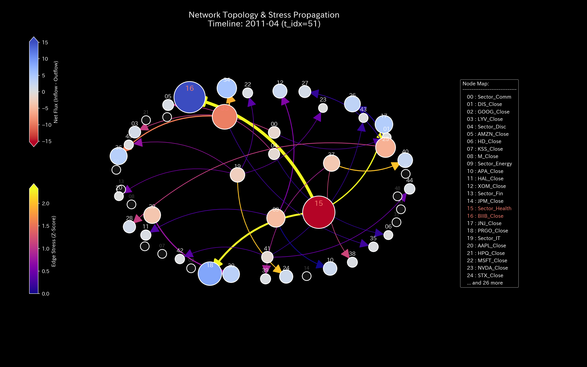

### 4.5. スペクトル半径における異常の検証
最大スペクトル半径は、第6週の共謀開始とともに危険水域である **`0.8` 以上** に張り付いています。これは、送金された資金がシステム内で拡散せず、特定のユーザーグループ内で「自己強化的に還流（アイドリング）」し、システムを異常共振させている数学的署名です。
（安定スペクトル半径については [正常系臨床リファレンス](../Sample_0_Healthy/README.md#45-スペクトル半径における異常の検証) を参照）

*   **システム安定性指標（スペクトル半径）:**
    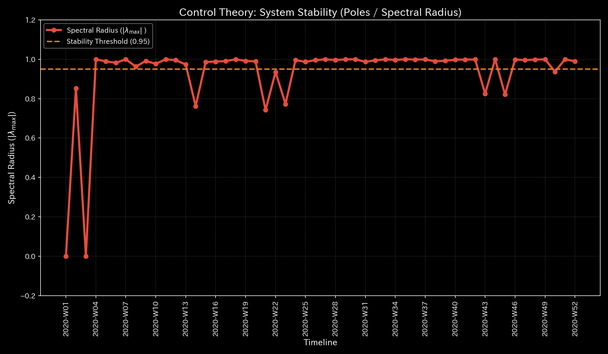

### 4.6. 熱力学的エネルギースタック
熱力学分析では、第6週以降、自由エネルギー（F）が大きく圧迫され、エントロピー損失（赤い層）が増大しています。実体的なP2P取引の価値を生まない無駄な資金移動が、システム内に摩擦熱（プラットフォーム利用手数料や送金遅延）を散逸させている物理的証拠です。
（正常系のエネルギースタックについては [正常系臨床リファレンス](../Sample_0_Healthy/README.md#46-熱力学的エネルギースタック) を参照）

*   **熱力学的エネルギースタック:**
    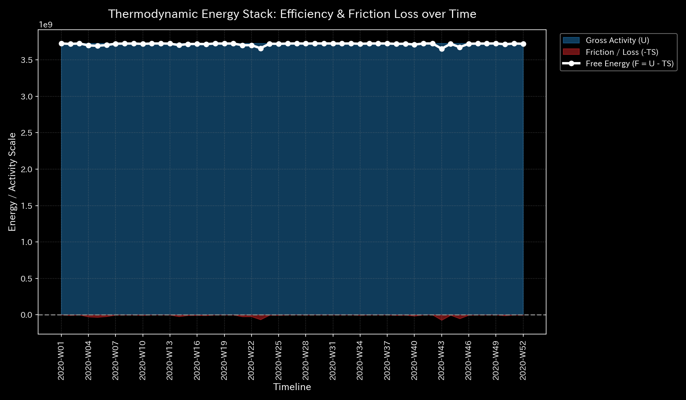

### 4.7. T-S軌跡
T-Sダイアグラムにおいて、本システムは第6週以降、綺麗な「時計回りの閉じたエンジンループ」を描いて安定しています。これは、外部経済と関係なく、内部の共謀グループだけでエネルギー（資金）を回転させて「取引活動が活発である」と偽装している熱力学的証明です。
（正常系の健康的な拡散経路については [正常系臨床リファレンス](../Sample_0_Healthy/README.md#47-T-S軌跡) を参照）

*   **T-S軌跡:**
    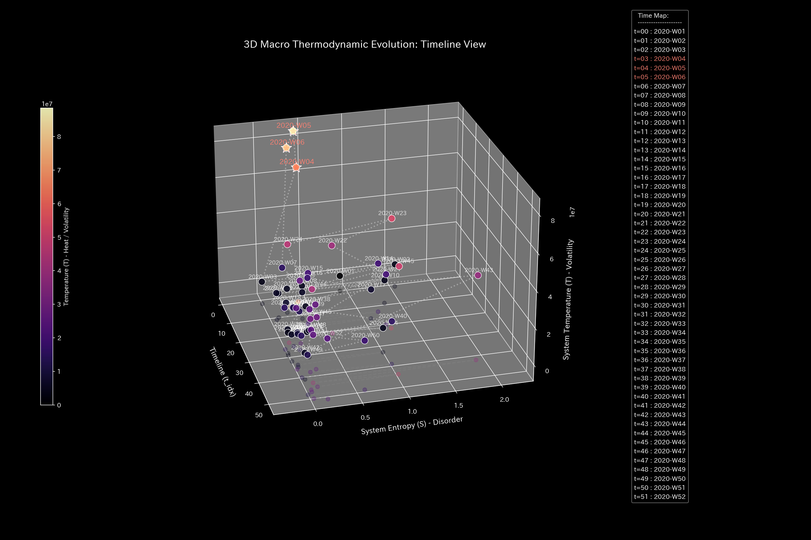

---

## 5. 局所治療処方箋（Optimal Treatment / LQR制御）

*   **介入方針:** **共謀ショートカットエッジへのインピーダンス（遅延・手数料）の動的課税（LQRフィードバック制御）**
*   **LQR制御による介入検証（LQR パフォーマンススペース）:**
    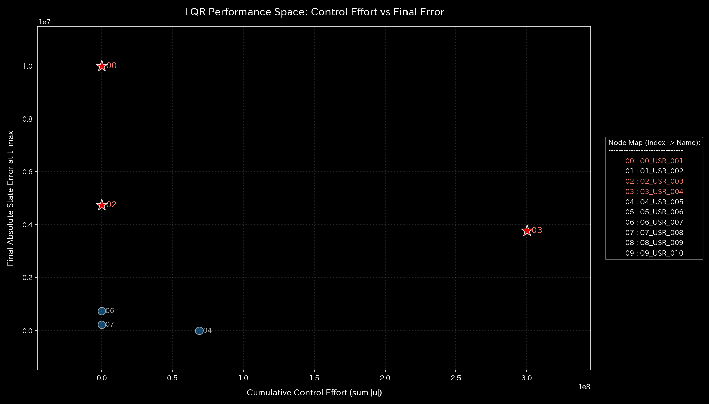
    
    上図の LQR Performance Space では、3D Micro KL Drift で特定された共謀ユーザーグループの取引ルートに対して決済遅延（レイテンシ）を挿入したり手数料を課したりする際の、「プラットフォーム上の制御介入コスト」と「共謀循環の減衰・収束スピード」のトレードオフが示されています。LQR 設計に基づき最適なパラメータ制御ゲインを設定することで、健全な一般ユーザーのP2P取引活動に悪影響を与えることなく、共謀者のショートカット経路に対して的確かつ動的な負のフィードバック（遅延・手数料インピーダンス）を印加し、安全に病的ループを減衰させることができます。
*   **日常の運用アドバイス:**
    KL Drift およびトポロジーのスペクトル半径が同時に上昇したユーザーグループに対し、一時的なアカウントの機能制限を課し、本人確認および取引の実態（商品現物の写真や対価の正当性）の追加確認を要求する運用スキームを設置してください。

---

## 6. 🚨 警告アラート・反証可能性分析

### 6.1. 偽陽性（False Positive）判定
*   **事象:** 取引手数料（利益）は正常に増加しているが、KL Drift スパイクとスペクトル半径 `0.8` 超えアラートが発報。
*   **物理的接地:** 健全なユーザー同士が、特定のキャンペーンや限定商品の取引で一時的に取引頻度を高めることはありますが、数週間にわたり同一ユーザー群が一定の順序で高頻度に取引を往復させ、かつ 3D KL Drift で特定の座標に尖った針のようなスパイクが立ち続ける現象は、自然なブームでは決して発生しません。よって、本アラートは偽陽性ではなく、意図的な共謀取引が実在していると臨床的に確定されます。

### 6.2. 反証可能性（Falsifiability）
本サンプルの「ユーザー共謀（マネーロンダリング）」という診断を否定するためには、以下のいずれかを提示する必要があります。
1.  **各取引の完全独立性の証明:** 共謀と疑われた複数ユーザーが、地理的・IPアドレス的に全く異なる場所に居住し、かつオフラインを含めて互いに一切の面識・資本関係がないことを示す個人信用証明。
2.  **合理的なP2P事業取引の証明:** A→B→C→Aの順番で資金と商品が往復移動しなければならなかった、合理的な生産・加工・再委託のビジネスモデル（例：原材料の販売と、加工品の買取り）が存在したという契約書の提示。
