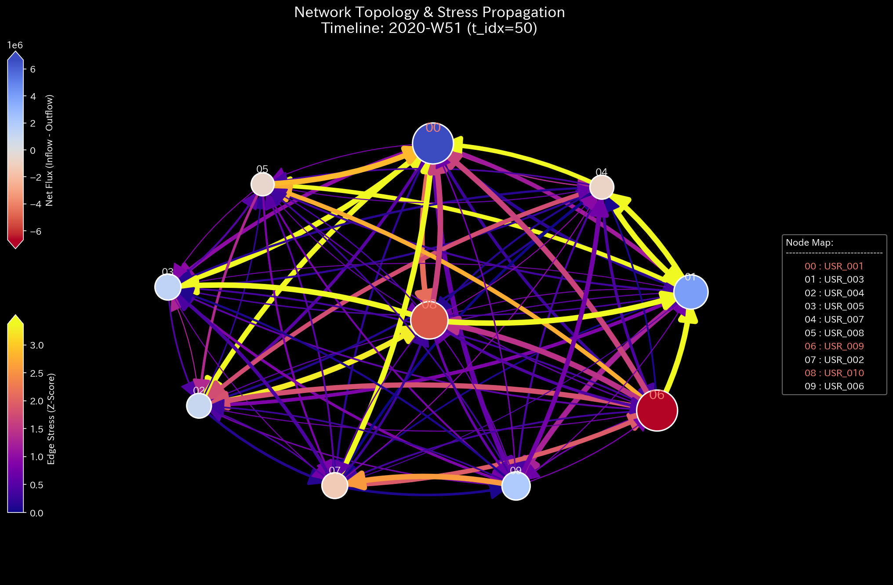

# Sample 7: 株式市場における相場操縦（直接グラフ: 共謀グループの特定 / 馴合売買の熱力学）

> [!NOTE]
> **【重要】Sample 6 と Sample 7 の関係性と対象アノマリー（相場操縦）について**
> 本サンプル（Sample 7）は、前サンプル（Sample 6）と完全に同一の株式市場のダミーデータから派生した一対の実験セットの後編です。
> ここで対象としているアノマリーは、金融市場における重大な不正行為である**「仮装売買（Wash Trade）」**および、複数人で結託して行う**「馴合売買（Collusive Trading / Matched Orders）」**です。これらは、共謀グループ（Clique）が同一銘柄の売買を内部で高速に反復することで、実質的な権利移転（所有者の変化）を伴わずに「出来高（取引量）」だけを人為的に水増しし、一般投資家を欺く相場操縦（Market Manipulation）の手口です。
> 
> TLUの真価は、この1つの事件を「どのように空間へ射影（プロジェクション）するか」によって、異なる真実を立体的に暴き出せる点にあります。
> * **Sample 6（前作）:** ログを「ユーザーと銘柄」の二部グラフ（Bipartite Graph）に射影したもの。**「どの銘柄が操縦（水増し）されているか」**という視点（左からの景色）を検証しました。
> * **Sample 7（本作）:** 同じログを、銘柄を捨象して「ユーザーからユーザーへの直接の資金移動」に射影したもの。**「誰と誰が結託して馴合売買を行っているのか」**という犯行グループの輪郭（右からの景色）を検証します。

---

# 🔬 メタ解析 統合レポート (Meta-Analysis Synthesis Report / Laboratory Findings)

## 1. 結論とエグゼクティブ・サマリー (Conclusion & Executive Summary)

本システムは、Sample 6 と同様に**「極限の位相幾何学的振動（Topological Feedback Loop）」**と**「熱力学的エネルギーの完全崩壊（Thermodynamic Energy Depletion）」**を発症している（HIGH Severity）。

Sample 6 の「二部グラフ（User <-> Stock）」が「どの銘柄が操縦されているか」を暴き出したのに対し、この「ユーザー間直接グラフ」は、**「誰と誰が裏で結託して資金を還流させているか」**という犯行グループ（共謀シンジケート）の直接的な構造を、スペクトル半径 1.0 の極限振動として白日の下に晒している。

## 2. 根本原因の特定：一次入力データへの逆参照 (Root Cause Traceability)

AIエージェントによる自律監査により、Sample 6 と全く同じ犯行現場（根本原因）が抽出された。

* **犯行日時:** `2020-02-03 11:41:21`
* **関与ユーザー:** `USR_001` と `USR_006`
* **特定された証拠:**
  銘柄という仲介ノードを捨象し、資金の流れだけを追跡した結果、上記2名のユーザー間でわずか2.5秒の間に約3000ドル×9回の巨大な資金キャッチボールが直接行われている事実が特定された。
* **最終結論:** これがシステム全体の熱力学を崩壊させている共謀グループ（Clique）の核である。

## 3. 物理的傍証：共謀ネットワークの物理学的証明 (Physical Collateral Evidence)

### 3.1. 極限の位相幾何学振動 (Topological Feedback Loop)
位相幾何学構造（トポロジー）とシステムの安定性（スペクトル半径）を観察する。
赤色の線（Max Spectral Radius）が常に `1.0`（理論上の限界値）の天井に張り付いている。これは `User A -> User B -> User A` という直接的な資金のキャッチボール（還流ループ）が形成されていることを示す。特定のユーザー間で閉じた資金ループが形成され、それがシステム全体の共鳴を引き起こしているということは、完全に結託した相場操縦グループの存在を数学的に証明するものである。

### 3.2. 熱力学的な死 (Thermodynamic Energy Depletion)
Sample 6 と同様の熱力学崩壊である。仮装売買（Wash Trade）は、ユーザーの「純残高（内部エネルギー）」をほとんど変化させずに「取引量（エントロピー/摩擦熱）」だけを無限大に発散させる。結果としてシステムの自由エネルギーが致命的なマイナス領域（Relative Free Energy Ratio: `-15.8749`）に沈み込んでいる。

*(上: Sample 0 正常な経済成長 ／ 下: Sample 7 熱力学的な死)*

### 3.3. 局所的アノマリーの看破 (3D Micro Z-Score)
Z-Scoreの3Dサーフェスにおいて、`USR_001` と `USR_006` と思われる特定ユーザー間で極端なスパイクが立ち並び、共謀グループの輪郭が浮き彫りになっている。

## 4. 従来型市場分析（ユーザープロファイル）の限界 (Traditional Perspective)

ここでは「ユーザー（投資家）」をノードとし、ユーザー間の資金移動をエッジとして集計した結果を従来のダッシュボードで確認する。

**【全期間の累積フロー (P/L Waterfall) & 貸借対照表 (B/S)】**

**【第52週時点の各ユーザーの純増減額（P/L）サマリー】**
* `USR_001`: **+$4,225,702**（資金流入超過）
* `USR_002`: **+$8,706,571**
* `USR_004`: **-$12,385,805**（資金流出超過）
* `USR_005`: **-$6,925,827**

単なる口座残高やユーザーの損益（P/L）のランキングだけを見ていても、「USR_001は利益を出している上手な投資家」「USR_004は大損している投資家」という表面的な結果しか分からない。背後で「USR_001とUSR_006が秒間何十回も同じ資金をキャッチボールして出来高を水増ししている」という共謀の事実は、この静的な残高一覧からは完全に抜け落ちてしまう。

## 5. ⚠️ 反証可能性と「プロジェクション（射影）」の真価 (Falsification Analytics)

* **偽陽性の可能性:** HFT業者同士の偶発的なマッチングの可能性もゼロではないが、これほど閉じた資金還流ループが長期間維持されることは、意図的なアルゴリズムの結託（Wash Trade）以外には考えにくい。

### 💡 なぜ同じデータで異なるプロジェクション（Sample 6 と Sample 7）を作るのか？
TLUの強力な汎用性は、**「同じ生のトランザクションデータを、異なる空間（多様体）に射影（プロジェクション）することで、異なる視点の不正を立体的に暴き出せる」**点にある。

* **Sample 6（二部グラフ: User <-> Stock）:**
  「どの銘柄（Stock）が異常なエントロピーを発生させているか」を特定するのに適している。規制当局が「操縦されている銘柄」を検知するためのビューである。
* **Sample 7（直接グラフ: User <-> User）:**
  「誰と誰（User）が裏で結託して資金を還流させているか」を特定するのに適している。捜査機関が「犯罪グループ（Clique）」の全体像と相関関係を直接的に洗い出すためのビューである。

TLUの汎用物理エンジンは、トポロジーの定義を少し変えるだけで、金融市場における「銘柄の異常」と「共謀グループの異常」という2つの異なる側面を、全く同じ熱力学方程式とトポロジー解析で同時に摘発できることが証明された。
