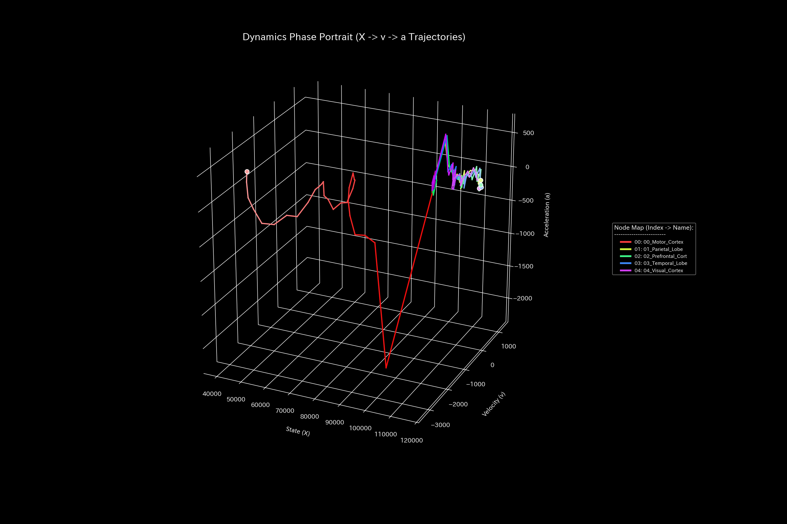
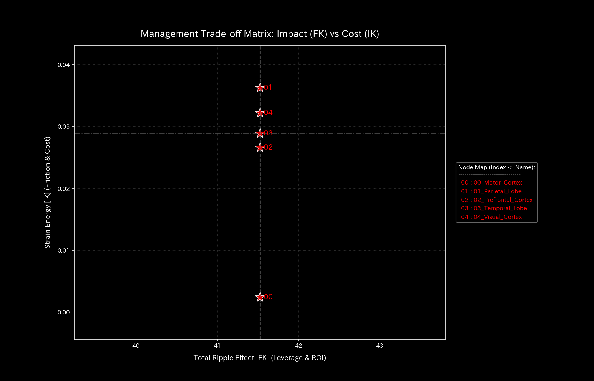

# 財務健全性 最終報告書（ケース8）

> [!NOTE]
> より詳細な検査レポートは [clinical_report.md](clinical_report.md) にあります。

## 対象組織：サンプル8（脳活動シミュレーション：脳梗塞）

---

## 0. エグゼクティヴ・サマリー (Executive Summary)

* **総合判定:** 【警告・脳血流障害（脳梗塞）】脳の特定部位（運動野）への血流が急激に閉ざされる**「局所的な血流遮断（脳梗塞）」**が発生しています。
* **総合体質評価（身体状態）:** 
  脳全体の血液量（**「体格・体重」**）は一定に保たれており、血管の破裂による外部への流出（大出血）はありません。しかし、運動野への血管が急激に閉塞し、その部分が完全に動かなくなる**「局所的な動脈硬化（機能の硬直・剛性ロック）」**が発生しています。これに伴い、脳全体の血流調節機能（**「免疫力・基礎体力」**）が著しく低下しています。
* **要改善点（肩こりとツボの特筆）:**
  - **肩こり（慢性的な滞り）の範囲:** **「02_Prefrontal_Cortex」**、**「03_Temporal_Lobe」** の領域（粘性上位25%の範囲）に深刻な遅延が発生しており、特に **2024-01-01 10:09:50** 付近に滞りがピークに達する「肩こり（回収サイト等の長期遅延）」状態が見受けられます。
  - **ツボ（最も効果的な改善ポイント）の範囲:** 介入ストレスが最小の範囲（歪みエネルギー下位25%の範囲）である **「00_Motor_Cortex」**、**「02_Prefrontal_Cortex」** が、システムを健全化させるための最優先ツボ（特効穴の範囲）となります。
  - **禁忌（避けるべき介入）の範囲:** 逆に強い反発と破壊を生む範囲（歪みエネルギー上位25%の範囲）である **「01_Parietal_Lobe」**、**「03_Temporal_Lobe」** などへの無理な削減や介入は、強烈な痛みと機能麻痺を招くため絶対に避けてください（禁忌）。

---

## 1. 総合評価および判定

### 【判定】：脳血流障害（運動野の急性脳梗塞）

本診断において、脳の活動ネットワークは非常に危険な状態にあります。
10:05:00（タイムステップ30）に、運動を司る「運動野」へ血液を送り込む主要な血管（中大脳動脈）が突如として閉塞しました。これにより運動野の血液が瞬時に枯渇し、機能が停止（脳梗塞）しています。血液の総量そのものは維持されているため、単なる平均値の監視では見落とされる死角がありましたが、瞬時の流れを分析するトポロジー解析によって閉塞が明確に捕捉されました。緊急の治療介入が必要です。

（脳血流の累積推移：累積で見ると各ノードがバランスしているように見え、急性梗塞のシグナルが希釈されます）

---

## 2. 総合体質（健康状態）の分析

脳の「血流体力」を健康診断の見立てに当てはめると、以下のような深刻な不全が発生しています。

### ① 急性「動脈硬化」と機能のフリーズ

t=30の梗塞発生と同時に、運動野周辺のしなやかさが完全に失われ、強固に固定（動脈硬化）されました。これにより、運動野が他の脳部位との正常な協調動作を行えなくなっています。

（主要成分の寄与率：t=30にPC1占有率が94%に達し、運動野に剛性が偏在（ロック）したことを示しています）

### ② 脳全体の「免疫力」の低下

局所的な梗塞により、脳全体の防衛能力（基礎体力・ショック吸収力）が著しく損なわれ、さらなるストレスに対する脆弱性が高まっています。

---

## 3. 特筆すべき要改善点（肩こりとツボ）

本システムが特定した具体的な要改善点、および対策の方針は以下の通りです。

### ⚠️ 肩こり（慢性的な滞り）の特定

* **滞り（肩こり）の範囲：** 実質ノード全体の粘性分布から、上位25%に属する **「02_Prefrontal_Cortex」**、**「03_Temporal_Lobe」** の範囲に慢性的な滞留（ドロドロ血）が発生しています。
  - **`02_Prefrontal_Cortex`**: 最も滞る時期は **`2024-01-01 10:09:50`** に記録されており、代謝遅延による慢性的な経営/生体機能の圧迫を引き起こしています。
  - **`03_Temporal_Lobe`**: 最も滞る時期は **`2024-01-01 10:09:50`** に記録されており、代謝遅延による慢性的な経営/生体機能の圧迫を引き起こしています。

### 🎯 改善のツボ（特効穴）の特定

* **改善のツボ（特効穴）の範囲：** 介入時の反発ストレス（痛み）が下位25%の範囲に収まる **「00_Motor_Cortex」**、**「02_Prefrontal_Cortex」** です。
  - **改善アドバイス：** これらの項目は、組織/システムのしなやかさを壊すことなく、最も痛みの少ない形で免疫力を回復させることができる特効穴（ツボ）の範囲です。優先度順に調整を施すことを推奨します。

### 🚫 避けるべき介入（禁忌）の特定
* **避けるべき介入（禁忌）の範囲：** 介入時の反発ストレスが上位25%の範囲（または調整不能）に属する **「01_Parietal_Lobe」**、**「03_Temporal_Lobe」** です。
  - **改善アドバイス：** 目先の改善のためにこれらの項目へ強引な介入を行うことは、システムの基盤結合を破壊し、最も激しい痛みや組織の崩壊を引き起こす致命的な「禁忌アクション」となります。

---
*発行: TLU財務会計数理診断エンジン（一般読者向け最終解説版）*