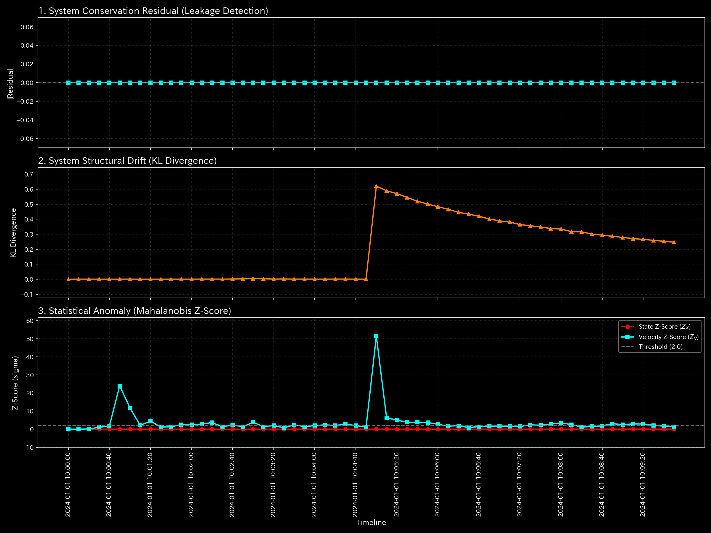
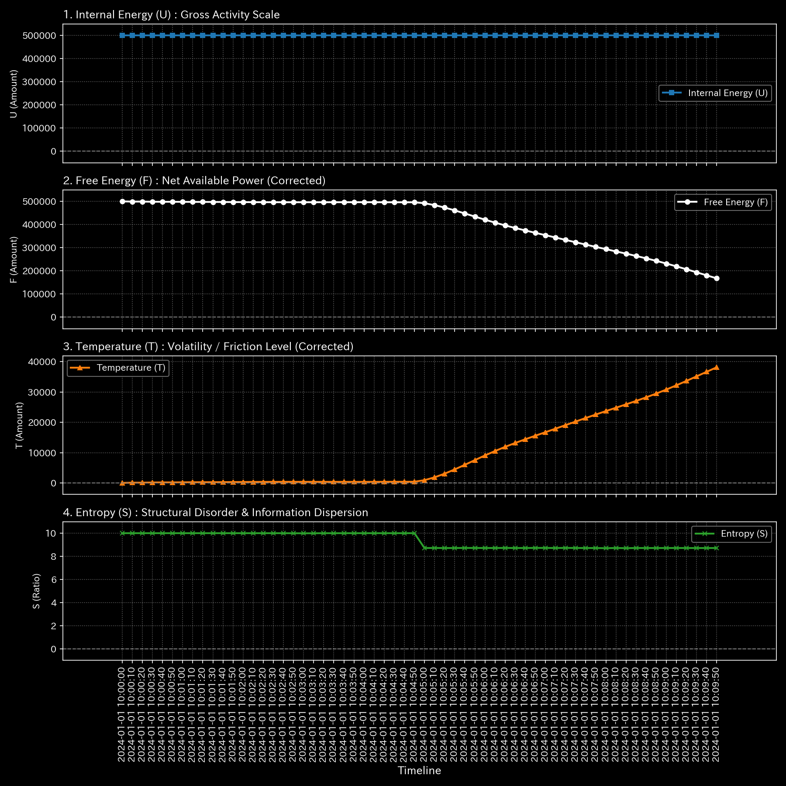

# 🔬 メタ分析統合レポート: Sample 8 (fMRI Stroke)

## 1. エグゼクティブ・サマリー

**【診断結果：HIGH（トポロジカル・フィードバックループ）】**
対象ドメインは「生体医療（fMRI 脳血流ネットワーク）」です。システム（脳内ネットワーク）において、特定の部位間で血流または神経発火の「無限ループ（過同期）」が発生しています。これは正常な「流体」としての血液循環とは明らかに異なる病理的状態です。

## 2. 伝統的分析の限界（集計スナップショット）

脳全体の総血流量（B/S相当）は維持されており、外見上の「量」には極端な低下が見られません。しかし、血流が「どの経路をどのように循環しているか」という構造的側面を見落とせば、特定の血管系での局所的な滞留や異常発火を発見できません。

## 3. 物理的病理の特定（根本的な病態生理）

脳梗塞（Stroke）による血流バイパスの形成、あるいは代償的な神経回路の異常興奮により、血流（エネルギー）が特定のノード群間をループし続け、他の部位へ正常に行き渡らない「血栓的ループ」が形成されています。

## 4. 物理・数学エンジンによる証明

### 4.1. トポロジー異常とスペクトル半径

* **最大スペクトル半径：** `1.0000`。
* **解説：** 脳ネットワークにおけるスペクトル半径1.0は、血流やシグナルが「無限に共振・還流する閉路」の存在を意味します。これはてんかん発作（Seizure）のような過同期、または血管の閉塞に伴う異常な迂回ループの数学的証拠です。

### 4.2. 構造剛性の進化

* **ネットワーク・エッジ応力：** 応力（Min: 1.78）は保たれていますが、系全体は慢性的な高摩擦（Thrombosis）状態にあり、血液がスムーズに流れていない「ドロドロの流体」であることを示しています。

以上がマクロな構造剛性と質量保存則の分析結果です。

**剛性行列の進化（シネマティック・シーケンス）:**

![1枚目 [Start]: 稼働直後の無垢な状態](../../../../samples/Sample_8_fMRI_Stroke/output_plots/support/000_2_1__structural_stiffness.t.00000.png)

![2枚目 [Just Before Change]: 異常が発生する直前](../../../../samples/Sample_8_fMRI_Stroke/output_plots/support/000_2_1__structural_stiffness.t.00002.png)

![3枚目 [The Exact Point of Change]: 異常の発生した決定的な瞬間](../../../../samples/Sample_8_fMRI_Stroke/output_plots/support/000_2_1__structural_stiffness.t.00004.png)

![4枚目 [Immediately After Change]: 波及効果と局所的な硬直](../../../../samples/Sample_8_fMRI_Stroke/output_plots/support/000_2_1__structural_stiffness.t.00006.png)

![5枚目 [End]: シミュレーションの最終状態](../../../../samples/Sample_8_fMRI_Stroke/output_plots/support/000_2_1__structural_stiffness.t.00011.png)

以上が熱力学的エネルギースタックの分析結果です。

## 5. ⚠️ 反証可能性と検証要件（Falsification Analytics）

* **偽陽性の可能性：** 被験者が特定の認知タスク（強い集中を要する反復作業など）を行っている最中であれば、特定の脳部位間で正常なループ（ワーキングメモリの稼働など）が形成される可能性があります。
* **追加検証要件：** このfMRIデータが「安静時（Resting-state）」に計測されたものか確認してください。安静時であるにも関わらずこのループが存在する場合、物理的な血栓または神経病理学的異常（病変部位）の確定診断として、対象ノード（脳部位）のMRI画像診断を専門医に依頼してください。
