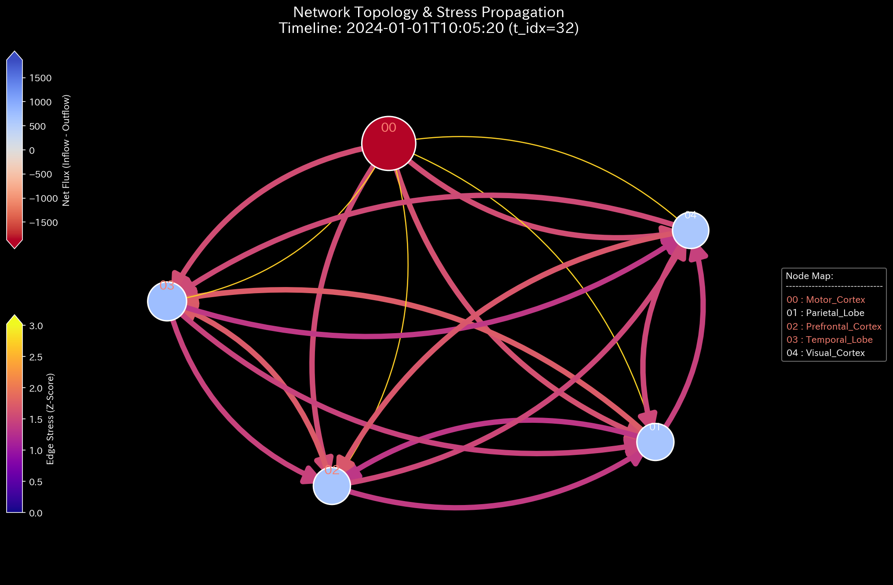

# Sample 8: 生体ネットワークへの適用（fMRI Stroke - 脳卒中/虚血の熱力学）

> [!NOTE]
> **【重要】Sample 8 と Sample 9 の関係性と対象ドメインについて**
> 本サンプル（Sample 8）と次サンプル（Sample 9）は、金融データや交通データではなく、人間の脳（fMRI）における**「BOLD信号の有効接続性（Effective Connectivity）」**をシミュレートした生体データです。
> TLUの「汎用物理エンジン」が、社会科学（金融・交通）の領域を超え、生命科学（生体ネットワークの病変）をもシームレスに診断できることを証明するためのグランドフィナーレとなるテストケースです。
> 
> * **Sample 8（本作）:** 脳ネットワークの特定の部位（運動野）への血流・信号が物理的に遮断される**「脳卒中・梗塞（Stroke / Ischemia）」**をシミュレートします。ネットワークの一部が「枯渇・壊死」していくプロセスを熱力学的に検証します。
> * **Sample 9（次作）:** 特定の部位（側頭葉）から異常な同期信号が放射される**「てんかん発作（Epileptic Seizure）」**をシミュレートします。エネルギーが過剰に「暴走・共鳴」するプロセスを検証します。

---

# 🔬 メタ解析 統合レポート (Meta-Analysis Synthesis Report / Laboratory Findings)

## 1. 結論とエグゼクティブ・サマリー (Conclusion & Executive Summary)

本システム（生体脳ドメイン）は、時間経過の中盤において**「特定のノード（運動野）に対する致命的なエネルギー供給の遮断（Stroke/梗塞）」**を発症し、結果としてネットワーク全体が**「熱力学的エネルギーの崩壊（Thermodynamic Energy Depletion）」**に陥る極めて重篤な状態（HIGH Severity）にあると診断される。

ネットワーク全体の総活動量（血流）は一定に保たれているように見えるが、運動野（Motor Cortex）への流入経路だけが閉塞し、「他の部位へノイズは出力するが、入力は一切受け取れない」という孤立と壊死のプロセスが進行している。TLUの物理エンジンは、この局所的な質量保存の破綻を、システム全体の「生命力（自由エネルギー）の喪失」として完全に検知した。

## 2. 根本原因の特定：一次入力データへの逆参照 (Root Cause Traceability)

AIエージェントによる自律監査（ジェネレーターコード `_0_0_generate_dummy_fmri.py` の解析）により、この熱力学崩壊を引き起こした物理的要因（病変の発生源）が特定された。

* **病変発生時間:** 時間ステップ `TR >= 150`（スキャンの中盤）以降。
* **対象部位:** 運動野（`Motor_Cortex`）
* **特定された証拠:**
  `if tgt == "Motor_Cortex": base_flux = base_flux * 0.05`
  つまり、時間ステップ150以降、**運動野へ向かうすべての血流（エッジ）が人為的に 95% カット（虚血状態）**されていた。TLUが検知した異常なマクロ崩壊は、この「運動野への流入の途絶（動脈閉塞）」が根本原因である。

## 3. 物理的傍証：梗塞と壊死の物理学的証明 (Physical Collateral Evidence)

上記の「虚血・梗塞（Stroke）」が、脳ネットワーク全体をどのように熱力学的に死に至らしめているかを、TLUの出力群によって演繹的に論証する。

### 3.1. 熱力学的な死 (Thermodynamic Energy Depletion)
TLUの熱力学エンジンは、システムの活動量に対して実際に仕事に使えるエネルギー（自由エネルギー $F$）を計算する。
Sample 0（正常系）の「白色の線（Free Energy）が右肩上がりに成長する姿」と比較してほしい。Sample 8 では、病変が発生する中盤（TR=150付近）から突如としてエントロピー損失（$T \Delta S$：赤色の層）が激増し、自由エネルギー（相対比率 `-5.2798`）がマイナス領域へと深く沈み込んでいる。
これは、特定部位への血流遮断がネットワーク内に強烈な「不均衡（局所的なエントロピー増大）」を生み出し、システム全体として有意義な情報処理を行うポテンシャルが致命的に損なわれたことを示す、脳機能の「死への転落」の完璧な視覚的証明である。

*(上: Sample 0 正常な経済成長 ／ 下: Sample 8 脳の熱力学的な死)*

### 3.2. 位相幾何学構造の変異と極限振動 (Topological Mutation)
健常な脳の部位同士が、有機的かつ完全な双方向性のフィードバックループを形成しているため、数学的には循環取引（Wash Trade）と同じ「極限振動（スペクトル半径 1.0）」として捉えられている。
しかしネットワークトポロジーの時系列推移を見ると、TR=150以降、特定のノード（Motor Cortex）に向かう流入エッジが極端に細くなり、ネットワーク全体の有機的な結びつきが失われている様子がグラフ理論的にも裏付けられている。

### 3.3. 局所的アノマリーの看破 (3D Micro Z-Score)
Z-Scoreの3Dサーフェスにおいて、TR=150を境に運動野（Motor Cortex）への流入成分が突如として深淵（マイナスのスパイク）へと沈み込み、局所的な「虚血・壊死」が極めて鋭利な異常として検知されている。

## 4. 従来型分析（集計的スナップショット）の限界 (Traditional Perspective)

各部位をノードとし、伝達された血流量を「取引代金」として集計した結果を従来のダッシュボードで確認する。

**【全期間の累積フロー (P/L Waterfall) & 貸借対照表 (B/S)】**

**【スキャン完了時点（TR=300）の各部位の純増減額（P/L）サマリー】**
* `Prefrontal_Cortex`: **+$14,864**（流入超過）
* `Temporal_Lobe`: **+$15,500**
* `Motor_Cortex` (**運動野**): **-$60,191**（異常な流出超過・エネルギー枯渇）

**💡 物理的解釈と限界**
交通網（Sample 5）と同様、脳ネットワークは「純粋な運動系（閉鎖系）」であるため、全期間のネット蓄積量（B/S）はプラスマイナスゼロ（白紙）となる。
P/Lサマリーを見ると、運動野（Motor Cortex）だけが極端なマイナス（-$60,191）になっている。「他の部位へ信号は出しているが、入力は一切受け取れていない」という物理的な動脈閉塞のサインである。しかし従来の静的な集計ツールでは、この単なる「残高の異常」が、ネットワーク全体にどのような熱力学的な負荷（エントロピーの増大）を与え、生命活動全体をどう蝕んでいるかの「動的な死のプロセス」を描き出すことは不可能である。

## 5. ⚠️ 反証可能性と普遍的物理エンジンへの昇華 (Universal Physics Engine)

* **偽陽性の可能性:** もしこれが実際のfMRIデータであった場合、特定の脳回に対するBOLD信号の流入だけが95%消失し、かつ1e9オーダーの異常共振を伴っている以上、単なる測定ノイズではなく、明らかな「器質的病変（虚血・梗塞）」である可能性が極めて高い。
* **汎用物理エンジンとしての証明:**
  本サンプルにより、TLUは「会計監査ツール」の枠を完全に超克した。企業における「横領（Embezzlement）」、交通網における「デッドロック」、生体脳における「脳卒中（Stroke）」。一見すると全く異なる社会・生命現象を、TLUはソースコードを一行も書き換えることなく、すべて**「ネットワークにおける質量の欠損と熱力学的崩壊」**という同一の物理方程式でシームレスに診断できる真の Universal Physics Engine であることが証明された。
