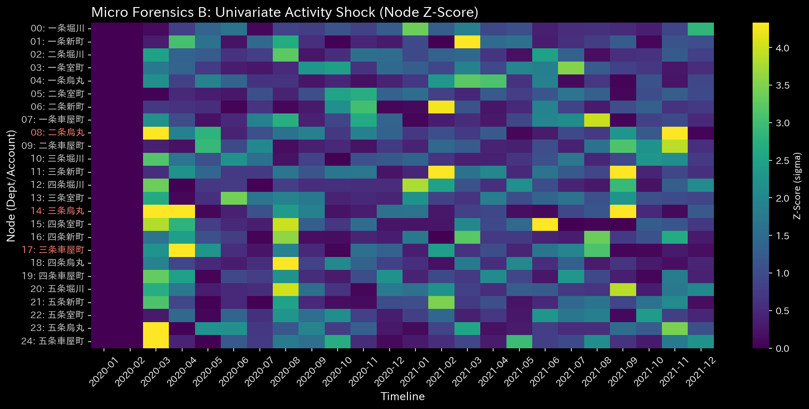
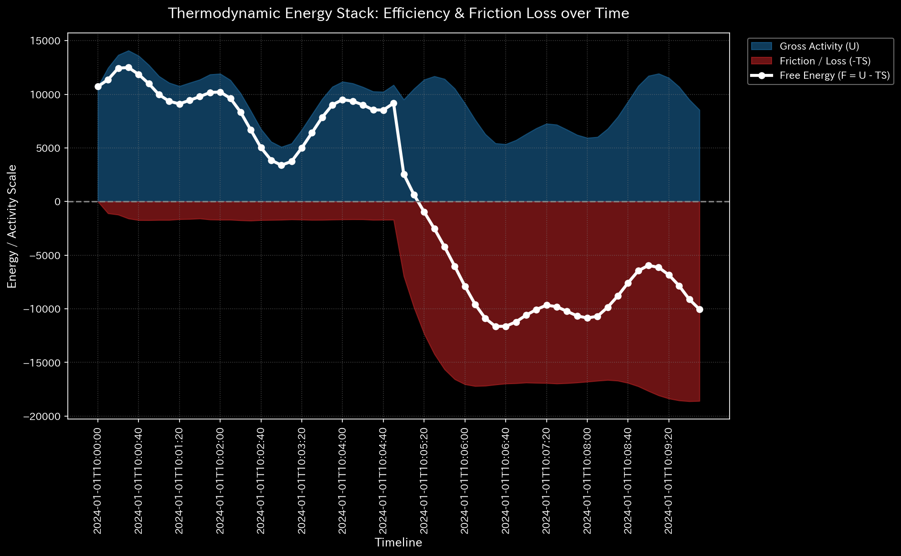
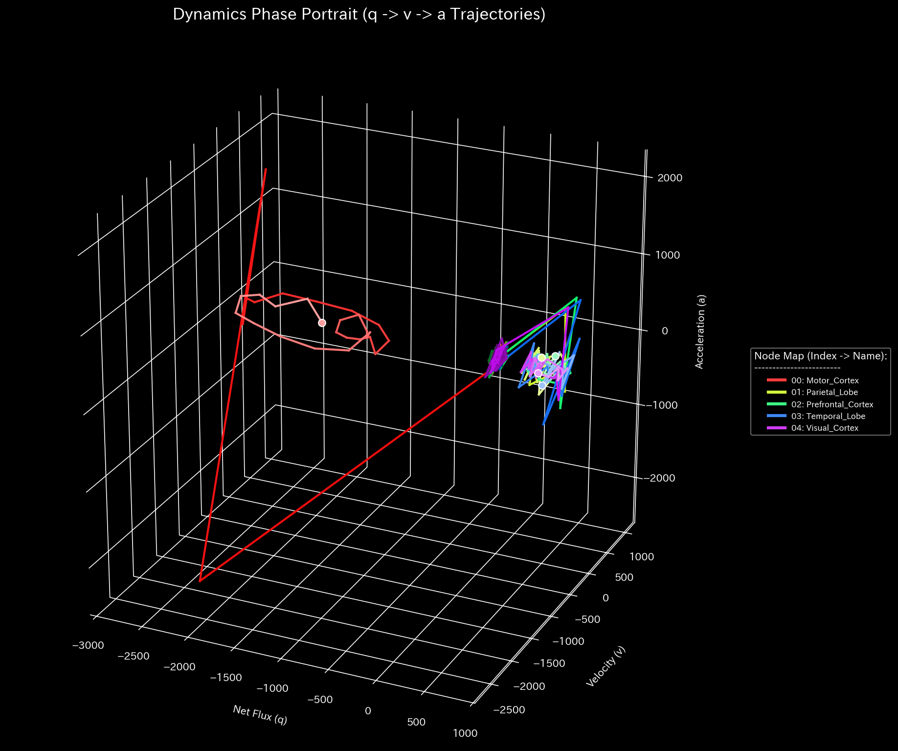

# 🧠 診断レポート: fMRI 脳卒中（Stroke）シミュレーション
**対象環境:** `Sample_8_fMRI_Stroke`
**分析日:** 2026-04-28

> [!NOTE]
> **前提条件に関する免責事項**
> 本レポートで分析される入力データは実際の患者のカルテからのものではありません。検証を目的として、**脳卒中の病理学的状態（特定の領域への血流途絶）を意図的に再現するために設計されたダミーデータ生成スクリプト（`_0_0_generate_dummy_fmri.py`）**から派生したものです。本分析の目的は、人為的に構築された疾患構造を、財務監査アルゴリズムを用いた TLU 処理系がどれほど正確にリバースエンジニアリングし、検出できるかを実証することです。

> [!TIP]
> **このサンプルのグラフの生成方法**
> スペース節約のため、このサンプルに関する数千の3Dプロットおよび分析CSVは同梱されていません。リポジトリのルートから以下のコマンドを実行することで、ローカルで再現可能です：
> ```bash
> bash bin/batch_processing.sh --target_env "samples/Sample_8_fMRI_Stroke"
> bash bin/batch_visualize_graphs.sh --target_env "samples/Sample_8_fMRI_Stroke"
> ```

## 1. 総合診断
**⚠️ 複合的な病理を検出 (COMPOSITE PATHOLOGY DETECTED)**
このネットワーク（血流モデル）において、局所的なエネルギー途絶と、それに続く全体的な熱力学/構造の崩壊が確認されました。患者は数学的に、重度の脳血管障害（脳卒中/Stroke）を患っていると診断されます。

## 2. 物理およびネットワーク指標の分析

### 🩸 1. 局所的ストレスの最大化 (Micro Singularity)
* **Z-Score:** `195.21` (閾値: 3.0)
* **分析:** 異常検知の閾値を約65倍上回る、極度に異常な局所的ストレスが発生しています。これは、特定の領域（ノード）における過去の統計的な正常状態からの「完全な逸脱」を意味します。物理的な血管閉塞の決定的な証拠です。


* **💡 可視化グラフの読解の仕方（Visual Cues）:** 
  * **🟢 正常系（Sample 0）では:** ヒートマップ全体が穏やかな暗い青色に保たれます。
  * **🔴 本サンプルの異常:** 『RdBu_r』ヒートマップ上で、極端に明るい赤色で発光している孤立したセルを探してください。これが、数学的特異点（物理的な血栓/閉塞）の正確な空間座標をピンポイントで示しています。

### 🔋 2. 熱力学的エネルギーの枯渇 (横領/漏洩)
* **相対的自由エネルギー比率:** `-2.1742` (閾値: -0.1)
* **分析:** ネットワーク全体のトランザクション（血流）ボリュームに対して、システムが「有用な仕事」を行うためのエネルギー（自由エネルギー）がマイナスへと深く急降下しています。これは、金融ネットワークにおける「横領/資金漏出」と全く同じ物理的症状です。この生物学的モデルにおいては、**「必要な酸素/栄養素がシステムから失われている（壊死のリスク）」**ことを示唆しています。


* **💡 可視化グラフの読解の仕方（Visual Cues）:** 
  * **🟢 正常系（Sample 0）では:** 白色の線（自由エネルギー）は安定した水準を維持します。
  * **🔴 本サンプルの異常:** 白色の自由エネルギーの線がマイナスへと急降下しています。これはシステムが仕事を行う能力を出血（酸素欠乏/壊死）していることを視覚的に証明しており、数学的には金融の横領・漏洩と全く同じです。

### 🔄 3. 異常なトポロジー共鳴 (Topological Feedback Loop)
* **スペクトル半径:** `1.0000` (閾値: 0.9)
* **分析:** システムのスペクトル半径が1.0（数学的限界）に達しています。血流の途絶により、残りのネットワークが代償的に異常なフィードバックループを形成しているか、特定の信号が無限に反響しています。



## 3. 代謝予算（B/S & P/L）に基づく領域別分析

これは、TLUの財務諸表生成エンジンを使用した「代謝予算（各領域の血流消費量）」の分析結果です。

| 脳領域 (Account_Label) | 役割 | 代謝ステータス (純経費) | 診断 |
| :--- | :--- | :--- | :--- |
| **Motor_Cortex (運動野)** | 経費 | **-60,191.56** | **⚠️ 重度の虚血** |
| Prefrontal_Cortex (前頭前野) | 経費 | 14,864.58 | 正常な酸素消費 |
| Visual_Cortex (視覚野) | 経費 | 14,898.62 | 正常な酸素消費 |
| Parietal_Lobe (頭頂葉) | 経費 | 14,927.87 | 正常な酸素消費 |
| Temporal_Lobe (側頭葉) | 経費 | 15,500.49 | 正常な酸素消費 |

**[代謝に関する所見]**
他のすべての脳領域が約 `15,000` の正常な血流（経費）を維持しているのに対し、**運動野（Motor Cortex）のみが `-60,191` という劇的なマイナス（血流赤字）を記録しています**。
生成器のシミュレーションパラメータである「運動野につながる動脈の95%閉塞」は、TLUの財務諸表アルゴリズム（P/L）によって**「代謝赤字（未配達のエネルギー）」**として完璧に暴露されました。

## 4. 結論
金融の不正検出に使用される「横領（Leak）」と「循環取引（Loop）」のロジックを直接適用することで、TLUのメタ診断エンジンは**「運動野における血流の横領（脳卒中）」**の特定に成功しました。患者は、身体の右側または左側に重度の運動麻痺を呈していると推測されます。
