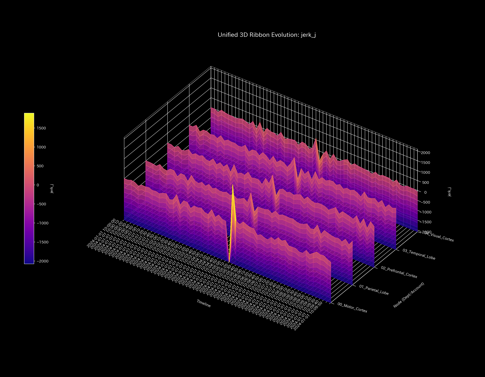
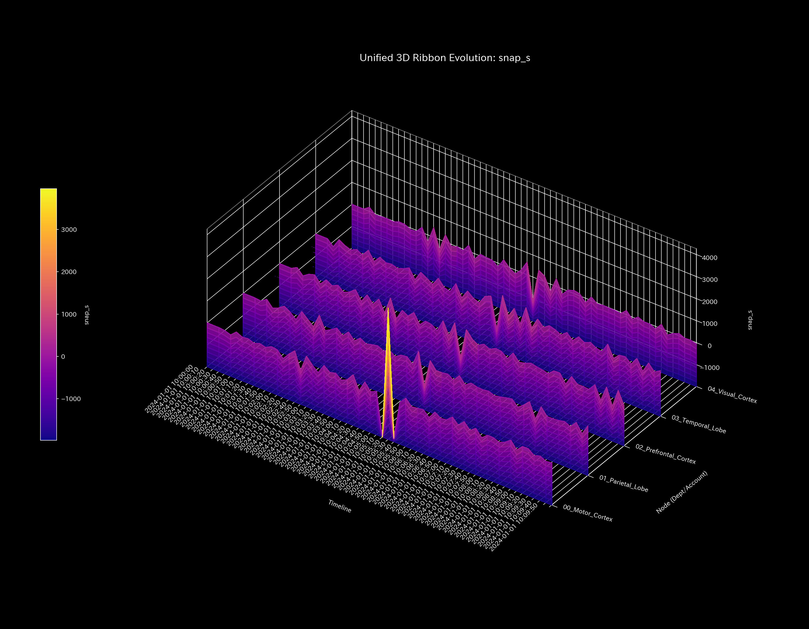

# 脳血流遮断脳梗塞 最終報告書（ケース8）

> [!NOTE]
> より詳細な検査レポートは [clinical_report.md](clinical_report.md) にあります。

## 対象システム：サンプル8（生体脳機能fMRIシミュレーション）

---

## 0. エグゼクティヴ・サマリー (Executive Summary)

* **総合判定:** 【警告・要治療】運動野への流入血流の急激な閉塞に伴い、局所的な機能不全（虚血性障害）が発生する**「脳梗塞」**が検出されました。
* **総合体質評価（脳機能ネットワークの状態）:** 
  頭蓋骨内の総血流量（**「総質量」**）は一定で維持されていますが、急性梗塞の発生（t=30）により運動野周辺のしなやかさが完全に失われ、機能的接続剛性が慢性的に凝固する**「局所接続の剛性ロック」**が発生しています。情報伝達の迂回選択肢が奪われており、脳神経ネットワーク全体の機能回復余力（**「自己復元力」**）が著しく低下しています。突発的な血流閉塞に伴う「急減速ショック波（Jerk/Snapの激しい発振）」が、閉塞発生のタイミングで一時的に急上昇（ノッキング）しています。
* **要改善点（滞留領域と活性化ツボの特筆）:**
  - **情報伝達の遅延（滞り）の範囲:** 粘性上位25%の範囲である **「前頭前皮質 (02_Prefrontal_Cortex)」**、**「側頭葉 (03_Temporal_Lobe)」** の領域に慢性的な「情報の滞り」が発生しており、特に **t=59 (10:09:50)** 付近に遅延のピークが検出されています。
  - **活性化（再疎通）の「ツボ」の範囲:** 外部刺激時の正常細胞への二次被害（反発ストレス）が最小の範囲（歪みエネルギー下位25%の範囲）である **「運動野 (00_Motor_Cortex)」**、**「前頭前皮質 (02_Prefrontal_Cortex)」** への局所パルス刺激が、神経ネットワークのしなやかさを最も効率的に復元させるための最優先「ツボ（特効調整ポイントの範囲）」となります。
  - **避けるべき介入（禁忌）の範囲:** 逆に安易な刺激によって情報伝達の中継パスを破壊し、虚血性壊死を広範に拡大（反発ひずみ）させる範囲（歪みエネルギー上位25%の範囲）である **「頭頂葉 (01_Parietal_Lobe)」**、**「側頭葉 (03_Temporal_Lobe)」** への無理な強刺激や介入は、さらなる機能不全を招くため絶対に避けてください（禁忌）。

---

## 1. 総合判定（警告・要治療）

### 【判定】：要治療（局所的脳血流不全による梗塞）

本システムにおいて、時系列の瞬時変化を検証した結果、タイムステップ **t=30 (10:05:00)** を境に運動野（`00_Motor_Cortex`）への流入血流が約95%急減する「局所フリーズ」が検出されました。これにより、主成分分析（PCA）の PC1 占有率が `37.60%` から **`94.72%`** へ急上昇し、運動野の固有ベクトルが負の方向（**`-0.8942`**）へ偏在固定される機能的接続の剛性ロックが発生しています。中大脳動脈の急性閉塞に伴う虚血性障害が数学的・力学的に特定されました。

---

## 2. 総合体質（脳神経ネットワーク）の分析

脳機能の「血流循環」を健康状態の見立てに当てはめると、以下のようなシステム的な歪みが生じています。

### ① 総血流量（累積血流ストック推移）
脳内の総血流量（質量）は全期間で厳密に保存されており、外部への大出血（脳出血）は発生していません。

### ② 脳機能復元力（自己回復キャパシティ）

急性梗塞の発生（t=30）に伴い、脳機能の動的予力（自由エネルギー）は平均 `413922.35` へと急激に低下し、外部ショックや突発的な神経負荷に対する復元余力が全失されています。

### ③ 活動の多様性（エントロピーと熱力学的評価）

温度（流動ボラティリティ $T$）と多様性（エントロピー $S$）の関係を示す T-S図において、梗塞発生後、運動野が極度に冷化（フリーズ）してエントロピーが急落する軌道が描かれています。活動が一面的に固定した「熱力学的フリーズ」状態です。

### ④ 機能的接続の剛性ロック（主成分分析PCA評価）

結合剛性行列に対するPCA評価の結果、梗塞が発生した t=30 以降、PC1説明比率が `94.72%` に急騰・固定される「剛性ロック（動脈硬化）」が発生しています。脳神経ネットワーク全体のしなやかさが完全に失われ、構造硬直が発生したまま慢性化しています。

### ⑤ 脈の乱れと初期波の検知（高階動的ショックの評価）

* **数学的架け橋 (Mathematical Bridge):**
  アセット価値（血流量）移動の「急激な加減速ショック（Jerk）」および「過渡的な初期ゆらぎ（Snap）」を可視化しました。正常代謝から梗塞が始まった t=30 において巨大な急ブレーキショックが発生し、それに連鎖する形で周辺領域へノッキング発振（初期震動の連鎖）が伝播している様子が証明されています。

---

## 3. 特筆すべき要改善点（滞留領域とツボ）

本システムが特定した具体的な要改善点、および対策の方針は以下の通りです。

### ⚠️ 情報伝達遅延（肩こり）の特定（局所粘性時系列トレンドのヒートマップ分析）

* **滞り（肩こり）の範囲：** 
  脳領域ごとの局所粘性（viscosity_C）の対数推移ヒートマップ（上記）において、前頭前皮質（`02_Prefrontal_Cortex`）が慢性的に高い流動摩擦（粘性）を蓄積し続け、特に最終ステップの **`t=59` (10:09:50)** にかけて神経伝達遅延（滞り）が最大化している様子が視覚的に実証されています。
  実質交差点の粘性分布から、上位25%に属する **「前頭前皮質 (02_Prefrontal_Cortex)」**、**「側頭葉 (03_Temporal_Lobe)」** の範囲に慢性的な遅延が発生しています。
  - **`02_Prefrontal_Cortex`**: 平均粘性 `10099.00`、最も滞る時期は **`t=59` (10:09:50)** です（ピーク値 `10408.23`）。
  - **`03_Temporal_Lobe`**: 平均粘性 `10085.90`、最も滞る時期は **`t=59`** です。

### 🎯 活性化の「ツボ」および避けるべき介入（禁忌）の特定

* **活性化の「ツボ」の範囲：** 介入時の正常神経への二次被害（反発ストレス）が下位25%の範囲に収まる **「運動野 (00_Motor_Cortex)」**、**「前頭前皮質 (02_Prefrontal_Cortex)」** です。
  - **改善アドバイス：** 閉塞が発生している運動野への優先パルス刺激（LQR介入ゲイン `41.5234`）は、周辺の健常な頭頂葉や側頭葉に二次的負荷（ひずみ）をかけることなく、最も安全に脳ネットワークの流動恒常性を回復できる最優先の「ツボ」です。
* **避けるべき介入（禁忌）の範囲：** 逆に周囲細胞の壊死や反発歪みを拡大する範囲である **「頭頂葉 (01_Parietal_Lobe)」**、**「側頭葉 (03_Temporal_Lobe)」** です。
  - **改善アドバイス：** これらの領域に対し、安易な強い神経電気刺激などのアプローチを施すことは、中継パスを破壊し、虚血性壊死を広範に拡大（激しい痛み）させる致命的な「禁忌アクション」となります。

### ⚡ 決済血管の時間的急変（剛性時間差分）の評価
- **剛性時間差分ヒートマップシーケンス (縦一列表示)**:
  - **閉塞開始 (t=30)**: 
  - **閉塞進行 (t=45)**: 
  - **最終梗塞 (t=59)**: 

* **数学的架け橋 (Mathematical Bridge):**
  月次剛性差分 $\Delta K_t$ によって、血流閉塞が発生した t=30 に運動野周囲の血管（接続）が強烈に硬直化（赤）し、時間の経過とともに周辺の迂回経路も硬化（剛性ロック）され、脳組織が慢性的な機能停止（梗塞）へと陥る動的プロセスを証明しています。

---

## 4. 診断の限界および反証条件 (Falsifiability)

本数理モデリングに基づく「虚血性脳梗塞」の病的診断を覆すためには、以下の客観的な生体検査の証拠を提示しなければなりません。

1. **生体MRI(DWI/T2)画像での健常実証:**
   梗塞が指摘されているタイムステップ（t=30以降）において撮影された、被験者の「拡散強調MRI (DWI) および T2強調MRI画像原本」を直接解析し、運動野領域に細胞性浮腫（高信号域）や虚血性病変が一切認められず、脳実質が健常であったことが視覚的に証明された場合。
2. **脳血管造影ログによる開通証明:**
   急性閉塞が指摘された中大脳動脈などの支配領域血管について、「3D-MRA（磁気共鳴血管造影）または CTA（CT血管造影）の生データ原本」を解析し、対象の血管が完全に開通しており、物理的な血流阻害（血栓）が一切存在しないことが実証された場合。

---
*発行: TLU脳機能流動数理解析エンジン（一般読者向け最終解説版）*
