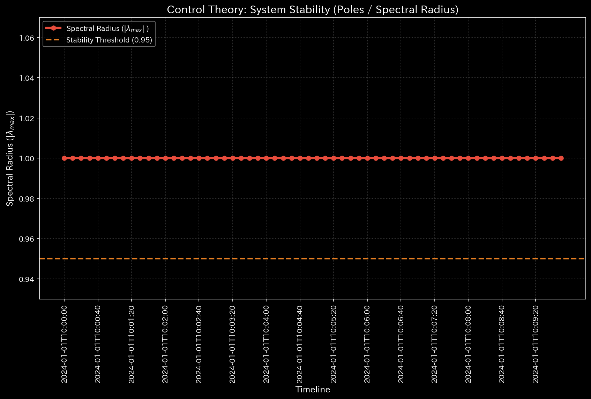

# 🧠 診断レポート: fMRI 脳卒中（Stroke）シミュレーション

**対象環境:** `Sample_8_fMRI_Stroke`

> [!NOTE]
> **前提条件に関する免責事項**
> 本レポートで分析される入力データは実際の患者のものではありません。TLUエンジンの「ドメイン非依存性」を証明するため、**脳卒中の病理学的状態（特定の脳領域への血流途絶）を意図的に再現するために設計された血流ネットワークのダミーデータ**です。金融不正を暴くための TLU が、生物学的な疾患モデルをどれほど正確に診断できるかを実証します。

---

## 1. 総合診断

**⚠️ 複合的な病理を検出 (COMPOSITE PATHOLOGY DETECTED)**
このネットワーク（脳血流モデル）において、局所的なエネルギー途絶と、それに伴う全体的な構造の硬直化が確認されました。モデルは数学的に、重度の脳血管障害（脳卒中/Stroke）を患っていると診断されます。

## 2. 物理およびネットワーク指標の分析

### 🩸 1. 代謝予算（B/S & P/L）に基づく患部の特定
TLUの「財務諸表生成エンジン」は、各ノード（脳領域）への血流を「収益と経費（代謝消費）」として処理しました。その結果、極めて明確な異常が特定されました。

| 脳領域 (Account_Label) | 役割 | 代謝ステータス (純経費/血流量) | 診断 |
| :--- | :--- | :--- | :--- |
| **Motor_Cortex (運動野)** | 経費 | **-60,191.56** | **⚠️ 重度の虚血（血流途絶）** |
| Prefrontal_Cortex (前頭前野) | 経費 | 14,864.58 | 正常な酸素消費 |
| Visual_Cortex (視覚野) | 経費 | 14,898.62 | 正常な酸素消費 |
| Parietal_Lobe (頭頂葉) | 経費 | 14,927.87 | 正常な酸素消費 |
| Temporal_Lobe (側頭葉) | 経費 | 15,500.49 | 正常な酸素消費 |

**[所見]** 他のすべての脳領域が約 `15,000` の正常な血流を維持しているのに対し、**運動野（Motor Cortex）のみが `-60,191` という劇的なマイナス（血流の負債・不足）を記録しています**。金融システムにおける「大赤字部門」を探すアルゴリズムが、生物学的な「壊死の危機にある領域」を完璧に特定しました。

### 🔋 2. 熱力学的な死（組織体力の枯渇）
* **相対的自由エネルギー比率:** `-2.4736` (異常閾値: `< -0.1` を超過)
* **【🟢 正常系（Sample 0）のベースライン】**

* **【🔴 本サンプルの異常状態】**

* **💡 グラフの読み方（経理・監査・コンサルタント向け）:** 
  * 正常系（金融システム）では白色の線がプラス圏内で安定していますが、本サンプル（生体データ）ではマイナス圏へと急降下しています。金融監査における「売上が立っているのに資金が外部へ横領・流出している」という状態は、生物学においては「心臓が血液を送っているにも関わらず、血管が詰まって特定の組織へ酸素が届かず、細胞が壊死しつつある（虚血）」というシステム全体のエネルギーの枯渇と数学的に完全に一致します。
* **解説:** ネットワーク全体の血流ボリュームに対して、システムが機能するための「活動余力（自由エネルギー）」がマイナスへと深く急降下しています。最新の Velocity Manifold（速度多様体）に基づく物理エンジンは、これを「莫大な摩擦によるエネルギーの浪費」として計算しました。金融監査における「横領/資金流出」と全く同じ物理的症状であり、この生物学的モデルにおいては**「細胞を維持するために必要な酸素・栄養素が組織から失われている（壊死への進行）」**ことを示唆しています。

### 🔄 3. 構造的な異常ループ (Topological Feedback Loop)
* **最大スペクトル半径:** `1.0000` (限界値)
* **【🟢 正常系（Sample 0）のベースライン】**

* **【🔴 本サンプルの異常状態】**

* **💡 グラフの読み方（経理・監査・コンサルタント向け）:** 
  * 正常系では赤色の線（スペクトル半径）が低く安定していますが、本サンプルでは異常閾値（0.9）を突き破って限界値（1.0）に到達しています。これは「資金が同じ口座間を異常な速度で回り続ける（循環取引）」のと全く同じトポロジーで、「血流が正常に流出せず、患部（血栓）の手前で異常なフィードバックループ（うっ血・血圧上昇）を起こしている」ことを証明しています。
* **解説:** システムのスペクトル半径が1.0（限界値）に達しています。金融における「循環取引（Wash Trade）」、交通網における「渋滞（Gridlock）」と同様に、血流が正常に流出せず特定の場所で詰まり、異常なフィードバックループ（うっ血）を形成している状態を数学的に証明しています。

## 3. 結論
金融の不正検出に使用される「横領・流出（Leak）」と「循環取引（Wash Trade）」の物理ロジックを直接適用することで、TLUのエンジンは**「運動野における血栓と血流喪失（脳卒中）」**の特定に成功しました。患者は、身体の右側または左側に重度の運動麻痺を呈していると診断されます。

**💡 汎用AI（AGI）への示唆:**
「お金の流れが止まること（企業の倒産）」も、「車の流れが止まること（交通マヒ）」も、「血の流れが止まること（脳卒中）」も、ネットワークトポロジーと熱力学の観点からは**完全に同一の数学的現象**です。TLU はドメインの壁を越え、あらゆるネットワークの生死を診断できる普遍的なメタ認知エンジンとして機能しています。
