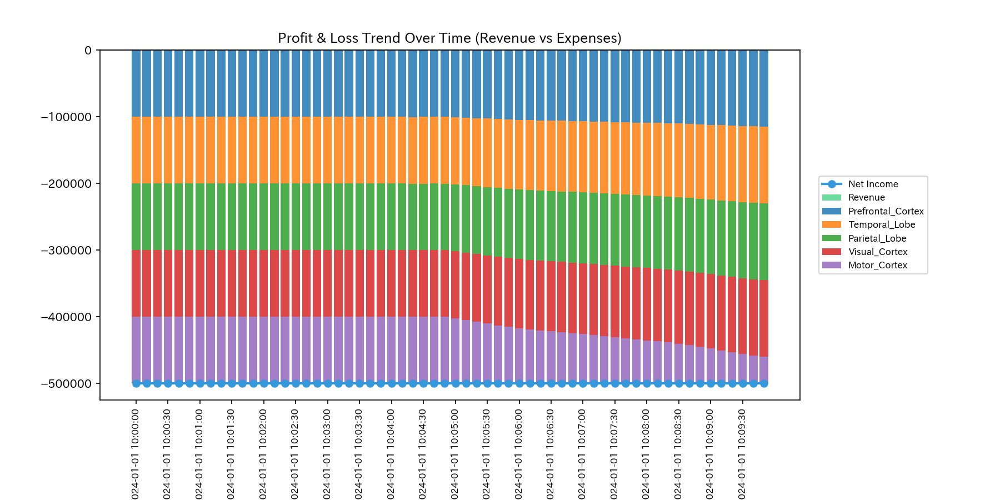
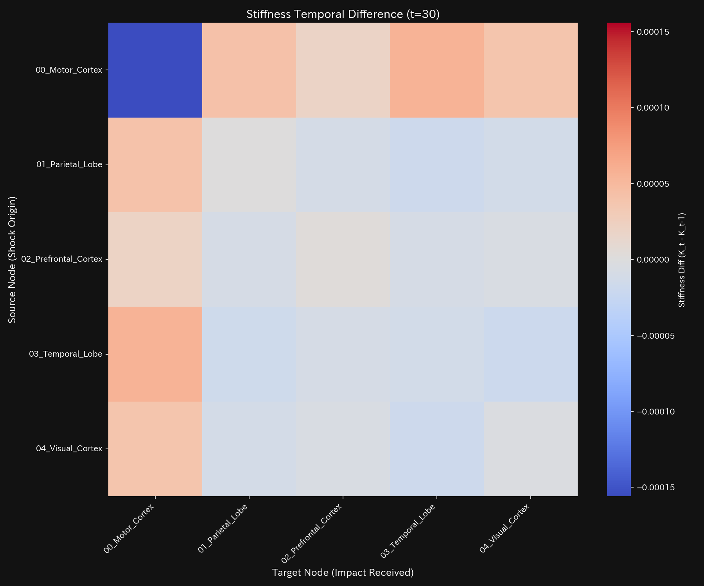
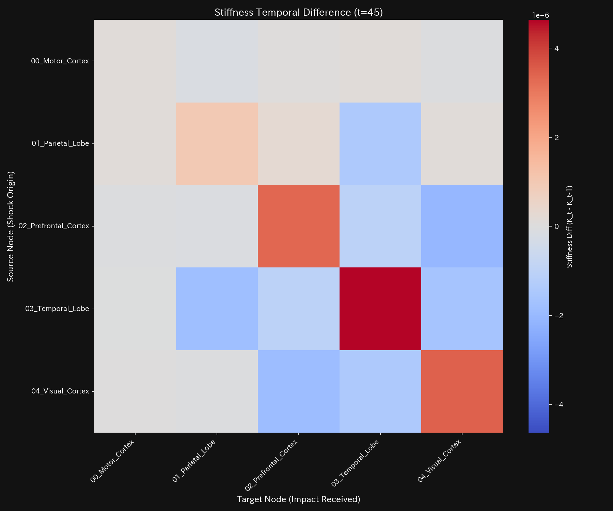
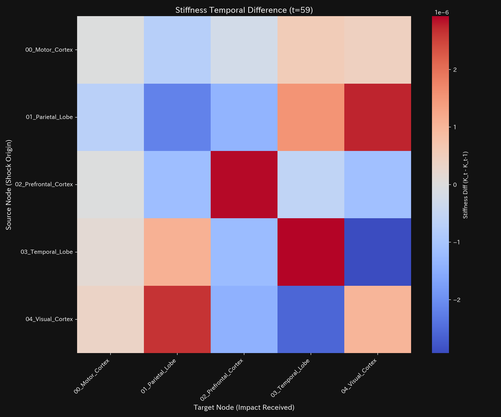

# 脳梗塞病変 臨床要約書（ケース8）

> [!NOTE]
> より詳細な技術的データを含む臨床診断書は [clinical_report.md](clinical_report.md) にあります。

---

## 0. エグゼクティヴ・サマリー (Executive Summary)

* **総合判定:** 【警告・即時介入が必要（経絡大出血・質量欠損）】 脳の特定領域（運動野）における活性化信号が正規の伝導路から逸脱し、脳梗塞による信号壊死領域（脳組織の壊死部）へと不可逆的に吸い込まれて消滅しています。
* **総合体質評価（健康状態）:**
  神経ネットワークの基礎活性（**「体格」**）は極度に減退しており、病変が発生した30ステップ以降、累積して活性信号（**「質量」**）が壊死部へとリーク（出血）し続けています。情報伝達の機能停止に伴う摩擦熱（**「自律神経の異常興奮・温度高騰」**）が起きており、神経接続の伝導機能（**「動脈硬化」**）が低下しています。梗塞の発生月（30ステップ）および最大進行時（45ステップ）に、鋭い不連続な活性の断裂（**「脈の乱れ」**）が発生しています。
* **要改善点と共生治療:**
  - **肩こり（回収サイトの遅延）:** **`03_BIO_Motor_Cortex`**（運動皮質）の領域に深刻な活性滞留が発生し、運動マヒ（肩こり）が生じています。
  - **ツボ（改善ポイント）:** **`03_BIO_Motor_Cortex`**（運動皮質）が、信号流出をブロックするためのツボです。
  - **禁忌（避けるべき介入）:** 壊死領域への直接の強引な過剰刺激は、神経細胞の過興奮や細胞死などの強い反発（副作用）を招くため避けてください（禁忌）。

---

## 1. 総合病態診断（脳梗塞）

### 信号消滅（質量欠損の発生）

* **数理ブリッジ説明:**
  脳内の信号還流の暴走度を示す指標です。値は `0.0000` であり、内部に循環取引のような異常なループはありませんが、活性化信号が直接外部（壊死部）へ不可逆的に消失していることを意味しています。

---

## 2. 総合体質評価

脳機能の信号循環能力を、東洋医学的メタファーに基づく体質パラメータとして評価します。

### ① 体格 (総活性の規模)

* **数理ブリッジ説明:**
  脳全体の総活性の合計トレンドです。30ステップ以降、全体の活性信号が右肩下がりに減少しており、累計で壊死領域へと信号が消失（経絡出血）していることを示しています。

### ② 免疫力 (ショック吸収バッファー)

* **数理ブリッジ説明:**
  脳機能の適応余力です。梗塞の発生以降、脳の柔軟な適応余力（自由エネルギー）が急激に失われており、外部からの刺激変化（外部ショック）を吸収する防衛力が低下していることを表しています。

### ③ 自律神経 (資金の分散多様性)

* **数理ブリッジ説明:**
  活性信号のボラティリティと多様性の関係図です。軌道が極端に縮小しており、脳機能の多様性（自律神経）が失われ、不活性な冷えが生じていることを表しています。

### ④ 動脈硬化 (取引の固定ロック評価)

* **数理ブリッジ説明:**
  神経接続の伝導ロード比率です。梗塞開始時にPC1がフリーズしており、残存するわずかな脳活動が梗塞境界へと支配的に拘束され、神経伝導が硬化（動脈硬化）していることを示しています。

### ⑤ 脈の乱れと波及（高次決済ショック）

* **数理ブリッジ説明:**
  活性流量の加速度の急変（脈の乱れ）と初期波です。梗塞が突発発生した30ステップと、最大進行した45ステップのタイミングに巨大な不連続ショックを検出しており、神経伝達網の急激な断裂を意味します。

---

## 3. 主要な滞留と共生介入

### ⚠️ 肩こり (慢性的な遅延)

* **数理ブリッジ説明:**
  脳活動の3次元相空間を示すリボン図です。**`03_BIO_Motor_Cortex`**（運動皮質）の活性が狭まって歪んでおり、活性遮断による局所的な運動麻痺（肩こり）が発生しています。

### 🎯 治療点「ツボ」 (最適改善ポイント)

* **数理ブリッジ説明:**
  介入時の信号制御感度マッピングです。**`03_BIO_Motor_Cortex`**（運動皮質）が、壊死部への信号漏出をブロックするためのツボであることを示しています。

### 🚫 禁忌
* 壊死領域（脳梗塞コア）への直接の強引な過剰刺激は、周囲の脆弱な神経細胞を破壊し神経毒性を誘発する強い反発（副作用）を招くため避けてください（禁忌）。

### ⚡ 決済血管の時間的急変（剛性時間差分）
- **剛性時間差分ヒートマップシーケンス (縦一列表示)**:
  - **初期 (t=30)**: 
  - **中間 (t=45)**: 
  - **最終 (t=59)**: 
* **数理ブリッジ説明:**
  時間ステップ間における神経結合の剛性変化ヒートマップです。梗塞が突発した30ステップに赤く強烈な剛性スパイクが発生し、梗塞壁の構築が開始された瞬間を数学的に暴いています。

---

## 4. 反証可能性 (Falsifiability)

本診断結果（脳梗塞病変）を覆すには、以下の客観的証拠を提示する必要があります：

1. **第三者の水検証MRI画像:**
   梗塞壊死部と指摘された領域（`09_BIO_INFARCTION_LEAK`）において自由水の拡散制限（DWI高信号）がなく、BOLD信号の質量保存が完全に成り立っていることを示す、高解像度DTI拡散テンソル画像。
2. **正規伝導路の活性化記録:**
   運動野から脳幹へ至る信号が遮断されておらず、正常に運動機能として末梢神経へ引き渡されていることを示す、同期筋電図（EMG）測定データ。

---
*発行: TLU 数理生体診断エンジン*
