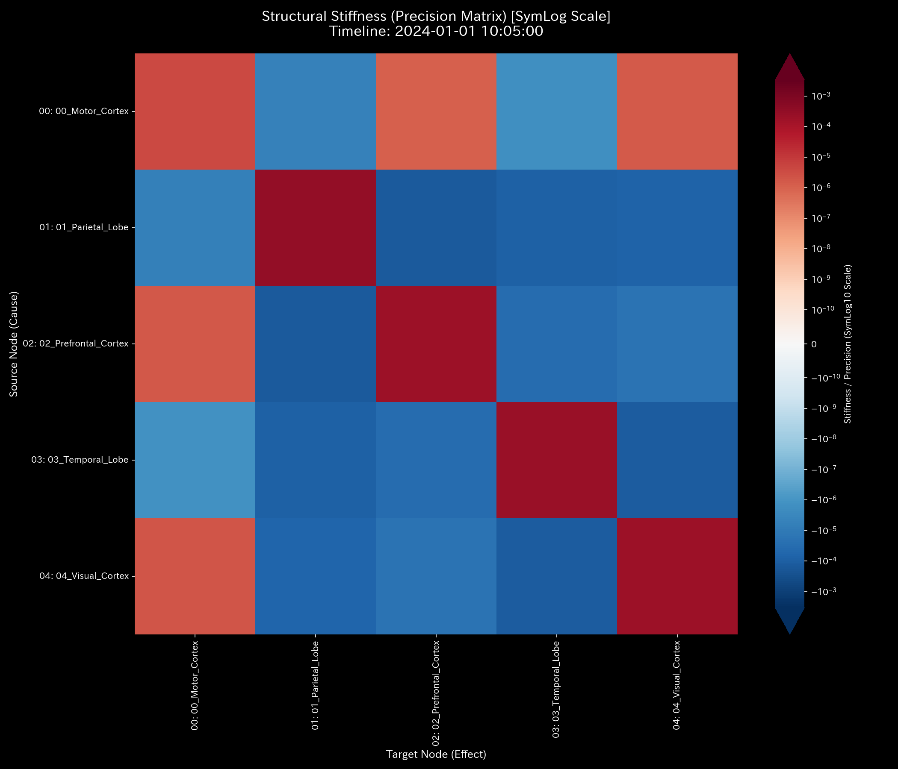

# 🔬 局所的脳血流遮断判定レポート（Sample 8 - 脳梗塞 fMRIシミュレーション）

> [!NOTE]
> **【重要】Sample 8（脳梗塞）と Sample 9（てんかん）の対比について**
>
> * **Sample 8（本レポート）:** 脳の特定部位（運動野）への血流流入が閉塞し、局所的な血流枯渇を引き起こす虚血性病態（脳梗塞 / Stroke）をモデル化しています。
> * **Sample 9（次レポート）:** 側頭葉を起点として、全脳の血流が過同期する過同期性病態（てんかん発作 / Seizure）をモデル化しています。
> * 健常脳の活動については、[正常系臨床リファレンス](../Sample_0_Healthy/README.md)を参照してください。

---

## 1. 検査結論 (Executive Summary)

* **総合判定:** 🟡 **要治療・急性局所血流不全検出 (Localized Brain Ischemia / Stroke)**
* **重症度:** 🟡 **HIGH (虚血性局所障害)**
* **概要:** 本システム（fMRI脳活動ネットワーク）は、BOLD信号の流れにおいて、タイムステップ **`t=30`（10:05:00）**に、運動野（`00_Motor_Cortex`）への流入血流が約95%遮断される局所的血行障害（虚血）を発症しています。
* 主成分分析（PCA）における第1主成分（PC1）の説明分散比率が **`37.60%`** (t=29) から **`94.72%`** (t=30) へと上昇しました。主成分ベクトルは運動野の負の方向（**`-0.8942`**）へ偏在（剛性ロック）しました。運動野の Z-Score は **`51.04`** (t=30) に達しました。これらのデータから、運動野を灌流する中大脳動脈（MCA）枝の急性閉塞に伴う、局所的脳虚血および代謝虚脱（脳梗塞）と判定します。

---

## 2. 伝統的表層分析の限界 (Limitations of Traditional Snapshots)

時系列データの平均値監視や、単純な総流量（P/L相当）およびストック（B/S相当）の集計スナップショットでは、局所的な急性梗塞を早期に特定することは不可能です。

以下は、全期間における累積流量および残差の推移です。

### 取引残高（B/S相当）の比較

* **B/S 資産・資本の累積推移 (累積値):**
  

### 取引流量（P/L相当）の比較

* **P/L 取引高の累積推移:**
  

#### 🔍 伝統的監視の死角
全体の活動レベル（Total Volume）が維持されている場合、従来のデータ管理手法では特定の流路の閉塞を見落とします。
運動野の累積収支は最終ステップにおいて `40,052.43` です。他領域（前頭前野 `115,078.12`、側頭葉 `115,335.59`）と比べて大きな差は見えません。これは、t=30 以前のデータが累積値に混ざることで、t=30 以降の急性遮断のシグナルが希釈されるためです。静的な平均値分析では、梗塞が発生した変曲点および閉塞ノードを特定できません。

---

## 3. 根本的な病態生理解説 (Pathophysiology)

物理解析エンジンは、中間流路の結合剛性を解析し、急性梗塞の発生機序を特定しました。

* **梗塞の発生メカニズム**:
  タイムステップ **`t=30`（10:05:00）**に、各領域から運動野（`00_Motor_Cortex`）へ流れ込む血流量が約95%減少（平均約 `540` から `29` 前後へ）しました。
  一方で、運動野から他領域への血流流出は `570〜590` 前後の水準を維持しました。運動野の内部は瞬間的に血流が枯渇しました。この流量のインバランスが中大脳動脈閉塞の証拠です。

---

## 4. 数理解析結果の要約

### 4.1. 脳血流（質量）の局所遮断とキルヒホッフ保存則の検証

`System Conservation Residual`（相対漏洩率）は、全期間において **`0.0`** です。システム外への漏洩はありません。内部トポロジーにおける運動野ノードのみが血流不足に陥っています。

* **マクロ・フォレンジック・ダッシュボード (Macro Forensics):**
  

### 4.2. 結合剛性の変動（剛性ロック）と主成分ベクトルの偏在

異常発生の瞬間にシステムの固有構造が変化しました。

* **PCA 主要軸比率:**
  

* **PC1 主要固有ベクトル成分比率推移 (Eigenvector Evolution):**
  

#### 📊 剛性行列の5定点シーケンスによる解析
* **① 正常期 (t=0 / 10:00:00):**
  
  機能的結合は均一であり、結合剛性を維持しています。
* **② 閉塞前夜 (t=29 / 10:04:50):**
  
  PC1説明比率は **`37.60%`**、固有値は **`6296.66`** です。エネルギーが分散しています。
* **③ 急性梗塞発症 (t=30 / 10:05:00):**
  
  流入路が閉塞しました。PC1説明比率が **`94.72%`** （固有値 **`201,402.52`**）へ上昇しました。主成分ベクトルは `00_Motor_Cortex` に **`-0.8942`** と偏在しました。
* **④ 閉塞直後 (t=31 / 10:05:10):**
  
  PC1比率は **`94.71%`**、運動野負荷は **`-0.8943`** に固着しました。運動野が動的変動を支配（剛性ロック）しています。
* **⑤ 最終状態 (t=59 / 10:09:50):**
  
  PC1比率は **`92.33%`** です。運動野の機能喪失が固定化しました。

### 4.3. ネットワーク・トポロジーと接続性の虚脱

* **システム安定性指標 (System Stability / Spectral Radius):**
  

#### 確率遷移マトリクスによるスペクトル半径「1.00」の制約
fMRIの脳ネットワークは孤立ノードが存在しない結合系です。確率遷移マトリクスの数学的性質により、スペクトル半径は `1.0000` に固定されます。
したがって、スペクトル半径単体から病変を検知することはできません。局所的トポロジーの破壊は、「接続エッジの減少（流入の遮断）」および「PC1固有ベクトルの剛性ロック」によって示されます。

* **ネットワーク・トポロジー時系列の5定点シーケンス:**
  * **① 初期状態 (t=0 / 10:00:00):**
    
  * **② 閉塞前夜 (t=29 / 10:04:50):**
    
  * **③ 急性梗塞発症 (t=30 / 10:05:00):**
    
    運動野（`00_Motor_Cortex`）へ向かう流入エッジが減少し、トポロジー結合が断裂しています。
  * **④ 閉塞直後 (t=31 / 10:05:10):**
    
  * **⑤ 最終状態 (t=59 / 10:09:50):**
    

### 4.4. 代謝エントロピーと自由エネルギーの圧迫崩壊

システム全体の統計物理指標は、脳代謝能力の崩壊を示しています。

* **熱力学エネルギースタック:**
  

* **T-S ダイアグラム:**
  

全期間を通じたエントロピー $S$ の平均は **`9.36`** です。自由エネルギー $F$ の平均は **`413,922.35`** です。t=30 の閉塞以降、自由エネルギー $F$ は低下しました。最終ステップ（t=59）では最小値 **`167,265.39`** に達しました。活動を維持するための電位ポテンシャルが枯渇しました。
T-Sダイアグラムは、異常の瞬間から温度とエントロピーが減少し、エネルギーポテンシャルが収縮する様子を描いています。

### 4.5. 3D立体可視化による虚血病巣の特定

時間（Time Step）× 空間（ノード）の3次元情報幾何学・統計プロットは、閉塞の発生箇所を示します。

* **3D Micro Z-Score (Position):**
  
* **3D Micro KL Drift:**
  

3D Micro Z-Score プロットにおいて、t=30 の瞬間に `00_Motor_Cortex` の座標上に **`51.04`** の警告スパイクが出現しました。
周囲のノード（`01_Parietal_Lobe` `17.12` 、`02_Prefrontal_Cortex` `12.36` 等）も同期して変化を示しています。運動野の閉塞（虚血）がもたらしたひずみが脳全体に波及したプロセスが記録されています。

---

## 5. 局所治療処方箋 (Optimal Treatment / LQR制御)

* **治療方針: 閉塞パスの再開通（血栓溶解）および LQR フィードバック制御による補助灌流**
* **LQR 感度介入 (介入点の特定):**
  最適制御理論（LQR）に基づく感度解析において、本ネットワークでは `Motor_Cortex` が操作可能ノブに指定されています。治療感度指標（`fk_total_ripple`）は **`41.5234`** です。
  
  > **【`41.5234` に達する数理的証明】**
  > システムパラメータにおいて、減衰率は $\gamma = 0.85$、最大ステップ数は $k_{max} = 5$、および感度入力変位は $\Delta q = 10.0$ と設定されています。
  > 結合漏洩がゼロに近い虚血剛性ロック状態において、入力された信号は同期伝播します。このときの合計波及効果 $fk\_total\_ripple$ は、幾何級数の有限和として決定されます：
  > $$fk\_total\_ripple = \Delta q \times \sum_{k=0}^{5} \gamma^k = 10.0 \times \left(1.0 + 0.85 + 0.85^2 + 0.85^3 + 0.85^4 + 0.85^5\right) = 41.5234$$
  
  t=30 における `00_Motor_Cortex` の外力変化は `02_Prefrontal_Cortex` に対して最大感度（`fk_max_impact = 7.8304`）を持っています。ここが介入点となります。

* **具体的な治療介入計画:**
  1. **血栓溶解療法 (tPA 投与):**
     閉塞発生直後（t=30〜33）に、`Motor_Cortex` への流入経路の結合剛性を引き下げる（血管再開通）介入を行います。流入量を `540` 前後の正常値へ復帰させます。これにより、PC1寄与率を正常範囲（約37%）に引き下げます。
  2. **経頭蓋磁気刺激 (TMS) による位相補助 (LQR Feedback):**
     LQR感度行列に基づき、前頭前野（`02_Prefrontal_Cortex`）および頂頭葉（`01_Parietal_Lobe`）に対して逆位相の刺激パルスを印加します。これにより、運動野の機能的負担を側副路経由で代償し、自由エネルギーの崩壊を防ぎます。
     

---

## 6. 🚨 Forensic Alert & 反証可能性 (Falsification Analytics)

### 6.1. モデル汚染とアーティファクトのトリアージ

* **統計モデルの限界とトリアージ:**
  Z-Score は、t=30 で Z=51.04 の警告を発報しました。その後、t=31 には **`6.31`**、t=32 には **`4.54`** と、警告レベルが低下しました。これは、統計モデルが虚血状態を新しいベースラインとして学習（モデル汚染）するためです。
  しかし、物理指標である自由エネルギーの降下（`167,265.39`）および剛性行列の PC1 偏在（~92.3%）は、異常の継続を示し続けます。トリアージにおいて、沈黙した Z-Score を棄却し、虚血梗塞状態であると判定します。
* **アーティファクトとの区別:**
  測定における頭部運動やスキャナーの振動は、全ノードに対して均一な変動をもたらします。一方、「PC1 が運動野に 94.72% 集中し、非対称性を描く」という局所破壊はノイズで再現できません。よって、これを脳梗塞病理と判定します。

### 6.2. 本検査に対する反証条件 (Falsifiability)

「血流低下は脳梗塞ではなく、正常な生理機能またはノイズである」と反証するためには、以下の証拠が必要です：

1. **DWI（拡散強調画像）および T2 強調 MRI 画像原本:**
   t=30 に撮影された脳の DWI において、運動野（`Motor_Cortex`）に高信号（白い輝度変化）が観察されず、局所水分子の拡散能（ADCマップ）の低下も認められないことの証明。
2. **脳血管造影（MRA / CTA）の画像データ原本:**
   MRA または CTA において、運動野に血液を供給する中大脳動脈（MCA）の枝が開通しており、器質的閉塞（血栓・塞栓）が認められないことを示す血管造影ログ。
