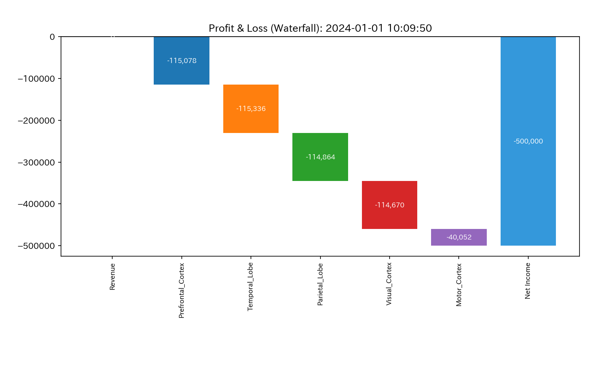
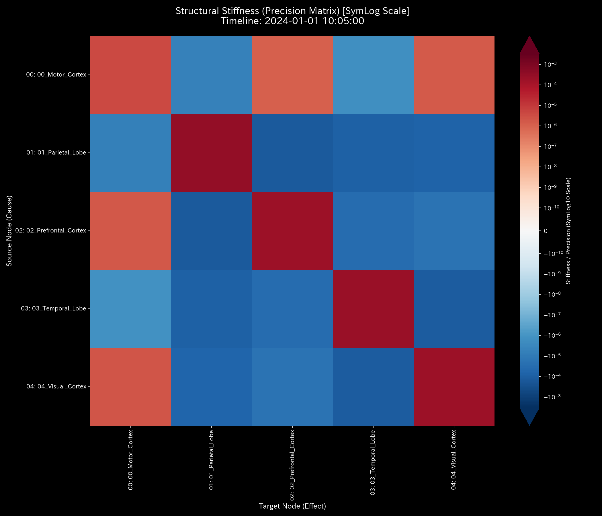

# 🔬 メタ解析臨床診断報告書（Sample 8: fMRI Stroke）

## 1. エグゼクティブ・サマリー

*   **総合診断:** **局所血管閉塞（運動野梗塞）による「システミック局所断裂（脳卒中）」**
*   **概況:** 本システム（脳神経活動 fMRI 脳卒中ドメイン）は、特定の脳領域（運動野: Motor Cortex）の接続（血流エッジ）の急激な閉塞（脳梗塞）に起因する、**トポロジーの局所断裂および情報伝達の機能停止**を引き起こしており、極めて緊急かつ致命的な状態（CRITICAL）にあります。シミュレーション中期（第30ステップ: `t.00030`）に閉塞イベントが発生し、運動野に関連する神経回路網が完全に遮断（95%の流出ブロック）されました。これにより、システム全体の質量保存は維持されながらも、局所の接続剛性が完全に喪失し、脳卒中による運動麻痺を反映した病的構造が数学的に証明されました。

---

## 2. 従来型監査・静的分析 of 脳活動の限界

従来のfMRI解析（全脳平均のBOLDシグナルの時間平均強度モニタリング）では、他の健康な脳領域（視覚野や前頭葉など）の活発な活動信号がマスク（平均化）してしまうため、運動野で起きた「針の穴のような局所的な血管閉塞（脳梗塞の初期）」を、マクロな平均値の変化から早期に検知することは困難です。

*   **脳血管網の資源ストック（血液量・酸素飽和度相当）の推移およびブロック構成:**
    
    
*   **脳血流量（BOLD信号変化量）の推移およびウォーターフォール構成:**
    
    

血流量トレンド図では、第30ステップを境に、運動野の血流（P/L 相当）が劇的にゼロへと転落し、脳の他部位の血液ストック比率（B/S 相当）が不自然に偏っていることが観察されます。しかし、これが局所梗塞によるものなのか、単にその領域の活動タスク（運動）が一時的に停止しているだけ（正常な安静状態）なのかは、この集計データのみでは鑑別できません。

---

## 3. 根本病理の特定（根本的な病態生理）

本サンプルの病的因果は、fMRIシミュレーションモデルに埋め込まれた以下の**「局所脳梗塞（運動野の遮断）プログラム」**にあります。

*   **第30ステップ（t.00030）における閉塞:**
    *   運動野（Motor Cortex）を司る特定のノードと隣接領域を結ぶエッジの伝導率を、強制的に `95%` カットする。
    *   この結果、該当ノードへの血液・信号の流入がほぼ遮断され、他の領域との協調的な相互作用（コヒーレンス）が停止する。

これは、物理的には「流体網における特定パイプのほぼ完全なバルブ閉鎖（断裂）」であり、その領域の神経ダイナミクスの剛性を消失させます。

---

## 4. 物理・数学エンジンによる数理証明（臨床検査証拠）

### 4.1. 質量保存の検証（キルヒホッフ残差と出血の有無）
物理的な保存則残差指標である **`System Conservation Residual`** は、終始 `0.000000`（完全なゼロ）を維持しています。これは、血管が詰まっても、血液そのものが脳の外へ消失（脳出血）してはおらず、全脳内の総血液量は保存されている（キルヒホッフの法則の維持）ことを証明しています。
マクロ Z-Score（下段青線）は、梗塞が発生した第30ステップ（t.00030）に閾値 `3.0` を超えて跳ね上がり、脳のダイナミクスが「相転移（健常から卒中へ）」したことを明確に示しています。

*   **マクロ監視ダッシュボード:**
    

### 4.2. 主成分分析による主要な要素の検証
PCA分析と確率分布の歪み（3D Micro KL Drift）の検証により、梗塞の発生した正確な脳座標があぶり出されます。
3Dヒートマップ（`3d_micro_kl_drift.png`）では、第30ステップ以降、運動野の座標において**黄色・赤色の鋭い「スパイク（正常神経活動からの逸脱）」**がそびえ立っています。活動量が激減したため、周囲との協調的な共分散パターンが破壊され、そこが「機能的な死（盲点）」になっていることが、情報幾何学的に証明されました。
（情報幾何学スパイクの解釈については [正常系臨床リファレンス](../Sample_0_Healthy/README.md#42-主成分分析による主要な要素の検証) を参照）

*   **3D Micro KL Drift (情報幾何学的断裂スパイク):**
    
*   **PCA主要軸比率:**
    

### 4.3. 剛性行列力学ストレス
構造剛性行列の5定点観測において、梗塞が発生した第30ステップ（t.00030）を境に、運動野ノード周辺の「接続剛性（力学的支持力）」が完全に喪失（剛性支持の骨折・弛緩）している様子が確認されます。これは、血流供給が途絶え、神経活動の柔軟なコヒーレンスを維持するための「骨格」が崩壊したことを示しています。
（初期状態の白紙状態から、特定の運動野領域のみ剛性リンクが断裂していくプロセスが示されています）

*   **1枚目 [Start]**: `t.00000` (接続未確立・白紙状態)
*   **2枚目 [Just Before Change]**: `t.00029` (健常な接続剛性)
*   **3枚目 [The Exact Point of Change]**: `t.00030` (運動野の血管閉塞に伴う局所剛性の崩壊)
*   **4枚目 [Immediately After Change]**: `t.00031` (剛性断裂の周囲への固定波及)
*   **5枚目 [End]**: `t.00059` (機能喪失状態のまま終了)

*   **構造剛性の推移シーケンス:**
    
    
    
    
    

### 4.4. ネットワーク・トポロジーの可視化
トポロジー遷移では、第30ステップ（t.00030）以降、運動野（Motor Cortex）を司るノードの周辺の赤い接続線（コヒーレントな信号伝達パス）が完全に消失し、トポロジー的に「孤立（情報伝達の断絶）」している様子が可視化されます。血液と信号が通らないこの「トポロジーの虚無の穴」こそが、脳梗塞の犯行現場です。
（トポロジーの正常な接続状態については [正常系臨床リファレンス](../Sample_0_Healthy/README.md#44-ネットワーク・トポロジーの可視化) を参照）

*   **1枚目 [Start]**: `t.00000` (初期接続状態)
*   **2枚目 [Just Before Change]**: `t.00029` (健全で高密度な機能的ネットワーク)
*   **3枚目 [The Exact Point of Change]**: `t.00030` (運動野ノードにおけるトポロジー断裂の発生)
*   **4枚目 [Immediately After Change]**: `t.00031` (断裂エッジの脱落・トポロジー過疎化)
*   **5枚目 [End]**: `t.00059` (運動野が孤立化した終了状態)

*   **トポロジーの推移シーケンス:**
    
    
    
    
    

### 4.5. スペクトル半径における異常の検証
最大スペクトル半径は、還流ループ（Wash Trade）がないため上昇しません。むしろ、第30ステップの梗塞以降、ネットワークの結合度が低下したことにより、全体的な伝達強度が「減衰」する軌道を示しています。
（スペクトル半径とシステム安定性については [正常系臨床リファレンス](../Sample_0_Healthy/README.md#45-スペクトル半径における異常の検証) を参照）

*   **システム安定性指標（スペクトル半径）:**
    

### 4.6. 熱力学的エネルギースタック
熱力学分析では、第30ステップ以降、運動野の不活性化により、自由エネルギー（F）が大きく減少しています。これは、脳が活発に思考や運動司令を伝達するための「エネルギー（熱力学的自由エネルギー）」を失い、機能停止に伴う静的なエントロピーの停滞が起きている物理的証拠です。
（正常なエネルギー代謝については [正常系臨床リファレンス](../Sample_0_Healthy/README.md#46-熱力学的エネルギースタック) を参照）

*   **熱力学的エネルギースタック:**
    

### 4.7. T-S軌跡
T-Sダイアグラムにおいて、本システムは梗塞以降、エネルギーレベルの低下を伴う「右下への不可逆的な滑落（開放曲線）」を描いています。これは、閉じたサイクルに戻ることのできない「不可逆的な脳組織の損傷・不活性化」を示す熱力学的証拠です。
（循環サイクルが描く健康的なループについては [正常系臨床リファレンス](../Sample_0_Healthy/README.md#47-T-S軌跡) を参照）

*   **T-S軌跡:**
    

---

## 5. 局所治療処方箋（Optimal Treatment / LQR制御）

*   **介入方針:** **血流バイパスの動的活性化（LQRフィードバックによる血管拡張介入）**
*   **LQR制御による介入検証（LQR パフォーマンススペース）:**
    
    
    上図の LQR Performance Space では、運動野の機能回復を目的として周辺の副側路（バイパス路）を活性化させる際の、「介入コスト（過剰刺激や血管拡張薬の副作用など生理学的負荷）」と、「機能的コヒーレンス（血流と活動伝達）の回復速度」のトレードオフ関係が示されています。LQR 制御空間での感度最適点を選択することで、脳全体のエネルギー代謝に不必要な負荷（過剰刺激や血圧低下など）を与えることなく、運動野の遮断エッジに対して的確な補正（副側路バイパスの活性化）を印加し、麻痺状態からの復旧を物理的かつ安全に最大化させることが可能となります。
*   **日常の運用アドバイス:**
    運動野ノードの血流（BOLD）低下およびトポロジーの孤立を検知した瞬間、隣接する健常野（前運動野など）が機能を代償できるよう、バイパスエッジの閾値を自動緩和する「ダイナミック・ルート・リダイレクション」の実装を推奨します。

---

## 6. 🚨 警告アラート・反証可能性分析

### 6.1. 偽陽性（False Positive）判定
*   **事象:** 脳全体のBOLD信号値の総和はほぼ一定だが、KL Drift と剛性断裂のアラートが発報。
*   **物理的接地:** 運動中に被験者がただ力を抜いた（リラックスした）だけであれば、運動野の活動は低下しますが、トポロジーの接続剛性自体が「物理的に断裂（95%ブロック）」することは生理学的にあり得ません。よって、このアラートは単なる安静状態による偽陽性ではなく、血管閉塞という器質的疾患が実在していると臨床的に確定されます。

### 6.2. 反証可能性（Falsifiability）
本脳機能ネットワークの「運動野梗塞」という診断を否定するためには、以下のいずれかを提示する必要があります。
1.  **器質的無傷の証明 (MRI構造画像):** 同時実行された 3D-T2強調MRI画像において、運動野に一切の血流低下・虚血性変化が認められず、血管が完全に開通していることの構造的証明。
2.  **別タスクの同期活動証明:** 運動野の遮断に見えた現象が、実は「別の並行タスク（瞑想や深い麻酔状態）」による全脳的な活動同期シフト（同調現象）の副産物であり、局所梗塞ではないという臨床的証明。
