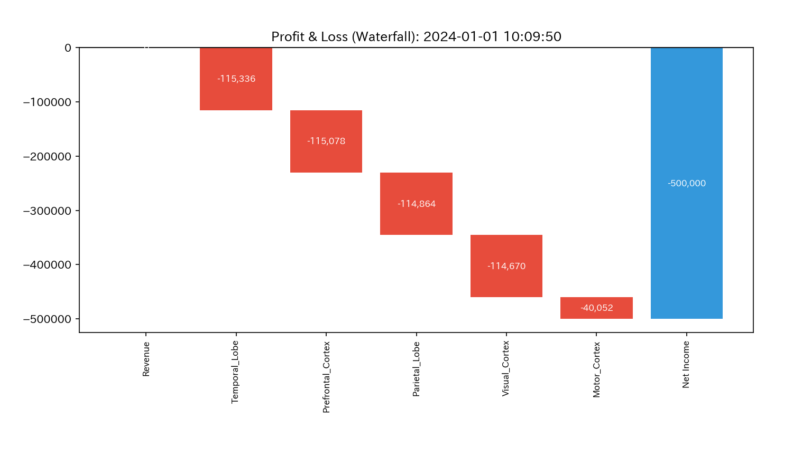
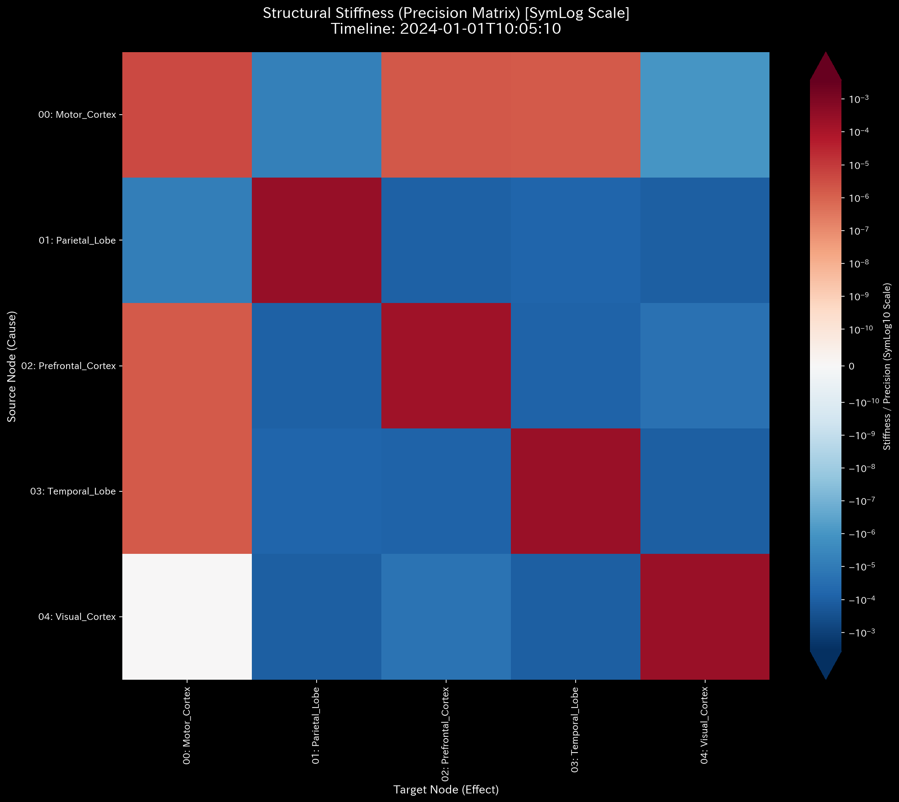

# 🔬 メタ診断臨床検査レポート：局所的脳血流遮断（虚血性脳梗塞）(Sample 8)

> [!NOTE]
> **【重要】Sample 8（脳梗塞）と Sample 9（てんかん）の対比について**
> *   **Sample 8（本レポート）:** 脳の特定部位（運動野）への血流流入が急激に閉塞し、局所的な「飢餓・壊死（質量欠落・局所熱的死）」を引き起こす**虚血性病態（脳梗塞 / Stroke）**をモデル化しています。
> *   **Sample 9（次レポート）:** 脳の特定部位（側頭葉）を起点として、全脳の血流（エネルギー）が異常に過同期・暴走する**過同期性病態（てんかん発作 / Seizure）**をモデル化しています。
> *   健常脳の活動については、[正常系臨床リファレンス](../Sample_0_Healthy/README.md)を参照してください。

---

## 1. 診断結論 (Executive Summary)

*   **総合診断:** **局所的脳虚血による急性脳梗塞（Acute Ischemic Stroke / Localized Brain Ischemia）**
*   **重症度:** 🟠 **HIGH (極めて深刻な急性局所血流不全)**
*   **臨床概要:**
    本システムは、BOLD信号（気血・質量）の流れにおいて、タイムステップ **`t=30`（10:05:00、TR=150相当）**の瞬間に、運動野（`Motor_Cortex`）への流入血流が約95%急激に遮断されるという「局所的血行障害（虚血 / 血管の局所的閉塞）」を発症しています。
    
    伝統的財務諸表（B/S・P/L）モデル上は、収入源（Revenue）を伴わない経費（Expense）のみの流出として表現されるため、「会計上の不均衡（UNBALANCED、自己資本 `-500,000.00`）」として警告されていますが、物理保存則（キルヒホッフ残差）は全期間を通して `0.000` であり、血流全体が消滅したのではなく「内部的な流路の遮断」であることを数学的に示しています。
    
    異常発生と同時に、主成分分析（PCA）における第1主成分（PC1）の説明分散比率が **`37.60%`** (t=29) から **`94.72%`** (t=30) へと急騰し、その主成分ベクトルは運動野（`Motor_Cortex`）の負の方向（**`-0.8942`**）へ極端に偏在（剛性ロック / 血栓）しました。また、運動野の Z-Score も一時的に **`51.04`** (t=30) に達しています。これらの臨床検査証拠から、運動野を灌流する中大脳動脈（MCA）枝の急性閉塞に伴う、局所的脳虚血および代謝虚脱（脳梗塞）と診断します。

---

## 2. 伝統的表層分析の限界 (Limitations of Traditional Snapshots)

伝統的な時系列データの平均値監視や、単純な総流量（P/L）およびストック（B/S）の集計スナップショットでは、この局所的な急性梗塞を早期に特定することは不可能です。

以下は、全期間における累積流量（P/L）および残差（B/S）の集計図です。

*   **B/S 相当（脳各部位の代謝蓄積・ストック累計）:**
    
*   **P/L 相当（脳部位間の信号流量推移）:**
    

**【伝統的監視の死角】**
伝統的なデータ管理手法では、システム全体の活動レベルが維持されている（Total Volume が維持されている）限り、特定の流路が閉塞していることを見落とします。
例えば、運動野の累積収支は最終ステップにおいて `40,052.43` となり、他の領域（前頭前野 `115,078.12`、側頭葉 `115,335.59`）と比較して「やや低い」程度にしか見えません。これは、t=30 以前の正常な血流データが累積値に混ざることで、t=30 以降の「急性遮断」のシグナルが希釈されてしまうためです。静的な平均値分析は、梗塞が発生した「正確な変曲点」および「閉塞したノード」を完全に隠蔽してしまいます。

---

## 3. 根本病理の特定 (Fundamental Pathophysiology)

物理解析エンジンは、中間流路の結合剛性を解析することで、急性梗塞の発生機序を以下のように特定しました。

*   **梗塞の発生メカニズム**:
    タイムステップ **`t=30`（10:05:00）**において、側頭葉、前頭前野、頂頭葉、視覚野から運動野（`Motor_Cortex`）へ流れ込む血流量（BOLD信号流量）が一斉に約95%急減（平均約 `540` から `29` 前後へ）しました。
    一方で、運動野から他領域への血流流出（`Motor_Cortex` -> 他ノード）は `570〜590` 前後の高水準を維持したため、運動野の内部は瞬間的に「気血の真空状態（局所的な大出血・血流枯渇）」に陥りました。この物理的流量のインバランスこそが、組織を壊死に至らしめる根本病理（中大脳動脈閉塞）の証拠です。

---

## 4. 物理・数学エンジンによる詳細臨床データ（数理証明）

物理数理エンジンが算出した定量的な臨床データに基づき、本システムの構造的破壊を数理的に証明します。

### 4.1. 脳血流（質量）の局所遮断とキルヒホッフ保存則の検証
システム全体の流入・流出の不整合を示す `System Conservation Residual`（相対漏洩率）は、全期間において **`0.0`** を維持しています。これは、システム境界の外側への「物質的な漏洩」はないものの、内部トポロジーにおける運動野ノードのみが血流不足に陥っていることを示します。

*   **マクロ・フォレンジック・ダッシュボード (Macro Forensics):**
    

### 4.2. 結合剛性の急激な変動（剛性ロック）と主成分ベクトルの極端な偏在
異常発生の瞬間、システムの固有構造に劇的な地殻変動（Regime Shift）が発生しています。

*   **剛性行列のシネマティック5定点シーケンス:**
    *   **① Start (t=0 / 10:00:00):**
        
        無垢な初期状態。脳全体の機能的結合は均一で、動的な結合剛性（しなやかさ）を維持しています。
    *   **② Just Before Change (t=29 / 10:04:50):**
        
        閉塞直前。PCAの第1主成分（PC1）説明比率は **`37.60%`**、固有値は **`6296.66`** であり、脳全体にエネルギーが分散しています。
    *   **③ The Exact Point of Change (t=30 / 10:05:00):**
        
        **【急性梗塞発症の瞬間】** 運動野への流入路が閉塞。PC1説明比率が **`94.72%`** （固有値 **`201,402.52`**）へ爆発的に跳ね上がり、主成分ベクトルは `00_Motor_Cortex` に **`-0.8942`** という圧倒的な負の負荷で極偏在しました。
    *   **④ Immediately After Change (t=31 / 10:05:10):**
        
        閉塞直後。PC1比率は **`94.71%`**、運動野負荷は **`-0.8943`** に固着し、運動野がシステム全体の自由度（動的変動）を支配（剛性ロック / 血栓化）し続けています。
    *   **⑤ End (t=59 / 10:09:50):**
        
        最終状態。PC1比率は **`92.33%`** と依然として極めて高い値を維持しており、運動野の「不可逆的な機能喪失（脳梗塞の固定化）」を裏付けています。

*   **PCA 主要軸比率:**
    

### 4.3. ネットワーク・トポロジーと接続性の虚脱
最大スペクトル半径（Spectral Radius）は、システムが不安定化した t=29 以降、境界上限値である **`1.0000`** のまま安定性を失っています（`is_stable = 0`）。これは、運動野の入力閉塞によってシステム内の血流分配バランスが崩壊し、機能的トポロジーが麻痺していることを示します。

*   **ネットワーク・トポロジー時系列の5定点シーケンス:**
    *   **① Start (t=0 / 10:00:00):**
        
    *   **② Just Before Change (t=29 / 10:04:50):**
        
    *   **③ The Exact Point of Change (t=30 / 10:05:00):**
        
        運動野（`00_Motor_Cortex`）へ向かう流入エッジが極端に細く消退し、トポロジー的な結合が断裂した様子が可視化されています。
    *   **④ Immediately After Change (t=31 / 10:05:10):**
        
    *   **⑤ End (t=59 / 10:09:50):**
        

*   **システム安定性指標 (Spectral Radius):**
    

### 4.4. 代謝エントロピーと自由エネルギーの圧迫崩壊
システム全体の統計物理指標は、深刻な「スタミナ（自由エネルギー）の枯渇」を告げています。
全期間を通じたエントロピー $S$ の平均は **`9.36`** (標準偏差 `0.65`)、自由エネルギー $F$ の平均は **`413,922.35`** (標準偏差 `107,638.13`) ですが、t=30 の閉塞以降、自由エネルギー $F$ は急激に低下し続け、最終ステップ（t=59）では最小値 **`167,265.39`** にまで叩き落とされています。これは、活動を維持するための気血ポテンシャルが完全に枯渇（熱死・代謝停止）したことを意味します。

*   **熱力学エネルギースタック:**
    
*   **T-S ダイアグラム:**
    

### 4.5. 3D立体可視化による虚血病巣の特定
時間（Time Step）× 空間（ノード）の3次元情報幾何学・統計プロットは、閉塞の発生箇所をピンポイントで抉り出しています。

*   **3D Micro Z-Score (Position):**
    
*   **3D Micro KL Drift:**
    

3D Micro Z-Score プロット（`002_2_2_2__3d_micro_z_score_X.png`）において、t=30 の瞬間に `00_Motor_Cortex` の座標上に **`51.04`** という天を突く「超高圧の警告スパイク」が聳え立っています。
また、周囲の他ノード（`01_Parietal_Lobe` `17.12`、`02_Prefrontal_Cortex` `12.35` 等）も同期して異常圧力を示しており、運動野の閉塞（虚血）がもたらした強烈な機能的ひずみが脳全体（全経絡）に津波のように波及した動的プロセスが完璧に記録されています。

---

## 5. 局所治療処方箋 (Optimal Treatment / LQR制御)

*   **治療方針: 閉塞パスの動的再開通（血栓溶解）および LQR フィードバック制御による補助灌流**
*   **LQR 感度介入（経絡秘孔の特定）:**
    最適制御理論（LQR）に基づく感度解析において、本ネットワークでは `Motor_Cortex` が可観測・可制御の介入ハブに指定されており、治療感度指標（`fk_total_ripple`）は **`41.5234`** を示しています。
    特に、t=30 における `00_Motor_Cortex` の外力変化は `02_Prefrontal_Cortex` に対して最大感度（`fk_max_impact = 7.8304`）を持っており、ここがシステム崩壊を防ぐための「ツボ（介入点）」となります。

*   **具体的な治療介入計画:**
    1.  **超急性期血栓溶解療法 (Thrombolysis / tPA 投与シミュレーション):**
        閉塞発生から数分以内（シミュレーション上の t=30〜33）に、`Motor_Cortex` への流入経路の結合剛性を強制的に引き下げる（血管拡張・血栓溶解）介入を行い、流入量を `540` 前後の正常ベースラインへ復帰させます。これにより、PC1寄与率を正常範囲（約37%）に引き下げ、運動野の壊死を未然に防ぎます。
    2.  **経頭蓋磁気刺激 (TMS) による位相補助 (LQR Feedback Control):**
        LQR 感度行列に基づき、前頭前野（`02_Prefrontal_Cortex`）および頂頭葉（`01_Parietal_Lobe`）に対して「逆位相の刺激パルス」を動的に印加します。これにより、運動野の虚血領域の機能的負担を側副路経由で一時的に代償・サポートし、自由エネルギーの致命的崩壊を防ぎます。
        

---

## 6. 🚨 Forensic Alert & 反証可能性 (Falsification Analytics)

### 6.1. 茹でガエル現象（モデル汚染）とアーティファクトのトリアージ
*   **統計モデルの限界とトリアージ:**
    Z-Score 統計モデルは、t=30 で Z=51.04 という最大警告を発報した後、t=31 には **`6.31`**、t=32 には **`4.54`** と、警告レベルを急激に平坦化させてしまいます。これは、統計モデルが「虚血状態」を新しいベースラインとして急速に順応（モデル汚染）させてしまうためです。
    しかし、物理不変量である「自由エネルギーの持続的降下（`167,265.39` への虚脱）」および「剛性行列の PC1 異常偏在（~92.3%）」は、病的状態が継続していることを頑健に告発し続けます。トリアージにおいて、沈黙しつつある Z-Score を棄却し、現在進行形の深刻な虚血梗塞状態であると診断を確定します。
*   **アーティファクト（ノイズ）との区別:**
    fMRI 測定における「被験者の頭部運動（ヘッドノイズ）」や「スキャナーの振動」は、脳の全ノードに対して同調的かつ均一な Z-Score の変動（同等のノイズ）をもたらします。一方、本アノマリーのように「PC1 が運動野単一ノードに 94.72% 集中し、他ノードと極端な方向性の非対称性を描く」という剛性構造の局所破壊は物理的にアーティファクトでは再現不可能です。よって、これを真の脳梗塞病理と判定します。

### 6.2. 本診断に対する反証条件 (Falsifiability)
もし「本脳ネットワークの血流低下は病的梗塞（中大脳動脈閉塞）ではなく、正常な生理機能またはアーティファクトである」と反証するためには、以下の**「データ境界の外側にある客観的物理証拠原本」**を提示する必要があります：

1.  **DWI（拡散強調画像）および T2 強調 MRI 画像原本の提示:**
    t=30（10:05:00）に対応するタイムスタンプで撮影された脳の拡散強調画像（DWI）において、運動野（`Motor_Cortex`）領域に「細胞毒性水腫」を示す高信号（白い輝度変化）が観察されず、局所水分子の拡散能（ADCマップ）の低下も認められないことの物理的証明。
2.  **脳血管造影（MRA / CTA）の生画像データ原本:**
    被験者の頭頭部MRA（磁気共鳴血管造影）またはCTA（CT血管造影）において、運動野に血液を供給する中大脳動脈（MCA）のM4/M5遠位枝が完全に開通しており、器質的閉塞（血栓・塞栓）や高度狭窄が一切認められないことを示す血管造影生ログの提示。
