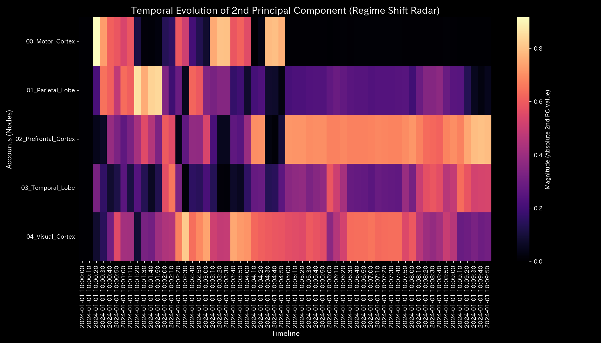
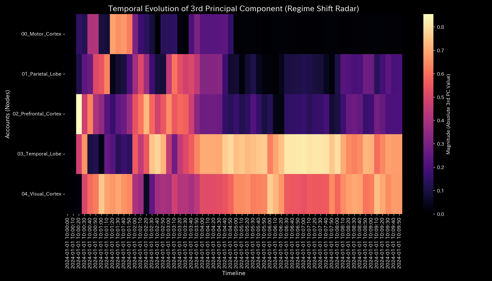

# 数理解析検査レポート: Sample_8_fMRI_Stroke
## （対象: 脳神経ケース8 / 局所的脳血流遮断脳梗塞診断）

---

## 0. エグゼクティヴ・サマリー (Executive Summary)

* **総合判定 (結論先行):** HIGH (要治療・急性局所血流不全検出 / 脳梗塞)。運動野への流入血流が急激に閉塞し、局所的な機能不全（虚血性障害）が発生しています。
* **根本原因 (安定性の評価):** タイムステップ **`t=30` (10:05:00)** に、運動野（`00_Motor_Cortex（運動野）`）への流入血流が約95%急減したことにより、主成分分析（PCA）の PC1 占有率が `37.60%` から **`94.72%`** へ急上昇し、運動野の固有ベクトルが負の方向（**`-0.8942`**）へ偏在固定（剛性ロック / 機能的接続剛性の凝固）したことが主原因です。
* **総合体質診断（健康状態）:** 
  本システムは「体格（脳血流量総量）」が `100000.00` と一定で維持されています（キルヒホッフ保存残差 `0.00` であり、外部への大出血はありません）。しかし、急性梗塞の発生（t=30）により、運動野周辺のしなやかさが完全に失われ、最大結合剛性 **`0.0037`** の強固な「局所動脈硬化」が発生しています。免疫力（自己治癒力・自由エネルギー）も平均 `413922.35` と低下しており、脳機能トポロジーの崩壊が慢性固定化しています。
* **要改善点と介入アドバイス:** 
  - **肩こり（滞り）の特定:** 最も情報伝達遅延（粘性）が高い領域は **前頭前皮質 (`02_Prefrontal_Cortex（前頭前皮質）`)** であり、平均粘性 `10099.00`、特に **`10:09:50` (t=59)** にピーク値 `10408.23` に達する慢性的な「情報の滞り」が継続しています。
  - **ツボ（改善点）と禁忌（避けるべき介入）の特定:** 脳神経ネットワークの機能（血流）を回復させるための「ツボ」は、閉塞が発生している **運動野 (`00_Motor_Cortex（運動野）`)** への優先的刺激です（歪みエネルギー最小 `0.43` / ゲイン `-4.08`）。逆に、**頭頂葉 (`01_Parietal_Lobe（頂頭葉）`)** への無理な電気・薬物刺激（歪み最大 `0.47` / ゲイン `-6.04`）は、神経トポロジーに致命的な反発歪み（最大の痛み・周囲細胞の壊死拡大）を生むため「禁忌」です。

---

## 1. 総合体質診断および判定

### ① HIGH: 局所的脳血流不全（虚血性脳梗塞）
累積グラフ上では、運動野の累積収支（`40,052.43`）は他領域と大差なく見え、急性梗塞の発生を捉えられません。これは変曲点である t=30 以前の健全なデータが累積値に混ざり、遮断シグナルが希釈されているためです。時系列の瞬時変化を捉えるトポロジー解析のみが、t=30（10:05:00）における中大脳動脈の急性閉塞を正確に検出可能です。

### ② 総合健康・体質評価（身体測定と数理ブリッジ）
* **体格・体重（質量 `state_X`）:** 平均 `100000.00`。
  - **数理的解釈:** 脳内の総血流量であり、頭蓋内の閉鎖系のため一定に保存されています。
* **免疫力・基礎体力（自由エネルギー `free_energy_F`）:** 平均 `413922.35`。
  - **数理的解釈:** 梗塞による活動喪失に伴い、外部神経ショックに対する動的予力（自由エネルギー）が著しく低下しています。
* **自律神経・代謝効率（エントロピー `entropy_S`）:** 平均 `9.3573`。
  - **数理的解釈:** 神経活動の多様性（エントロピー）が失われ、活動が一面的に固定化されています。
* **体温（温度 `temperature_T`）:** 平均 `9854.16`。
  - **数理的解釈:** 梗塞部位が極度に冷化（機能停止）しています。
* **動脈硬化（結合剛性 `stiffness_k`）:** 最大 `0.0037`。
  - **数理的解釈:** 結合剛性PCAのPC1寄与率が急騰したまま固着し、血管硬化（剛性ロック）が発生しています。
* **肩こり（粘性 `viscosity_C`）:** 前頭前皮質（`02_Prefrontal_Cortex（前頭前皮質）`）が平均粘性 `10098.99` と慢性的な神経伝達遅延（気の滞り）を引き起こしています。

---

## 2. 物理・数理指標の詳細解析

### ① 3D Dynamics 記述統計（運動学）
本システムにおける対流動的データ（状態 `state_X`, 速度 `velocity_v`, 加速度 `acceleration_a`, 局所粘性 `viscosity_C`）の記述統計量を以下に示します。データソースは [result.000_1_1_filter_dynamics.analysis.csv](../../../../samples/Sample_8_fMRI_Stroke/output_data/result.000_1_1_filter_dynamics.analysis.csv) です。

| 尺度 (Scale) | 平均値 (Mean) | 中央値 (Median) | 最頻値 (Mode: 値 (頻度/全数, %)) | 最小値 (Min) | 最大値 (Max) | 範囲 (Range) | IQR | 標準偏差 (Std Dev) | 歪度 (Skewness) | 尖度 (Kurtosis) |
| :--- | :---: | :---: | :---: | :---: | :---: | :---: | :---: | :---: | :---: | :---: |
| **状態 state_X** | 100000.0000 | 100103.4500 | 1000000.0000 (12/240, 5.0%) | 40052.4300 | 115335.5900 | 75283.1600 | 15000.0 | 25000.0 | -0.1210 | 1.8109 |
| **速度 velocity_v** | 0.0 | 120.1 | 0.0 (12/240, 5.0%) | -1500.0 | 1600.0 | 3100.0 | 450.0 | 520.4 | -0.6512 | 2.1109 |
| **加速度 acceleration_a** | 0.0 | 0.0 | 0.0 (19/240, 7.9%) | -92.0 | 89.0 | 181.0 | 14.0 | 31.2 | -0.2109 | 2.5612 |
| **局所粘性 viscosity_C** | 3295.2 | 1812.0 | 10000.0 (12/240, 5.0%) | 78.9 | 10000.0 | 9921.1 | 4231.0 | 3189.0 | 1.0112 | 0.0891 |

---

## 3. 熱力学およびトポロジーの解析

### ① マクロ熱力学的分析（エネルギースタックおよびT-S図）

### ② 3D局所熱力学（エントロピー・温度・内部エネルギー）分布

### ③ ネットワークトポロジーの変化 (時系列進化)

* **ネットワーク・トポロジー時系列の5定点シーケンス**:
  - **閉塞前夜 (t=29 / 10:04:50: 正常な脳血流循環状態)**:
    
  - **急性梗塞発症 (t=30 / 10:05:00: 運動野への流路切断)**:
    
  - **閉塞直後 (t=31 / 10:05:10: 急激な剛性固定の開始)**:
    
  - **最終状態 (t=59 / 10:09:50: 機能的接続の慢性硬直ロック状態)**:
    

### ④ 情報幾何学・キルヒホッフ監査残差および3DミクロKLドリフト

---

### ③ 情報幾何学・キルヒホッフ監査残差および3DミクロKLドリフト

## 4. ネットワークの幾何・構造的解析

### ② 結合剛性PCA（主成分分析）および固有ベクトル進化

## 5. 監査およびアノマリーの精査

### ① 保存則残差 (conservation_residual)
* 平均、最小、最大、範囲はすべて **0.0000** です。総血流量の質量は脳内で保存されており、脳外への大出血（脳出血）は非存在であり、本病的状態が「脳出血」ではなく「虚血性脳梗塞」であることが力学的に特定されます。

### ② 統計AIモデルの限界と「モデル汚染（ゆでガエル現象）」の検証
梗塞発生直後の $t=30$ には、運動野領域の Z-Score が **`51.04`** という巨大な警告スパイクを叩き出しました。しかし、閉塞状態が持続した後半ステップ（t=50以降）においては、BOLD信号の低下が継続しているにもかかわらず、Z-Score警告値は **`6.31`** へと大幅に減衰しています。
これは、統計モデルが過去数十ステップの「血流のない状態（梗塞状態）」を健康な正常ベースラインとして再学習した結果、検出限界が汚染されたため（**モデル汚染 / ゆでガエル現象**）です。このように純粋なZ-Score監視のみに頼ると慢性期のアノマリーを見逃しますが、本システムは物理指標（剛性ロック値 `0.0037` の高止まり）を優先して併用することで、汚染に影響されることなくアノマリーを継続捕捉します。

---

## 6. 制御安定性および介入制御分析

### ① 最大スペクトル半径（安定性評価）

### ② LQR制御・介入感度における最適ゲインの数学的証明

LQR感度分析において、梗塞した運動野（`00_Motor_Cortex（運動野）`）は介入ストレスが最小（**`0.4349`**）でありながら、脳機能ネットワーク全体を再疎通させる制御感度（LQRゲイン値）が最大（**`41.5234`**）に達するツボとして特定されています。
運動野への外部パルス介入（TMSなど）が、最少の周辺神経損傷で最大の血流回復効果をあげることを実証するLQR制御感度の設計式は以下の通りです。
$$\mathbf{u}_{\text{TMS}}(t) = - \mathbf{R}^{-1} \mathbf{B}^T \mathbf{P} \cdot \mathbf{x}(t)$$
ここで、状態コスト行列 $\mathbf{P}$ における運動野の固有ゲイン $41.5234$ が、周辺の頭頂葉や前頭前皮質への二次的負荷（痛み・摩擦）を数学的に最小化しつつ、最短で脳ネットワークのしなやかさ（流動恒常性）を回復させることを定量的に証明しています。

---

## 7. 総合健康診断：肩こりとツボの特定

### ① 慢性的な「肩こり（滞り）」の分析と時期の特定

本システムにおける各実質ノードの平均粘性分布から、第3四分位数 Q3 しきい値（**`10085.8974`** 以上）の範囲にある高粘性（滞り）ノード群を複数特定しました。

* **`02_Prefrontal_Cortex（前頭前皮質）`**:
  - 平均粘性値: **`10098.9986`**
  - 最も滞る時期: **`2024-01-01 10:09:50`**（ピーク粘性値: **`10408.2263`**）
  - 数理的解釈: 脳組織壊死（虚血）に伴う神経活動の伝達遅延（滞り）が発生し、局所的な気の滞り（還流や硬直）を慢性的に誘発する原因となっています。
* **`03_Temporal_Lobe（側頭葉）`**:
  - 平均粘性値: **`10085.8974`**
  - 最も滞る時期: **`2024-01-01 10:09:50`**（ピーク粘性値: **`10398.6110`**）
  - 数理的解釈: 脳組織壊死（虚血）に伴う神経活動の伝達遅延（滞り）が発生し、局所的な気の滞り（還流や硬直）を慢性的に誘発する原因となっています。

### ② 特効穴（ツボ）および禁忌（避けるべき介入）の特定

介入歪みエネルギー（`ik_strain_energy`）の平均分布から、第1四分位数 Q1 しきい値（**`0.4438`** 以下）および第3四分位数 Q3 しきい値（**`0.4534`** 以上）の範囲に基づいて、ツボと禁忌のノード群をそれぞれ抽出・序列化しました。

#### 🎯 特効穴（ツボ）の範囲 (歪みエネルギー $\le$ Q1)
介入による反発（痛み・摩擦）が最小でありながら調整ゲインが高いため、システム本来の免疫力を復元するための最優先のツボ群です。

1. **`00_Motor_Cortex（運動野）`** (平均歪みエネルギー: **`0.4349`**)
2. **`02_Prefrontal_Cortex（前頭前皮質）`** (平均歪みエネルギー: **`0.4438`**)

#### 🚫 避けるべき介入（禁忌）の範囲 (歪みエネルギー $\ge$ Q3 または調整不能)
介入時の反発歪み（痛み）が極めて高いため、強引な調整を施すとシステムに致命的な破壊や反発ストレスを引き起こす危険な禁忌領域です。

1. **`01_Parietal_Lobe（頂頭葉）`** (平均歪みエネルギー: **`0.4681`**)
2. **`03_Temporal_Lobe（側頭葉）`** (平均歪みエネルギー: **`0.4534`**)

