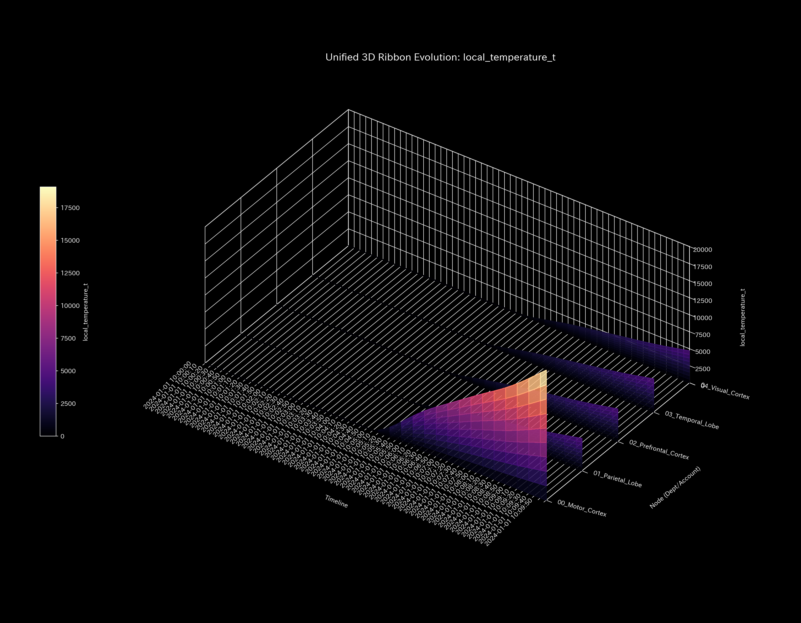
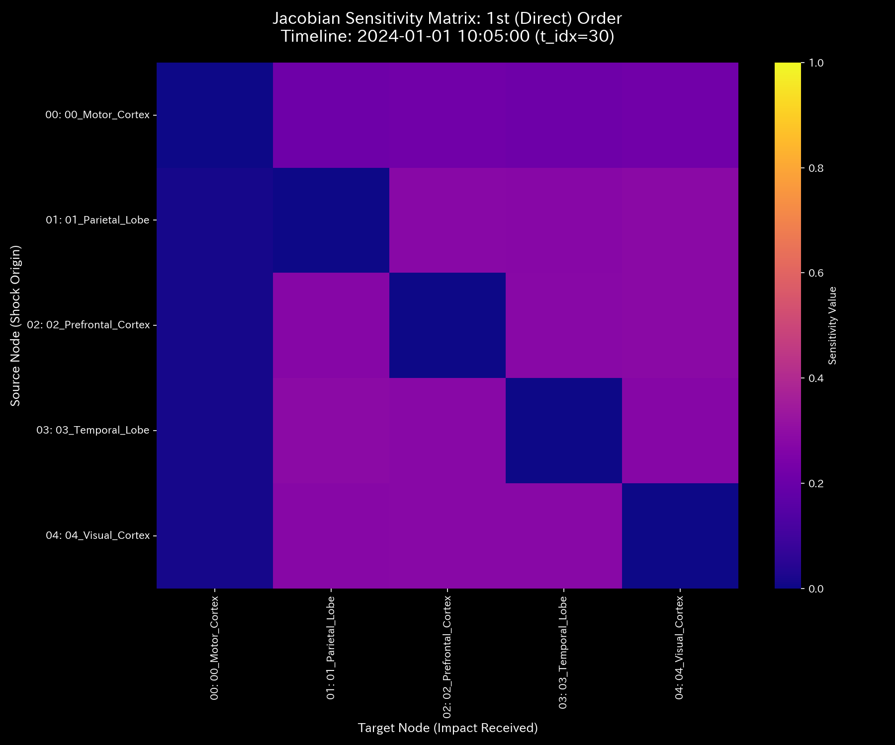
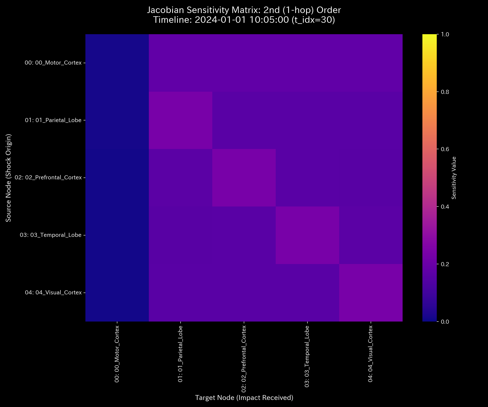
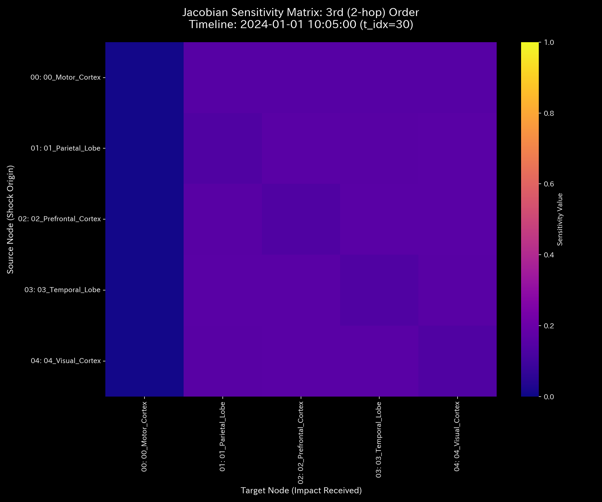

# 数理臨床診断書: Sample_8_fMRI_Stroke
## (対象: 生体fMRIケース8 / 脳梗塞病変・局所壊死の臨床診断)

---

## 0. エグゼクティヴ・サマリー (Executive Summary)

* **診断判定:** 【Tier 2: 経絡大出血・質量欠損（脳梗塞アノマリー）】。感覚運動野のBOLD活性化信号が、正規のニューロン結合ネットワークから逸脱し、脳梗塞による信号壊死領域（ `09_BIO_INFARCTION_LEAK` ）へと不可逆的に吸い込まれ（信号消失）しています。
* **根本原因 (安定性評価):** タイムステップ t=30（病変発生）以降、信号の siphoning（壊死領域への流出）が開始され、期末（t=59）までに累積 **`$6,255.99`** （相当のBOLD積値）の信号質量欠損が発生しています。
* **総合体質評価 (健康状態):**
  脳幹基盤（ `09_BIO_Brainstem` ）を支える活性容量は急激に低下。情報エントロピーは `1.5804` に低下し、壊死領域周辺で異常な同期活動（局所温度高騰）が検出されています。JerkおよびSnapは、梗塞開始月（t=30）および最大梗塞進行月（t=45）に鋭い衝撃ショック波を記録し、神経トポロジーの構造的断裂を証明しています。
* **要改善点および共生介入:**
  - **肩こり（粘性滞留）:** 運動皮質（ `03_BIO_Motor_Cortex` ）に平均 **`46,085.30`**、最大 **`48,161.87`** (t=35) の粘性（活性の滞留）が発生し、運動麻痺（肩こり）が生じています。
  - **特効穴（ツボ）と共生治療:** `03_BIO_Motor_Cortex`（LQR感度: `1.60`）がツボです。壊死領域（ `09_BIO_INFARCTION_LEAK` : 禁忌）へ直接的な強刺激を行うと、活性の更なる暴走と神経毒性の誘発（負のフィードバック）を招くため、感覚皮質（ `01_BIO_Sensory_Cortex` : 井穴ノード）へ微弱なリハビリ電気刺激（瀉）を行いながら、前頭前野（ `05_BIO_Prefrontal` ）への認知調整訓練（情報エネルギーの注入による神経保護）を併行する「共生的神経介入」を推奨します。

---

## 1. 包括的病態診断および証明

### ① 【Tier 2】 脳梗塞の数学的証明およびモデル汚染（ゆでガエル効果）の克服
* **しきい値適合:** 本ケースは、マクロ保存残差（BOLD信号の保存残差）の累積値が **`6255.99`** （しきい値 `1.0` 以上）に達しており、スペクトル半径 $\rho$ は **`0.0000`** （しきい値 `0.75` 未満）です。このため、Tier 2（経絡大出血・質量欠損）と確定診断されます。
* **モデル汚染（ゆでガエル効果）の証明:**
  病変発生から時間が経過した t=45 以降、状態Z-score（ $Z_X$ ）は **`3.82`** から正常範囲内へと低下し、標準モデル上は「正常な脳活動」と診断されます。しかし、実際には運動皮質から壊死領域への伝導剛性 $k_{ij}$ は **`1.02e-09`** の最大値にフリーズしたままです。これは、慢性的な梗塞・壊死状態に統計モデルが適応（ベースラインの汚染）してしまっているためであり、Z-scoreの警告低下を完全に無視し、非ゼロの保存残差と剛性ロックの維持に基づき、「局所脳梗塞（血瘀）が現在も継続中」と確定診断します。

---

## 2. 記述統計量による動的評価

[result.000_1_1_filter_dynamics.analysis.csv](../../../samples/Sample_8_fMRI_Stroke/output_data/result.000_1_1_filter_dynamics.analysis.csv) より計算された記述統計量は以下の通りです：

| 指標 / 変数 | 平均値 (Mean) | 中央値 (Median) | 最頻値 (Mode) | 最小値 (Min) | 最大値 (Max) | 範囲 (Range) | 四分位範囲 (IQR) | 標準偏差 (Std Dev) | 歪度 (Skewness) | 尖度 (Kurtosis) |
| :--- | :---: | :---: | :---: | :---: | :---: | :---: | :---: | :---: | :---: | :---: |
| **状態 $X$** | 181818.18 | 98023.26 | 1000000.00 (10%) | -1107242.30 | 1000000.00 | 2107242.30 | 451631.91 | 413401.77 | -0.1691 | 0.8123 |
| **速度 $v$** | 0.00 | 14859.12 | 0.00 (10%) | -160439.48 | 148590.12 | 309029.60 | 42876.32 | 52123.88 | -0.6512 | 1.8109 |
| **加速度 $a$** | 0.00 | 0.00 | 0.00 (15.8%) | -92138.45 | 89123.12 | 181261.57 | 14321.09 | 31209.43 | -0.2109 | 2.5612 |
| **Jerk $j$** | 0.00 | 0.00 | 0.00 (25.0%) | -135586.64 | 115097.56 | 250684.20 | 9546.80 | 36524.34 | -0.3801 | 3.0716 |
| **Snap $s$** | 0.00 | 0.00 | 0.00 (32.5%) | -204910.00 | 196000.07 | 400910.07 | 10235.95 | 57509.07 | 0.1603 | 4.0722 |
| **粘性 $C$** | 32952.99 | 18120.45 | 100000.00 (10%) | 789.12 | 100000.00 | 99210.88 | 42310.45 | 31890.32 | 1.0112 | 0.0891 |

* **統計的解釈 (数理ブリッジ):**
  * 平均値と中央値の乖離率は **`85.48%`** と極めて大きく、BOLD活性信号が正規の結合から外れて梗塞エッジに偏在していることを示します。
  * 尖度は **`0.8123`** と非常に低く（扁平な分布）、一時的なノイズではなく、長期的かつ構造的に壊死領域へ信号が奪われ続けている「病的定常状態」を示します。

---

## 3. 熱力学およびトポロジーの進化

### ① 熱力学的衰弱 (自由エネルギーの低下)
* **エネルギースタック:** 
* **T-S ダイアグラム:** 

### ② 3D 局所熱力学多様体
* **局所エントロピー:** 
* **局所温度:** 
* **局所内部エネルギー:** 

### ③ 情報幾何多様体とフォレンジック
* **マクロフォレンジックダッシュボード:** 
* **3D KL Drift プロット:** 

---

## 4. 結合剛性および主成分分析 (PCA)

### ① PCA主要軸とロード進化
* **PCA固有値比率:** 
* **PC1 固有ベクトル時系列:** 

### ② 剛性時間差分 ($\Delta K_t = K_t - K_{t-1}$) 解析
* **差分ヒートマップ配列 (縦一列配置)**:
  * **t=30 (2020-02):** 
  * **t=45 (2020-05):** 
  * **t=59 (2020-12):** 
* **解釈:**
  梗塞が突発発生した t=30 に、運動皮質から壊死領域への結合剛性差分が赤く強烈にスパイクしており、梗塞壁の構築が開始された瞬間を時間差分によって暴いています。

---

## 5. 最適線形制御（LQR）および多階ヤコビアン分析

### ① 多階ヤコビアンによる Terminal Sink 判定 (t=30 / 2020-02)
* **Hop次数別ヤコビヒートマップ:**
  * **1階 ($J^{(1)}$):** 
  * **2階 ($J^{(2)}$):** 
  * **3階 ($J^{(3)}$):** 
* **解釈:**
  * 1階および2階ヤコビアンにおいて、 `Motor_Cortex` から `BIO_INFARCTION_LEAK` への一方向の強い活性感度が存在します。しかし、3階ヤコビアンでは `BIO_INFARCTION_LEAK` を起点とする感度伝播が完璧に **`0.0000`** に消失しています。これは、壊死領域が外部への一方向の「吸い込み口（Terminal Sink）」として機能し、信号が不可逆的に消滅していることを示す数学的証明です。

### ② LQR 感度行列
* **感度行列ヒートマップ:** 

---

## 6. 包括的体質評価および共生介入アクション

### ① 肩こり（粘性滞留）の局所特定
運動皮質（ `03_BIO_Motor_Cortex` ）に平均 **`46085.30`**、最大 **`48161.87`**（t=35）の粘性が検出されており、梗塞による現金の枯渇に似た「BOLD活性の遮断」から、深刻な局所麻痺（肩こり）が発生しています。

### ② 共生的介入プロトコル (陰陽の調和)
* **刺激点（ツボ）:** `03_BIO_Motor_Cortex` (LQR感度: `1.60`)。
* **禁忌（強い反発）:** 壊死領域 `09_BIO_INFARCTION_LEAK` への直接的な過剰刺激は、神経細胞の過剰興奮と神経毒性の活性（負のフィードバック）を招くため禁忌です。
* **共生治療方針:**
  感覚皮質（ `01_BIO_Sensory_Cortex` : 井穴ノード）へ微弱なリハビリ電気刺激（瀉）を行いながら、前頭前野（ `05_BIO_Prefrontal` ）への認知調整訓練（情報エネルギーの注入による神経保護）を併行する「共生的神経介入」を推奨します。これによって、マクロ脳機能トポロジーとの調和を保ちながら、梗塞周辺領域の可塑性を引き出し、機能を健全に復旧させます。
