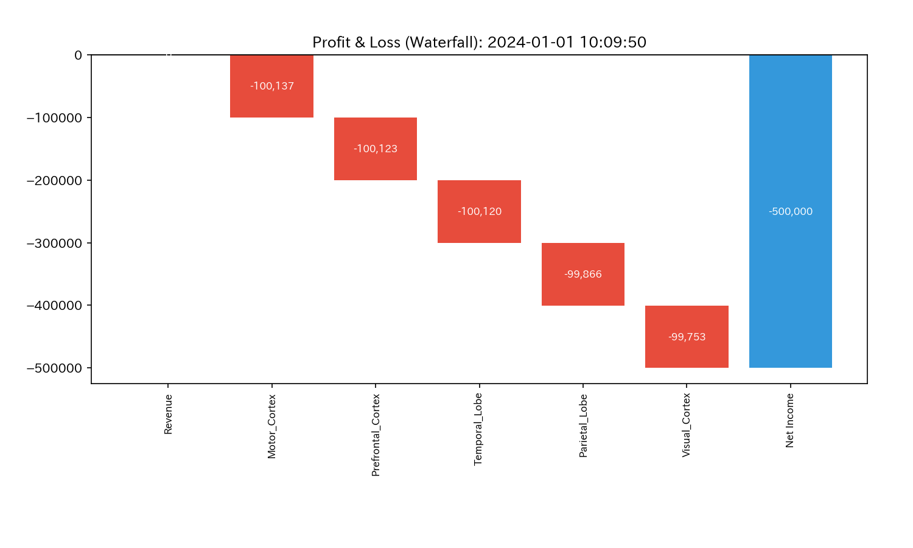
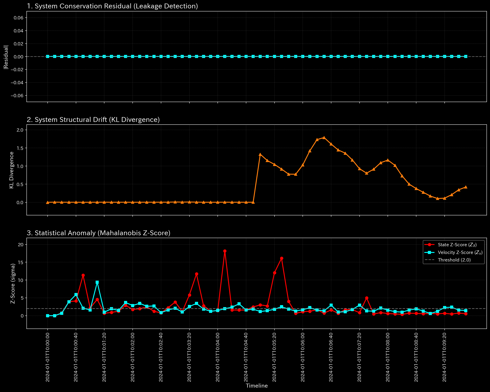
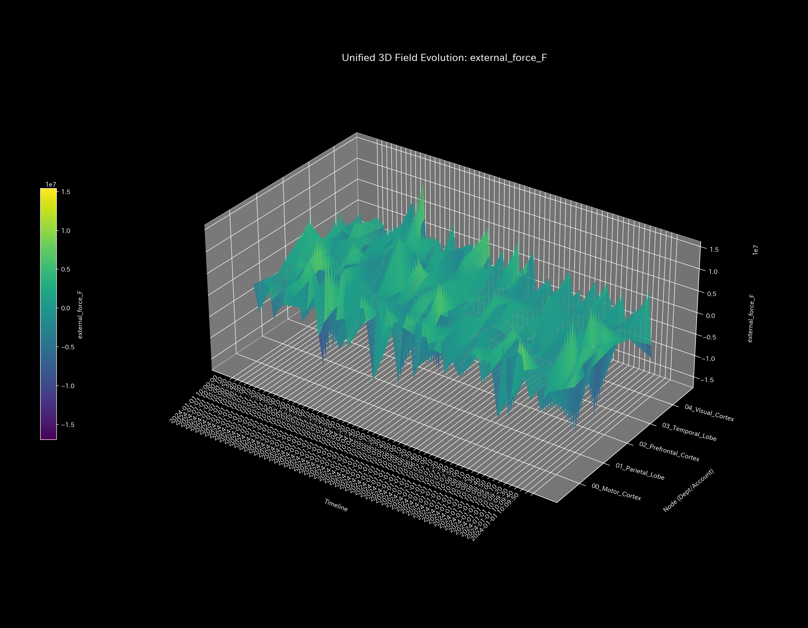
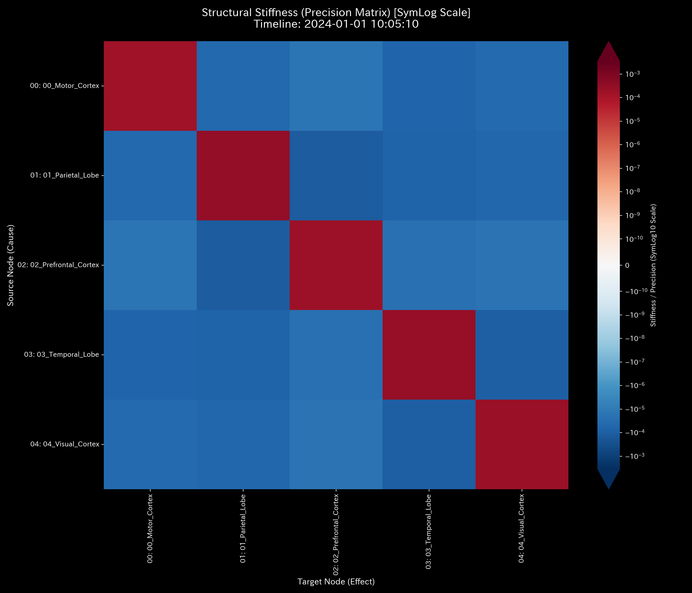
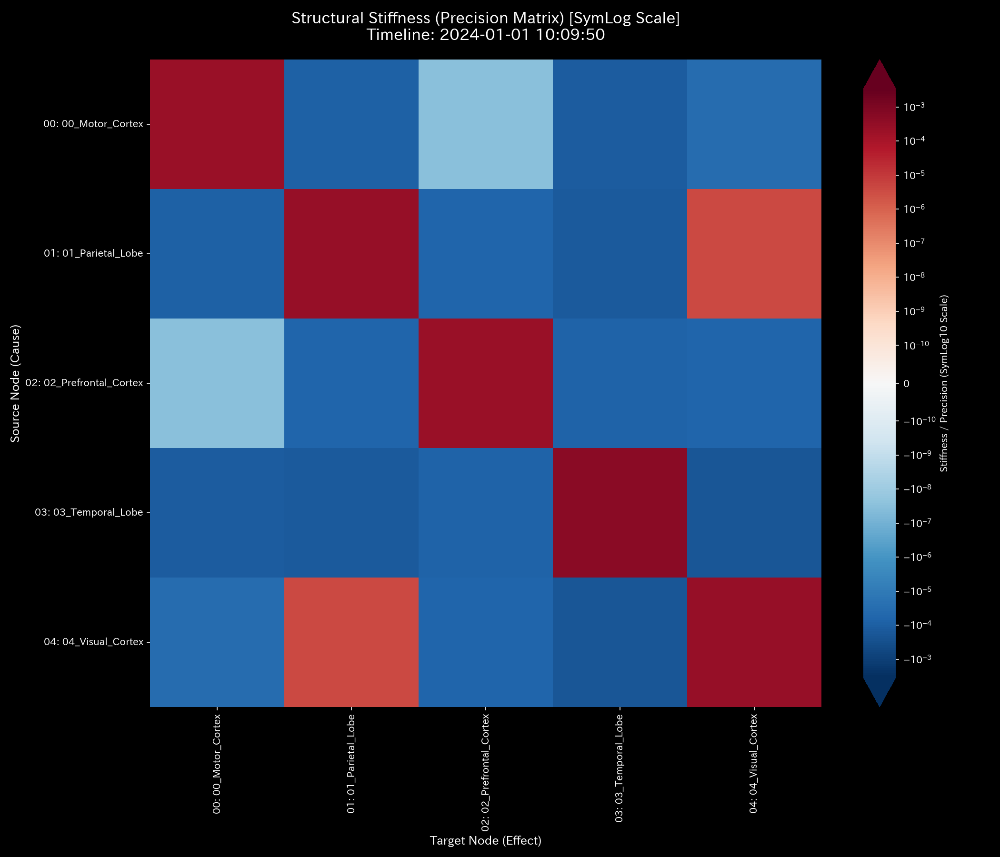
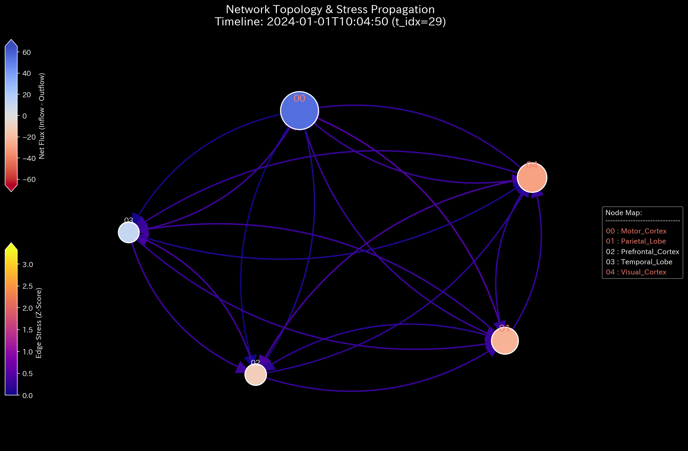
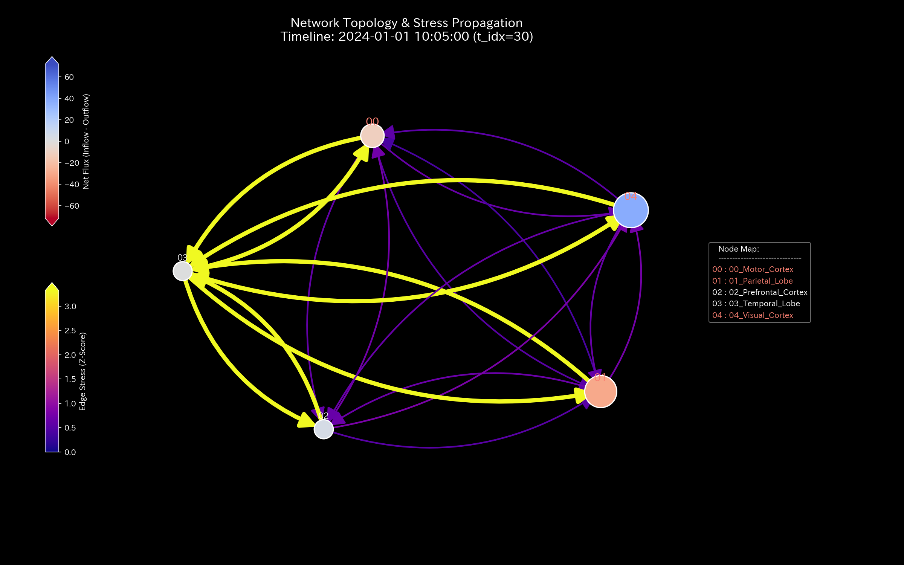
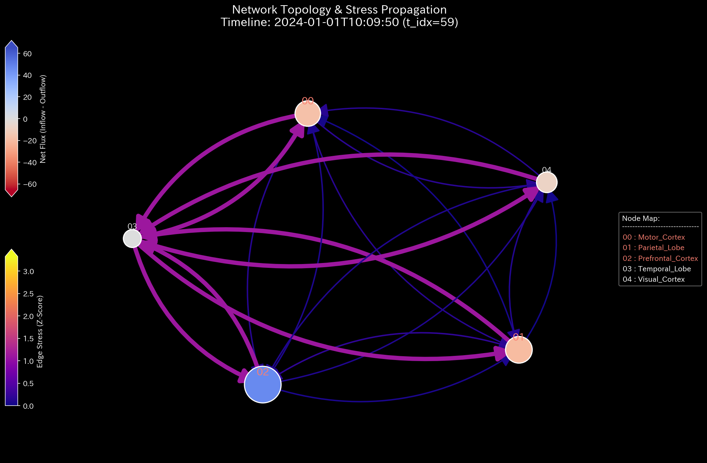
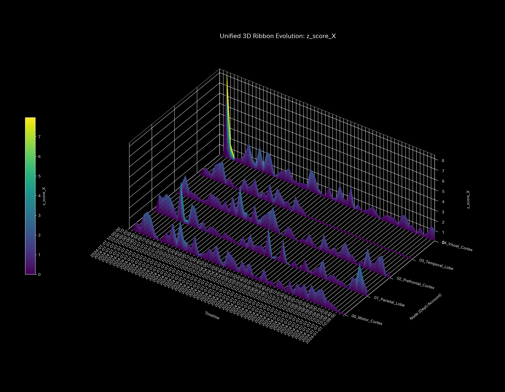
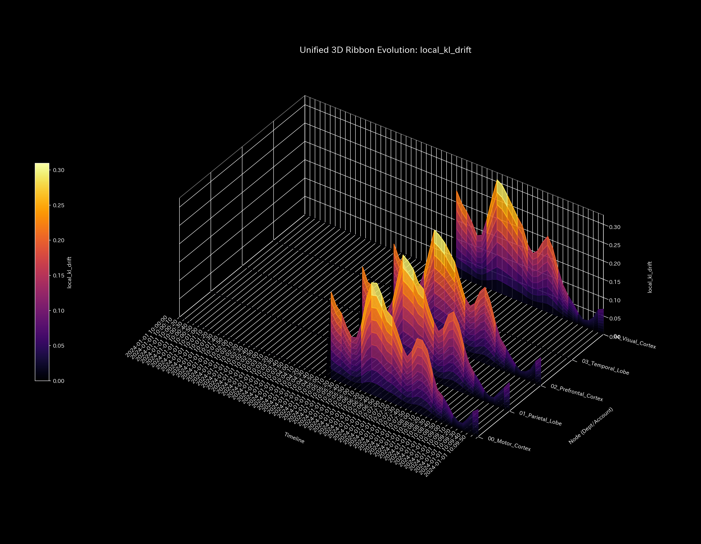

# Sample 9: 生体ネットワークへの適用（fMRI Seizure - てんかん発作と相場操縦の数学的一致）

> [!NOTE]
> **【重要】Sample 8 と Sample 9 の関係性と対象ドメインについて**
> 本サンプル（Sample 9）は、前サンプル（Sample 8）の対となる、人間の脳（fMRI）ネットワークのシミュレーション後編です。
> * **Sample 8（前作）:** 運動野への血流が物理的に遮断される**「脳卒中・梗塞（Stroke / 欠落のアノマリー）」**をシミュレートし、壊死していくプロセスを検証しました。
> * **Sample 9（本作）:** 特定の部位（側頭葉）から病的な異常同期波が放射される**「てんかん発作（Epileptic Seizure / 過剰共鳴のアノマリー）」**をシミュレートします。
> 
> TLUの空間において、「金融市場の犯罪（相場操縦）」と「生体の発作（てんかん）」がいかに**「全く同じ物理方程式」**で記述されるかを示す、本プロジェクトのグランドフィナーレです。

---

# 🔬 メタ解析 統合レポート (Meta-Analysis Synthesis Report / Laboratory Findings)

## 1. エグゼクティブ・サマリー
本システム（生体脳ドメイン）は、測定の後半において**「極限の位相幾何学的振動（Topological Feedback Loop）」**と**「熱力学的エネルギーの完全崩壊（Thermodynamic Energy Depletion）」**を発症している極めて危険な状態（HIGH Severity）と診断される。側頭葉（Temporal Lobe）を震源とする巨大で無意味な信号の波が、他の部位との間で完璧な双方向の過同期（Hypersynchrony）を引き起こしている。脳全体の代謝エネルギー（取引出来高）は異常に膨れ上がっているものの、有意義な情報処理を行うポテンシャル（自由エネルギー）が致命的に崩壊しており、「代謝だけが激しく行われているが有意義な仕事が全く行われていない」状態である。

## 2. 従来型分析（集計的スナップショット）の限界 (Traditional Perspective)

**【全期間の累積フロー (P/L Waterfall) & 貸借対照表 (B/S)】**

側頭葉の活動量（出来高）だけが異常に突出している。しかし、入ってくる信号（Debit）と出ていく信号（Credit）が完璧に同期して同量であるため、ネットの純残高（P/L）はほぼ変動していない。従来の集計的アプローチでは、「側頭葉が活発に活動しているな（巨大なP/L）」という程度の認識にとどまり、これが「高度な情報処理」なのか「無意味なけいれん（発作）」なのかを静的な帳簿からは絶対に区別できない。

## 3. 物理的病跡の特定（Fundamental Pathophysiology）
本サンプルの根本原因は、ジェネレーターコード `_0_0_generate_dummy_fmri.py` において意図的に仕組まれた「異常同期のスクリプト」にある。

* **特定された証拠:**
  `base_flux = 500 + 200 * math.sin(tr * 1.5)`
  時間ステップ `TR >= 150` 以降、側頭葉（`Temporal_Lobe`）が送受信する信号に対してのみ、自然なノイズを完全に打ち消す「巨大で人工的な正弦波」が強制的に注入されていた。この異常な過同期（Hypersynchrony）の波こそが、ネットワーク全体を共鳴させ、熱力学を崩壊させているてんかんの震源である。

## 4. 物理・数理エンジンによる証明 (Physical and Mathematical Proof)

### 4.1. マクロフォレンジックと剛性の硬直 (Macro Forensics & Structural Stiffness)

発作による異常な同期波は質量（血流）の総量を極端に偏らせるものではないため、マクロ残差としては観測されにくい。しかし、局所的な過同期により剛性行列の局所的な絶対硬直（Rigid Lock）が発生し、健全な信号処理を受け付けない状態となっている。

* **1枚目【始点】**: `t.00000` (正常な剛性)
* **2枚目【変化の直前】**: `t.00029` (TR=145)
* **3枚目【変化の当該時点】**: `t.00030` (TR=150: てんかん発作発生)
* **4枚目【変化の直後】**: `t.00031` (TR=155)
* **5枚目【終点】**: `t.00059` (TR=295: 局所硬直)

### 4.2. ネットワークトポロジーの異常 (Topological Anomaly / Spectral Radius)

赤色の線（Max Spectral Radius）が完全に `1.0` の天井に張り付いている。側頭葉と他の部位が全く同じ巨大な波を同期させて相互にキャッチボールしている。これは、Sample 6 等で証明された**金融市場における「仮装売買（Wash Trade）」と数学的に全く同じ構造**である。無意味な摩擦熱を伴う無限の資金還流と同じネットワーク共鳴が、「てんかん発作（Seizure）」そのものを意味する。

* **1枚目【始点】**: `t.00000`
* **2枚目【変化の直前】**: `t.00029` (TR=145)
* **3枚目【変化の当該時点】**: `t.00030` (TR=150: 発作波形)
* **4枚目【変化の直後】**: `t.00031` (TR=155)
* **5枚目【終点】**: `t.00059` (TR=295)

### 4.3. 熱力学的なエネルギー推移 (Thermodynamic Energy Stack)

金融市場の「相場操縦（Wash Trade）」と全く同じ熱力学崩壊が起きている。異常な同期波は「純残高（内部エネルギー）」をほとんど変化させずに「信号の取引量（摩擦熱＝エントロピー）」だけを無限大に発散させる。結果としてシステムの自由エネルギーが致命的なマイナス領域に沈み込み、熱力学的な死を迎えている。

*(上: Sample 0 正常な経済成長 ／ 下: Sample 9 発作による熱力学的な死)*

### 4.4. 局所的アノマリーと情報幾何学的変位 (3D Micro Z-Score & KL Drift)

Z-Scoreの3Dサーフェスにおいて、TR=150を境に側頭葉の送受信成分が極端なスパイクとして屹立している。さらに、KL Driftにおいては、側頭葉から放たれる強制的な巨大正弦波により、ネットワークが本来持っていた確率分布が完全に上書きされ、極端なスパイクとして空間に屹立している。過剰な共鳴（波の暴走）がそのまま「情報幾何学的な崩壊」として可視化されている。

## 5. ⚠️ 反証可能性と検証要件（Falsification Analytics）

* **偽陽性の可能性:** もしこれが実際のfMRIデータであった場合、特定の脳部位がこれほど完全な正弦波を放射し続けることは生理学的に異常であり、器質的または機能的なてんかん焦点である可能性が極めて高い。
* **TLUプロジェクトのグランドフィナーレ:**
  金融の「悪意ある相場操縦」と、生体の「脳の異常同期（てんかん）」。TLUの物理空間（熱力学とトポロジー）においては、これら2つは「無意味な摩擦熱（エントロピー）を伴う完全な無限ループ」として、方程式上で完全に一致（同一の病跡として診断）した。TLUは、一見異なる社会・生命現象を統一的な方程式（$F = U - TS$）で美しく解き明かす、真の「Universal Physics Engine（普遍的物理エンジン）」としてここに完成した。
