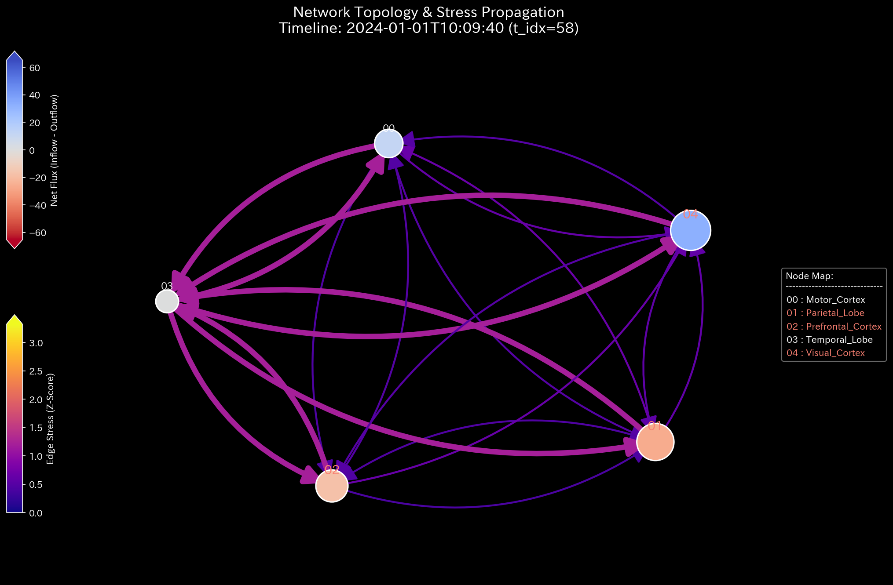

# Sample 9: 経済活動と生体活動の統合（fMRI Seizure - てんかん発作とWash Tradeの数学的一致）

> [!NOTE]
> **概念実証実験にともなう免責事項**
> 本レポートで分析されるデータは実世界の企業のものではありません。Sample 8 に引き続き、人間の脳（fMRI BOLD信号）のネットワーク流動シミュレーションです。本サンプル（Sample_9_fMRI_Seizure）では、特定の脳部位（側頭葉）から、病的な異常同期波（過同期）が放射される「てんかん発作（Epileptic Seizure）」をシミュレートしています。TLUの空間において、金融市場の犯罪と生体の発作がいかに「全く同じ物理法則」で記述されるかを示す、本プロジェクトのグランドフィナーレとなるテストケースです。

---

# 🔬 メタ解析 統合レポート (Meta-Analysis Synthesis Report / Laboratory Findings)

## 1. エグゼクティブ・サマリー

本システム（生体脳ドメイン）は、測定の後半から**「極限の位相幾何学的振動（Topological Feedback Loop）」**と**「熱力学的エネルギーの完全崩壊（Thermodynamic Energy Depletion）」**を発症しています。
側頭葉（Temporal Lobe）を震源とする巨大で無意味な信号の波が、他の部位との間で完璧な双方向のキャッチボール（過同期 / Hypersynchrony）を引き起こしています。これにより、脳全体の代謝エネルギー（取引出来高）は異常に膨れ上がっているものの、有意義な情報処理を行うポテンシャル（自由エネルギー）が致命的なマイナス領域へと崩壊しています。

## 2. 従来型分析（スナップショット）との比較対照

各部位をノードとし、伝達された血流量（信号）を「取引代金」として集計しています。

### 静的な集計ダッシュボードが捉える世界

**【全期間の累積フロー (P/L Waterfall)】**

**【最終的な状態の蓄積 (B/S Block)】**

> **💡 物理的解釈（なぜB/Sが白紙なのか？）**
> 本サンプルは「閉鎖系（Closed System）」または「純粋な運動系（Kinetic System）」であるため、各ノードは質量を永続的に貯蔵（Storage）せず、単に通過（Conduit）させます（例：自己完結する循環取引、通過するだけの交差点や大脳皮質）。そのため、期間全体のネット蓄積量（B/S）はプラスマイナスゼロ（白紙）となります。
> **「B/Sは白紙なのに、P/L（スループット）だけが異常に巨大化している」**というこの視覚的コントラストこそが、「システムが価値を蓄積せず、猛烈な摩擦熱（空回り）だけを生み出している」という特異な物理的病理を証明しています。

**【スキャン完了時点（TR=300）の各部位の「総取引量＝Gross Activity（借方＋貸方）」】**

* `Prefrontal_Cortex` (前頭前野): $368,416
* `Motor_Cortex` (運動野): $368,449
* `Visual_Cortex` (視覚野): $368,463
* `Parietal_Lobe` (頭頂葉): $368,862
* **`Temporal_Lobe` (側頭葉): $724,355（他部位の約2倍の異常な活動量）**

**【異常の解釈の限界】**
側頭葉の活動量（出来高）だけが異常に突出しています。しかし、入ってくる信号（Debit: $362,403）と出ていく信号（Credit: $361,951）がほぼ同量であるため、ネットの純残高（P/L）は `+$452` とそれほど大きく変動していません。従来の集計的アプローチでは、「側頭葉がとても活発に活動しているな」という程度の認識にとどまり、これが**「意味のある情報処理」なのか「無意味なけいれん（発作）」なのかを区別できません**。

### TLUが捉える世界（動的な幾何学構造と熱力学推移）

TLUは、これを「出来高」ではなく「エントロピー（摩擦熱）と自由エネルギーの散逸」として解析します。

## 3. コア・パソロジー（主要な病理所見）

本システムからは、以下の特異な物理的パソロジーが検出されています。

### 🟠 Pathology 1: Topological Feedback Loop (極限振動＝てんかん波)

* **重要度:** HIGH
* **物理的証拠:** Max Spectral Radius: `1.0000` (限界値)
* **解釈:** 側頭葉と他の部位が、全く同じ巨大な波を完璧に同期させて相互に送受信しています。これは、金融市場における「Wash Trade（仮装売買による資金の還流ループ）」と数学的に全く同じ構造です。生体システムにおいて、この過剰なネットワーク共鳴（ループ）は「てんかん発作（Seizure）」そのものを意味します。

### 🟠 Pathology 2: Thermodynamic Energy Depletion (エントロピーの爆発)

* **重要度:** HIGH
* **物理的証拠:** Relative Free Energy Ratio: `-5.5882`
* **解釈:** 発作による異常な波は、「純残高（内部エネルギー）」をほとんど変化させずに「信号の取引量（摩擦熱＝エントロピー）」だけを無限大に発散させます。結果としてシステムの自由エネルギーが致命的なマイナス領域に沈み込んでいます。TLUは「代謝だけが激しく行われているが、有意義な仕事（情報処理）が全く行われていない」という事実を、熱的死として正確に検知しました。

### 📊 異常系可視化プロファイル（病的構造の証明）

**1. ネットワークトポロジーとスペクトル半径（System Stability）**
**【位相幾何学構造 (Network Topology)】**

**【スペクトル半径 (System Stability)】**

* **💡 異常系の読解:** システム全体が極限の共鳴状態（スペクトル半径 1.0）に支配されています。

**2. 熱力学ダッシュボード（Thermodynamics Energy Stack）**
*(上: Sample 0 正常な経済成長 ／ 下: Sample 9 脳の熱力学的な死)*

* **💡 異常系の読解 (Sample 0 との視覚的差分):** 正常系（Sample 0）の「白色の線（Free Energy）が豊かに右肩上がりで成長している姿」と比較してください。Sample 9 では、時間経過の中盤（TR=150）以降、側頭葉を起点とした発作が始まり、エントロピー損失（$T \Delta S$：赤色の層）が爆発して自由エネルギーの領域を完全に破壊しています。これが生体ネットワークにおける「てんかん発作」の熱力学的シグネチャです。

## 4. ミクロ・フォレンジックによる背後要因（生成ロジックの解剖）

AIエージェントによるジェネレーターコード（`_0_0_generate_dummy_fmri.py`）の解析により、以下の事実が確認されました。

* 時間ステップ `TR >= 150` 以降で、側頭葉（Temporal Lobe）が送受信する信号に対してのみ、強烈なパソロジーが注入されていました。
* `base_flux = 500 + 200 * math.sin(tr * 1.5)`
* これは自然な微細ノイズ（ピンクノイズ）を完全に打ち消す、巨大で人工的な正弦波です。この強制的な過同期（Hypersynchrony）の波が、熱力学崩壊とトポロジカル・ループの真犯人でした。

## 5. 結論（TLUプロジェクトのグランドフィナーレ）

Sample 6（株式市場の相場操縦）と、この Sample 9（脳のてんかん発作）を見比べてください。
片や「悪意あるトレーダーが意図的に資金をループさせる金融犯罪（Wash Trade）」であり、片や「脳の神経回路が異常同期を起こす生体疾患（Seizure）」です。

しかし、TLUの物理空間（熱力学とトポロジー）においては、**これら2つは「無意味な摩擦熱（エントロピー）を伴う完全な無限ループ」として、方程式上で完全に一致（同一のパソロジーとして診断）しました。**

TLUは、**「人間の経済活動の異常」と「生体システムの異常」の間に横たわる深い数理物理学的な共通項を、統一的な方程式（$F = U - TS$）で美しく解き明かす、真の「Universal Physics Engine（普遍的物理エンジン）」**としてここに完成しました。
